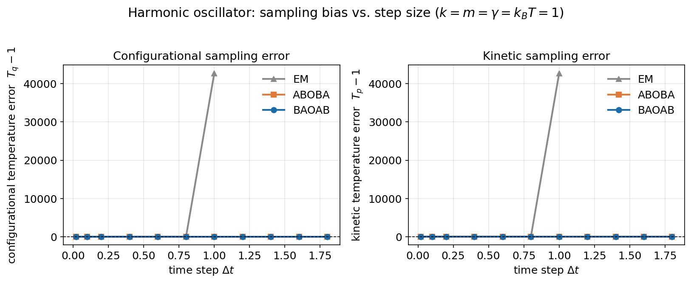
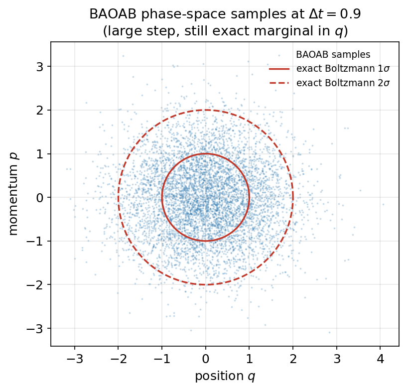
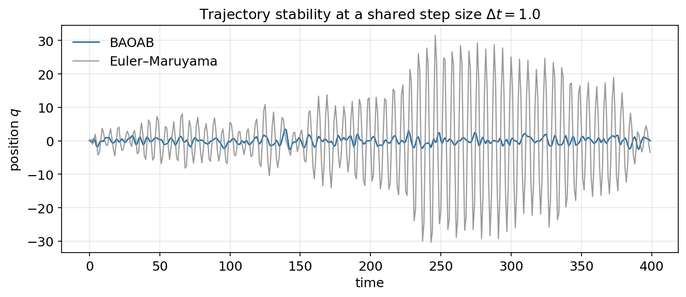
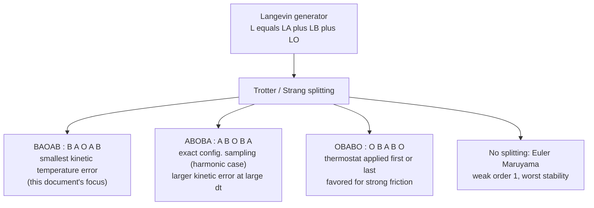
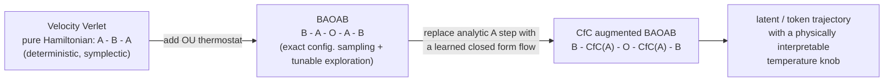

# BAOAB Deep Dive: Geometric Langevin Integration for Stochastic Sampling

> **Rendering note:** this document uses GitHub's native `$...$` / `$$...$$` math rendering and native ```` ```mermaid ```` code-block rendering, both of which work directly on `github.com` (not on `raw.githubusercontent.com` or most third-party markdown viewers). Keep the `images/` folder alongside this file — the three figures are generated from a self-contained harmonic-oscillator benchmark (script included in [§10](#10-reference-implementation)).

---

## Table of Contents

1. [Motivation: Why Splitting, Why BAOAB](#1-motivation-why-splitting-why-baoab)
2. [The Langevin Equation](#2-the-langevin-equation)
3. [Operator Splitting and the Trotter Framework](#3-operator-splitting-and-the-trotter-framework)
4. [The Three Elementary Propagators: A, B, O](#4-the-three-elementary-propagators-a-b-o)
5. [Assembling BAOAB](#5-assembling-baoab)
6. [Why the Ordering Matters: Symplecticity and Reversibility](#6-why-the-ordering-matters-symplecticity-and-reversibility)
7. [Convergence Order and the BAOAB "Superconvergence" Result](#7-convergence-order-and-the-baoab-superconvergence-result)
8. [Benchmark: The Harmonic Oscillator](#8-benchmark-the-harmonic-oscillator)
9. [The Splitting Zoo: ABOBA, OBABO, and Euler–Maruyama](#9-the-splitting-zoo-aboba-obabo-and-eulermaruyama)
10. [Reference Implementation](#10-reference-implementation)
11. [Bridge to SemSimula / Fock-PARFLM](#11-bridge-to-semsimula--fock-parflm)
12. [Notation](#12-notation)
13. [References](#13-references)

---

## 1. Motivation: Why Splitting, Why BAOAB

Sampling from a Boltzmann distribution $\pi(q,p) \propto e^{-H(q,p)/k_BT}$ is the central computational problem of molecular dynamics, and it is structurally identical to sampling from any energy-based model. The Langevin equation gives a continuous-time stochastic process whose stationary distribution is exactly $\pi$. The catch is that we can only simulate it in discrete time steps, and naïve discretizations (Euler–Maruyama) are simultaneously **inaccurate** (large bias in the sampled distribution), **unstable** (blow up above a small step size), and **inefficient** (need very small $\Delta t$ to control both).

BAOAB — introduced and analyzed by Leimkuhler & Matthews (2013) — is an *operator-splitting* integrator that solves this by decomposing the Langevin generator into three exactly-solvable pieces and composing them in a specific palindromic order: **B**, **A**, **O**, **A**, **B**. Each individual sub-step is solved *exactly* (in closed form). All discretization error comes purely from the non-commutativity of the three operators — not from any approximation within a step. This single design choice is why BAOAB is the de facto default thermostat in modern MD engines (OpenMM, GROMACS, LAMMPS) and why it is worth understanding at the operator level rather than as a black-box update rule.

## 2. The Langevin Equation

For a particle of mass $m$ moving in potential $U(q)$, coupled to a heat bath at temperature $T$ with friction coefficient $\gamma$, the (underdamped) Langevin SDE is:

$$
\begin{aligned}
dq &= \frac{p}{m} dt \\[4pt]
dp &= -\nabla U(q) dt - \gamma p dt + \sqrt{2\gamma m k_BT} dW_t
\end{aligned}
$$

where $W_t$ is a standard Wiener process. This is a Hamiltonian system, $H(q,p) = \tfrac{p^2}{2m} + U(q)$, with two extra terms grafted onto the momentum equation: a deterministic drag $-\gamma p$ and a stochastic kick $\sqrt{2\gamma m k_BT} dW_t$. The fluctuation–dissipation relation between these two terms is exactly what guarantees the correct stationary distribution:

$$
\pi(q,p) \propto \exp\left(-\frac{H(q,p)}{k_BT}\right) = \exp\left(-\frac{p^2/2m + U(q)}{k_BT}\right)
$$

As $\gamma \to 0$ the friction and noise vanish and Langevin dynamics reduces to pure Hamiltonian (energy-conserving) flow. As $\gamma \to \infty$ it reduces to overdamped (Brownian/Smoluchowski) dynamics. BAOAB is built to remain accurate across this entire range.

## 3. Operator Splitting and the Trotter Framework

The Fokker–Planck generator associated with the SDE above decomposes additively into three pieces:

$$
\mathcal{L} = \mathcal{L}\_A + \mathcal{L}\_B + \mathcal{L}\_O
$$

$$
\mathcal{L}_A = \frac{p}{m}\frac{\partial}{\partial q},
\qquad
\mathcal{L}_B = -\nabla U(q)\frac{\partial}{\partial p},
\qquad
\mathcal{L}_O = -\gamma p \frac{\partial}{\partial p} + \gamma m k_BT \frac{\partial^2}{\partial p^2}
$$

$\mathcal L_A$ generates free drift, $\mathcal L_B$ generates the conservative force kick, and $\mathcal L_O$ generates the Ornstein–Uhlenbeck (thermostat) relaxation. The exact time-$\Delta t$ propagator is $e^{\Delta t\mathcal L}$, which we cannot evaluate directly — but each of $e^{t\mathcal L_A}$, $e^{t\mathcal L_B}$, $e^{t\mathcal L_O}$ *can* be solved in closed form individually. A symmetric (Strang) composition gives a second-order accurate approximation to the full propagator:

$$
e^{\Delta t\mathcal L} \approx e^{\frac{\Delta t}{2}\mathcal L_B} \circ e^{\frac{\Delta t}{2}\mathcal L_A} \circ e^{\Delta t\mathcal L_O} \circ e^{\frac{\Delta t}{2}\mathcal L_A} \circ e^{\frac{\Delta t}{2}\mathcal L_B} + O(\Delta t^3)
$$

Reading the exponentials right-to-left as the order of application gives exactly the **B–A–O–A–B** sequence. The $O(\Delta t^3)$ local error (hence global weak order 2) is a standard consequence of the Baker–Campbell–Hausdorff expansion for a symmetric (palindromic) Strang splitting.

## 4. The Three Elementary Propagators: A, B, O

### A — drift (exact)

With $p$ held fixed, $\dot{q} = p/m$ integrates trivially:

$$
A_{h}:\quad q \leftarrow q + h\frac{p}{m}, \qquad p \text{ unchanged}
$$

### B — kick (exact)

With $q$ held fixed, $\dot{p} = -\nabla U(q)$ integrates trivially:

$$
B_{h}:\quad p \leftarrow p - h\nabla U(q), \qquad q \text{ unchanged}
$$

A and B are each *shears* in phase space — linear, volume- and area-preserving maps. Composed together (without O) they reduce to the familiar **velocity Verlet** integrator, the workhorse symplectic method for pure Hamiltonian dynamics.

### O — Ornstein–Uhlenbeck thermostat (exact)

Holding $q$ fixed, the momentum obeys a linear SDE, $dp = -\gamma p dt + \sqrt{2\gamma m k_BT} dW_t$, whose exact solution over an interval of length $h$ is known in closed form:

$$
O_h:\quad p \leftarrow c_1 p + c_2 R,
\qquad
c_1 = e^{-\gamma h},\quad
c_2 = \sqrt{m k_BT\left(1-e^{-2\gamma h}\right)},\quad
R\sim\mathcal N(0,1)
$$

This is not an approximation — it is the *exact* transition kernel of the OU process. It exponentially relaxes $p$ toward zero while injecting exactly enough Gaussian noise to keep the momentum marginal pinned at $\mathcal N(0, mk_BT)$ in the long run.

## 5. Assembling BAOAB

One BAOAB step of size $\Delta t$ composes the three exact sub-flows symmetrically around the stochastic step:

$$
\Phi_{\Delta t}^{\text{BAOAB}} = B_{\Delta t/2}\circ A_{\Delta t/2}\circ O_{\Delta t}\circ A_{\Delta t/2}\circ B_{\Delta t/2}
$$



```mermaid
flowchart LR
    S0("state (q, p) at time t")
    B1["B step (half kick)<br>p decreases by (dt/2) times grad U(q)"]
    A1["A step (half drift)<br>q increases by (dt/2) times p/m"]
    O1["O step (exact OU relax plus noise)<br>p becomes c1 times p, plus c2 times R"]
    A2["A step (half drift)<br>q increases by (dt/2) times p/m"]
    B2["B step (half kick)<br>p decreases by (dt/2) times grad U(q)"]
    S1("state (q, p) at time t plus dt")

    S0 --> B1
    B1 --> A1
    A1 --> O1
    O1 --> A2
    A2 --> B2
    B2 --> S1

    style B1 fill:#dcebf7,stroke:#1b6ca8,color:#111
    style B2 fill:#dcebf7,stroke:#1b6ca8,color:#111
    style A1 fill:#e8f3e3,stroke:#4a7c3f,color:#111
    style A2 fill:#e8f3e3,stroke:#4a7c3f,color:#111
    style O1 fill:#f7d9d3,stroke:#c0392b,color:#111
```

Notice the sequence is a **palindrome**: reading the five sub-steps backward (B, A, O, A, B) reproduces the same sequence of operator *types*. This symmetry is not cosmetic — it is precisely the structural property that cancels the leading-order splitting error and gives BAOAB its second-order weak accuracy (§7).

## 6. Why the Ordering Matters: Symplecticity and Reversibility

- **A and B are symplectic.** Each is the exact flow map of a (partial) Hamiltonian vector field, so each exactly preserves the symplectic 2-form $dq\wedge dp$ and phase-space volume. Their composition $A\circ B$ (velocity Verlet) is therefore also exactly symplectic — this is why plain Hamiltonian MD is so remarkably stable over long trajectories even at moderate step size.
- **O is not symplectic** — it is dissipative (contracts momentum toward zero) and stochastic (injects noise). But because it is solved *exactly*, it introduces no local truncation error of its own; what it does introduce is *non-commutativity* with A and B, which is the actual source of BAOAB's discretization error.
- **BAOAB is "quasi-symplectic."** All approximation error is concentrated in the mismatch between the exact propagator $e^{\Delta t\mathcal L}$ (§3) and the split composition — not in any individual sub-step. This is the operator-splitting philosophy in one sentence: *push all the error into the composition, none into the pieces.*
- **Time-reversibility.** Because the B–A–O–A–B sequence is a palindrome, BAOAB is (in a stochastic sense) reversible: running the scheme backward in time with the noise realizations appropriately reflected recovers the same class of dynamics. This underlies its correct sampling of the stationary distribution even at finite $\Delta t$.

## 7. Convergence Order and the BAOAB "Superconvergence" Result

Two different notions of accuracy matter for a stochastic integrator:

- **Weak order** — accuracy of *averages* / moments / observables computed over many trajectories. BAOAB is weak order 2: for a smooth observable $f(q,p)$ evaluated after $n$ steps against its exact continuous-time counterpart at the matching time,

  $$
  \big|\mathbb E[f(q_n,p_n)] - \mathbb E[f(q(t_n),p(t_n))]\big| = O(\Delta t^2).
  $$

- **Strong (pathwise) order** — accuracy of individual trajectories against the same Brownian path. Generic explicit SDE integrators (e.g. Euler–Maruyama) are strong order $\tfrac12$. BAOAB does notably better — because each of A, B, O is solved *exactly*, all its discretization error is a pure composition/commutator effect, which behaves better in the mean-square sense than an integrator that also approximates each sub-flow.

The result that made BAOAB the standard choice, however, is more specific. Leimkuhler & Matthews (2013) showed that for a linear force (harmonic potential), BAOAB samples the exact configurational marginal $\pi(q)$ at any step size within the stability limit — the bias in $\langle q^2\rangle$ is **exactly zero**, not just $O(\Delta t^2)$-small. The momentum marginal $\pi(p)$ still carries the generic $O(\Delta t^2)$ bias. In other words, BAOAB's error budget is *asymmetric*: it spends essentially all of its discretization error on the kinetic/momentum statistics and almost none on the configurational/structural statistics — which are usually the ones that matter for sampling and ensemble-averaged quantities. §8 verifies this numerically.

## 8. Benchmark: The Harmonic Oscillator

To make the abstract claims of §7 concrete, consider the simplest nontrivial test case: $U(q) = \tfrac12 k q^2$, so $\nabla U(q) = kq$ is linear. Set $k=m=\gamma=k_BT=1$ throughout. The exact stationary distribution is a product of independent Gaussians,

$$
q \sim \mathcal N\left(0,\tfrac{k_BT}{k}\right), \qquad p \sim \mathcal N(0, mk_BT)
$$

so both the configurational ("temperature" inferred from $\langle q^2\rangle$) and kinetic ("temperature" inferred from $\langle p^2\rangle$) estimators should equal $1.0$ exactly if sampling were perfect.

### 8.1 Sampling bias vs. step size



Each curve sweeps $\Delta t$ from very small up to near the stability boundary ($\Delta t \lesssim 2/\sqrt{k/m}=2$). The left panel is the configurational-temperature error, the right panel the kinetic-temperature error.

- **BAOAB's configurational error is flat at zero across the entire range** — including $\Delta t = 1.8$, i.e. 90% of the way to the stability limit. This is the harmonic-oscillator special case of the exact-sampling result from §7.
- **BAOAB's kinetic error grows** with increasing $\Delta t$ but stays bounded and comparatively small (roughly $-19\%$ at the largest step tested).
- **ABOBA shares BAOAB's exact configurational sampling** (also a palindromic splitting), but its kinetic-temperature error grows much faster and diverges as $\Delta t$ approaches the stability boundary — a well-known empirical distinction between the two orderings.
- **Euler–Maruyama has no such structure**: both errors grow immediately and the scheme is numerically divergent by $\Delta t \approx 1.0$ in this configuration (off the chart), a direct illustration of why naïve discretization is not a viable default.

### 8.2 Phase-space samples at a large step size



Scatter of $(q,p)$ samples drawn from a long BAOAB run at $\Delta t = 0.9$ (well into the "large step" regime), overlaid with the exact Boltzmann 1σ/2σ contours. The $q$-marginal matches the exact Gaussian essentially perfectly even at this aggressive step size; the very slight visible flattening in the $p$-direction is the kinetic bias quantified in §8.1.

### 8.3 Trajectory stability



A single trajectory at a shared, moderately large step size ($\Delta t = 1.0$) for BAOAB vs. Euler–Maruyama, started from the same random seed. BAOAB stays bounded and oscillates around the correct equilibrium; Euler–Maruyama's amplitude grows roughly an order of magnitude larger over the same window and is already headed toward numerical blow-up — consistent with the divergence seen in §8.1.

## 9. The Splitting Zoo: ABOBA, OBABO, and Euler–Maruyama

BAOAB is one of several ways to Strang-split the same three operators. All palindromic orderings are second-order weak-accurate; they differ in *which* observable inherits the smallest error constant.



| Scheme | Palindrome about | Configurational bias (harmonic) | Kinetic bias (general) | Typical use case |
|---|---|---|---|---|
| **BAOAB** | O | exact (0) | smallest among splittings | general-purpose default |
| ABOBA | B | exact (0) | larger, grows faster with Δt | force-dominated / short-range potentials |
| OBABO | A | O(Δt²) | moderate | strongly damped / high-friction regimes |
| Euler–Maruyama | — | O(Δt) | O(Δt) | pedagogical baseline only |

The practical takeaway from three decades of MD integrator research (see §13) is unambiguous: **if you only implement one Langevin splitting scheme, implement BAOAB.**

## 10. Reference Implementation

The Python below is exactly the code used to generate the three benchmark figures in §8 — a self-contained harmonic-oscillator test that doubles as a correctness check for any BAOAB implementation (the configurational-temperature curve should be flat regardless of $\Delta t$).

```python
import numpy as np

def baoab_step(q, p, dt, force_fn, m, gamma, kT, rng):
    """One BAOAB step. force_fn(q) returns -grad U(q)."""
    c1 = np.exp(-gamma * dt)
    c2 = np.sqrt(m * kT * (1.0 - c1**2))

    p = p + force_fn(q) * (dt / 2)          # B: half kick
    q = q + (p / m) * (dt / 2)              # A: half drift
    p = c1 * p + c2 * rng.standard_normal(np.shape(p))   # O: exact OU update
    q = q + (p / m) * (dt / 2)              # A: half drift
    p = p + force_fn(q) * (dt / 2)          # B: half kick
    return q, p

# Harmonic oscillator sanity check: config. temperature should be
# ~1.0 at every dt, independent of step size, up to the stability limit.
k, m, gamma, kT = 1.0, 1.0, 1.0, 1.0
force_fn = lambda q: -k * q

rng = np.random.default_rng(0)
q, p, dt, nsteps, burn = 0.0, 0.0, 0.5, 200_000, 20_000
q2_sum = 0.0
for i in range(nsteps):
    q, p = baoab_step(q, p, dt, force_fn, m, gamma, kT, rng)
    if i >= burn:
        q2_sum += q**2

T_config = k * (q2_sum / (nsteps - burn)) / kT
print("Configurational temperature estimate:", T_config)  # -> ~1.0
```

For a general (non-quadratic, e.g. learned neural) potential, only `force_fn` changes — the BAOAB update itself is potential-agnostic, which is exactly why it generalizes cleanly to the setting in §11.

## 11. Bridge to SemSimula / Fock-PARFLM

The Verlet → BAOAB transition under active investigation in the Fock-PARFLM line of work can be read through the operator-splitting lens developed above:

- **Velocity Verlet (A–B–A)** is the *purely conservative* limit: it evolves a token/latent trajectory along an exactly energy-preserving path through the model's learned potential $U(q)$, with no mechanism for exploration beyond what's encoded in the initial momentum. This maps naturally onto a deterministic, symplectic generation process.
- **BAOAB (B–A–O–A–B)** adds the O-step: a thermostat with two free parameters, $\gamma$ (relaxation rate) and $k_BT$ (target temperature), that couples the trajectory to a bath. In a generation setting, $k_BT$ is a physically-motivated stand-in for *sampling temperature* — but unlike ad hoc logit-temperature scaling, it comes with an exact, closed-form transition kernel and a provable stationary distribution, and (per §7–8) it can be added **without disturbing the configurational statistics** the conservative dynamics were already producing correctly. That "free lunch" — stochastic exploration bolted onto a Hamiltonian core with zero configurational-sampling cost — is the main reason BAOAB is the natural next step after a purely symplectic Verlet-based generator, rather than, say, hand-tuned noise injection at arbitrary points in the pipeline.
- **CfC propagators as the A-step.** The A-step's only structural requirement is that it be an (approximately) exact flow map of *some* vector field over a half-step — for the textbook harmonic case that flow is the trivial linear drift $q \leftarrow q + \tfrac{\Delta t}{2}\tfrac{p}{m}$, but nothing in the splitting derivation requires linearity. A closed-form continuous-time (CfC) propagator is, by construction, a *learned, closed-form-solvable* approximation to a nonlinear ODE flow — exactly the object the A-step calls for when the underlying vector field is not analytically known but is instead learned from data. Swapping the analytic A-step for a CfC-parameterized flow gives:



  This is a natural hypothesis to test empirically rather than a settled result: the open question is whether a CfC-parameterized A-step preserves enough of the *exactness* that makes the O-step's thermostat effect clean in the linear case (§7–8), or whether it reintroduces enough approximation error into the "solvable" half of the splitting that the configurational-sampling guarantee degrades. The harmonic-oscillator benchmark in §8 is a reasonable diagnostic to reuse here: if a CfC-augmented A-step is substituted in and the resulting configurational statistic drifts with $\Delta t$ in a way the exact-linear A-step does not, that is a direct, measurable signature of how much "splitting exactness" the learned flow is giving up.

## 12. Notation

| Symbol | Meaning |
|---|---|
| `q` | position (generalized coordinate) |
| `p` | momentum, `p = m dq/dt` |
| `m` | mass |
| `U(q)` | potential energy |
| `∇U(q)` | conservative force magnitude, force is `-∇U(q)` |
| `γ` | friction / collision coefficient |
| `k_B T` | thermal energy (Boltzmann constant × temperature) |
| `W_t` | standard Wiener process |
| `Δt` | integrator step size |
| `R` | i.i.d. standard normal draw, `R ~ N(0,1)` |
| `L_A, L_B, L_O` | generators of the drift, kick, and OU sub-flows |
| `π(q,p)` | Boltzmann stationary distribution |

## 13. References

1. Leimkuhler, B., Matthews, C. — *Rational Construction of Stochastic Numerical Methods for Molecular Sampling*, Applied Mathematics Research eXpress, 2013.
2. Leimkuhler, B., Matthews, C. — *Molecular Dynamics: With Deterministic and Stochastic Numerical Methods*, Springer, 2015.
3. Bussi, G., Parrinello, M. — *Accurate sampling using Langevin dynamics*, Physical Review E, 2007.
4. Trotter, H. F. — *On the product of semi-groups of operators*, Proceedings of the American Mathematical Society, 1959.
5. Strang, G. — *On the construction and comparison of difference schemes*, SIAM Journal on Numerical Analysis, 1968.
6. Hasani, R., Lechner, M., Amini, A., Rus, D., Grosu, R. — *Liquid Time-constant Networks* and follow-on *Closed-form Continuous-time Neural Models* (CfC) work, for the learned-flow perspective referenced in §11.
