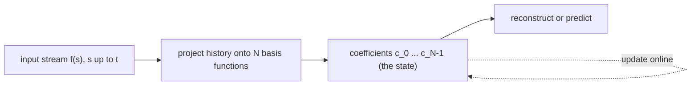
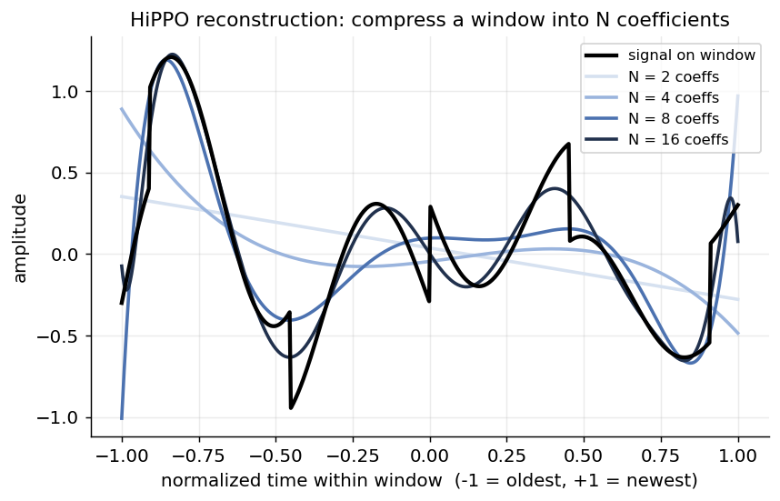
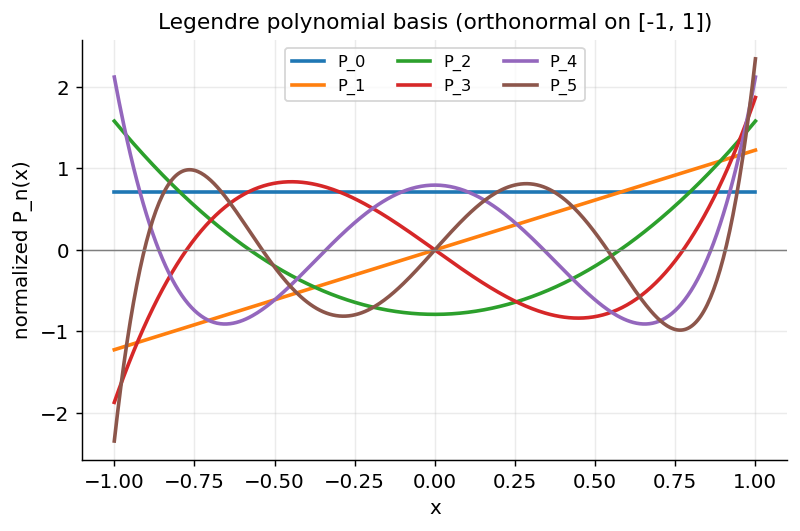
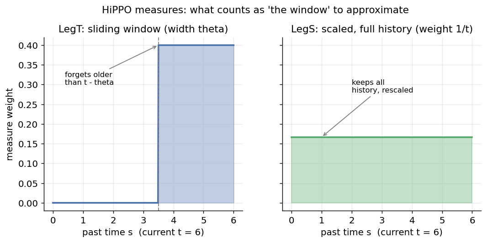
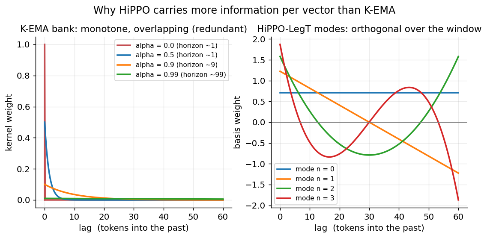
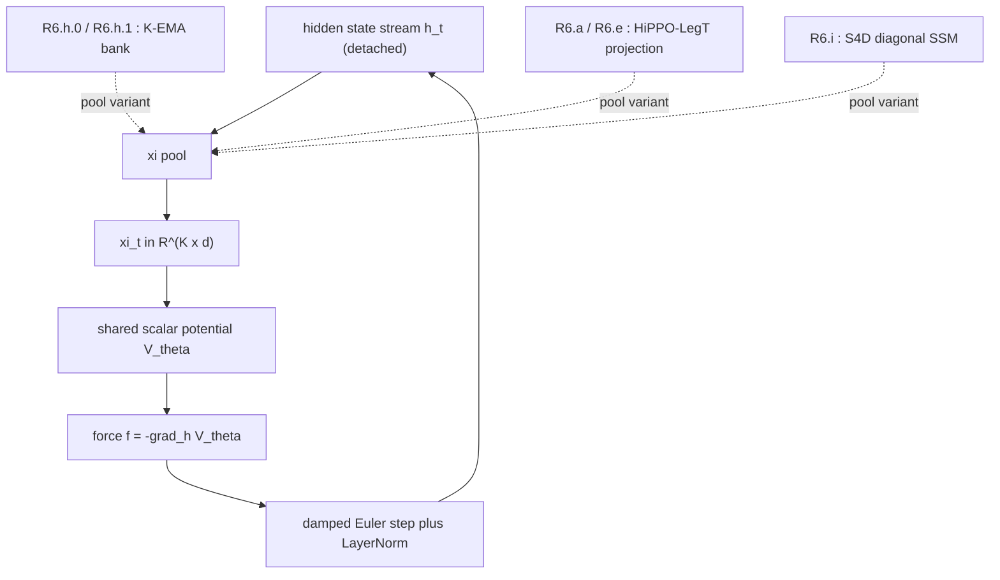
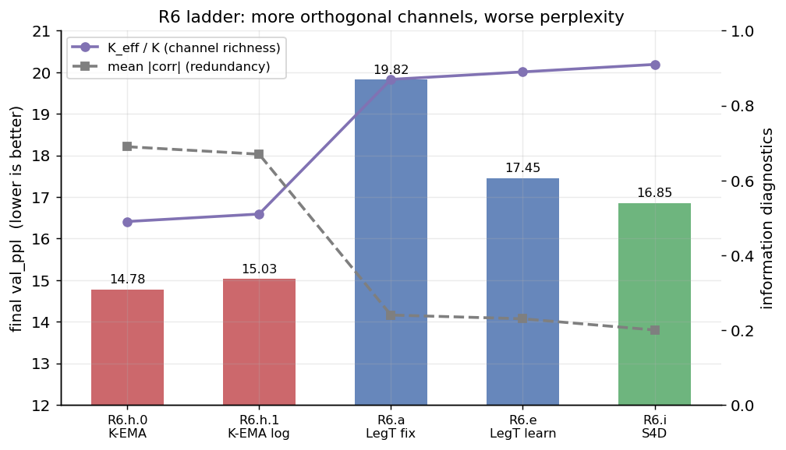

# HiPPO: A Tutorial and Deep Dive

**Context.** In Section 15 of the Semantic Simulation paper, the *R6 ladder*
compares several ways of building the $K$-channel context summary
$\xi_t \in \mathbb{R}^{K \times d}$ that the shared scalar potential
$V_\theta$ consumes. The reference cell (R6.h.0) uses a bank of $K$ parallel
**exponential moving averages (K-EMA)**. Two of the experimental cells
replace that bank with a **HiPPO-LegT** projection (R6.a with fixed
$\Delta t$, R6.e with learnable $\Delta t$). This document explains what
HiPPO is, where it comes from, and exactly what we were trying to buy by
swapping K-EMA for it.

> **Rendering note.** This file uses GitHub-flavoured KaTeX math and Mermaid
> diagrams, written to comply with
> [`GitHub_Markdown_LaTeX_Rendering_Cheatsheet.md`](../../semsimula-paper/companion_notes/GitHub_Markdown_LaTeX_Rendering_Cheatsheet.md).
> If a symbol looks wrong on GitHub, open the file in Safari.

**Companion document:** [`02_S4D_Deep_Dive.md`](./02_S4D_Deep_Dive.md) — S4D
is the diagonal state-space model that R6.i uses, and it is initialised
*from* the HiPPO theory developed here.

---

## Table of contents

1. [The one-sentence summary](#1-the-one-sentence-summary)
2. [The problem HiPPO solves: online memory](#2-the-problem-hippo-solves-online-memory)
3. [Intuition: compress a window into a few numbers](#3-intuition-compress-a-window-into-a-few-numbers)
4. [Orthogonal polynomial projection](#4-orthogonal-polynomial-projection)
5. [The measure: LegT versus LegS](#5-the-measure-legt-versus-legs)
6. [The HiPPO ODE: coefficients evolve linearly](#6-the-hippo-ode-coefficients-evolve-linearly)
7. [The HiPPO matrices](#7-the-hippo-matrices)
8. [Discretization: from ODE to recurrence](#8-discretization-from-ode-to-recurrence)
9. [K-EMA is the one-pole special case of HiPPO](#9-k-ema-is-the-one-pole-special-case-of-hippo)
10. [Reference implementation](#10-reference-implementation)
11. [HiPPO in the R6 ladder](#11-hippo-in-the-r6-ladder)
12. [Why HiPPO lost to K-EMA here](#12-why-hippo-lost-to-k-ema-here)
13. [Key takeaways](#13-key-takeaways)
14. [References](#14-references)

---

## 1. The one-sentence summary

HiPPO (**Hi**gh-order **P**olynomial **P**rojection **O**perators) is a
recipe for maintaining, **online and in closed form**, the coefficients of
the best polynomial approximation of everything a signal has done so far,
where "best" is defined against an explicit weighting (measure) over the
past.

The remarkable fact that makes HiPPO useful is that those coefficients obey
a **linear ordinary differential equation**

$$
\frac{d}{dt} c(t) = A c(t) + B f(t),
$$

with **fixed** matrices $A$ and $B$ that can be written down analytically.
Memory of the past becomes a linear dynamical system.

---

## 2. The problem HiPPO solves: online memory

A recurrent model sees a scalar (or vector) stream $f(t)$ one step at a time
and must keep a finite-dimensional **state** that summarises the history
$f(s)$ for $s \le t$. The design question is: *what should that state be?*

A principled answer: pick a finite basis of $N$ functions and store, at all
times, the coefficients of the projection of the recent history onto that
basis. If the basis is good, those $N$ numbers let you **reconstruct** the
history, and therefore they preserve whatever is needed to predict the
future.



The genius of HiPPO is in *how* it keeps those coefficients current as $t$
advances: not by recomputing an integral over the whole past at every step
(which would be unbounded work), but by a small linear update.

---

## 3. Intuition: compress a window into a few numbers

Suppose the last chunk of history looks like the black curve below. If we
keep only $N$ Legendre coefficients, we keep the smooth, low-order shape of
that window and discard the fine detail. As $N$ grows, the reconstruction
sharpens.



This is exactly the trade a recurrent state makes: a fixed budget of $N$
numbers buys a fixed resolution of the past. HiPPO makes that budget
**explicit and orthogonal**, so each coefficient adds genuinely new
information rather than re-encoding what another coefficient already holds.

---

## 4. Orthogonal polynomial projection

Let $\lbrace g_n \rbrace_{n=0}^{N-1}$ be polynomials that are **orthonormal**
with respect to a measure $\mu$ on the time axis:

$$
\int g_n(s) g_m(s) d\mu(s) = \delta_{nm}.
$$

For the uniform measure on $[-1, 1]$ these are the (normalised) **Legendre
polynomials**. The first six are shown here; note how each successive mode
adds one more oscillation, the hallmark of an orthogonal family.



The projection of a history function $f$ onto this basis is the coefficient
vector

$$
c_n(t) = \int f(s) g_n^{(t)}(s) d\mu^{(t)}(s),
$$

where the superscript $(t)$ records that both the basis and the measure are
**anchored to the current time** $t$ — as $t$ advances, the window slides or
stretches, and the $g_n^{(t)}$ move with it. Handling that moving frame is
the whole technical content of HiPPO.

---

## 5. The measure: LegT versus LegS

The measure $\mu^{(t)}$ decides *what counts as the past worth remembering*.
Two choices dominate, and the R6 ladder uses the first.



- **LegT (translated Legendre).** A uniform weight on a sliding window of
  fixed width $\theta$: the model approximates the last $\theta$ time units
  and *forgets* everything older. This gives a finite, controllable horizon.

- **LegS (scaled Legendre).** A uniform weight on the entire history
  $[0, t]$, rescaled by $1/t$: nothing is ever fully forgotten, but old
  detail is progressively compressed. LegS has the elegant property of being
  **timescale-invariant**.

The R6 ladder uses **LegT** because it wants a *bounded* context horizon
that is directly comparable to the EMA horizons of the K-EMA reference cell.
A LegT window of width $\theta$ plays the same role as an EMA with
time-constant $\tau \approx \theta$.

---

## 6. The HiPPO ODE: coefficients evolve linearly

Here is the payoff. Differentiate the coefficient definition with respect to
$t$ and substitute the recurrence relations of the Legendre polynomials. All
the messy boundary terms collapse, and what remains is a **linear ODE in the
coefficient vector**:

$$
\frac{d}{dt} c(t) = A c(t) + B f(t),
\qquad c(t) \in \mathbb{R}^{N}.
$$

Read this carefully: the state $c(t)$ — the entire compressed memory of the
past — is driven by (i) a linear self-interaction $A c(t)$ that "ages" the
existing memory and (ii) an input term $B f(t)$ that writes the newest
sample in. There is no nonlinearity, no attention, no learned recurrence —
just two constant matrices that fall out of the projection geometry.


---

## 7. The HiPPO matrices

For the **LegS** measure (the most-cited form), the matrices are

$$
A_{nk} = -\begin{cases}
  \sqrt{(2n+1)(2k+1)} & \text{if } n \gt k, \\
  n + 1 & \text{if } n = k, \\
  0 & \text{if } n \lt k,
\end{cases}
\qquad
B_n = \sqrt{2n+1}.
$$

For the **LegT** measure with window width $\theta$ (the form used in R6.a
and R6.e), they are

$$
A_{nk} = -\frac{1}{\theta}(2n+1)\begin{cases}
  1 & \text{if } n \ge k, \\
  (-1)^{n-k} & \text{if } n \lt k,
\end{cases}
\qquad
B_n = \frac{1}{\theta}(2n+1)(-1)^{n}.
$$

Two structural facts matter for everything downstream:

1. $A$ is **dense and lower-Hessenberg-like**: every coefficient talks to
   every lower coefficient. This coupling is what makes the basis orthogonal
   over the moving window, but it is also what makes $A$ expensive to power
   up (the problem S4 and S4D exist to solve).
2. $A$ is **fixed**, not learned. The only freedom in the basic scheme is
   the window $\theta$ (equivalently the step size $\Delta t$ after
   discretization), which R6.e promotes to a learnable parameter.

---

## 8. Discretization: from ODE to recurrence

A language model runs in discrete token steps, so we discretize the ODE with
step $\Delta t$. The **bilinear (Tustin)** transform — which R6.a/R6.e use —
maps the continuous pair $(A, B)$ to a discrete pair $(\bar{A}, \bar{B})$:

$$
\bar{A} = \Big(I - \tfrac{\Delta t}{2} A\Big)^{-1}\Big(I + \tfrac{\Delta t}{2} A\Big),
\qquad
\bar{B} = \Big(I - \tfrac{\Delta t}{2} A\Big)^{-1} \Delta t B.
$$

The memory then updates by a plain linear recurrence, one matrix-vector
product per token:

$$
c_t = \bar{A} c_{t-1} + \bar{B} f_t.
$$

The bilinear map is chosen because it preserves stability (it sends the left
half-plane to the unit disk exactly), so a stable continuous memory stays a
stable discrete memory for any $\Delta t$.

The step size $\Delta t$ is the single most important knob: it sets the
**effective horizon**. Small $\Delta t$ means a long, slowly-decaying memory;
large $\Delta t$ means a short, snappy one. This is why R6.e makes
$\Delta t$ learnable — it lets gradient descent tune the horizon per channel,
the HiPPO analogue of learning the EMA decay $\alpha$.

---

## 9. K-EMA is the one-pole special case of HiPPO

This is the single most useful thing to internalise for the R6 ladder,
because it puts K-EMA, HiPPO, and S4D on one axis.

An exponential moving average

$$
\xi_t = \alpha \xi_{t-1} + (1 - \alpha) f_t
$$

is *exactly* a discrete linear state-space recurrence with a **single,
real, scalar** state: $\bar{A} = \alpha$ and $\bar{B} = 1 - \alpha$. Its
continuous form is the one-pole ODE $\dot{c} = -\lambda c + \lambda f$ with
$\alpha = e^{-\lambda \Delta t}$.

So the three R6 families differ only in the *structure of the state matrix*:

| Family | State matrix $A$ | States | Poles | What each "channel" stores |
| ------ | ---------------- | ------ | ----- | -------------------------- |
| **K-EMA** | diagonal, real, scalar per channel | $K$ independent 1-D | $K$ real poles | a single decaying average |
| **HiPPO-LegT** | dense, real, $N \times N$ | one coupled $N$-D | eigenvalues of dense $A$ | orthogonal window coefficients |
| **S4D** | diagonal, complex, $N$ entries | $N$ independent 1-D (complex) | $N$ complex poles | decaying *oscillations* |

The next figure shows *what each channel actually sees* into the past. K-EMA
gives $K$ monotone exponentials that heavily overlap (they are all just
decays at different rates — highly redundant). HiPPO-LegT gives orthogonal,
oscillating window modes that each capture a different "shape" of the recent
past — far less redundant per vector.



This redundancy gap is precisely what the R6 information-theoretic
diagnostics (mean off-diagonal correlation, total correlation, effective
channel count $K_{\mathrm{eff}}$) were built to measure.

---

## 10. Reference implementation

A compact, dependency-light HiPPO-LegT memory. This mirrors the math of
Sections 7 and 8 and is deliberately written for clarity, not speed.

```python
import numpy as np

def hippo_legt_matrices(N, theta=1.0):
    """Continuous HiPPO-LegT A (N x N) and B (N,) for window width theta."""
    A = np.zeros((N, N))
    B = np.zeros(N)
    for n in range(N):
        B[n] = (2 * n + 1) * ((-1) ** n) / theta
        for k in range(N):
            sign = 1.0 if n >= k else (-1.0) ** (n - k)
            A[n, k] = -(2 * n + 1) * sign / theta
    return A, B

def discretize_bilinear(A, B, dt):
    """Tustin / bilinear transform: continuous (A, B) -> discrete (Ad, Bd)."""
    N = A.shape[0]
    I = np.eye(N)
    left = np.linalg.inv(I - (dt / 2.0) * A)
    Ad = left @ (I + (dt / 2.0) * A)
    Bd = left @ (dt * B)
    return Ad, Bd

class HiPPOLegT:
    """Online polynomial memory: feed scalars, read N coefficients."""
    def __init__(self, N, dt, theta=1.0):
        A, B = hippo_legt_matrices(N, theta)
        self.Ad, self.Bd = discretize_bilinear(A, B, dt)
        self.c = np.zeros(N)

    def step(self, f_t):
        # one matrix-vector product per token: c <- Ad c + Bd f
        self.c = self.Ad @ self.c + self.Bd * f_t
        return self.c
```

In the R6 ladder the per-channel scalar memory above is applied
**independently to each of the $d$ hidden-state dimensions** (so the channel
output is in $\mathbb{R}^{N \times d}$, flattened into the $\xi$ slice), and
$\Delta t$ is either fixed (R6.a) or a learnable parameter (R6.e). The
matrices $\bar{A}, \bar{B}$ are precomputed once and held constant.

---

## 11. HiPPO in the R6 ladder

The R6 cells keep the entire SPLM backbone fixed (LayerNorm-after-step
integrator, shared scalar potential $V_\theta$, optimiser, schedule,
vocabulary, token budget) and change **only** how $\xi_t$ is produced:



The hypothesis was clean and reasonable: K-EMA channels are redundant (a
bank of overlapping exponentials), so replacing them with an **orthogonal**
HiPPO-LegT basis should pack more independent information into the same
$K \times d$ budget and let $V_\theta$ do a better job — lower perplexity for
free.

---

## 12. Why HiPPO lost to K-EMA here

The information hypothesis was confirmed on its own terms and the perplexity
hypothesis was falsified. HiPPO-LegT did carry strictly more information per
$\xi$ vector (lower channel correlation, higher effective channel count) yet
trained to **worse** validation perplexity than the redundant K-EMA bank.



The measured numbers from the R6 ladder (TinyStories pilot, $K = 4$):

| Cell | Basis | Final val_ppl | Mean abs corr | K_eff / K |
| ---- | ----- | ------------- | ------------- | --------- |
| R6.h.0 | K-EMA hand-picked | 14.78 | 0.69 | 0.49 |
| R6.h.1 | K-EMA log-spaced | 15.03 | 0.67 | 0.51 |
| R6.a | HiPPO-LegT (fixed dt) | 19.82 | 0.24 | 0.87 |
| R6.e | HiPPO-LegT (learn dt) | 17.45 | 0.23 | 0.89 |
| R6.i | S4D | 16.85 | 0.20 | 0.91 |

The interpretation, developed in the paper as the **"V_theta-fit-difficulty"
synthesis**, is that the binding constraint is not the information content of
the context summary but the downstream MLP's ability to *extract* from it.
Redundant, smooth, monotone K-EMA channels **compress the function class**
that $V_\theta$ has to fit, and at this token budget that compression matters
more to perplexity than raw channel richness. Orthogonalising the bank gives
$V_\theta$ a harder, higher-rank function to learn.

Making $\Delta t$ learnable (R6.e) recovered roughly 2.4 PPL over the fixed
version (R6.a), confirming that horizon tuning helps — but not enough to beat
the inductive-bias advantage of the redundant EMA bank.

---

## 13. Key takeaways

- **HiPPO turns memory into a linear ODE.** The coefficients of the best
  polynomial approximation of the past evolve as
  $\dot{c} = A c + B f$ with closed-form, fixed $A$ and $B$.
- **The measure sets the horizon.** LegT is a sliding window of width
  $\theta$; LegS keeps all history rescaled. R6 uses LegT for a bounded,
  EMA-comparable horizon.
- **K-EMA is HiPPO with one real pole per channel.** All three R6 families
  are linear state-space models that differ only in the structure of $A$:
  diagonal-real (K-EMA), dense-real (HiPPO), diagonal-complex (S4D).
- **Orthogonality is not free.** HiPPO-LegT carried more information per
  vector but trained to worse perplexity, because it handed $V_\theta$ a
  harder function class. Information richness and learnability are different
  objectives.
- **The dense $A$ is a computational liability.** Powering up a dense
  $N \times N$ $A$ is the bottleneck that motivates the diagonal S4D
  reparameterisation, covered in the companion document.

---

## 14. References

- A. Gu, T. Dao, S. Ermon, A. Rudra, C. Re. *HiPPO: Recurrent Memory with
  Optimal Polynomial Projections.* NeurIPS 2020.
- A. Gu, K. Goel, C. Re. *Efficiently Modeling Long Sequences with
  Structured State Spaces (S4).* ICLR 2022.
- Semantic Simulation paper, Section 15, "Information-bottleneck programme:
  the R6 ladder."
- Companion ledger:
  `semsimula-paper/companion_notes/Reducing_Information_Bottleneck_In_Multi-Channel_Xi_SPLM.md`.
