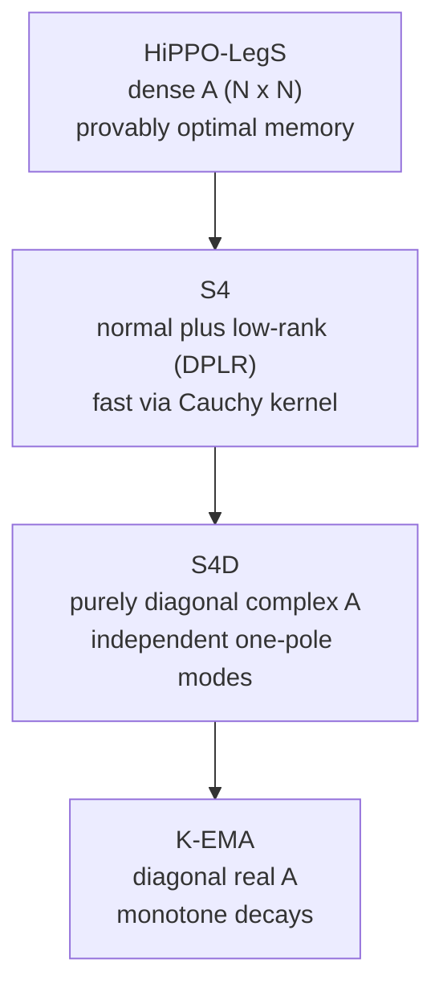
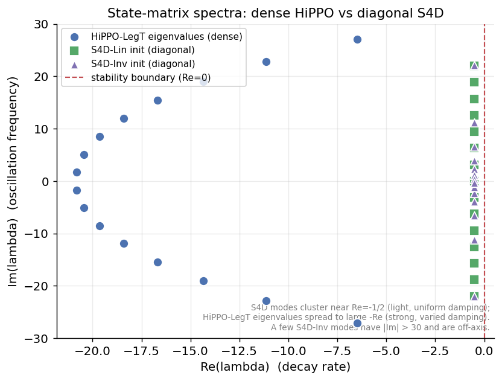
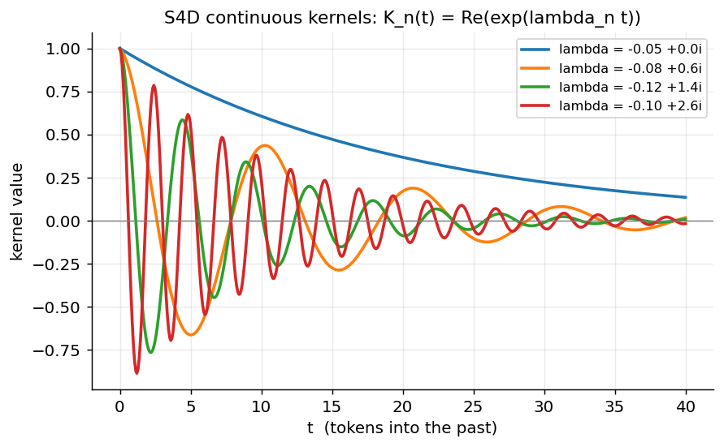
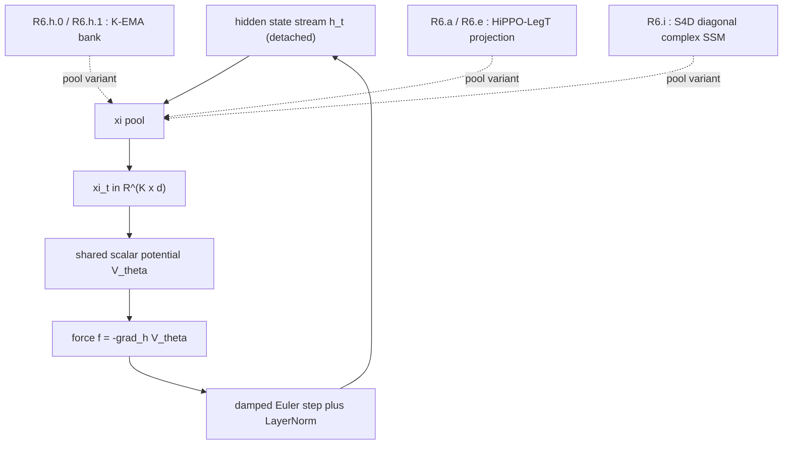

# S4D: A Tutorial and Deep Dive

**Context.** In Section 15 of the Semantic Simulation paper, the *R6 ladder*
compares several ways of building the $K$-channel context summary
$\xi_t \in \mathbb{R}^{K \times d}$ that the shared scalar potential
$V_\theta$ consumes. The most structured cell, **R6.i**, replaces the K-EMA
bank with an **S4D** (diagonal structured state-space) layer: a bank of
learnable, complex, diagonal one-pole filters initialised from the HiPPO
theory. This document explains what S4D is, how it descends from HiPPO and
S4, and exactly what it bought (and did not buy) in the R6 ladder.

> **Rendering note.** This file uses GitHub-flavoured KaTeX math and Mermaid
> diagrams, written to comply with
> [`GitHub_Markdown_LaTeX_Rendering_Cheatsheet.md`](../../semsimula-paper/companion_notes/GitHub_Markdown_LaTeX_Rendering_Cheatsheet.md).
> If a symbol looks wrong on GitHub, open the file in Safari.

**Companion document:** [`01_HiPPO_Deep_Dive.md`](./01_HiPPO_Deep_Dive.md) —
read that first. S4D is initialised *from* the HiPPO matrices derived there,
and the K-EMA-as-one-pole-SSM framing is assumed throughout below.

---

## Table of contents

1. [The one-sentence summary](#1-the-one-sentence-summary)
2. [The problem S4D solves: the dense matrix is too expensive](#2-the-problem-s4d-solves-the-dense-matrix-is-too-expensive)
3. [From dense HiPPO to diagonal S4D: the three steps](#3-from-dense-hippo-to-diagonal-s4d-the-three-steps)
4. [The diagonal state-space model](#4-the-diagonal-state-space-model)
5. [The kernel view: damped oscillations](#5-the-kernel-view-damped-oscillations)
6. [Complex-conjugate pairs and real outputs](#6-complex-conjugate-pairs-and-real-outputs)
7. [Initialisation: S4D-Lin and S4D-Inv](#7-initialisation-s4d-lin-and-s4d-inv)
8. [Zero-order-hold discretization in closed form](#8-zero-order-hold-discretization-in-closed-form)
9. [The K-EMA / HiPPO / S4D spectrum, revisited](#9-the-k-ema--hippo--s4d-spectrum-revisited)
10. [Reference implementation](#10-reference-implementation)
11. [S4D in the R6 ladder (R6.i)](#11-s4d-in-the-r6-ladder-r6i)
12. [Why S4D beat HiPPO-LegT but still lost to K-EMA](#12-why-s4d-beat-hippo-legt-but-still-lost-to-k-ema)
13. [Key takeaways](#13-key-takeaways)
14. [References](#14-references)

---

## 1. The one-sentence summary

S4D (**S4 Diagonal**) is the observation that you can throw away almost all
the structure of the HiPPO/S4 state matrix — keeping only its **diagonal** —
and still get a state-space sequence model that is nearly as expressive,
far simpler to implement, and trivially parallelisable.

Where HiPPO uses a dense $N \times N$ matrix $A$ and S4 uses a
diagonal-plus-low-rank (DPLR) factorisation of it, S4D uses a **purely
diagonal, complex** $A$:

$$
A = \mathrm{diag}(\lambda_0, \lambda_1, \ldots, \lambda_{N-1}),
\qquad \lambda_n \in \mathbb{C}, \quad \mathrm{Re}(\lambda_n) \lt 0.
$$

Each state is now an **independent complex one-pole filter**. The whole
expensive coupling of HiPPO collapses into $N$ scalar recurrences that run
in parallel.

---

## 2. The problem S4D solves: the dense matrix is too expensive

Recall from the [HiPPO deep dive](./01_HiPPO_Deep_Dive.md) that the memory
state obeys a linear recurrence

$$
c_t = \bar{A} c_{t-1} + \bar{B} f_t,
$$

where $\bar{A}$ is the discretized HiPPO matrix. For HiPPO-LegT this
$\bar{A}$ is **dense**: every coefficient couples to every other. Two costs
follow:

1. **Sequential cost.** Computing a length-$L$ output by rolling the
   recurrence forward is $O(L N^2)$ — one dense matrix-vector product per
   step. There is no shortcut, because $\bar{A}^k$ has no special structure.
2. **No convolutional speed-up.** A linear SSM can in principle be evaluated
   as a single long convolution with a kernel $\bar{K}$, computed once and
   applied with an FFT in $O(L \log L)$. But the kernel entries
   $\bar{K}_k = \bar{C} \bar{A}^k \bar{B}$ require powering up the dense
   $\bar{A}$, which is exactly the expensive operation S4 was invented to
   avoid.

S4 (Gu, Goel, Re 2022) solved this by writing the HiPPO matrix as
**normal-plus-low-rank** and using a Cauchy-kernel trick to compute the
convolution kernel without ever materialising $\bar{A}^k$. It works, but the
DPLR machinery is intricate and numerically delicate.

S4D (Gu et al. 2022, *On the Parameterization and Initialization of
Diagonal State Space Models*) asked the sharper question: **what if we just
drop the low-rank part?** A purely diagonal $A$ powers up trivially
($\lambda^k$ is a scalar), the kernel becomes a sum of geometric series, and
the whole model becomes a few lines of code — with almost no loss in
accuracy.

---

## 3. From dense HiPPO to diagonal S4D: the three steps

The path from HiPPO to S4D is a sequence of three relaxations, each trading
a little structure for a lot of simplicity.



1. **HiPPO-LegS → S4.** Keep the exact HiPPO matrix but factor it as
   $A = A_{\text{normal}} - PQ^\top$ (a normal matrix minus a rank-one
   correction). The normal part is unitarily diagonalisable; the low-rank
   part is handled by a separate woodbury / Cauchy computation. This gives
   the speed without changing the dynamics.
2. **S4 → S4D.** Drop the low-rank term $PQ^\top$ entirely. Keep only the
   diagonalised normal part. Remarkably, the eigenvalues of the HiPPO normal
   part, used as the S4D initialisation, retain most of the memory quality.
3. **S4D → K-EMA.** Force the diagonal entries to be **real** (no imaginary
   part). Each mode becomes a plain exponential decay, and the complex
   one-pole filter degenerates into an exponential moving average. This is
   the K-EMA reference cell of the R6 ladder.

So S4D sits exactly one rung above K-EMA: it is "K-EMA with complex poles,"
which is precisely "K-EMA channels that can *oscillate* as they decay."

---

## 4. The diagonal state-space model

A single-input, single-output diagonal SSM is the continuous system

$$
\dot{c}(t) = A c(t) + B f(t),
\qquad y(t) = \mathrm{Re}(C^\top c(t)),
$$

with $A = \mathrm{diag}(\lambda_0, \ldots, \lambda_{N-1})$ complex and
diagonal. Because $A$ is diagonal, the $N$ states **never interact**: state
$n$ obeys its own scalar ODE

$$
\dot{c}_n(t) = \lambda_n c_n(t) + B_n f(t).
$$

This is the whole point. The dense HiPPO coupling — the thing that made the
basis orthogonal over a sliding window — is gone. In its place we have $N$
parallel, independent complex resonators, each defined by a single number
$\lambda_n$ that sets both its **decay rate** (real part) and its
**oscillation frequency** (imaginary part).

The figure below shows the spectra. The dense HiPPO-LegT eigenvalues
(circles) spread far into the left half-plane with large, varied damping;
the S4D initialisations (squares and triangles) cluster near
$\mathrm{Re}(\lambda) = -\tfrac{1}{2}$ with light, fairly uniform damping
and a spread of frequencies up the imaginary axis.



The dashed vertical line at $\mathrm{Re}(\lambda) = 0$ is the stability
boundary: every mode must sit strictly to its left
($\mathrm{Re}(\lambda_n) \lt 0$) so its contribution decays rather than
grows.

---

## 5. The kernel view: damped oscillations

Because the modes are independent, the SSM's impulse response (the
convolution kernel) is just a **sum of complex exponentials**. The
continuous kernel of mode $n$ is

$$
K_n(t) = \mathrm{Re}\big(C_n e^{\lambda_n t}\big),
$$

and with $\lambda_n = r_n + i \omega_n$ this is a **damped oscillation**: an
envelope $e^{r_n t}$ (with $r_n \lt 0$) multiplying a cosine of frequency
$\omega_n$. The next figure plots four such kernels.



Compare this with the two earlier kernel families:

- **K-EMA** kernels are pure decays ($\omega_n = 0$): monotone, never cross
  zero, heavily overlapping. Each channel can only answer "what was the
  weighted average over roughly the last $\tau$ tokens."
- **HiPPO-LegT** kernels are orthogonal polynomial window modes: they
  oscillate, but over a hard finite window with a sharp cutoff.
- **S4D** kernels are damped sinusoids: they oscillate like HiPPO but with a
  soft exponential envelope instead of a hard window, and — crucially — each
  is generated by a single complex scalar instead of a row of a dense matrix.

The damped-oscillation kernel is what lets a single S4D channel act as a
**band-pass filter** on the hidden-state stream: it responds most strongly
to content that recurs at roughly its natural frequency $\omega_n$, decaying
at rate $\lvert r_n \rvert$. A bank of them tiles the time-frequency plane.

---

## 6. Complex-conjugate pairs and real outputs

The hidden-state stream $f(t)$ is real, and the context summary
$\xi_t$ that $V_\theta$ consumes must be real. But the modes $\lambda_n$ are
complex. The standard S4D device is to keep the poles in **conjugate
pairs**: for every $\lambda_n = r_n + i \omega_n$ there is a partner
$\bar{\lambda}_n = r_n - i \omega_n$. Their contributions add to

$$
C_n e^{\lambda_n t} + \bar{C}_n e^{\bar{\lambda}_n t}
= 2 e^{r_n t}\big( a_n \cos \omega_n t - b_n \sin \omega_n t \big),
$$

which is manifestly real. In practice the implementation stores only the
upper-half-plane modes ($\omega_n \ge 0$) and takes
$2 \cdot \mathrm{Re}(\cdot)$ at the end, halving the parameter count. An $N$-state
S4D layer therefore uses $N/2$ complex numbers and represents $N/2$
independent damped oscillators.

This is why, in the eigenvalue figure of Section 4, the S4D markers appear
symmetrically about the real axis: each plotted pair is one real
oscillator.

---

## 7. Initialisation: S4D-Lin and S4D-Inv

Because $A$ is now just a list of numbers, the question "where do the
$\lambda_n$ start?" becomes a design choice. S4D contributes two closed-form
initialisations, both derived as approximations to the diagonalised HiPPO
spectrum.

**S4D-Lin** (linear) places the imaginary parts on an even ladder:

$$
\lambda_n = -\tfrac{1}{2} + i \pi n.
$$

The decay is uniform ($-\tfrac{1}{2}$ for every mode) and the frequencies
are linearly spaced. This makes the bank resemble a truncated Fourier basis
with a common damping — a clean, interpretable spectrum.

**S4D-Inv** (inverse) approximates the actual HiPPO-LegS eigenvalues more
closely, placing the frequencies on an inverse ladder:

$$
\lambda_n = -\tfrac{1}{2} + i \frac{N}{\pi}\Big( \frac{N}{2n+1} - 1 \Big).
$$

This packs many modes at low frequency and a few at high frequency,
mirroring how HiPPO devotes most of its capacity to the slow, smooth shape
of the past. In the spectra figure, the triangles (S4D-Inv) reach higher up
the imaginary axis than the squares (S4D-Lin) for the same $N$.

In the R6 ladder, **R6.i initialises from the diagonalised HiPPO-LegT
spectrum** (consistent with the LegT window used by the HiPPO cells R6.a and
R6.e) and then makes both $A$ (the diagonal poles) and $B$ **learnable**, so
gradient descent can move each pole to wherever it is most useful. The step
size $\Delta t$ is also learnable, exactly as in R6.e.

---

## 8. Zero-order-hold discretization in closed form

A diagonal $A$ makes discretization a one-liner. Whereas HiPPO-LegT used the
bilinear (Tustin) transform with a matrix inverse, S4D uses the
**zero-order-hold (ZOH)** transform, which for a *scalar* pole has an exact
closed form:

$$
\bar{\lambda}_n = e^{\lambda_n \Delta t},
\qquad
\bar{B}_n = \frac{e^{\lambda_n \Delta t} - 1}{\lambda_n} B_n.
$$

No matrix inverse, no solve — just a complex exponential per mode. The
discrete recurrence is then the independent scalar update

$$
c_{n,t} = \bar{\lambda}_n c_{n,t-1} + \bar{B}_n f_t,
$$

and the channel output is $\xi_{n,t} = 2 \cdot \mathrm{Re}(C_n c_{n,t})$.

ZOH is the natural choice here because it is the exact solution of the
scalar ODE under a piecewise-constant input — there is no approximation
error for a diagonal system, and stability is automatic:
$\mathrm{Re}(\lambda_n) \lt 0$ implies $\lvert \bar{\lambda}_n \rvert \lt 1$.
Making $\Delta t$ learnable simply rescales every horizon together, the
S4D analogue of the per-channel EMA decay.

---

## 9. The K-EMA / HiPPO / S4D spectrum, revisited

We can now complete the table from the HiPPO deep dive. The three R6
families are all linear state-space models; they differ only in the
structure of the state matrix $A$ and therefore in what each channel can
represent.

| Family | State matrix $A$ | Poles | Kernel shape | Learnable parts |
| ------ | ---------------- | ----- | ------------ | --------------- |
| K-EMA | diagonal, real | $K$ real | monotone decay | decays (or fixed) |
| HiPPO-LegT | dense, real | eigenvalues of dense $A$ | orthogonal window modes | $\Delta t$ only (R6.e) |
| S4D | diagonal, complex | $N$ complex (conjugate pairs) | damped oscillations | poles, $B$, and $\Delta t$ |

Read top to bottom, this is a ladder of **increasing per-channel
expressivity**: real decay → orthogonal window shape → damped oscillation
with a learnable frequency. Read in terms of **implementation cost**, S4D is
paradoxically *simpler* than HiPPO-LegT (diagonal, no matrix inverse,
parallel modes) while being *strictly more expressive than K-EMA* (complex
poles subsume real ones).

The information-theoretic diagnostics behave monotonically along this
ladder, as the R6 results show.

---

## 10. Reference implementation

A compact, dependency-light diagonal S4D memory. It mirrors Sections 4, 6,
and 8 and is written for clarity, not speed.

```python
import numpy as np

def s4d_lin_init(N_pairs):
    """S4D-Lin initialisation: N_pairs conjugate-pair poles (upper half)."""
    n = np.arange(N_pairs)
    lam = -0.5 + 1j * np.pi * n          # decay -1/2, linear frequencies
    B = np.ones(N_pairs, dtype=complex)  # unit input gain
    C = np.ones(N_pairs, dtype=complex)  # unit output gain
    return lam, B, C

def zoh_discretize(lam, B, dt):
    """Exact zero-order-hold for a diagonal (scalar-per-mode) system."""
    lam_bar = np.exp(lam * dt)
    B_bar = (np.exp(lam * dt) - 1.0) / lam * B
    return lam_bar, B_bar

class S4D:
    """Bank of independent complex one-pole filters (conjugate pairs)."""
    def __init__(self, N_pairs, dt):
        self.lam, self.B, self.C = s4d_lin_init(N_pairs)
        self.lam_bar, self.B_bar = zoh_discretize(self.lam, self.B, dt)
        self.c = np.zeros(N_pairs, dtype=complex)   # complex state

    def step(self, f_t):
        # independent scalar recurrence per mode; runs in parallel
        self.c = self.lam_bar * self.c + self.B_bar * f_t
        # real output: 2 Re(C c) recovers the conjugate-pair sum
        return 2.0 * np.real(self.C * self.c)
```

In the R6 ladder the per-channel filter above is applied **independently to
each of the $d$ hidden-state dimensions**, so the channel output is in
$\mathbb{R}^{N \times d}$, flattened into the $\xi$ slice. The poles
$\lambda_n$, the input gains $B_n$, and the step size $\Delta t$ are all
registered as learnable parameters (stored as real / imaginary parts to keep
the optimiser real-valued), and $\bar{\lambda}\_n, \bar{B}\_n$ are recomputed
from them on each forward pass.

---

## 11. S4D in the R6 ladder (R6.i)

R6.i keeps the entire SPLM backbone fixed (LayerNorm-after-step integrator,
shared scalar potential $V_\theta$, optimiser, schedule, vocabulary, token
budget) and changes **only** how $\xi_t$ is produced — exactly like the
HiPPO cells, but with the diagonal-complex pool.



The design intent of R6.i was to get **the best of both worlds**: the
orthogonality / low-redundancy of HiPPO (because complex modes with distinct
frequencies are nearly uncorrelated) together with the cheapness and
learnability of K-EMA (because the modes are diagonal and independent). On
the information diagnostics it succeeded — R6.i had the lowest channel
correlation and the highest effective channel count of the whole ladder.

The per-token cost is essentially identical to K-EMA: $N$ independent
complex multiply-accumulates instead of $K$ real ones, well under one
percent of total compute. Unlike R6.a / R6.e there is no dense matrix
product and no matrix inverse at init.

---

## 12. Why S4D beat HiPPO-LegT but still lost to K-EMA

The R6 ladder produced a clean, slightly humbling ordering. Here are the
measured numbers (TinyStories pilot, $K = 4$):

| Cell | Basis | Final val_ppl | Mean abs corr | K_eff / K |
| ---- | ----- | ------------- | ------------- | --------- |
| R6.h.0 | K-EMA hand-picked | 14.78 | 0.69 | 0.49 |
| R6.h.1 | K-EMA log-spaced | 15.03 | 0.67 | 0.51 |
| R6.a | HiPPO-LegT (fixed dt) | 19.82 | 0.24 | 0.87 |
| R6.e | HiPPO-LegT (learn dt) | 17.45 | 0.23 | 0.89 |
| R6.i | S4D | 16.85 | 0.20 | 0.91 |

Two facts stand out:

1. **S4D was the best of the structured cells.** Among the
   information-rich pools (R6.a, R6.e, R6.i), S4D won on both axes: the
   lowest redundancy (mean abs corr 0.20) and the highest effective channel
   count (0.91 of nominal), and the best perplexity (16.85). The
   learnable complex poles let it tune horizons and frequencies that the
   fixed HiPPO window could not, recovering roughly 3 PPL over R6.a.
2. **It still lost to the redundant K-EMA bank.** Despite carrying almost
   twice the independent information per $\xi$ vector, S4D trained to
   16.85 PPL versus K-EMA's 14.78 — about 2 PPL *worse*.


The interpretation, developed in the paper as the
**V_theta-fit-difficulty synthesis**, is the same conclusion the HiPPO cells
reached, only sharper because S4D is the strongest possible version of the
"make the channels orthogonal" hypothesis:

> The binding constraint in the R6 regime is not the **information content**
> of the context summary but the downstream MLP's ability to **extract** a
> useful potential from it. Redundant, smooth, monotone K-EMA channels
> compress the function class $V_\theta$ must fit, and at this token budget
> that inductive-bias compression helps perplexity more than raw channel
> richness does. S4D hands $V_\theta$ the richest, highest-rank, most
> oscillatory context of any cell — and that is exactly why it is the
> hardest for $V_\theta$ to fit.

In other words, S4D falsifies the information hypothesis in the most
convincing way available: it maximised channel information *and* minimised
redundancy *and* was cheap *and* was fully learnable, and it **still** could
not beat a bank of overlapping exponentials. The bottleneck lives in the
potential, not the pool.

This is the result that motivated the paper to stop scaling the context
pool and instead turn to the structure of $V_\theta$ itself (the structured
scalar-potential programme).

---

## 13. Key takeaways

- **S4D is HiPPO with the structure thrown away.** Drop the dense coupling
  and the low-rank correction; keep only a diagonal of complex poles. Each
  state becomes an independent one-pole filter $\dot{c}_n = \lambda_n c_n + B_n f$.
- **Complex poles mean damped oscillations.** A mode
  $\lambda_n = r_n + i \omega_n$ has kernel $e^{r_n t}\cos \omega_n t$: a
  band-pass filter at frequency $\omega_n$ decaying at rate $\lvert r_n \rvert$.
  K-EMA is the special case $\omega_n = 0$.
- **Conjugate pairs keep the output real.** Store the upper-half-plane modes
  and take $2 \cdot \mathrm{Re}(\cdot)$; an $N$-state layer is $N/2$ real
  oscillators.
- **ZOH discretization is a closed form.** For a diagonal system
  $\bar{\lambda}_n = e^{\lambda_n \Delta t}$ exactly — no matrix inverse,
  stability automatic.
- **S4D won the structured-pool contest but lost the war.** It had the best
  redundancy, effective-channel-count, and perplexity of the structured
  cells, yet still trailed the redundant K-EMA bank — the cleanest evidence
  that the R6 bottleneck is $V_\theta$'s fit difficulty, not context
  information.

---

## 14. References

- A. Gu, T. Dao, S. Ermon, A. Rudra, C. Re. *HiPPO: Recurrent Memory with
  Optimal Polynomial Projections.* NeurIPS 2020.
- A. Gu, K. Goel, C. Re. *Efficiently Modeling Long Sequences with
  Structured State Spaces (S4).* ICLR 2022.
- A. Gu, K. Goel, A. Gupta, C. Re. *On the Parameterization and
  Initialization of Diagonal State Space Models (S4D).* NeurIPS 2022.
- A. Gupta, A. Gu, J. Berant. *Diagonal State Spaces are as Effective as
  Structured State Spaces (DSS).* NeurIPS 2022.
- Semantic Simulation paper, Section 15, "Information-bottleneck programme:
  the R6 ladder."
- Companion ledger:
  `semsimula-paper/companion_notes/Reducing_Information_Bottleneck_In_Multi-Channel_Xi_SPLM.md`.
