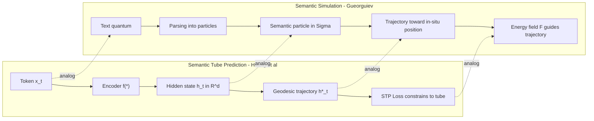
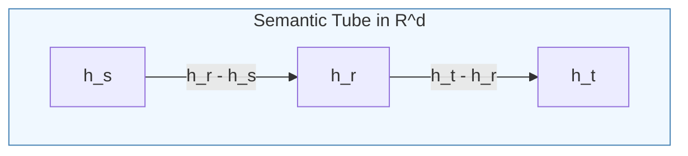
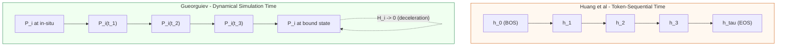
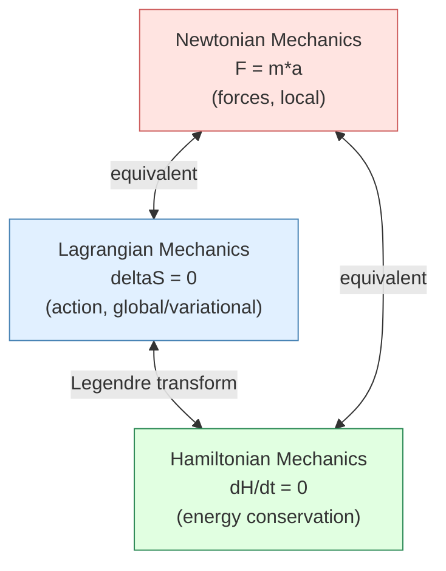
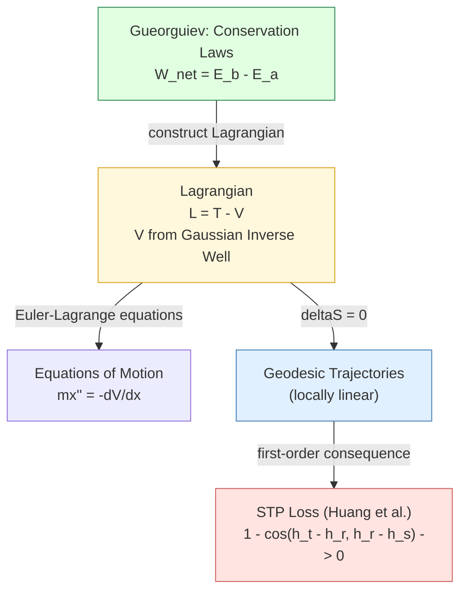
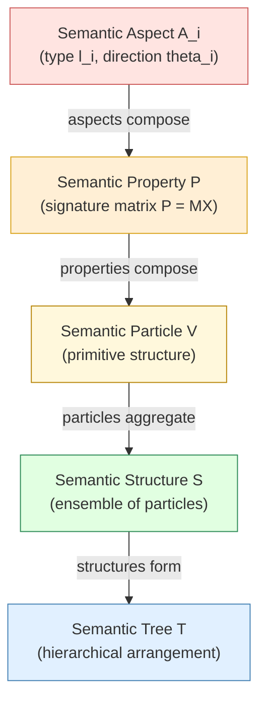
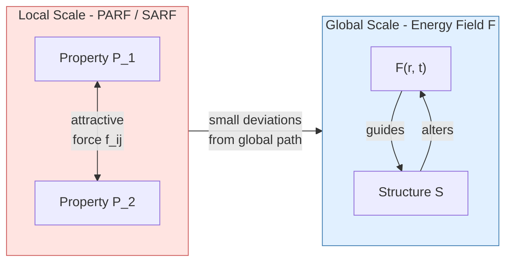
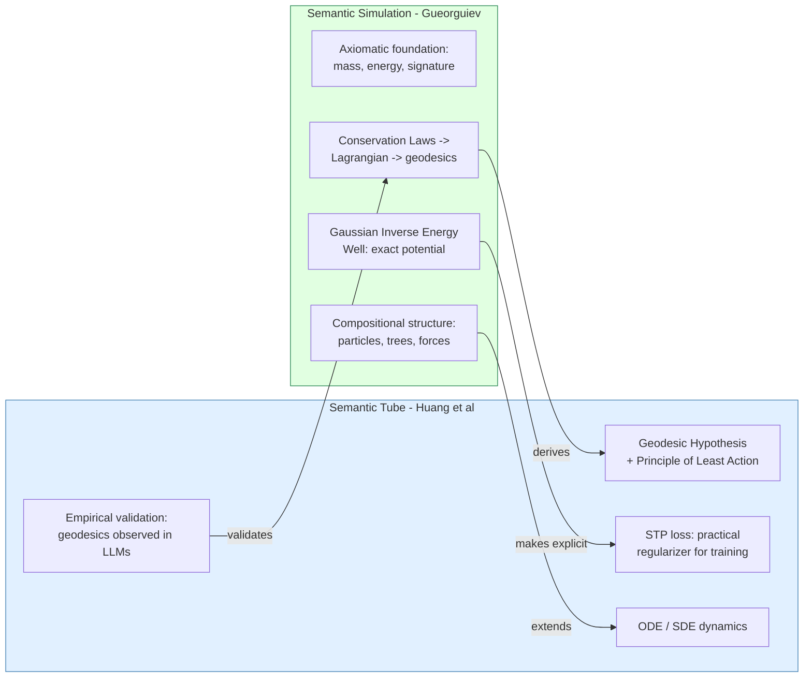

# Hidden States, Semantic Tube Geodesics, and Semantic Structures

**A Comparative Analysis of Huang et al.'s Semantic Tube Prediction and Gueorguiev's Semantic Simulation Framework**

---

## 1. Introduction

Two independent lines of inquiry have converged on a strikingly similar conclusion: that semantic content evolves along constrained trajectories in a continuous metric space. The first, *Semantic Tube Prediction* (STP) by Huang, LeCun, and Balestriero [1], discovers this structure empirically inside the hidden states of Large Language Models. The second, *Semantic Simulation* by Gueorguiev [2][3][4][5][6][7][8], postulates it axiomatically as the foundation for modeling semantic inference via dynamical systems.

This document examines the structural parallels, conceptual divergences, and mutual implications of these two frameworks, with particular attention to the role of variational principles (Principle of Least Action) versus conservation laws in deriving the governing equations of motion for semantic structures.

---

## 2. Overview of the Two Frameworks

### 2.1 Semantic Tube Prediction (Huang et al.)

The STP framework [1] models the evolution of hidden states $h_t = f(x_{\leq t})$ in an LLM as a trajectory in the $d$-dimensional hidden state space $\mathbb{R}^d$. The core claims are:

1. Token sequences trace **geodesics** on a smooth semantic manifold
2. These geodesics are **locally linear** almost everywhere
3. A regularization loss $\mathcal{L}_{STP} = 1 - \cos(h_t - h_r, h_r - h_s)$ confines the actual trajectory to a **tubular neighborhood** of the geodesic
4. The dynamics are governed by an **ODE** in token-sequence space:

$$dx_{\leq t} = \mathring{u} \circ \mathring{f}(x_{\leq t}) \ dt$$

### 2.2 Semantic Simulation (Gueorguiev)

The Semantic Simulation framework models the evolution of **semantic structures** — collections of semantic particles — in an $L$-dimensional metric Semantic Space $\Sigma$. Structures have intrinsic properties (mass $\mathfrak{m}$, energy $E$, semantic signature $P = MX$), move with velocity $\vec{v}$, and interact via:

1. A **Semantic Energy Field** $\mathfrak{F}(\vec{r}, t)$ that permeates $\Sigma$ and guides structures toward their true in-situ positions
2. **Attractive and repulsive forces** between substructures at local scales
3. **Conservation laws** (work-energy theorem) governing the energy exchange along trajectories

The dynamics are governed by a **coupled system of recurrence relations** [3]:

$$E\left(\vec{p}_{c,i} + \Delta\vec{p}_i\right) = E\left(\vec{p}_{c,i}\right) + \sum_{j=1}^{N_i} \vec{f}\left(\vec{p}_{i,j} + \Delta\vec{p}_i,  l_{i,j}\right)\Delta\vec{p}_i$$

$$\vec{p}_E = \sum_{i=1}^{n} \frac{\mathfrak{m}_i}{E(\vec{p}_{c,i} + \Delta\vec{p}_i)} \left(\vec{p}_{c,i} + \Delta\vec{p}_i\right)$$

---

## 3. Architectural Comparison

The following diagram illustrates the structural correspondence between the two frameworks:

### 3.1 Concept-Level Mapping

| Concept | Semantic Tube (Huang et al.) | Semantic Simulation (Gueorguiev) |
|---|---|---|
| **Space** | Hidden state space $\mathbb{R}^d$ | Semantic Space $\Sigma$ ($L$-dimensional metric space) |
| **Fundamental unit** | Hidden state $h_t$ (opaque vector) | Semantic particle with mass $\mathfrak{m}$, energy $E$, signature $P$ |
| **Trajectory** | Geodesic $h_t^{\ast}$ parameterized by token index $t$ | Path $T_{i,0,k}$ parameterized by simulation time $t_k$ |
| **Governing equation** | ODE: $dx_{\leq t} = \mathring{u} \circ \mathring{f}(x_{\leq t}) \ dt$ | Coupled system of equations (7)–(8) in [3] |
| **What constrains trajectories** | STP loss (externally imposed regularizer) | Energy field $\mathfrak{F}$ and conservation laws (intrinsic) |
| **Perturbation / noise** | Unembedding error $\epsilon_t$ | Local attractive/repulsive forces (PARF, SARF) |
| **Multi-scale structure** | H-JEPA hierarchy (architectural) | Local forces + global field (physical, emergent) |
| **Memory of past** | Frozen in network parameters | Persistent alterations of $\mathfrak{F}$ by past trajectories |
| **Compositional structure** | None (h_t is monolithic) | Particles → Properties → Structures → Trees [7][8] |

---

## 4. The Evolution of Representations in Time

### 4.1 The Semantic Tube Geodesic

In Huang et al., the hidden state $h_t$ evolves as each new token is processed. The optimal (error-free) trajectory is the geodesic $h_t^{\ast}$:

$$h_t^{\ast} = \mathring{f}(x_{\leq t})$$

The actual hidden state deviates from this by the noise $\epsilon_t$:

$$h_t = h_t^{\ast} + \epsilon_t$$

The STP loss enforces local linearity by requiring that consecutive trajectory segments point in approximately the same direction:

$$\mathcal{L}_{STP} = 1 - \cos(h_t - h_r,  h_r - h_s) \to 0$$

At inference time, the errors accumulate into a Brownian motion term, and the dynamics become a **Stochastic Differential Equation**:

$$dx_{\leq t} = \mathring{u} \circ \mathring{f}(x_{\leq t}) \ dt + \sigma_t \ dW_t$$

### 4.2 The Semantic Structure Trajectory

In Gueorguiev's framework, a semantic property $P_i$ travels toward its **bound state** under the combined influence of the energy field $\mathfrak{F}$ and inter-property forces. The trajectory is parameterized by the natural coordinate $s$ along the path:

$$s(k) = s(k-1) + \Delta s(k)$$

The energy acquired along the trajectory is:

$$E\left(\vec{p}_{c,i} + \Delta\vec{p}_i\right) = E\left(\vec{p}_{c,i}\right) + \sum_{j=1}^{N_i} \vec{f}\left(\vec{p}_{i,j} + \Delta\vec{p}_i,  l_{i,j}\right)\Delta\vec{p}_i$$

Near the bound state, a damping factor $H_i$ decelerates the property [3, eq. 8]:

$$H_i = \frac{\tanh\left(\frac{|\vec{p}_E - \vec{p}_{c,i}| - x_i}{x_u}\right) + 1}{2}$$

Here $x_i$ is the bound-state distance and $x_u$ controls the slope from 1 to 0 as $P_i$ approaches its bound state, with $x_u \ll \min_i x_i$.

The increment of position is:

$$\Delta\vec{p}_i = \frac{\vec{p}_E - \vec{p}_{c,i}}{|\vec{p}_E - \vec{p}_{c,i}|}  H_i  \Delta s$$

### 4.3 Comparison of Dynamics

| Property | Semantic Tube | Semantic Simulation |
|---|---|---|
| Time parameter | Token index $t \in \{0, 1, \ldots, \tau\}$ | Continuous simulation time $t_k$ |
| Step size | Fixed (one per token) | Variable ($\Delta s$ depends on forces) |
| Terminal condition | Sequence ends at $\langle$EOS$\rangle$ | Structure reaches bound state ($H_i \to 0$) |
| Deceleration | None — constant step rate | Sigmoid damping $H_i$ near bound state |
| Stochastic component | Brownian motion $\sigma_t \ dW_t$ at inference | Field fluctuations (signature-dependent) |

---

## 5. Principle of Least Action vs. Conservation Laws

This is the deepest conceptual divergence between the two frameworks, and arguably the most productive one for future development.

### 5.1 Huang et al.: Variational Principle (Principle of Least Action)

Huang et al. invoke the **Principle of Least Action** to justify that hidden-state trajectories are geodesics. The argument is:

1. The semantic manifold is smooth (an artifact of training)
2. The Principle of Least Action states that the path taken by a system between two points minimizes the **action** $\mathcal{S}$:

$$\mathcal{S}[q] = \int_{t_0}^{t_1} \mathcal{L}(q, \dot{q}, t) \ dt$$

3. Paths that minimize the action are geodesics on the manifold
4. Geodesics on smooth manifolds are locally linear almost everywhere

The action-minimization perspective is **global** — it selects the trajectory by considering all possible paths between two endpoints and choosing the one with minimal action. This is characteristic of Lagrangian mechanics.

However, Huang et al. do **not** derive the Lagrangian $\mathcal{L}$ explicitly. The Principle of Least Action is invoked as a hypothesis, not derived from a specified Lagrangian. The STP loss $\mathcal{L}_{STP}$ is not itself the action — it is a proxy that enforces a consequence (local linearity) of the action principle.

### 5.2 Gueorguiev: Conservation Laws (Newtonian / Hamiltonian)

Gueorguiev's framework derives the equations of motion from **conservation laws** applied to individual particles and ensembles. The foundational result is the **work-energy theorem** [3, Appendix A]:

$$W_{net}(a, b) = E_b - E_a$$

derived from Newton's third law applied in semantic space:

$$\vec{f}_{net} = \mathfrak{m} \cdot \frac{d\vec{v}}{dt}$$

$$dW_{net} = \mathfrak{m} \cdot \vec{v} \ d\vec{v}$$

$$W_{net}(a,b) = \frac{1}{2} \cdot \mathfrak{m} \cdot v^2\Big|_a^b = E_b - E_a$$

This is a **local** formulation — it describes the forces and energy exchanges at each point along the trajectory, without reference to the global path. It is characteristic of Newtonian mechanics.

### 5.3 The Relationship: Lagrangian ↔ Newtonian ↔ Hamiltonian

In classical physics, three formulations of mechanics are mathematically equivalent:

| Formulation | Starting Point | Derives | Used By |
|---|---|---|---|
| **Newtonian** | Forces $\vec{F} = \mathfrak{m} \cdot \vec{a}$ | Trajectories from local force balance | Gueorguiev |
| **Lagrangian** | Action $\mathcal{S} = \int \mathcal{L} \ dt$, $\delta \mathcal{S} = 0$ | Euler-Lagrange equations | Huang et al. (hypothesized) |
| **Hamiltonian** | $H = T + V$, $dH/dt = 0$ | Hamilton's equations | Both (implicit) |

In classical physics, these three are equivalent. If one can specify the Lagrangian $\mathcal{L} = T - V$ (kinetic minus potential energy), the Euler-Lagrange equations reproduce Newton's laws. Conversely, given the forces, one can reconstruct the Lagrangian.

### 5.4 Constructing the Lagrangian for Semantic Space

Gueorguiev's framework provides the ingredients needed to construct an explicit Lagrangian for semantic space. The kinetic energy of a semantic property $P_i$ with mass $\mathfrak{m}\_i$ and velocity $\vec{v}\_i$ is:

$$T_i = \frac{1}{2} \cdot \mathfrak{m}_i \cdot v_i^2$$

The potential energy can be constructed from the Gaussian Inverse Semantic Energy Well [4]. For a property at distance $x$ from the ensemble center:

$$V(x) = \mathfrak{m}_i \cdot \upsilon^2 \cdot \left(1 - e^{-\kappa^2 x^2}\right)$$

where $\upsilon = \sqrt{E_t / \mathfrak{m}}$ is the semantic velocity of the property when subjected to the total net energy $E_t$ of the ensemble [8, eq. 40], $f$ is a normalization coefficient (with dimension of semantic frequency, $\mathbf{stu}^{-1}$) that makes the term $fx/\upsilon$ dimensionless, and $\kappa = f/\upsilon$ [4, eq. 6] controls the well width. This satisfies the ODE [4, eq. 13]:

$$\frac{1}{2(1 - 2\xi^2)} \cdot \frac{d^2 y}{d\xi^2} + y(\xi) = \mathfrak{m}_i \cdot \upsilon^2$$

The Lagrangian for a single property traveling toward its bound state is then:

$$\mathcal{L}_i = T_i - V_i = \frac{1}{2} \cdot \mathfrak{m}_i \cdot v_i^2 - \mathfrak{m}_i \cdot \upsilon^2 \cdot \left(1 - e^{-\kappa^2 x_i^2}\right)$$

And the Euler-Lagrange equation:

$$\frac{d}{dt}\frac{\partial \mathcal{L}_i}{\partial \dot{x}_i} - \frac{\partial \mathcal{L}_i}{\partial x_i} = 0$$

yields:

$$\mathfrak{m}_i \cdot \ddot{x}_i = -2 \cdot \mathfrak{m}_i \cdot \upsilon^2 \cdot \kappa^2 \cdot x_i \cdot e^{-\kappa^2 x_i^2}$$

This is the **restoring force** that pulls the property toward the ensemble center — precisely what the energy field $\mathfrak{F}$ implements in the Newtonian formulation.

### 5.5 Implications

The equivalence of the Newtonian and Lagrangian formulations means that:

1. **Huang et al.'s geodesic hypothesis is a consequence of Gueorguiev's conservation laws.** If the work-energy theorem holds in semantic space and the energy field defines a smooth potential, then the Principle of Least Action automatically applies, and trajectories are geodesics on the induced Riemannian manifold.

2. **Gueorguiev's force equations can be derived from an action principle.** The Gaussian Inverse Energy Well provides the potential energy; the kinetic energy comes from semantic mass and velocity. Together they define a Lagrangian whose Euler-Lagrange equations reproduce the coupled dynamics.

3. **The STP loss is an empirical proxy for what the Lagrangian enforces exactly.** The local linearity enforced by $\mathcal{L}_{STP}$ is a first-order consequence of geodesic motion. The full Lagrangian formulation predicts not just local linearity but the precise curvature of the trajectory as a function of the energy landscape.

---

## 6. The Semantic Particle: Microscopic vs. Macroscopic Description

### 6.1 What Huang et al. Lack

The hidden state $h_t$ in the Semantic Tube is an **opaque monolithic vector**. It has no internal structure — no decomposition into constituent parts, no mass, no individual energy. It is a single point in $\mathbb{R}^d$ that moves along a trajectory.

### 6.2 What Gueorguiev Provides

Semantic structures in the Simulation framework have rich internal composition described through a hierarchy of constructs:

Each level carries quantitative attributes:

- **Aspect** $A_i$: type $l_i$ and angular coordinates $\boldsymbol{\theta}_i$ in $\Sigma$ [5]
- **Property** $P$: signature matrix $P = MX$ where $M$ encodes mass ratios, and singular value decomposition $P = U\Sigma V^T$ determines information content $H(P)$ and feasible in-situ positions [5]
- **Particle** $V$: tree of properties with arc weights encoding semantic significance [7]
- **Structure** $S$: ensemble of particles with total mass $\mathfrak{m}\_S$, harmonic energy $E_H$, and energy-weighted centroid $\vec{p}\_E$ [3][8]
- **Tree** $T = \sum_{i=0}^{N}(k_i, v_i)$: hierarchical arrangement with tuple factors encoding structural position [7]

### 6.3 The Gaussian Inverse Semantic Energy Well

A key quantitative result unique to the Semantic Simulation framework is the energy well that determines bound-state distances [4]. For a property at distance $x$ from the ensemble center:

$$y(x) = \mathfrak{m}_i \cdot \upsilon^2 \cdot \left(1 - e^{-\kappa^2 x^2}\right), \quad x > 0$$

This curve has an inflection point at $x = \frac{1}{\sqrt{2}\kappa}$, meaning properties settle at distances determined by their energy relative to the ensemble. The ODE governing the well shape [4, eq. 11]:

$$\frac{d^2 y}{dx^2} + \mathcal{K}(x) \cdot y(x) = \mathcal{K}(x) \cdot \mathfrak{m}_i \cdot \upsilon^2$$

where $\mathcal{K}(x) = 2\kappa^2(1 - 2\kappa^2 x^2)$, has no counterpart in the Semantic Tube framework.

---

## 7. Multi-Scale Interactions: Local Forces and Global Fields

### 7.1 Two-Scale Architecture

Gueorguiev explicitly separates interactions into two scales [2][6][8]:

- **Local**: Attractive/repulsive forces (PARF between properties [8], SARF between structures [6]) act only at short semantic distances
- **Global**: The semantic energy field $\mathfrak{F}(\vec{r}, t)$ carries information across all of $\Sigma$

The estimation of attractive forces between structures depends on previously observed instances [6]. Given structures $A_{new}$ and $B$ with prior pairs $A^{prev_i}$ and $B_j^{prev_i}$, the force is estimated from the known forces $f_{i,j} = f_{SARF}(A^{prev_i}, B_j^{prev_i})$ using semantic distances $d_{i,j}$ and masses $\mathfrak{m}\_{a_i}$, $\mathfrak{m}\_{b_{i,j}}$. This is a fundamentally **empirical-Bayesian** approach — forces between new structures are inferred from statistics of past interactions.

### 7.2 Correspondence to the Semantic Tube

In Huang et al., the only "force" is the STP loss, which acts uniformly along the trajectory. There is no analogue of the two-scale separation. The closest parallel is in the broader JEPA literature:

| Scale | Gueorguiev | JEPA Hierarchy |
|---|---|---|
| **Local** (short-range) | PARF / SARF between nearby substructures | JEPA-1: detailed, short-term predictions |
| **Global** (long-range) | Energy field $\mathfrak{F}$ guiding overall trajectory | JEPA-2: abstract, long-term predictions |

---

## 8. Information Content and the Feasibility of In-Situ Positions

A distinctive contribution of the Semantic Simulation framework is the use of **singular value decomposition** of the property signature matrix to determine feasible in-situ positions [5].

Given a property with signature matrix $P$, its SVD is $P = U\Sigma V^T$ with singular values $\sigma_1, \sigma_2, \ldots, \sigma_N$. The normalized information content is:

$$H^{\ast} = -\left(\hat{\sigma}_1 \log \hat{\sigma}_1 + \hat{\sigma}_2 \log \hat{\sigma}_2 + \cdots + \hat{\sigma}_N \log \hat{\sigma}_N\right) \cdot \sum_{i=1}^{N} \sigma_i$$

where $\hat{\sigma}\_i$ are the normalized singular values satisfying $\sum \hat{\sigma}\_i^2 = 1$.

The feasible in-situ positions lie on the surface of an $L$-dimensional sphere of radius $H^{\ast}$, further constrained by the scaled ellipsoid $\mathfrak{S}^{\ast}$ determined by the singular values [5, eq. 16]:

$$\mathfrak{S}^{\ast}: \left(\frac{\varsigma_1}{\sigma_1^{\ast}}\right)^2 + \left(\frac{\varsigma_2}{\sigma_2^{\ast}}\right)^2 + \cdots + \left(\frac{\varsigma_k}{\sigma_k^{\ast}}\right)^2 \leq 1 \quad \text{s.t.} \quad \frac{\sigma_1^{\ast} + \sigma_2^{\ast} + \cdots + \sigma_k^{\ast}}{k} = H^{\ast}$$

This provides a rigorous geometric characterization of where structures can exist in semantic space — something entirely absent from the Semantic Tube framework, where hidden states can occupy any point in $\mathbb{R}^d$ without constraint.

---

## 9. Semantic Trees and Structural Operations

Gueorguiev's framework includes algebraic operations on **semantic trees** [7] that enable compositional reasoning about structures:

A tree is represented as:

$$T = \sum_{i=0}^{N}(k_i, v_i)$$

where $k_i$ are tuple factors encoding tree position via primitive factor concatenation:

$$k_i = \dot{k}_{1,i} \cdot \dot{k}_{2,i} \cdot \cdots \cdot \dot{k}_{h,i}$$

and $v_i$ are semantic particle values.

The **semantic tree difference** between two trees sharing the same particle set but with different arrangements provides a metric for structural comparison [7, eq. 7]:

$$\text{sdiff}(P_1, P_2) = \sum_{i,j} \left|\frac{\mathfrak{m}_i}{E_i}\vec{a}_i - \frac{\mathfrak{m}_j}{E_j}\vec{b}_j\right| + \sum_{q} \frac{\mathfrak{m}_q}{E_q}\lVert\vec{b}_q\rVert$$

where aspects are matched by decreasing mass-to-energy ratio $\mathfrak{m}_i / E_i$.

This compositional algebra has no counterpart in the Semantic Tube framework. In Huang et al., hidden states are atomic and indivisible — there is no mechanism for decomposing $h_t$ into parts, rearranging them, or computing distances between alternative arrangements.

---

## 10. Summary: What Each Framework Provides to the Other

**From Huang et al. to Gueorguiev:**
- Empirical evidence from LLM hidden states that trajectories in representation space are indeed geodesics — validating the dynamical-system approach
- The ODE/SDE formulation providing a clean mathematical framework for thinking about inference-time dynamics
- The observation that the Principle of Least Action applies to learned representations, suggesting that the conservation laws postulated for $\Sigma$ have real-world correlates

**From Gueorguiev to Huang et al.:**
- The **microscopic theory** beneath the macroscopic geodesic: semantic particles with mass, energy, and signature whose collective behavior produces the observed trajectories
- The **explicit potential function** (Gaussian Inverse Energy Well) that the STP loss approximates
- The **compositional structure** that would allow decomposing $h_t$ into meaningful sub-components rather than treating it as opaque
- The **two-scale interaction model** (local forces + global field) that explains why trajectories are *approximately* but not *exactly* linear — the deviations from geodesic straightness arise from local inter-property forces
- The **signature-dependent reinforcement** mechanism via $\mathfrak{F}$, which suggests that the energy landscape should be conditional on the semantic identity of the structure traversing it

---

## References

[1] H. Huang, Y. LeCun, R. Balestriero, "Semantic Tube Prediction: Beating LLM Data Efficiency with JEPA," arXiv:2602.22617, 2026. [Link](https://arxiv.org/abs/2602.22617)

[2] D. Gueorguiev, "The Notion of Semantic Simulation," 2023/2024.

[3] D. Gueorguiev, "On the Need of Dynamic Simulation when Modeling Interactions of Semantic Structures," 2022.

[4] D. Gueorguiev, "On the Gaussian Inverse Semantic Energy Well," 2022.

[5] D. Gueorguiev, "On the Signature Matrix of Semantic Property," 2022.

[6] D. Gueorguiev, "Modeling Attractive and Repulsive Forces between Semantic Structures," 2022.

[7] D. Gueorguiev, "Semantic Tree Operations," 2021.

[8] D. Gueorguiev, "Modeling Attractive and Repulsive Forces in Semantic Properties," 2022.
