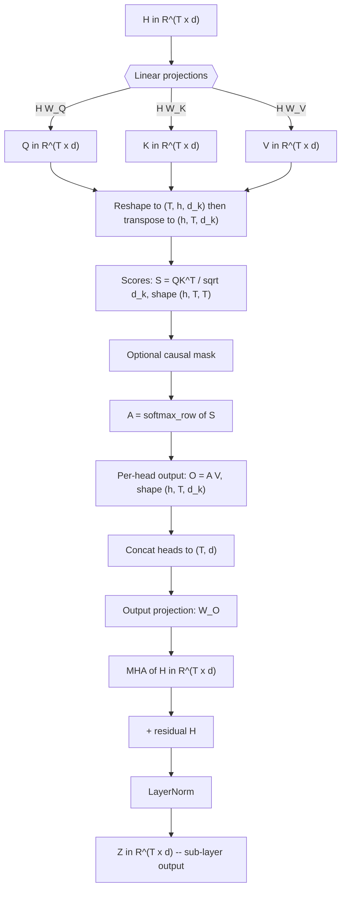
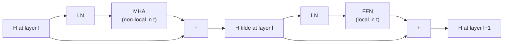

# Multi-Head Attention in the Transformer Block — A Deep Dive

*Compiled by D. Gueorguiev with Claude Opus 4.7 — May 11, 2026*

---

## 1. Scope and setup

This document deconstructs the **Multi-Head Attention (MHA)** sub-layer of a single transformer block, traces exactly how it transforms an input matrix $H \in \mathbb{R}^{T \times d}$ into an output of the same shape, and shows how the surrounding residual + LayerNorm wrapper closes the loop. The treatment is post-LN (the original Vaswani et al. convention); the pre-LN variant used in GPT-2 is noted where it differs.

We fix notation as follows:

| Symbol | Meaning | Typical value |
|---|---|---|
| $T$ | sequence length (number of token positions) | up to 1024 / 2048 / 8192 |
| $d$ | model dimension (a.k.a. $d_{\text{model}}$) | 512 (Vaswani), 768 (GPT-2 small) |
| $h$ | number of attention heads | 8 (Vaswani), 12 (GPT-2 small) |
| $d_k$ | per-head dimension, $= d / h$ | 64 |
| $H^{(\ell)}$ | residual-stream tensor at layer $\ell$, shape $T \times d$ | — |
| $\ell$ | block (depth) index, $\ell = 1, \dots, L$ | $L = 12$ for GPT-2 small |

For the **first block** the input is $H^{(0)}$ = token embeddings + positional encoding. For subsequent blocks the input is the output of the previous block.

---

## 2. The MHA pipeline at a glance



The flow has seven conceptual stages: **(1)** linear projections to Q/K/V, **(2)** scaled dot-product scoring, **(2.5)** optional causal mask, **(3)** row-wise softmax, **(4)** value averaging, **(5)** head concatenation, **(6)** output projection, **(7)** Add & Norm. Each is examined below.

---

## 3. Step-by-step deep dive

### 3.1 Linear projections — producing Q, K, V

**Learnable parameters per head $i \in \{1, \dots, h\}$:**

$$W_Q^{(i)}, W_K^{(i)}, W_V^{(i)} \in \mathbb{R}^{d \times d_k}$$

**Plus a single output-mixing matrix:**

$$W_O \in \mathbb{R}^{d \times d}$$

In practice, the $h$ per-head matrices are stacked side-by-side into single $d \times d$ matrices $W_Q$, $W_K$, $W_V$ so that one fused matmul produces all heads at once. The "split into heads" then becomes a tensor reshape, not a separate computation.

**Per-head projection:**

$$Q^{(i)} = H W_Q^{(i)}, \qquad K^{(i)} = H W_K^{(i)}, \qquad V^{(i)} = H W_V^{(i)}, \qquad Q^{(i)}, K^{(i)}, V^{(i)} \in \mathbb{R}^{T \times d_k}$$

**Row-by-row, for token $t$:**

$$q_t^{(i)} = h_t W_Q^{(i)}, \qquad k_t^{(i)} = h_t W_K^{(i)}, \qquad v_t^{(i)} = h_t W_V^{(i)}, \qquad \in \mathbb{R}^{d_k}$$

The canonical mechanistic reading:

- $q_t^{(i)}$ — **query**: "what is token $t$ looking for?"
- $k_t^{(i)}$ — **key**: "what does token $t$ advertise to others?"
- $v_t^{(i)}$ — **value**: "what does token $t$ contribute if attended to?"

$Q$ and $K$ live in the same $d_k$-dimensional *matching space*; $V$ lives in its own $d_k$-dimensional *content space*. There is no a priori reason for these to coincide, and indeed $W_Q, W_K, W_V$ are independent learnable parameters.

```python
# PyTorch — fused projection, then reshape into heads
B, T, d = x.shape                      # batch, seq, model dim
h, d_k = num_heads, d // num_heads

q = self.W_q(x)                        # (B, T, d)
k = self.W_k(x)                        # (B, T, d)
v = self.W_v(x)                        # (B, T, d)

# Split d → (h, d_k) and bring heads to the leading position
q = q.view(B, T, h, d_k).transpose(1, 2)   # (B, h, T, d_k)
k = k.view(B, T, h, d_k).transpose(1, 2)   # (B, h, T, d_k)
v = v.view(B, T, h, d_k).transpose(1, 2)   # (B, h, T, d_k)
```

### 3.2 Scaled dot-product scores

For each head $i$, compute a $T \times T$ matrix of pairwise affinities:

$$S^{(i)} = \frac{Q^{(i)} \big(K^{(i)}\big)^{\top}}{\sqrt{d_k}}, \qquad S^{(i)} \in \mathbb{R}^{T \times T}$$

Entry-wise:

$$S^{(i)}_{t,t'} = \frac{q_t^{(i)} \cdot k_{t'}^{(i)}}{\sqrt{d_k}}$$

This is the **affinity between token $t$'s query and token $t'$'s key**, in head $i$. Large positive values mean strong attraction; large negative values, strong repulsion.

#### Why divide by $\sqrt{d_k}$?

Suppose the components of $q_t^{(i)}$ and $k_{t'}^{(i)}$ are approximately independent zero-mean unit-variance random variables. Then their dot product

$$q_t^{(i)} \cdot k_{t'}^{(i)} = \sum_{j=1}^{d_k} q_{t,j}^{(i)} k_{t',j}^{(i)}$$

has

$$\mathbb{E}\left[q_t^{(i)} \cdot k_{t'}^{(i)}\right] = 0, \qquad \mathrm{Var}\left[q_t^{(i)} \cdot k_{t'}^{(i)}\right] = d_k$$

Without the $1/\sqrt{d_k}$ factor, the variance of the pre-softmax scores grows linearly with $d_k$. The softmax then saturates — one entry approaches 1, all others approach 0 — and the Jacobian collapses, killing gradients. Dividing by $\sqrt{d_k}$ restores unit variance and keeps the softmax in its responsive regime regardless of $d_k$.

```python
scores = (q @ k.transpose(-2, -1)) / math.sqrt(d_k)   # (B, h, T, T)
```

### 3.3 Causal masking (decoder / autoregressive only) — deep dive

For causal models (GPT-2, decoder blocks in Vaswani), add a mask $M \in \mathbb{R}^{T \times T}$ where

$$M_{t,t'} = \begin{cases} 0 & \text{if } t' \leq t \quad \text{(present or past — allowed)} \\ -\infty & \text{if } t' > t \quad \text{(future — forbidden)} \end{cases}$$

so that

$$S'^{(i)} = S^{(i)} + M$$

For **encoder blocks** (BERT, the encoder half of Vaswani) there is no mask — every position attends to every position.

#### How the mask is applied

Concretely, $M$ is upper-triangular with $-\infty$ above the main diagonal and $0$ on and below it:

$$M = \begin{pmatrix} 0 & -\infty & -\infty & \cdots & -\infty \\ 0 & 0 & -\infty & \cdots & -\infty \\ 0 & 0 & 0 & \cdots & -\infty \\ \vdots & \vdots & \vdots & \ddots & \vdots \\ 0 & 0 & 0 & \cdots & 0 \end{pmatrix}$$

The mask is added **before** the softmax, not after. The resulting masked softmax is

$$A^{(i)}_{t,t'} = \frac{\exp\big(S^{(i)}_{t,t'} + M_{t,t'}\big)}{\sum_{u=1}^{T} \exp\big(S^{(i)}_{t,u} + M_{t,u}\big)}$$

#### Why $-\infty$ before softmax (and not 0 after softmax)

The key identity is

$$\exp\big(S^{(i)}_{t,t'} + (-\infty)\big) = \exp(-\infty) = 0$$

So for any forbidden $(t, t')$ pair, the *numerator* in the softmax is exactly zero, and that entry contributes nothing to the *denominator* either. The allowed entries are then renormalized cleanly — they sum to 1 over only the past-and-present positions.

If you instead applied the mask **after** the softmax — zeroing out the forbidden entries post-hoc — two things would go wrong:

1. **The row would no longer sum to 1**, forcing a manual renormalization step.
2. **The gradients would leak information about future tokens during training**, because the masked entries would still have non-zero gradients through the unmasked softmax. The pre-softmax additive mask gets the math right in a single step.

#### Numerical detail: implementations use a large finite negative number

In production code the "$-\infty$" is realized as a large finite negative value (typically $-10^9$, or `float('-inf')` via masked-fill) for two reasons:

- `exp(-inf) = 0` is well-defined in IEEE 754, but `inf - inf = nan`, which can arise in rare edge cases (e.g., an entire row masked out due to padding combined with causal masking).
- A value like $-10^4$ is already enough: $\exp(-10^4)$ underflows to zero in float32 anyway.

PyTorch's standard `masked_fill(mask, float('-inf'))` works correctly for the canonical causal case because every row has at least one allowed entry (the diagonal), so the denominator is never zero. The `-1e9` convention is a defensive choice that survives pathological cases.

#### Worked example, $T = 4$

Suppose the raw scores for a single head are

$$S = \begin{pmatrix} 2.0 & 1.5 & 0.3 & 0.8 \\ 1.0 & 2.5 & 1.8 & 0.4 \\ 0.5 & 1.2 & 3.0 & 1.1 \\ 0.7 & 0.9 & 1.4 & 2.2 \end{pmatrix}$$

After adding $M$:

$$S' = S + M = \begin{pmatrix} 2.0 & -\infty & -\infty & -\infty \\ 1.0 & 2.5 & -\infty & -\infty \\ 0.5 & 1.2 & 3.0 & -\infty \\ 0.7 & 0.9 & 1.4 & 2.2 \end{pmatrix}$$

After row-wise softmax:

$$A = \begin{pmatrix} 1.000 & 0.000 & 0.000 & 0.000 \\ 0.182 & 0.818 & 0.000 & 0.000 \\ 0.057 & 0.115 & 0.828 & 0.000 \\ 0.106 & 0.130 & 0.214 & 0.550 \end{pmatrix}$$

Observations:

- **Row 1** (token 1) attends only to itself — the only allowed position. $A_{1,1} = 1$ regardless of the original score values.
- **Row 2** (token 2) attends to tokens 1 and 2, with weights depending only on $S_{2,1}$ and $S_{2,2}$.
- **Each row sums to exactly 1**, normalized over only the allowed (past-and-present) positions.
- **The lower-triangular structure** of $A$ is the visible signature of the causal constraint.

#### PyTorch implementation

```python
# Build the causal mask once (T × T boolean, True = forbidden)
mask = torch.triu(
    torch.ones(T, T, dtype=torch.bool, device=x.device),
    diagonal=1,
)
# diagonal=1 → strictly above the main diagonal is True;
# the diagonal itself is False because token t IS allowed to attend to itself.

# Apply to scores; broadcasts across (B, h)
scores = scores.masked_fill(mask, float('-inf'))

# Row-wise softmax now produces the lower-triangular attention pattern
attn = F.softmax(scores, dim=-1)
```

In efficient implementations (Flash Attention, xformers, PyTorch's `F.scaled_dot_product_attention(..., is_causal=True)`), the mask is **never materialized** as a $T \times T$ tensor. The kernel simply skips the upper-triangular work entirely, saving both memory ($O(T^2)$ for the mask) and roughly halving the attention FLOPs. Materializing the mask is fine for small $T$ but becomes a real bottleneck at long context lengths.

#### Architectural significance

The causal mask is what makes a transformer **autoregressive at the level of the loss**: during training, the model sees the entire sequence in one forward pass, but the mask guarantees that the prediction for token $t+1$ depends only on tokens $1, \dots, t$. This is the source of the *training parallelism* that makes transformers efficient — every position's loss is computed simultaneously, but each position's computation respects the autoregressive ordering.

At inference time, the mask is what makes **KV-caching** work: once the keys and values for tokens $1, \dots, t$ have been computed, they are frozen — no future token can affect them — so they can be cached, and only token $t+1$ requires fresh work. Without the mask, every token's representation would depend on every other token's, and incremental decoding would be impossible.

### 3.4 Row-wise softmax — the attention pattern

$$A^{(i)} = \mathrm{softmax}_{\text{row}}\big(S^{(i)}\big), \qquad A^{(i)} \in \mathbb{R}^{T \times T}$$

Explicitly, for row $t$:

$$A^{(i)}_{t,t'} = \frac{\exp\big(S^{(i)}_{t,t'}\big)}{\sum_{u=1}^{T} \exp\big(S^{(i)}_{t,u}\big)}$$

Each row of $A^{(i)}$ is a probability distribution over the $T$ key positions. This matrix is the **attention pattern** — the object interpretability researchers stare at to understand what a head is doing. Recurring motifs include:

- **previous-token heads** ($A_{t, t-1} \approx 1$, all other entries near zero)
- **first-token heads** ($A_{t, 1} \approx 1$, anchoring on `<bos>`)
- **induction heads** (matching repeated bigrams; Olsson et al. 2022)
- **subject-of-verb heads** (long-range syntactic linkage)

```python
attn = F.softmax(scores, dim=-1)   # (B, h, T, T), rows sum to 1
```

### 3.5 Weighted average of values

$$O^{(i)} = A^{(i)} V^{(i)}, \qquad O^{(i)} \in \mathbb{R}^{T \times d_k}$$

Row $t$:

$$o_t^{(i)} = \sum_{t'=1}^{T} A^{(i)}_{t,t'} v_{t'}^{(i)}$$

This is a **convex combination** of the value vectors weighted by attention. For each token $t$, head $i$ produces a $d_k$-dimensional vector summarizing "what this head pulled in from the rest of the sequence."

```python
out_per_head = attn @ v   # (B, h, T, d_k)
```

### 3.6 Concatenating heads

Stack the $h$ per-head outputs along the channel axis:

$$O = \mathrm{Concat}\big(O^{(1)}, O^{(2)}, \dots, O^{(h)}\big) \in \mathbb{R}^{T \times d}$$

Since $h \cdot d_k = d$ by construction, the concatenation brings us back to the model dimension.

```python
# (B, h, T, d_k) → (B, T, h, d_k) → (B, T, d)
out_concat = out_per_head.transpose(1, 2).contiguous().view(B, T, d)
```

### 3.7 Output projection — mixing the heads

$$\mathrm{MHA}(H) = O W_O, \qquad W_O \in \mathbb{R}^{d \times d}$$

Without $W_O$, the $h$ heads would write into **disjoint** $d_k$-dimensional channel slices of the output. $W_O$ is the linear map that allows them to recombine and share information across the channel axis. It is essential — removing it severely degrades the model. In mechanistic interpretability, $W_V W_O$ is often analyzed as a single "OV circuit" governing what gets written to the residual stream, while $W_Q W_K^\top$ is the "QK circuit" governing what gets attended to.

```python
output = self.W_o(out_concat)   # (B, T, d)
```

### 3.8 The Add & Norm wrapper

The MHA box in the Vaswani diagram is followed by an "Add & Norm" box. In the **post-LN** convention:

$$Z = \mathrm{LN}\big(H + \mathrm{MHA}(H)\big)$$

where LayerNorm operates **per token** (over the $d$ channel dimension):

$$\mathrm{LN}(x)_j = \gamma_j \cdot \frac{x_j - \mu(x)}{\sqrt{\sigma^2(x) + \epsilon}} + \beta_j$$

with

$$\mu(x) = \frac{1}{d} \sum_{j=1}^{d} x_j, \qquad \sigma^2(x) = \frac{1}{d} \sum_{j=1}^{d} \big(x_j - \mu(x)\big)^2$$

and $\gamma, \beta \in \mathbb{R}^d$ learnable scale and shift. The $\epsilon$ (typically $10^{-5}$) prevents division by zero.

In the **pre-LN** convention used by GPT-2 and most modern decoder-only models, the order is flipped:

$$Z = H + \mathrm{MHA}\big(\mathrm{LN}(H)\big)$$

This is more than a stylistic choice — it has substantive consequences:

- **Post-LN**: the residual stream is renormalized after every sub-layer; signals are clipped, training requires careful warmup, but representations stay bounded.
- **Pre-LN**: the residual stream accumulates unnormalized contributions; LN is applied only on the *read* side (into attention / FFN / unembedding). Training is more stable and the model is more amenable to depth scaling, but the residual stream's norm grows with depth.

For the hidden-state dynamics framing, the pre-LN version is much cleaner: the residual stream $H^{(\ell)}$ evolves as an unnormalized state, and the LN inside each sub-layer plays the role of a state-dependent rescaling on the read path.

---

## 4. The MHA equation in one line

Pulling everything together, the multi-head attention transformation $H \mapsto \mathrm{MHA}(H)$ is

$$\boxed{ \mathrm{MHA}(H) = \mathrm{Concat}_{i=1}^{h}\Big[\mathrm{softmax}\Big(\frac{(H W_Q^{(i)})(H W_K^{(i)})^{\top}}{\sqrt{d_k}}\Big) H W_V^{(i)}\Big] W_O }$$

with the surrounding sub-layer being either $\mathrm{LN}(H + \mathrm{MHA}(H))$ (post-LN) or $H + \mathrm{MHA}(\mathrm{LN}(H))$ (pre-LN).

---

## 5. A minimal reference implementation

```python
import math
import torch
import torch.nn as nn
import torch.nn.functional as F


class MultiHeadAttention(nn.Module):
    """
    Multi-head self-attention as described in Vaswani et al. (2017).

    Input/output shape: (B, T, d) where d = num_heads * d_k.
    Causal flag enables the autoregressive mask used in GPT-style models.
    """
    def __init__(self, d_model: int, num_heads: int, causal: bool = False):
        super().__init__()
        assert d_model % num_heads == 0
        self.d_model = d_model
        self.h = num_heads
        self.d_k = d_model // num_heads
        self.causal = causal

        # Fused per-head projections — each is d_model → d_model
        self.W_q = nn.Linear(d_model, d_model, bias=False)
        self.W_k = nn.Linear(d_model, d_model, bias=False)
        self.W_v = nn.Linear(d_model, d_model, bias=False)
        self.W_o = nn.Linear(d_model, d_model, bias=False)

    def forward(self, x: torch.Tensor) -> torch.Tensor:
        B, T, d = x.shape

        # 1. Project to Q, K, V and split into heads
        q = self.W_q(x).view(B, T, self.h, self.d_k).transpose(1, 2)  # (B, h, T, d_k)
        k = self.W_k(x).view(B, T, self.h, self.d_k).transpose(1, 2)
        v = self.W_v(x).view(B, T, self.h, self.d_k).transpose(1, 2)

        # 2. Scaled dot-product scores
        scores = (q @ k.transpose(-2, -1)) / math.sqrt(self.d_k)      # (B, h, T, T)

        # 2.5. Causal mask
        if self.causal:
            mask = torch.triu(
                torch.ones(T, T, dtype=torch.bool, device=x.device), diagonal=1
            )
            scores = scores.masked_fill(mask, float('-inf'))

        # 3. Row-wise softmax → attention pattern A
        attn = F.softmax(scores, dim=-1)                              # (B, h, T, T)

        # 4. Weighted average of values
        out = attn @ v                                                # (B, h, T, d_k)

        # 5. Concatenate heads back into (B, T, d)
        out = out.transpose(1, 2).contiguous().view(B, T, self.d_model)

        # 6. Output projection
        return self.W_o(out)                                          # (B, T, d)


class TransformerBlockPreLN(nn.Module):
    """
    A single pre-LN decoder-only block (GPT-2 style).
    """
    def __init__(self, d_model: int, num_heads: int, d_ff: int):
        super().__init__()
        self.ln1 = nn.LayerNorm(d_model)
        self.attn = MultiHeadAttention(d_model, num_heads, causal=True)
        self.ln2 = nn.LayerNorm(d_model)
        self.ffn = nn.Sequential(
            nn.Linear(d_model, d_ff),
            nn.GELU(),
            nn.Linear(d_ff, d_model),
        )

    def forward(self, h: torch.Tensor) -> torch.Tensor:
        # Pre-LN: H ← H + Sublayer(LN(H))
        h = h + self.attn(self.ln1(h))
        h = h + self.ffn(self.ln2(h))
        return h
```

---

## 6. The dynamical-systems perspective

Because each block is a **shape-preserving** map $\mathbb{R}^{T \times d} \to \mathbb{R}^{T \times d}$, the depth-indexed sequence $H^{(0)}, H^{(1)}, \dots, H^{(L)}$ is a discrete trajectory in a single fixed state space. Decomposing the block update (pre-LN):

$$h_t^{(\ell+1)} - h_t^{(\ell)} = \underbrace{\mathrm{MHA}\big(\mathrm{LN}(H^{(\ell)})\big)_t}_{\text{non-local in } t} + \underbrace{\mathrm{FFN}\big(\mathrm{LN}(\tilde H^{(\ell)})\big)_t}_{\text{local in } t}$$

where $\tilde H^{(\ell)} = H^{(\ell)} + \mathrm{MHA}(\mathrm{LN}(H^{(\ell)}))$ is the post-attention residual stream.



Two structural facts that matter for Lagrangian / shared-potential analysis:

1. **The FFN sub-layer is strictly local in the position index $t$**. It contributes a *per-token* term to the equation of motion. In a Lagrangian framing this is a single-particle potential $V(h_t)$ acting independently on each trajectory.

2. **The MHA sub-layer is the only non-local coupling between positions**. Its "interaction kernel" $A^{(i)}_{t,t'}$ is itself **state-dependent**, because $A$ depends on $h_t$ and $h_{t'}$ through $Q$ and $K$. This is a many-body interaction whose coupling strength is set by the configuration itself — structurally more like a self-consistent mean-field term than a fixed two-body potential.

Consequently, in the per-row trajectory picture $\{h_t^{(\ell)}\}_{\ell=0}^{L}$ (one trajectory per token position), a clean separable shared potential would have to absorb a *state-dependent non-local kernel* into a single-particle term. The extent to which this approximately works — measured by your shared-potential R² separator — is therefore a direct architectural diagnostic of how strongly attention is acting as effective single-particle dynamics versus genuinely many-body dynamics at a given layer.

---

## 7. Summary table

| Stage | Operation | Input shape | Output shape | Parameters |
|---|---|---|---|---|
| 1 | $Q, K, V = HW_Q, HW_K, HW_V$ | $(T, d)$ | $3 \times (T, d)$ | $3d^2$ |
| | Reshape into heads | $(T, d)$ | $(h, T, d_k)$ | — |
| 2 | $S = QK^\top / \sqrt{d_k}$ | $(h, T, d_k)$ | $(h, T, T)$ | — |
| 2.5 | Causal mask (optional) | $(h, T, T)$ | $(h, T, T)$ | — |
| 3 | $A = \mathrm{softmax}_{\text{row}}(S)$ | $(h, T, T)$ | $(h, T, T)$ | — |
| 4 | $O^{(i)} = A^{(i)} V^{(i)}$ | $(h, T, T), (h, T, d_k)$ | $(h, T, d_k)$ | — |
| 5 | Concat heads | $(h, T, d_k)$ | $(T, d)$ | — |
| 6 | Output projection $OW_O$ | $(T, d)$ | $(T, d)$ | $d^2$ |
| 7 | Add & Norm | $(T, d)$ | $(T, d)$ | $2d$ (LN $\gamma, \beta$) |

**Total parameter count for MHA + LN**: $4d^2 + 2d$ per block (ignoring biases). For GPT-2 small ($d = 768$): $\approx 2.36$M parameters in MHA + LN per layer.

---

## 8. References

1. Vaswani et al., *Attention Is All You Need*, NeurIPS 2017. arXiv:1706.03762.
2. Elhage et al., *A Mathematical Framework for Transformer Circuits*, Anthropic, 2021. transformer-circuits.pub/2021/framework.
3. Olsson et al., *In-context Learning and Induction Heads*, Anthropic, 2022.
4. Ba, Kiros, Hinton, *Layer Normalization*, 2016. arXiv:1607.06450.
5. Xiong et al., *On Layer Normalization in the Transformer Architecture*, ICML 2020 (pre-LN vs. post-LN analysis).
