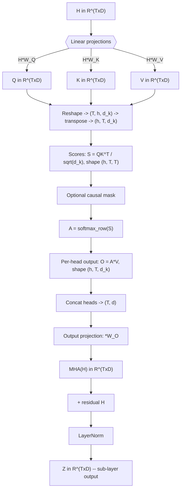
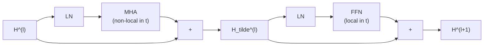
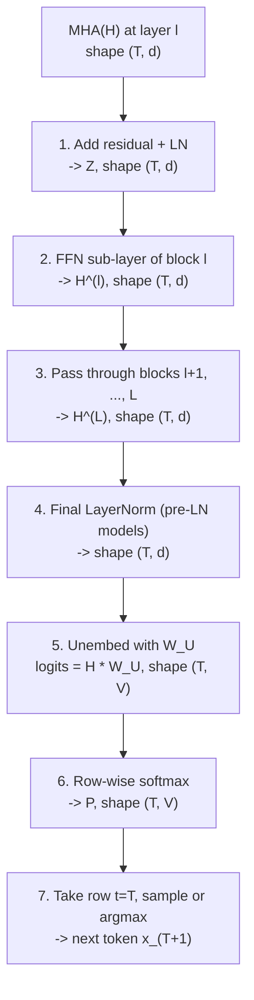
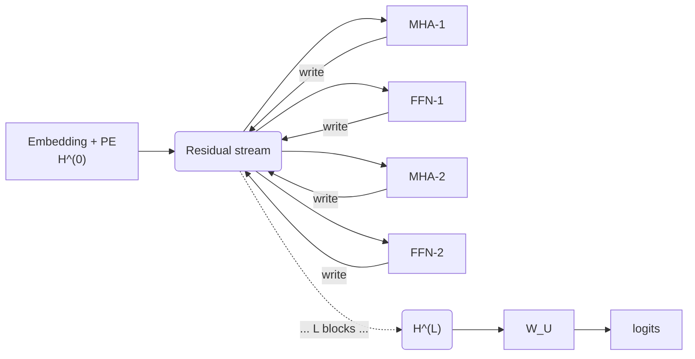

# Multi-Head Attention in the Transformer Block — A Deep Dive

*Compiled by D. Gueorguiev with Claude Opus 4.7 — May 11, 2026*

---

## 1. Scope and setup

This document deconstructs the **Multi-Head Attention (MHA)** sub-layer of a single transformer block, traces exactly how it transforms an input matrix $H \in \mathbb{R}^{T \times d}$ into an output of the same shape, shows how the surrounding residual + LayerNorm wrapper closes the loop, and follows the MHA output through the rest of the network to the final next-token prediction. Along the way it develops the **residual-stream view** of transformer architecture and examines the **unembedding matrix** $W_U$ as the bridge from residual-stream space to vocabulary space. The treatment is post-LN (the original Vaswani et al. convention); the pre-LN variant used in GPT-2 is noted where it differs.

We fix notation as follows:

| Symbol | Meaning | Typical value |
|---|---|---|
| $T$ | sequence length (number of token positions) | up to 1024 / 2048 / 8192 |
| $d$ | model dimension (a.k.a. $d_{\text{model}}$) | 512 (Vaswani), 768 (GPT-2 small) |
| $h$ | number of attention heads | 8 (Vaswani), 12 (GPT-2 small) |
| $d_k$ | per-head dimension, $= d / h$ | 64 |
| $H^{(\ell)}$ | residual-stream tensor at layer $\ell$, shape $T \times d$ | — |
| $\ell$ | block (depth) index, $\ell = 1, \dots, L$ | $L = 12$ for GPT-2 small |

For the **first block** the input is $H^{(0)}$ = token embeddings + positional encoding. For subsequent blocks the input is the output of the previous block.

---

## 2. The MHA pipeline at a glance



The flow has seven conceptual stages: **(1)** linear projections to Q/K/V, **(2)** scaled dot-product scoring, **(2.5)** optional causal mask, **(3)** row-wise softmax, **(4)** value averaging, **(5)** head concatenation, **(6)** output projection, **(7)** Add & Norm. Each is examined below.

---

## 3. Step-by-step deep dive

### 3.1 Linear projections — producing Q, K, V

**Learnable parameters per head $i \in \{1, \dots, h\}$:**

$$W_Q^{(i)},  W_K^{(i)},  W_V^{(i)} \in \mathbb{R}^{d \times d_k}$$

**Plus a single output-mixing matrix:**

$$W_O \in \mathbb{R}^{d \times d}$$

In practice, the $h$ per-head matrices are stacked side-by-side into single $d \times d$ matrices $W_Q$, $W_K$, $W_V$ so that one fused matmul produces all heads at once. The "split into heads" then becomes a tensor reshape, not a separate computation.

**Per-head projection:**

$$Q^{(i)} = H  W_Q^{(i)}, \qquad K^{(i)} = H  W_K^{(i)}, \qquad V^{(i)} = H  W_V^{(i)}, \qquad Q^{(i)}, K^{(i)}, V^{(i)} \in \mathbb{R}^{T \times d_k}$$

**Row-by-row, for token $t$:**

$$q_t^{(i)} = h_t W_Q^{(i)}, \qquad k_t^{(i)} = h_t W_K^{(i)}, \qquad v_t^{(i)} = h_t W_V^{(i)}, \qquad \in \mathbb{R}^{d_k}$$

The canonical mechanistic reading:

- $q_t^{(i)}$ — **query**: encodes what token $t$ is looking for in the context.
- $k_t^{(i)}$ — **key**: encodes what token $t$ advertises to other positions.
- $v_t^{(i)}$ — **value**: encodes what token $t$ contributes when attended to.

$Q$ and $K$ live in the same $d_k$-dimensional *matching space*; $V$ lives in its own $d_k$-dimensional *content space*. There is no a priori reason for these to coincide, and indeed $W_Q, W_K, W_V$ are independent learnable parameters.

```python
# PyTorch — fused projection, then reshape into heads
B, T, d = x.shape                      # batch, seq, model dim
h, d_k = num_heads, d // num_heads

q = self.W_q(x)                        # (B, T, d)
k = self.W_k(x)                        # (B, T, d)
v = self.W_v(x)                        # (B, T, d)

# Split d → (h, d_k) and bring heads to the leading position
q = q.view(B, T, h, d_k).transpose(1, 2)   # (B, h, T, d_k)
k = k.view(B, T, h, d_k).transpose(1, 2)   # (B, h, T, d_k)
v = v.view(B, T, h, d_k).transpose(1, 2)   # (B, h, T, d_k)
```

### 3.2 Scaled dot-product scores

For each head $i$, compute a $T \times T$ matrix of pairwise affinities:

$$S^{(i)} = \frac{Q^{(i)} \big(K^{(i)}\big)^{\top}}{\sqrt{d_k}}, \qquad S^{(i)} \in \mathbb{R}^{T \times T}$$

Entry-wise:

$$S^{(i)}_{t,t'} = \frac{q_t^{(i)} \cdot k_{t'}^{(i)}}{\sqrt{d_k}}$$

This is the **affinity between token $t$'s query and token $t'$'s key**, in head $i$. Large positive values mean strong attraction; large negative values, strong repulsion.

#### Motivation for the $\sqrt{d_k}$ scaling factor

Suppose the components of $q_t^{(i)}$ and $k_{t'}^{(i)}$ are approximately independent zero-mean unit-variance random variables. Then their dot product

$$q_t^{(i)} \cdot k_{t'}^{(i)} = \sum_{j=1}^{d_k} q_{t,j}^{(i)} k_{t',j}^{(i)}$$

has

$$\mathbb{E}\big[q_t^{(i)} \cdot k_{t'}^{(i)}\big] = 0, \qquad \mathrm{Var}\big[q_t^{(i)} \cdot k_{t'}^{(i)}\big] = d_k$$

Without the $1/\sqrt{d_k}$ factor, the variance of the pre-softmax scores grows linearly with $d_k$. The softmax then saturates — one entry approaches 1, all others approach 0 — and the Jacobian collapses, killing gradients. Dividing by $\sqrt{d_k}$ restores unit variance and keeps the softmax in its responsive regime regardless of $d_k$.

```python
scores = (q @ k.transpose(-2, -1)) / math.sqrt(d_k)   # (B, h, T, T)
```

### 3.3 Causal masking (decoder / autoregressive only) — deep dive

For causal models (GPT-2, decoder blocks in Vaswani), add a mask $M \in \mathbb{R}^{T \times T}$ where

$$
M_{t,t'} = \begin{cases}
0 & \text{if } t' \leq t \quad \text{(present or past -- allowed)} \\\\
-\infty & \text{if } t' \gt t \quad \text{(future -- forbidden)}
\end{cases}
$$

so that

$$S'^{(i)} = S^{(i)} + M$$

For **encoder blocks** (BERT, the encoder half of Vaswani) there is no mask — every position attends to every position.

#### How the mask is applied

Concretely, $M$ is upper-triangular with $-\infty$ above the main diagonal and $0$ on and below it:

$$
M = \begin{pmatrix}
0 & -\infty & -\infty & \cdots & -\infty \\\\
0 & 0 & -\infty & \cdots & -\infty \\\\
0 & 0 & 0 & \cdots & -\infty \\\\
\vdots & \vdots & \vdots & \ddots & \vdots \\\\
0 & 0 & 0 & \cdots & 0
\end{pmatrix}
$$

The mask is added **before** the softmax, not after. The resulting masked softmax is

$$A^{(i)}_{t,t'} = \frac{\exp\big(S^{(i)}_{t,t'} + M_{t,t'}\big)}{\sum_{u=1}^{T} \exp\big(S^{(i)}_{t,u} + M_{t,u}\big)}$$

#### Pre-softmax additive masking vs. post-softmax zeroing

The key identity is

$$\exp\big(S^{(i)}_{t,t'} + (-\infty)\big) = \exp(-\infty) = 0$$

So for any forbidden $(t, t')$ pair, the *numerator* in the softmax is exactly zero, and that entry contributes nothing to the *denominator* either. The allowed entries are then renormalized cleanly — they sum to 1 over only the past-and-present positions.

If you instead applied the mask **after** the softmax — zeroing out the forbidden entries post-hoc — two things would go wrong:

1. **The row would no longer sum to 1**, forcing a manual renormalization step.
2. **The gradients would leak information about future tokens during training**, because the masked entries would still have non-zero gradients through the unmasked softmax. The pre-softmax additive mask gets the math right in a single step.

#### Numerical detail: implementations use a large finite negative number

In production code the "$-\infty$" is realized as a large finite negative value (typically $-10^9$, or `float('-inf')` via masked-fill) for two reasons:

- `exp(-inf) = 0` is well-defined in IEEE 754, but `inf - inf = nan`, which can arise in rare edge cases (e.g., an entire row masked out due to padding combined with causal masking).
- A value like $-10^4$ is already enough: $\exp(-10^4)$ underflows to zero in float32 anyway.

PyTorch's standard `masked_fill(mask, float('-inf'))` works correctly for the canonical causal case because every row has at least one allowed entry (the diagonal), so the denominator is never zero. The `-1e9` convention is a defensive choice that survives pathological cases.

#### Worked example, $T = 4$

Suppose the raw scores for a single head are

$$
S = \begin{pmatrix}
2.0 & 1.5 & 0.3 & 0.8 \\\\
1.0 & 2.5 & 1.8 & 0.4 \\\\
0.5 & 1.2 & 3.0 & 1.1 \\\\
0.7 & 0.9 & 1.4 & 2.2
\end{pmatrix}
$$

After adding $M$:

$$
S' = S + M = \begin{pmatrix}
2.0 & -\infty & -\infty & -\infty \\\\
1.0 & 2.5 & -\infty & -\infty \\\\
0.5 & 1.2 & 3.0 & -\infty \\\\
0.7 & 0.9 & 1.4 & 2.2
\end{pmatrix}
$$

After row-wise softmax:

$$
A = \begin{pmatrix}
1.000 & 0.000 & 0.000 & 0.000 \\\\
0.182 & 0.818 & 0.000 & 0.000 \\\\
0.057 & 0.115 & 0.828 & 0.000 \\\\
0.106 & 0.130 & 0.214 & 0.550
\end{pmatrix}
$$

Observations:

- **Row 1** (token 1) attends only to itself — the only allowed position. $A_{1,1} = 1$ regardless of the original score values.
- **Row 2** (token 2) attends to tokens 1 and 2, with weights depending only on $S_{2,1}$ and $S_{2,2}$.
- **Each row sums to exactly 1**, normalized over only the allowed (past-and-present) positions.
- **The lower-triangular structure** of $A$ is the visible signature of the causal constraint.

#### PyTorch implementation

```python
# Build the causal mask once (T × T boolean, True = forbidden)
mask = torch.triu(
    torch.ones(T, T, dtype=torch.bool, device=x.device),
    diagonal=1,
)
# diagonal=1 → strictly above the main diagonal is True;
# the diagonal itself is False because token t IS allowed to attend to itself.

# Apply to scores; broadcasts across (B, h)
scores = scores.masked_fill(mask, float('-inf'))

# Row-wise softmax now produces the lower-triangular attention pattern
attn = F.softmax(scores, dim=-1)
```

In efficient implementations (Flash Attention, xformers, PyTorch's `F.scaled_dot_product_attention(..., is_causal=True)`), the mask is **never materialized** as a $T \times T$ tensor. The kernel simply skips the upper-triangular work entirely, saving both memory ($O(T^2)$ for the mask) and roughly halving the attention FLOPs. Materializing the mask is fine for small $T$ but becomes a real bottleneck at long context lengths.

#### Architectural significance

The causal mask is what makes a transformer **autoregressive at the level of the loss**: during training, the model sees the entire sequence in one forward pass, but the mask guarantees that the prediction for token $t+1$ depends only on tokens $1, \dots, t$. This is the source of the *training parallelism* that makes transformers efficient — every position's loss is computed simultaneously, but each position's computation respects the autoregressive ordering.

At inference time, the mask is what makes **KV-caching** work: once the keys and values for tokens $1, \dots, t$ have been computed, they are frozen — no future token can affect them — so they can be cached, and only token $t+1$ requires fresh work. Without the mask, every token's representation would depend on every other token's, and incremental decoding would be impossible.

### 3.4 Row-wise softmax — the attention pattern

$$A^{(i)} = \mathrm{softmax}_{\text{row}}\big(S^{(i)}\big), \qquad A^{(i)} \in \mathbb{R}^{T \times T}$$

Explicitly, for row $t$:

$$A^{(i)}_{t,t'} = \frac{\exp\big(S^{(i)}_{t,t'}\big)}{\sum_{u=1}^{T} \exp\big(S^{(i)}_{t,u}\big)}$$

Each row of $A^{(i)}$ is a probability distribution over the $T$ key positions. This matrix is the **attention pattern** — the object interpretability researchers stare at to understand what a head is doing. Recurring motifs include:

- **previous-token heads** ($A_{t, t-1} \approx 1$, all other entries near zero)
- **first-token heads** ($A_{t, 1} \approx 1$, anchoring on `<bos>`)
- **induction heads** (matching repeated bigrams; Olsson et al. 2022)
- **subject-of-verb heads** (long-range syntactic linkage)

```python
attn = F.softmax(scores, dim=-1)   # (B, h, T, T), rows sum to 1
```

### 3.5 Weighted average of values

$$O^{(i)} = A^{(i)} V^{(i)}, \qquad O^{(i)} \in \mathbb{R}^{T \times d_k}$$

Row $t$:

$$o_t^{(i)} = \sum_{t'=1}^{T} A^{(i)}_{t,t'}  v_{t'}^{(i)}$$

This is a **convex combination** of the value vectors weighted by attention. For each token $t$, head $i$ produces a $d_k$-dimensional vector summarizing the information pulled from the rest of the sequence.

```python
out_per_head = attn @ v   # (B, h, T, d_k)
```

### 3.6 Concatenating heads

Stack the $h$ per-head outputs along the channel axis:

$$O = \mathrm{Concat}\big(O^{(1)}, O^{(2)}, \dots, O^{(h)}\big) \in \mathbb{R}^{T \times d}$$

Since $h \cdot d_k = d$ by construction, the concatenation brings us back to the model dimension.

```python
# (B, h, T, d_k) → (B, T, h, d_k) → (B, T, d)
out_concat = out_per_head.transpose(1, 2).contiguous().view(B, T, d)
```

### 3.7 Output projection — mixing the heads

$$\mathrm{MHA}(H) = O  W_O, \qquad W_O \in \mathbb{R}^{d \times d}$$

Without $W_O$, the $h$ heads would write into **disjoint** $d_k$-dimensional channel slices of the output. $W_O$ is the linear map that allows them to recombine and share information across the channel axis. It is essential — removing it severely degrades the model. In mechanistic interpretability, $W_V W_O$ is often analyzed as a single "OV circuit" governing what gets written to the residual stream, while $W_Q W_K^\top$ is the "QK circuit" governing what gets attended to.

```python
output = self.W_o(out_concat)   # (B, T, d)
```

### 3.8 The Add & Norm wrapper

The MHA box in the Vaswani diagram is followed by an "Add & Norm" box. In the **post-LN** convention:

$$Z = \mathrm{LN}\big(H + \mathrm{MHA}(H)\big)$$

where LayerNorm operates **per token** (over the $d$ channel dimension):

$$\mathrm{LN}(x)_j = \gamma_j \cdot \frac{x_j - \mu(x)}{\sqrt{\sigma^2(x) + \epsilon}} + \beta_j$$

with

$$\mu(x) = \frac{1}{d} \sum_{j=1}^{d} x_j, \qquad \sigma^2(x) = \frac{1}{d} \sum_{j=1}^{d} \big(x_j - \mu(x)\big)^2$$

and $\gamma, \beta \in \mathbb{R}^d$ learnable scale and shift. The $\epsilon$ (typically $10^{-5}$) prevents division by zero.

In the **pre-LN** convention used by GPT-2 and most modern decoder-only models, the order is flipped:

$$Z = H + \mathrm{MHA}\big(\mathrm{LN}(H)\big)$$

This is more than a stylistic choice — it has substantive consequences:

- **Post-LN**: the residual stream is renormalized after every sub-layer; signals are clipped, training requires careful warmup, but representations stay bounded.
- **Pre-LN**: the residual stream accumulates unnormalized contributions; LN is applied only on the *read* side (into attention / FFN / unembedding). Training is more stable and the model is more amenable to depth scaling, but the residual stream's norm grows with depth.

For the hidden-state dynamics framing, the pre-LN version is much cleaner: the residual stream $H^{(\ell)}$ evolves as an unnormalized state, and the LN inside each sub-layer plays the role of a state-dependent rescaling on the read path.

---

## 4. The MHA equation in one line

Pulling everything together, the multi-head attention transformation $H \mapsto \mathrm{MHA}(H)$ is

$$\boxed{ \mathrm{MHA}(H) = \mathrm{Concat}_{i=1}^{h}\Big[\mathrm{softmax}\Big(\frac{(H W_Q^{(i)})(H W_K^{(i)})^{\top}}{\sqrt{d_k}}\Big) H W_V^{(i)}\Big] W_O }$$

with the surrounding sub-layer being either $\mathrm{LN}(H + \mathrm{MHA}(H))$ (post-LN) or $H + \mathrm{MHA}(\mathrm{LN}(H))$ (pre-LN).

---

## 5. A minimal reference implementation

```python
import math
import torch
import torch.nn as nn
import torch.nn.functional as F


class MultiHeadAttention(nn.Module):
    """
    Multi-head self-attention as described in Vaswani et al. (2017).

    Input/output shape: (B, T, d) where d = num_heads * d_k.
    Causal flag enables the autoregressive mask used in GPT-style models.
    """
    def __init__(self, d_model: int, num_heads: int, causal: bool = False):
        super().__init__()
        assert d_model % num_heads == 0
        self.d_model = d_model
        self.h = num_heads
        self.d_k = d_model // num_heads
        self.causal = causal

        # Fused per-head projections — each is d_model → d_model
        self.W_q = nn.Linear(d_model, d_model, bias=False)
        self.W_k = nn.Linear(d_model, d_model, bias=False)
        self.W_v = nn.Linear(d_model, d_model, bias=False)
        self.W_o = nn.Linear(d_model, d_model, bias=False)

    def forward(self, x: torch.Tensor) -> torch.Tensor:
        B, T, d = x.shape

        # 1. Project to Q, K, V and split into heads
        q = self.W_q(x).view(B, T, self.h, self.d_k).transpose(1, 2)  # (B, h, T, d_k)
        k = self.W_k(x).view(B, T, self.h, self.d_k).transpose(1, 2)
        v = self.W_v(x).view(B, T, self.h, self.d_k).transpose(1, 2)

        # 2. Scaled dot-product scores
        scores = (q @ k.transpose(-2, -1)) / math.sqrt(self.d_k)      # (B, h, T, T)

        # 2.5. Causal mask
        if self.causal:
            mask = torch.triu(
                torch.ones(T, T, dtype=torch.bool, device=x.device), diagonal=1
            )
            scores = scores.masked_fill(mask, float('-inf'))

        # 3. Row-wise softmax → attention pattern A
        attn = F.softmax(scores, dim=-1)                              # (B, h, T, T)

        # 4. Weighted average of values
        out = attn @ v                                                # (B, h, T, d_k)

        # 5. Concatenate heads back into (B, T, d)
        out = out.transpose(1, 2).contiguous().view(B, T, self.d_model)

        # 6. Output projection
        return self.W_o(out)                                          # (B, T, d)


class TransformerBlockPreLN(nn.Module):
    """
    A single pre-LN decoder-only block (GPT-2 style).
    """
    def __init__(self, d_model: int, num_heads: int, d_ff: int):
        super().__init__()
        self.ln1 = nn.LayerNorm(d_model)
        self.attn = MultiHeadAttention(d_model, num_heads, causal=True)
        self.ln2 = nn.LayerNorm(d_model)
        self.ffn = nn.Sequential(
            nn.Linear(d_model, d_ff),
            nn.GELU(),
            nn.Linear(d_ff, d_model),
        )

    def forward(self, h: torch.Tensor) -> torch.Tensor:
        # Pre-LN: H ← H + Sublayer(LN(H))
        h = h + self.attn(self.ln1(h))
        h = h + self.ffn(self.ln2(h))
        return h
```

---

## 6. The dynamical-systems perspective

Because each block is a **shape-preserving** map $\mathbb{R}^{T \times d} \to \mathbb{R}^{T \times d}$, the depth-indexed sequence $H^{(0)}, H^{(1)}, \dots, H^{(L)}$ is a discrete trajectory in a single fixed state space. Decomposing the block update (pre-LN):

$$h_t^{(\ell+1)} - h_t^{(\ell)} = \underbrace{\mathrm{MHA}\big(\mathrm{LN}(H^{(\ell)})\big)_t}_{\text{non-local in } t} + \underbrace{\mathrm{FFN}\big(\mathrm{LN}(\tilde H^{(\ell)})\big)_t}_{\text{local in } t}$$

where $\tilde H^{(\ell)} = H^{(\ell)} + \mathrm{MHA}(\mathrm{LN}(H^{(\ell)}))$ is the post-attention residual stream.



Two structural facts that matter for Lagrangian / shared-potential analysis:

1. **The FFN sub-layer is strictly local in the position index $t$**. It contributes a *per-token* term to the equation of motion. In a Lagrangian framing this is a single-particle potential $V(h_t)$ acting independently on each trajectory.

2. **The MHA sub-layer is the only non-local coupling between positions**. Its "interaction kernel" $A^{(i)}_{t,t'}$ is itself **state-dependent**, because $A$ depends on $h_t$ and $h_{t'}$ through $Q$ and $K$. This is a many-body interaction whose coupling strength is set by the configuration itself — structurally more like a self-consistent mean-field term than a fixed two-body potential.

Consequently, in the per-row trajectory picture $\{h_t^{(\ell)}\}_{\ell=0}^{L}$ (one trajectory per token position), a clean separable shared potential would have to absorb a *state-dependent non-local kernel* into a single-particle term. The extent to which this approximately works — measured by your shared-potential R² separator — is therefore a direct architectural diagnostic of how strongly attention is acting as effective single-particle dynamics versus genuinely many-body dynamics at a given layer.

---

## 7. From $O$ to the next predicted token

The MHA output $O$ is **not** the predicted next token. The gap between $O$ and an actual token prediction spans the rest of the entire transformer plus the unembedding step. This section traces that gap explicitly and connects it to the dynamical-systems framing of §6.

### 7.1 The nature of the MHA output $O$

After concatenation and the output projection, MHA produces

$$\mathrm{MHA}(H) = OW_O \in \mathbb{R}^{T \times d}$$

This is still a matrix in the **residual-stream space** $\mathbb{R}^{T \times d}$. Each row is a $d$-dimensional vector — for GPT-2 small, $d = 768$. It is:

- **Not** an integer index into a vocabulary
- **Not** a probability distribution over tokens
- **Not** a prediction

It is one **contribution** to the per-position hidden state. The role of MHA at layer $\ell$ is to compute the additive update that attention applies to each token's representation at this layer, and $OW_O$ is exactly that update.

A predicted token, by contrast, is either an integer in $\{1, \dots, V\}$ (for argmax decoding) or a probability vector in $\mathbb{R}^V$ where $V \approx 50{,}000$. Neither shape matches $O$.

### 7.2 The seven-step journey from $O$ to a predicted token

Suppose $OW_O$ is the MHA output at layer $\ell$. To convert it into a next-token prediction at the *last* position requires the following steps:



Explicitly:

1. **Finish the attention sub-layer:** $Z = \mathrm{LN}(H + \mathrm{MHA}(H))$ (post-LN) or $Z = H + \mathrm{MHA}(\mathrm{LN}(H))$ (pre-LN).
2. **Apply the FFN sub-layer** of the same block: $H^{(\ell)} = \mathrm{LN}(Z + \mathrm{FFN}(Z))$ (post-LN equivalent).
3. **Propagate through all remaining blocks** $\ell+1, \ell+2, \dots, L$.
4. **Apply the final LayerNorm** (in pre-LN models like GPT-2): $\tilde H^{(L)} = \mathrm{LN}_{\text{final}}(H^{(L)})$.
5. **Unembed:** $\text{logits} = \tilde H^{(L)}W_U \in \mathbb{R}^{T \times V}$.
6. **Row-wise softmax:** $P_t = \mathrm{softmax}(\text{logits}_t) \in \mathbb{R}^{V}$.
7. **Take row $t = T$** (the last position) and sample or take argmax to get the actual next token.

If $\ell = 1$ (the very first block), there are $L-1$ more blocks plus the unembedding step between $O$ and a predicted token. Even at $\ell = L$ (the final block), $O$ is still a hidden vector in $\mathbb{R}^d$ — only after the final LN and $W_U$ does it become a vocabulary-space quantity.

### 7.3 Connection to the dynamics framing

This is exactly why the depth-indexed trajectory $\{h_t^{(\ell)}\}_{\ell=0}^{L}$ is the natural object of dynamical study, rather than any individual $O$. The trajectory captures the full sequence of intermediate state updates — each $O$ at each layer is one nudge along the path. The "prediction" event happens **only at the boundary** $\ell = L$, when $W_U$ collapses the trajectory's endpoint into vocabulary space.

In Lagrangian terms:

- **Each $O$ at layer $\ell$ is an instantaneous contribution to $\dot h_t$ along the depth axis.** The MHA output corresponds to the "kinetic update" applied to position $t$'s trajectory at depth $\ell$, with the non-local coupling structure described in §6.
- **The trajectory $\{h_t^{(\ell)}\}_{\ell=0}^{L}$ is the path of the particle.** Its endpoint $h_t^{(L)}$ is the boundary condition that the unembedding reads out.
- **The loss is a boundary functional, not a bulk one.** The cross-entropy loss $\mathcal{L}_{\text{NTP}}$ depends only on $h_t^{(L)}$ (and $W_U$), not on the intermediate states. This is structurally identical to a least-action problem with a fixed-endpoint variational principle: the bulk dynamics are determined by the architectural Lagrangian, the endpoint is constrained by the loss.

The **STP loss** (Huang–LeCun–Balestriero), by contrast, is a regularizer that *does* act in the bulk — but along the *token axis* $t$ at fixed depth $\ell = L$, not along the depth axis. It penalizes curvature of the trajectory $\{h_t^{(L)}\}\_{t=1}^{T}$, complementing the boundary-only $\mathcal{L}\_{\text{NTP}}$.

The descriptive Lagrangian framework, sitting on the *depth* axis, is therefore orthogonal to STP's *token* axis — and the two together cover both axes of the residual stream tensor.

---

## 8. The residual stream and the residual-stream space

The MHA output $O$ does not stand alone — it joins a running quantity called the **residual stream**, a reframing of the transformer architecture that became standard after Elhage et al.'s *A Mathematical Framework for Transformer Circuits* (Anthropic, 2021). This section makes the residual-stream view explicit.

### 8.1 The basic idea

The residual stream is the **per-position state vector that flows through the entire transformer from input to output, getting additively updated by each sub-layer along the way**. Instead of viewing a transformer as a stack of nonlinear functions $f_L \circ \cdots \circ f_1$, view it as a single shared workspace — one $d$-dimensional vector per token position — into which every sub-layer reads, computes something, and writes its contribution back via addition.

The structural fact that enables this view: **every sub-layer is wrapped in a residual connection** ($H \mapsto H + \text{stuff}$). Unrolling the $L$ pre-LN blocks gives

$$H^{(L)} = H^{(0)} + \sum_{\ell=1}^{L} \mathrm{MHA}^{(\ell)}\big(\mathrm{LN}_1(H^{(\ell-1)})\big) + \sum_{\ell=1}^{L} \mathrm{FFN}^{(\ell)}\big(\mathrm{LN}_2(\tilde H^{(\ell)})\big)$$

The network output is the *sum* of the input embedding and $2L$ additive contributions — one per sub-layer. Each sub-layer reads from the current stream value, computes a contribution, and writes it back. The stream itself never gets multiplied by anything; it just accumulates terms.

### 8.2 The residual-stream space

The space the stream lives in is

$$\mathcal{R} = \mathbb{R}^{T \times d}$$

For a single token position $t$, the per-position residual stream is $\mathcal{R}_t = \mathbb{R}^d$. The dimensionality $d$ is the **bandwidth** of the stream: everything the model wants to communicate from one layer to another — features, syntactic information, positional signals, abstractions — must fit into these $d$ channels. This is the structural origin of *superposition*: there are typically far more concepts the model wants to represent ($\gg d$) than there are dimensions, so concepts get encoded as overlapping directions.

### 8.3 The read/write asymmetry

A key structural feature of pre-LN architectures: **sub-layers read from the stream through a LayerNorm, but write to the stream directly.**

- **Reading**: the sub-layer sees $\mathrm{LN}(H)$, which strips away any uniform scaling that has accumulated in the stream. Sub-layers can only access the *direction* of the stream, not its absolute magnitude.
- **Writing**: the sub-layer's output is added directly to the unnormalized stream. No LN on the way out.

This asymmetry has a striking consequence: the stream's *norm* grows monotonically with depth (each contribution is added without renormalization), but its *direction* is what each sub-layer actually acts on. Empirically the norm of the residual stream in GPT-2 grows by a factor of roughly $10\text{–}100\times$ from input to output.

### 8.4 The "stream" metaphor



Think of a stream of water flowing through the network from input embeddings at $\ell = 0$ to the unembedding at $\ell = L$. Sub-layers are tributaries pouring their output into the stream. Once written, a contribution is carried forward — it can only be cancelled by a downstream sub-layer writing an opposing contribution. This maps cleanly onto interpretability findings:

- **Information accumulates rather than transforms.** An attention head can write a "subject–verb agreement signal" at layer 5, and that signal is still present (possibly modified by later additions) at layer 11 where another head reads and uses it.
- **Sub-layers communicate via shared addresses.** Two heads in different layers communicate by writing and reading the same subspace of $\mathbb{R}^d$. This is how multi-layer circuits — induction heads (Olsson et al. 2022), IOI circuits (Wang et al. 2023) — work: head $A$ in layer $\ell$ writes to a subspace, head $B$ in layer $\ell'$ reads from it via its $Q$ or $K$ projection.
- **No bottlenecks.** Because everything is additive, there is no point where information must be re-encoded or compressed. The full $d$-dimensional channel is available at every layer.

### 8.5 The four roles of weight matrices

Every interaction with the stream factors into one of four roles, determined by which weight matrix is acting:

| Role | Mechanism | Function |
|---|---|---|
| **Read for routing** | $W_Q^{(\ell, i)}, W_K^{(\ell, i)}$ | Decide *what to attend to* based on the current stream content |
| **Read for content** | $W_V^{(\ell, i)}$ (attention), $W_1^{(\ell)}$ (FFN) | Extract information from the stream to compute the contribution |
| **Write** | $W_O^{(\ell, i)}$ (attention), $W_2^{(\ell)}$ (FFN) | Project the computed contribution back into the stream |
| **Read for prediction** | $W_U$ (unembedding) | Project the final stream into vocabulary space |

The QK matrices and the unembedding are pure **readers**. The $W_O$ projection in attention and the $W_2$ projection in FFN are the **writers**. The OV circuit ($W_V W_O$) and the FFN's read–write composition are the two pathways by which content actually moves into the stream.

### 8.6 Consequences of the residual-stream reframing

Three substantial consequences:

1. **Depth is a budget, not a transformation chain.** There are $2L$ "writes" available in a depth-$L$ model. The model's job is to allocate these writes to perform useful computation, with each head able to specialize in writing one kind of information at one layer.

2. **Linearity dominates the stream.** Because the stream is built by addition, and LN is approximately linear in its operating regime, much of what flows through the stream is *linearly decomposable*. One can talk about "the direction encoding indirect-object identity" or "the subspace carrying syntactic gender" as if these were independent additive contributions — and this is approximately true. The nonlinearities (softmax, GeLU) live inside sub-layers, not on the stream itself.

3. **The architecture is communication-bound.** The bottleneck is not depth or width per se, but how many *useful directions* in $\mathbb{R}^d$ the model can allocate to distinct concepts. This is why $d$ scales aggressively with model size (GPT-2 small: 768; GPT-3: 12{,}288; frontier models: $\sim 16{,}000$).

### 8.7 Connection to the dynamics framing

The residual-stream view is the natural setting for the Lagrangian framework because:

- **The state space is fixed and Euclidean.** $\mathcal{R}\_t = \mathbb{R}^d$ is the same at every layer. The trajectory $\{h_t^{(\ell)}\}\_{\ell=0}^{L}$ is a literal discrete-time path in a single 768-dimensional space (for GPT-2 small).
- **The update equation is a discrete dynamical system in obvious form.** Schematically, $h_t^{(\ell+1)} - h_t^{(\ell)} = \Delta_t^{\text{MHA}} + \Delta_t^{\text{FFN}}$, which is exactly the discrete analog of $\dot h = F(h, \ell)$. In the continuum limit (Neural ODE / continuous-depth Transformer), the stream becomes a literal solution to an ODE in $\mathbb{R}^d$, parameterized by depth.
- **Attention provides the only cross-row coupling on the stream.** The non-local term in the equation of motion comes entirely from MHA; FFN is per-position. The interaction kernel is the attention pattern $A^{(\ell)}_{t, t'}$. FFN contributes only single-particle potential terms.
- **The shared-potential question is naturally a residual-stream statement.** Asking whether all rows obey the same single-particle dynamics is asking whether the same potential governs all rows of the residual stream. The R² separator measures how cleanly the dynamics decompose — high R² means per-row trajectories are well-approximated as independent particles in a shared field; low R² means many-body coupling (attention's state-dependent kernel) is doing essential work.

### 8.8 A subtle implementation point

The **residual stream is not literally a tensor stored anywhere**. It is a conceptual aggregation. In actual code, the variable `x` (or `hidden_states`) that gets passed from sub-layer to sub-layer *is* the residual stream at each layer. There is no separate buffer accumulating contributions; the stream just *is* the running variable that each sub-layer updates.

The reframing is in *how the code is read*, not in what it does. The same forward pass that a 2017-era reader would describe as "applying twelve transformer blocks" is now described as "twenty-four sub-layer contributions accumulated into a $T \times d$ residual stream." Both descriptions compute the same thing; the second is far more useful for asking what the network is actually doing.

---

## 9. The unembedding matrix $W_U$

The residual stream is read out into vocabulary space by a single matrix at the very top of the network. This section examines its structure, geometry, and consequences.

### 9.1 Definition and shape

The unembedding matrix is

$$W_U \in \mathbb{R}^{d \times V}$$

where $V$ is the vocabulary size. Its job is to convert a hidden-state vector into a vector of logits over the vocabulary. The final transformation in a forward pass is:

$$\text{logits} = H^{(L)}  W_U \in \mathbb{R}^{T \times V}$$

For one token position:

$$\text{logits}_t = h_t^{(L)}  W_U \in \mathbb{R}^{V}$$

followed by a softmax:

$$P(x_{t+1} \mid x_{\leq t}) = \mathrm{softmax}(\text{logits}_t)$$

In pre-LN models there is a final LayerNorm before $W_U$: $\text{logits} = \mathrm{LN}_{\text{final}}(H^{(L)})W_U$. That is the entire readout: one matrix multiplication, possibly preceded by an LN, with no nonlinearity and (usually) no bias.

### 9.2 Parameter scale

$W_U$ is one of the **two largest matrices in any modern transformer** (the other being the embedding $W_E$).

| Model | $d$ | $V$ | $W_U$ params |
|---|---|---|---|
| GPT-2 small | 768 | 50,257 | ~38.6M |
| GPT-2 large | 1,280 | 50,257 | ~64.3M |
| Llama 3 8B | 4,096 | 128,256 | ~525M |
| Llama 3 70B | 8,192 | 128,256 | ~1.05B |

For GPT-2 small the 38.6M parameters in $W_U$ are about 30% of the model's total $\sim 124$M parameters.

### 9.3 Weight tying: $W_U$ and $W_E$ as one matrix

The **embedding matrix** $W_E \in \mathbb{R}^{V \times d}$ maps a one-hot token vector to a $d$-dimensional vector at the input. It has the same shape (up to transpose) as $W_U$. In many models — including GPT-2, GPT-3, and Pythia — the weights are **tied**: $W_U = W_E^\top$. The same matrix is used at the bottom (to embed tokens) and at the top (to unembed). This is *weight tying* (Press & Wolf, 2017).

Motivation:

1. **Parameter savings.** Without tying, both matrices cost $2Vd$ parameters; with tying, $Vd$. For GPT-2 small, that is the difference between $\sim$77M and $\sim$39M parameters.
2. **Conceptual symmetry.** The embedding maps token → direction; the unembedding finds the closest token direction. Tying enforces a single per-token representation shared between input encoding and output decoding.

The cost: tying constrains the model. The embedding's job (write a token-identity signal into the stream) and the unembedding's job (read out a next-token prediction from a heavily-processed stream) are genuinely different tasks. **Modern frontier models increasingly untie**: Llama 3, Gemma, and most ~2023+ models use separate $W_U$ and $W_E$. The parameter cost is judged worth the added flexibility.

For dynamics work on GPT-2 and Pythia: weights are tied exactly. This affects the geometric interpretation in §9.4.

### 9.4 Geometric interpretation: dot products with token directions

Write the columns of $W_U$ as $u_1, u_2, \dots, u_V \in \mathbb{R}^d$, one per vocabulary token. Then:

$$\text{logits}_t[v] = h_t^{(L)} \cdot u_v$$

The logit for token $v$ is the **dot product** between the final hidden state and token $v$'s column in $W_U$. The argmax prediction is

$$\mathrm{argmax}_v  \text{logits}_t[v] = \mathrm{argmax}_v  h_t^{(L)} \cdot u_v$$

— the token whose unembedding direction $u_v$ is most aligned with the residual stream at depth $L$. This is **nearest-direction lookup** in $\mathbb{R}^d$, with $V$ candidates.

Under weight tying, $u_v$ is literally token $v$'s embedding. The residual stream, in this view, is a vector that *points toward the next token's embedding*, and the transformer's job during the $L$ blocks of computation is to rotate the stream to point in the right direction.

This geometry is the basis of the **logit lens** (nostalgebraist, 2020), which applies $W_U$ to *intermediate* hidden states $h_t^{(\ell)}$ for $\ell < L$ to see what the model "would predict" if it stopped at layer $\ell$. It works because $W_U$ is a fixed linear readout defined independently of which layer feeds it. Predictions typically get sharper and more accurate as $\ell$ grows — direct evidence that the residual stream is *progressively refined toward the answer* rather than being transformed arbitrarily.

### 9.5 $W_U$ is not an isometry

Since $W_U$ maps $\mathbb{R}^d \to \mathbb{R}^V$ with $V \gg d$, its image is a $d$-dimensional subspace of $\mathbb{R}^V$ (assuming full column rank, which holds in practice). Two consequences:

1. **Many directions in logit space are unreachable.** The model can only produce logits of the form $hW_U$ for some $h \in \mathbb{R}^d$. The reachable logits form a $d$-dimensional subspace of $V$-dimensional logit space.
2. **$W_U$ deforms the geometry of residual-stream space.** If two hidden states $h$ and $h'$ differ by something in the **near-kernel** of $W_U$ (a direction with small singular value), they produce nearly identical logits. The unembedding is *not* an isometry — some directions in residual-stream space get amplified, others attenuated.

This non-isometry has direct consequences for dynamics: distances in residual-stream space are *not* the same as distances in logit (or probability) space. A small $L^2$ change in $h_t^{(L)}$ along a high-singular-value direction of $W_U$ can produce a large prediction change; the same-sized change along a low-singular-value direction can produce essentially none. **For task-relevant trajectory analysis, weighting geometric quantities by $W_U$'s SVD spectrum gives a "loss-aligned" geometry that may be cleaner than the raw $\mathbb{R}^d$ one.**

### 9.6 Over-complete frame structure

The $V$ columns of $W_U$ are $V$ vectors in $\mathbb{R}^d$. Since $V \gg d$, they cannot be orthogonal — there is not enough room in $d$ dimensions for $V$ mutually orthogonal vectors. They form an **over-complete frame**: $V$ vectors spanning a $d$-dimensional space, with mandatory inter-vector correlations.

For GPT-2 small, this is 50{,}257 vectors crammed into 768 dimensions. Semantically similar tokens ("cat", "kitten", "feline") tend to have positively-correlated $u_v$'s; dissimilar tokens tend toward smaller (but rarely zero) inner products.

This is one place where the *linear representation hypothesis* enters: if "concepts" are linear directions in $\mathbb{R}^d$, then the unembedding columns provide a natural (overcomplete, but interpretable) basis. Probing work that finds directions encoding truth, sentiment, refusal, etc., implicitly leverages this structure.

### 9.7 What the unembedding does, mechanistically

Putting it together, the unembedding step does three things at once:

1. **Project onto token directions** — compute the inner product between $h_t^{(L)}$ and each $u_v$.
2. **Rank tokens by similarity** — order the vocabulary by alignment with the current stream state.
3. **Convert to probabilities via softmax** — exponentiate and normalize.

The third step is worth pausing on: softmax depends on *differences* of logits (it's translation-invariant), and since $h \cdot u_v$ scales with $\|h\|$, **the temperature of the output distribution is governed by the norm of the residual stream**. Larger $\|h_t^{(L)}\|$ produces sharper (more confident) predictions; smaller $\|h_t^{(L)}\|$ produces flatter ones. This is why the $10\text{–}100\times$ growth of residual-stream norm through depth (§8.3) is significant: it controls the model's output confidence.

### 9.8 How $W_U$ is trained

$W_U$ is trained via cross-entropy on next-token prediction. The gradient has a clean interpretation:

$$\nabla_{W_U} \mathcal{L}_{\text{NTP}} = h_t^{(L)} \otimes \big(P_t - \delta_{x_{t+1}^*}\big)$$

where $P_t$ is the predicted distribution and $\delta_{x_{t+1}^*}$ is the one-hot target. At each training step:

- The column $u_v$ for the **correct** token $v = x_{t+1}^*$ is **pulled toward** the current $h_t^{(L)}$.
- All other columns are **pushed away** by amounts proportional to their predicted probabilities.

Over many steps this produces a contrastive organization of token directions — tokens that occur in similar contexts end up with similar $u_v$. Under weight tying, the same update also reshapes $W_E$, so every backward pass through $W_U$ also alters how tokens are initially embedded.

### 9.9 Connection to the dynamics framing and STP

Three specific connections:

1. **STP operates one step away from $W_U$.** Huang–LeCun–Balestriero's $h_t$ is the readout-side residual stream — exactly the input to $W_U$. STP regularizes the stream at the unembedding readout point. Local linearity of $\{h_t^{(L)}\}_t$ implies that consecutive predictions in token space vary along approximately straight lines in residual-stream space. Whether this corresponds to straight lines in *probability* space depends on how $W_U$ locally deforms the geometry — the non-isometry from §9.5.

2. **Under weight tying, the shared potential and the embedding geometry are not independent.** The dynamics that bring each $h_t^{(\ell)}$ from input to output respond to a landscape that — through training — is shaped by the geometry of token embeddings, since $W_U = W_E^\top$ enters both at readout and (indirectly, via gradient flow) at the embedding. The shared-potential R² question on a tied model is implicitly a question about the geometry of $W_E$.

3. **The R² separator and $W_U$'s spectrum.** Raw geometric R² on residual-stream trajectories treats all directions equally, but the *prediction* loss sees only the projection onto $W_U$'s column span, weighted by its singular spectrum. Weighting R² by $W_U$'s SVD spectrum produces a **task-relevant** R² — likely cleaner than the raw geometric one, and probably easier to interpret for the TMLR submission's separator diagnostic.

### 9.10 Summary of $W_U$ properties

| Property | Description |
|---|---|
| Definition | A linear map $\mathbb{R}^d \to \mathbb{R}^V$ from residual-stream space to logits |
| Shape | $d \times V$ |
| Function | Dot products between $h_t^{(L)}$ and per-token "unembedding directions" |
| Location | Top of the network, after the final block and (in pre-LN) the final LayerNorm |
| Weight tying | In GPT-2, Pythia: $W_U = W_E^\top$. In Llama 3, Gemma, modern frontier: typically untied. |
| Geometric picture | $V$ vectors in $\mathbb{R}^d$ forming an over-complete frame |
| Parameter count | $Vd$ — typically the largest single matrix in the model |
| Logit lens connection | The lens applies $W_U$ to intermediate $h_t^{(\ell)}$, not just $h_t^{(L)}$ |
| Isometry | No — the singular spectrum amplifies some directions and attenuates others |

In summary, $W_U$ is the **fixed linear readout** that translates the residual stream's final state into a vocabulary distribution, and its column geometry encodes the model's mapping between internal representations (directions in $\mathbb{R}^d$) and tokens (indices in $V$).

---

## 10. Summary table

| Stage | Operation | Input shape | Output shape | Parameters |
|---|---|---|---|---|
| 1 | $Q, K, V = HW_Q, HW_K, HW_V$ | $(T, d)$ | $3 \times (T, d)$ | $3d^2$ |
| | Reshape into heads | $(T, d)$ | $(h, T, d_k)$ | — |
| 2 | $S = QK^\top / \sqrt{d_k}$ | $(h, T, d_k)$ | $(h, T, T)$ | — |
| 2.5 | Causal mask (optional) | $(h, T, T)$ | $(h, T, T)$ | — |
| 3 | $A = \mathrm{softmax}_{\text{row}}(S)$ | $(h, T, T)$ | $(h, T, T)$ | — |
| 4 | $O^{(i)} = A^{(i)} V^{(i)}$ | $(h, T, T), (h, T, d_k)$ | $(h, T, d_k)$ | — |
| 5 | Concat heads | $(h, T, d_k)$ | $(T, d)$ | — |
| 6 | Output projection $OW_O$ | $(T, d)$ | $(T, d)$ | $d^2$ |
| 7 | Add & Norm | $(T, d)$ | $(T, d)$ | $2d$ (LN $\gamma, \beta$) |

**Total parameter count for MHA + LN**: $4d^2 + 2d$ per block (ignoring biases). For GPT-2 small ($d = 768$): $\approx 2.36$M parameters in MHA + LN per layer.

---

## 11. References

1. Vaswani et al., *Attention Is All You Need*, NeurIPS 2017. arXiv:1706.03762.
2. Elhage et al., *A Mathematical Framework for Transformer Circuits*, Anthropic, 2021. transformer-circuits.pub/2021/framework.
3. Olsson et al., *In-context Learning and Induction Heads*, Anthropic, 2022.
4. Ba, Kiros, Hinton, *Layer Normalization*, 2016. arXiv:1607.06450.
5. Xiong et al., *On Layer Normalization in the Transformer Architecture*, ICML 2020 (pre-LN vs. post-LN analysis).
6. Press & Wolf, *Using the Output Embedding to Improve Language Models*, EACL 2017 (weight tying).
7. nostalgebraist, *interpreting GPT: the logit lens*, LessWrong, 2020.
8. Wang et al., *Interpretability in the Wild: a Circuit for Indirect Object Identification in GPT-2 small*, ICLR 2023.
9. Huang, LeCun, Balestriero, *Semantic Tube Prediction: Beating LLM Data Efficiency with JEPA*, arXiv:2602.22617, 2026.
