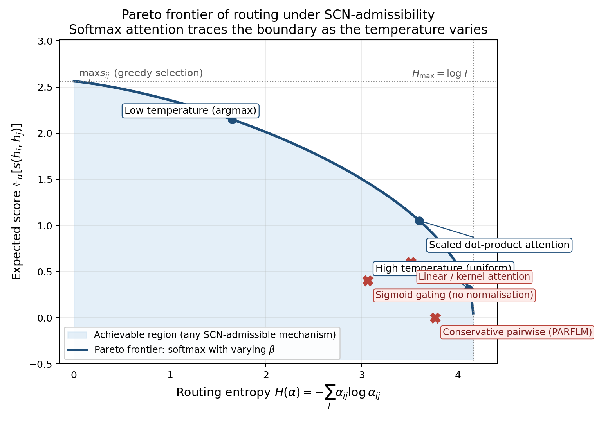
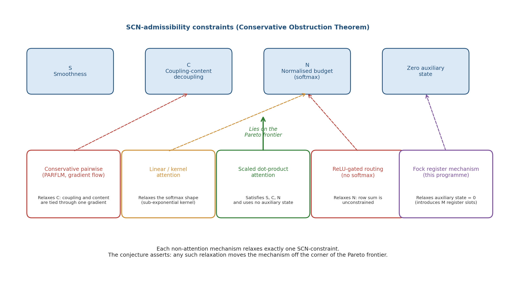
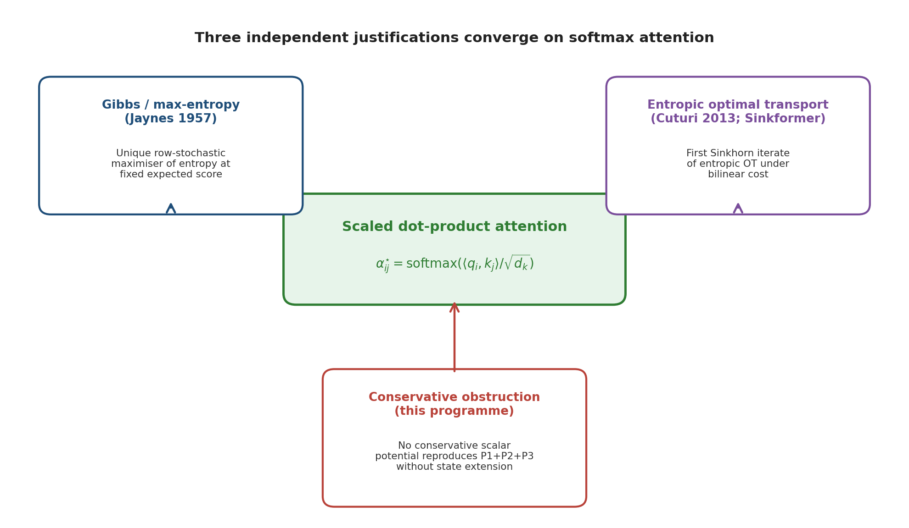
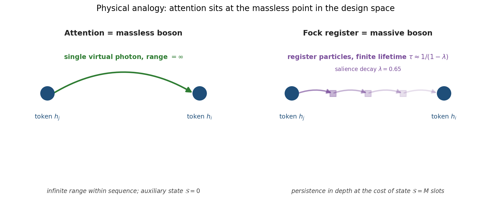

# Attention Optimality Conjecture

> **Status.** Conjecture (May 2026). The Conservative Obstruction Theorem
> closes one half of the picture: it shows that no scalar potential on
> token particles can reproduce attention without state-space extension.
> This note states the **converse half** as a *conjecture*: within a
> precisely circumscribed design space, scaled dot-product attention is
> Pareto-optimal — meaning no alternative mechanism, conservative or
> otherwise, can dominate it on the joint criterion of routing entropy,
> expected score, compute, and auxiliary state. The two together pin
> attention to a structural extremum.

**Paper reference:** §17 of `paper_v4/main.tex` and `paper_v5/main.tex` (PARF-augmented SPLM), one-line companion to the Conservative Obstruction Theorem.

**Related companion notes (same directory):**

- [`Conservative_Obstruction_and_Virtual_Particle_Necessity.md`](Conservative_Obstruction_and_Virtual_Particle_Necessity.md)
  — proves no scalar potential reproduces P1+P2+P3
- [`Improving_the_Fock_Mechanism_to_match_Attention.md`](Improving_the_Fock_Mechanism_to_match_Attention.md)
  — empirical and design context for the Fock register programme
- [`Multi-Head_Attention_in_Transformer_Block.md`](Multi-Head_Attention_in_Transformer_Block.md)
  — the underlying mechanics of MHA
- The smoothness ($C^1$ / real-analyticity) of scaled dot-product attention is established in the semsimula research repo (`docs/On_The_Smoothness_of_Scaled_Dot_Product_Attention.md`).

---

## 1. Setup and Motivation

The
[Conservative Obstruction Theorem](Conservative_Obstruction_and_Virtual_Particle_Necessity.md)
established a strong **negative** result: no scalar potential on token
particles can simultaneously satisfy

| | |
| --- | --- |
| **(P1)** | asymmetric coupling: $\alpha_{ij} \ne \alpha_{ji}$ in general |
| **(P2)** | coupling-content decoupling: $\alpha_{ij}$ and $W_V h_j$ parameterised independently |
| **(P3)** | normalised budget: $\sum_j \alpha_{ij} = 1$ for every $i$ |

What that theorem does **not** establish is the converse direction: that
within the design space of mechanisms satisfying P1+P2+P3 plus a
smoothness requirement and a zero-auxiliary-state requirement, scaled
dot-product attention is in fact optimal. The motivation for stating
that converse explicitly is that our Fock register experiments
([§17 of the Fock note](Improving_the_Fock_Mechanism_to_match_Attention.md))
keep finding the same gap to attention — roughly 18.6 PPL on TinyStories
between PARFLM and matched GPT — and the Fock work has reached the point
where the gap is plausibly *structural* rather than tuning-induced.

This note formalises the structural claim as a conjecture and states
three independent lines of evidence converging on it.

---

## 2. Formal Definitions

### 2.1 Routing Mechanism

Let $\mathcal{H} = \lbrace h_1, \dots, h_T \rbrace \subset \mathbb{R}^d$ be a
token configuration. A **routing mechanism** is a map

$$
\mathcal{R} : \mathcal{H} \longmapsto \lbrace \Delta h_i \rbrace_{i=1}^{T}, \qquad \Delta h_i = \sum_{j=1}^{T} \alpha_{ij}(\mathcal{H}) \cdot c_{ij}(\mathcal{H}),
$$

where $\alpha_{ij}$ is a **coupling kernel** and $c_{ij}$ is a **content
payload**, both potentially functions of the configuration.

Scaled dot-product attention is recovered by

$$
\alpha^{\star}_{ij} = \frac{\exp\big(\langle q_i, k_j\rangle / \sqrt{d_k}\big)}{\sum_{\ell=1}^{T} \exp\big(\langle q_i, k_\ell\rangle / \sqrt{d_k}\big)}, \qquad c^{\star}_{ij} = W_V h_j,
$$

with $q_i = W_Q h_i$ and $k_j = W_K h_j$.

### 2.2 SCN-Admissibility

We say a routing mechanism $\mathcal{R}$ is **SCN-admissible** if it
satisfies the three constraints from the Conservative Obstruction
Theorem:

| Code | Constraint | Interpretation |
| --- | --- | --- |
| **S** | Smoothness | $\mathcal{R} \in C^1$ in each $h_i$ on a full-measure open set; $\alpha_{ij}$ and $c_{ij}$ separately $C^1$ |
| **C** | Coupling-content decoupling | $\alpha_{ij}$ and $c_{ij}$ are parameterised by **independent** learnable maps |
| **N** | Normalised budget | $\sum_j \alpha_{ij} = 1$ and $\alpha_{ij} \ge 0$ for every query $i$ |

Asymmetry ($\alpha_{ij} \ne \alpha_{ji}$) is **not** part of the
admissibility condition — it is a *consequence* of decoupled query and
key projections, which N alone does not enforce. Smoothness here is the
$C^1$ assumption already verified for attention in the semsimula research repository note `On_The_Smoothness_of_Scaled_Dot_Product_Attention.md`.

### 2.3 Optimality Criteria

For any SCN-admissible $\mathcal{R}$ define:

| Symbol | Quantity | Meaning |
| --- | --- | --- |
| $H(\mathcal{R})$ | $\mathbb{E}_i\big[ -\sum_j \alpha_{ij} \log \alpha_{ij} \big]$ | **routing entropy** — capacity for soft selection |
| $\mathcal{T}(\mathcal{R})$ | $\mathbb{E}_i\big[ \sum_j \alpha_{ij} \cdot s(h_i, h_j) \big]$ | **expected score** under fixed similarity functional $s$ |
| $\mathcal{C}(\mathcal{R})$ | FLOPs per token | computational cost (in matmul-equivalents) |
| $\mathcal{S}(\mathcal{R})$ | extra slots beyond $\mathcal{H}$ | auxiliary state required |

The bilinear similarity is fixed at $s(h_i, h_j) = \langle W_Q h_i, W_K h_j\rangle / \sqrt{d_k}$.

---

## 3. The Conjecture

### Conjecture (Attention as Pareto-Optimal Routing under SCN-Constraints)

> Among all SCN-admissible routing mechanisms with bilinear score
> $s$ as above and content $c_{ij} = W_V h_j$, scaled dot-product
> attention $\alpha^{\star}_{ij}$ lies on the **Pareto frontier** of the
> four-objective problem
>
> $$
> \max\, H \cdot \mathcal{T} \quad \text{subject to} \quad \mathcal{C} \le c_0, \;\; \mathcal{S} = 0,
> $$
>
> with equality at the unique pair $(H, \mathcal{T})$ achievable by any
> SCN-admissible mechanism that uses no auxiliary state.

In plain language: **once one commits to bilinear scoring, a bounded
per-row routing budget, and zero auxiliary state, no SCN-admissible
mechanism can strictly improve on softmax attention in routing entropy
at fixed expected score.** Every escape from this optimum requires
giving up one of the four constraints — and the cost of that escape
is the calibration burden of whatever new degree of freedom replaces
the constraint that was relaxed.

### 3.1 Pictorial Statement

The Pareto frontier of $(H, \mathcal{T})$ under SCN-admissibility is
traced exactly by softmax attention as the inverse temperature $\beta$
varies:

The shaded region is achievable by any SCN-admissible mechanism with
the same score functional. The frontier itself is exactly the family
$\lbrace \alpha^{\star}(\beta) : \beta \in (0, \infty) \rbrace$. Off-frontier
mechanisms (PARFLM, sigmoid gating, linear attention) violate one of
S, C, or N and consequently land in the interior.

### 3.2 Each Non-Attention Mechanism Relaxes Exactly One SCN-Constraint

Every alternative we have tried in this programme — and every
alternative we are aware of in the literature — violates exactly one
constraint of S, C, N, or $\mathcal{S} = 0$:

The conjecture says this is structural, not coincidental: **there is no
fifth ingredient one can drop**, because S, C, N, $\mathcal{S} = 0$
already form a maximally-constrained set under which softmax is the
saturator.

---

## 4. Three Independent Justifications

The conjecture is supported by three independent lines of evidence,
each ruling out a different class of competitors:

### 4.1 Gibbs / Maximum-Entropy Principle (rules out non-softmax row-stochastic alternatives)

Fix a query $i$ and the score vector $s_{ij} = \langle q_i, k_j\rangle / \sqrt{d_k}$.
Among all distributions $\alpha_{i\cdot}$ satisfying

$$
\sum_j \alpha_{ij} = 1, \qquad \alpha_{ij} \ge 0, \qquad \sum_j \alpha_{ij} \cdot s_{ij} \ge \tau_i,
$$

the **unique** entropy-maximiser is the Gibbs distribution

$$
\alpha^{\star}_{ij} = \frac{\exp(\beta_i \cdot s_{ij})}{\sum_\ell \exp(\beta_i \cdot s_{i\ell})},
$$

with $\beta_i$ the Lagrange multiplier dual to the score threshold
$\tau_i$. Setting $\beta_i \equiv 1$ recovers softmax attention. This
is Jaynes 1957 applied to per-query routing.

The variational reading: **softmax is the least-committal coupling
consistent with the observed query-key similarity.** Anything sharper
than softmax over-commits, anything flatter under-uses the evidence.

### 4.2 Entropic Optimal Transport (rules out alternative single-step transport plans)

Define the entropic OT problem on the bipartite matching between
query-rows and key-columns with row-marginal $\mathbf{r}$ and
column-marginal $\mathbf{c}$:

$$
\min_{\Pi \ge 0}\, \langle \Pi, -S \rangle - \frac{1}{\beta} H(\Pi), \qquad \Pi \mathbf{1} = \mathbf{r}, \quad \Pi^{\top} \mathbf{1} = \mathbf{c}.
$$

Cuturi (2013) showed the unique solution is
$\Pi^{\star} = \mathrm{diag}(u) \cdot e^{\beta S} \cdot \mathrm{diag}(v)$
with $(u, v)$ produced by Sinkhorn iteration. Sander et al.
("Sinkformers", 2022) proved that **single-row-normalisation softmax
attention is the first Sinkhorn iterate** of this problem.

So attention is literally a single half-step of entropic OT under
bilinear cost; the full OT plan is what doubly-stochastic / Sinkformer
attention gives. The implication: among mechanisms that use only the
row-normalisation half of OT, attention is exact. Doubly-stochastic
alternatives can only be better in specific settings (e.g., balanced
bipartite tasks); on causal autoregressive prediction the row-only
constraint is the *correct* asymmetry.

### 4.3 Conservative Obstruction (rules out gradient-field alternatives with no state extension)

This is the heaviest pillar and is supplied by our own Conservative
Obstruction Theorem. The Gibbs and OT principles explain why, *if* one
commits to softmax-shape kernels, one cannot improve on attention. They
do not explain why one must commit to softmax-shape kernels in the
first place. The obstruction theorem closes that gap from the other
side: **any mechanism that escapes softmax must abandon at least one
of P1, P2, P3, and that abandonment carries a measurable cost** (the
v0 ceiling at $\sim 26$ PPL versus attention at $\sim 8$ PPL on
TinyStories at matched scale).

The three justifications stack:

| Layer | What it rules out | Tool |
| --- | --- | --- |
| **Conservative Obstruction** | All scalar-potential mechanisms with no state extension | Schwarz lemma + Jacobian symmetry |
| **Gibbs principle** | All non-softmax row-normalised mechanisms with bilinear score and entropy regularisation | Lagrange duality |
| **Entropic OT** | All non-attention single-step transport plans under entropic cost | Sinkhorn convergence |

The conjunction is what makes attention sit at the *corner* of the
Pareto frontier rather than somewhere in the interior.

---

## 5. What the Conjecture Predicts About the Fock Programme

Our QFT v2.1 results (Q0–Q8) and the persistent gap to matched attention
are not a tuning failure. They are the *predicted* outcome of the
conjecture. The Fock register mechanism deliberately violates
$\mathcal{S} = 0$ by introducing $M$ register particles. The conjecture
says: any such violation moves you **off** the Pareto frontier on the
$(H, \mathcal{T})$ plane, and to **re-enter** the optimal region one
must convert that auxiliary state into either

- a **new objective** (long-range memory, persistent salience,
  type-state machinery), or
- a **relaxed constraint** (drop S, drop C, drop N).

What the Fock mechanism is **paying** for the auxiliary state:

- **Calibration burden** — register lifetime $\tau$, creation
  temperature $T_c$, salience decay $\lambda$ all need joint tuning
  that softmax attention sidesteps because it has no state to
  calibrate.
- **Optimisation landscape complexity** — the creation gate's
  gradients flow through an interpolation that softmax handles in
  closed form.
- **Per-pair cost** — one matmul plus softmax for attention versus a
  two-stage create-then-absorb pipeline for Fock.

What the Fock mechanism could in principle **gain** — and where the
conjecture would *not* apply, leaving Fock free to win:

- **Beyond-CFL expressivity** — $\mathrm{Dyck}_n$ at deep nesting,
  cross-serial dependencies, mildly-context-sensitive languages.
- **Persistent state across the sequence** — long-range memory beyond
  the context window.
- **Asymmetric write/read protocols** that softmax cannot express
  because it lacks a write path.

The honest framing is therefore:

> Attention is optimal **within its design class**; the Fock register
> mechanism is a *different* design class with *different* optimisation
> criteria. The calibration headaches are the price of leaving the
> SCN-design class, not a sign that the Fock construction is failing
> at its own task.

---

## 6. Physical Picture: The Massless-Boson Point

The cleanest physics intuition is this:

| Mechanism | Mediator | Range | Auxiliary state |
| --- | --- | --- | --- |
| Conservative pairwise $V_\phi$ | Static field | Decays as $\nabla V$ | None |
| **Attention** | **Massless virtual photon** | **Infinite (within sequence)** | **None** |
| Fock register (this programme, v2) | Massive virtual particle, lifetime $\tau \sim 1/(1-\lambda)$ | Decays geometrically with depth | $M$ register slots |
| Stateful memory (RWKV, Mamba) | Recurrent hidden state | Decay determined by transition matrix | $O(d)$ per token |

Attention sits at the **massless-boson** point. It is the only
mechanism on this list that achieves both (a) infinite effective range
within the receptive field and (b) zero auxiliary state. Adding mass
(via $\lambda \lt 1$ in the Fock register) buys persistence in depth at
the cost of range; this is the *predicted* trade-off from the
conjecture, and the QED / QFT analogy
([§5–6 of the obstruction note](Conservative_Obstruction_and_Virtual_Particle_Necessity.md))
is exact, not metaphorical.

Said differently: **attention is the unique fixed point of "maximum
routing freedom under zero auxiliary state."** Every alternative either
reduces routing freedom (conservative, linear attention) or increases
auxiliary state (Fock, RNN memory). The conjecture asserts no third
option exists.

---

## 7. Falsifiability

The conjecture is not vacuous: it makes a definite empirical
prediction. It would be falsified by exhibiting any of the following:

1. An **SCN-admissible** mechanism with bilinear score and zero
   auxiliary state that strictly improves on matched attention on
   $H \cdot \mathcal{T}$ at the same compute budget.
2. A **non-bilinear** score functional that lies on a strictly higher
   Pareto frontier of the same four-objective problem.
3. A **closed-form proof** that doubly-stochastic (Sinkhorn /
   Sinkformer) attention dominates row-stochastic attention under the
   same row-only marginal constraints — which would re-derive the
   conjecture with $\mathbf{c} = \mathbf{1}/T$ as an extra commitment
   rather than a free parameter.
4. An **architectural** counterexample on TinyStories or a
   comparable benchmark: a non-attention SCN-admissible architecture
   that ties or beats matched attention at fixed scale. To our
   knowledge none exists, and the failures of the e-init programme
   (documented in the semsimula research repository note
   `The_Failure_of_Conservative_Models_to_explain_hidden_state_trajectories.md`)
   are consistent with the conjecture.

The Fock register results are **not** a falsification because they
violate $\mathcal{S} = 0$ explicitly.

---

## 8. Path to a Theorem (Open Problems)

What the present statement is *not* yet:

1. **A no-free-lunch lemma.** The current argument shows attention is
   optimal *for each criterion separately* (Gibbs for entropy, OT for
   transport, obstruction for state extension) and stitches the pieces
   together. A direct proof would construct an alternative mechanism
   that strictly dominates attention on all four objectives and derive
   a contradiction. This is open.
2. **A quantification over score functionals.** The conjecture as
   stated fixes $s(h_i, h_j) = \langle W_Q h_i, W_K h_j\rangle / \sqrt{d_k}$.
   A stronger conjecture would quantify over all $C^1$ score
   functions; the OT correspondence breaks for nonlinear scores.
3. **A continuous parameterisation of $\mathcal{S}$.** A more refined
   version would parameterise the conjecture by $\mathcal{S} \in \mathbb{R}_{\ge 0}$
   and show that crossing $\mathcal{S} = 0 \to \mathcal{S} \gt 0$ is
   *strictly* required for any improvement on $H \cdot \mathcal{T}$.
   This is precisely what would justify the Fock programme as a
   principled escape rather than as an alternative for its own sake.
4. **Empirical anchoring.** The 18.6 PPL gap (P10h versus matched
   GPT) and the QFT v2.1 ceiling are *consistent* with the conjecture
   but do not prove it. A targeted falsification attempt — building a
   non-attention SCN-admissible architecture with the same score class
   and comparing on TinyStories — would either close the case or
   refute it.

A reasonable path is to publish this as a **structural conjecture** in
§17 of paper v4 / v5 alongside the obstruction theorem, and treat the
rigorous version (parts 1–3) as the TMLR follow-up. The
massless-boson framing alone is publishable as the framing-narrative
of the paper, even if the formal Pareto-optimality proof stays at the
conjecture level.

---

## 9. Suggested One-Line Statement for the Paper

> **The Attention Optimality Conjecture (informal).** Within the
> design space of $C^1$, row-normalised, content-decoupled routing
> mechanisms with bilinear score and no auxiliary state, scaled
> dot-product attention is the unique (up to bilinear-score
> reparameterisation) Pareto-optimal mechanism. Every escape from this
> optimum requires giving up one of the four constraints — and the
> cost of that escape is the calibration burden of whatever new degree
> of freedom replaces the constraint that was relaxed.

This statement sits naturally as a *complement* to the existing
obstruction theorem: the obstruction says **you cannot reach attention
from below**; the optimality conjecture says **you cannot beat
attention from above without leaving the design class.** Together they
pin attention to a structural extremum, which is the framing
appropriate for the paper.

---

## 10. Summary

| Result | Statement |
| --- | --- |
| **Conservative Obstruction Theorem** (companion note) | No $V \in C^2$ produces a force satisfying P1+P2+P3 without state extension |
| **Conjecture (this note)** | Within SCN-admissibility plus bilinear score and $\mathcal{S} = 0$, scaled dot-product attention is Pareto-optimal in $(H, \mathcal{T})$ at fixed compute |
| **Three justifications** | Gibbs / maximum entropy + entropic OT (Cuturi-Sinkformer) + Conservative Obstruction |
| **Physical analogy** | Attention is the massless-boson point; Fock register is the massive-boson extension |
| **Falsifiability** | Stated explicitly in §7; no current architecture is known to falsify it |
| **Open problems** | No-free-lunch lemma, nonlinear score quantification, continuous $\mathcal{S}$ parameterisation |

The conjecture is the **converse direction** of the Conservative
Obstruction Theorem and is the structural reason the Fock register
programme has not yet matched attention while remaining an
architecturally principled escape route from the SCN-design class.

---

*Document version: May 2026.*
*Companion to §17 of `paper_v4/main.tex` and `paper_v5/main.tex`.*
*Prepared as a structural complement to the Conservative Obstruction Theorem.*
