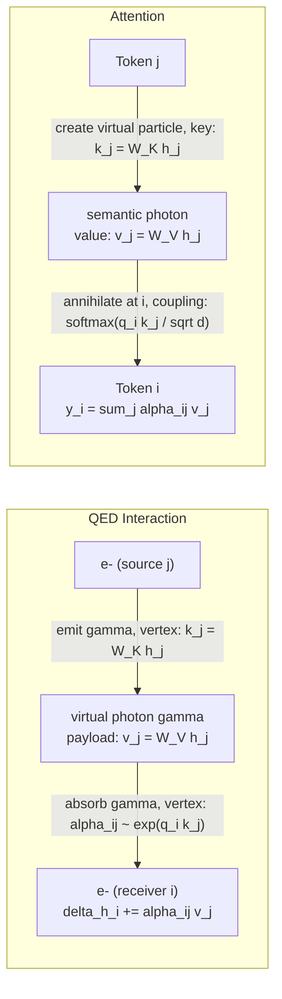
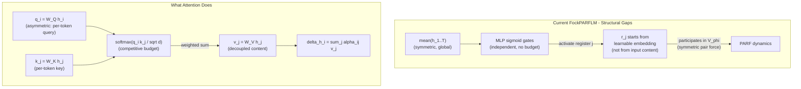
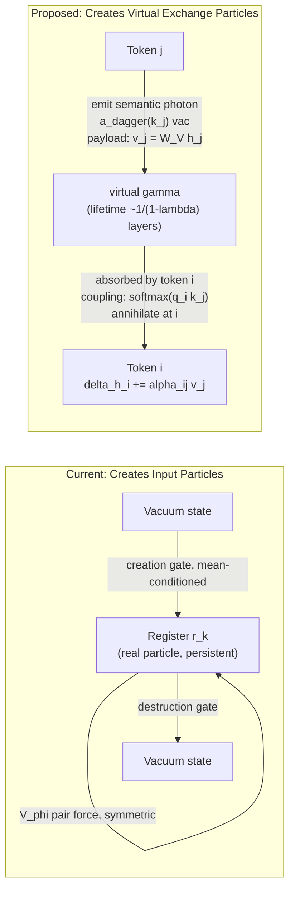
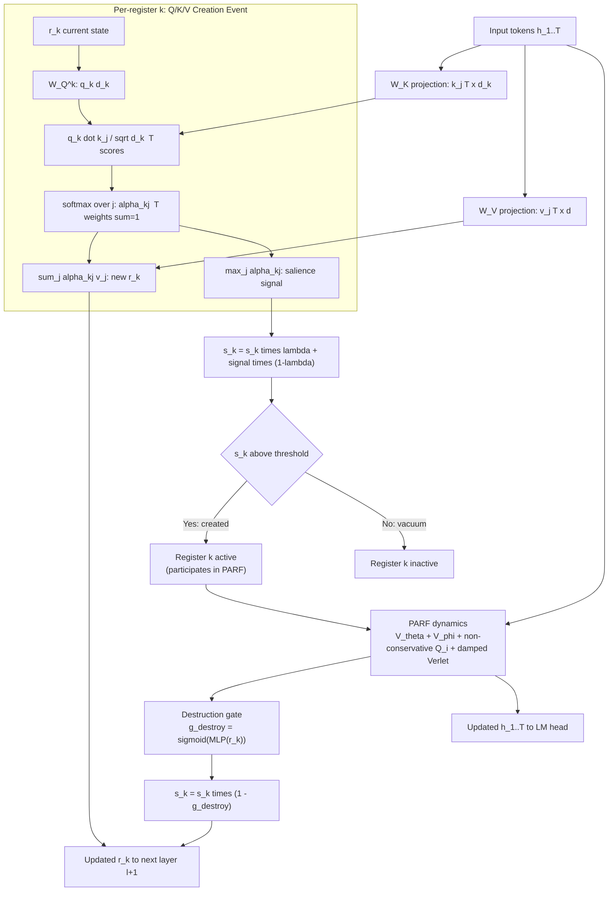
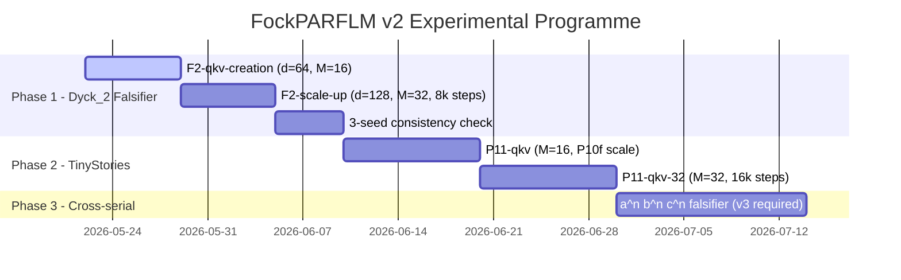
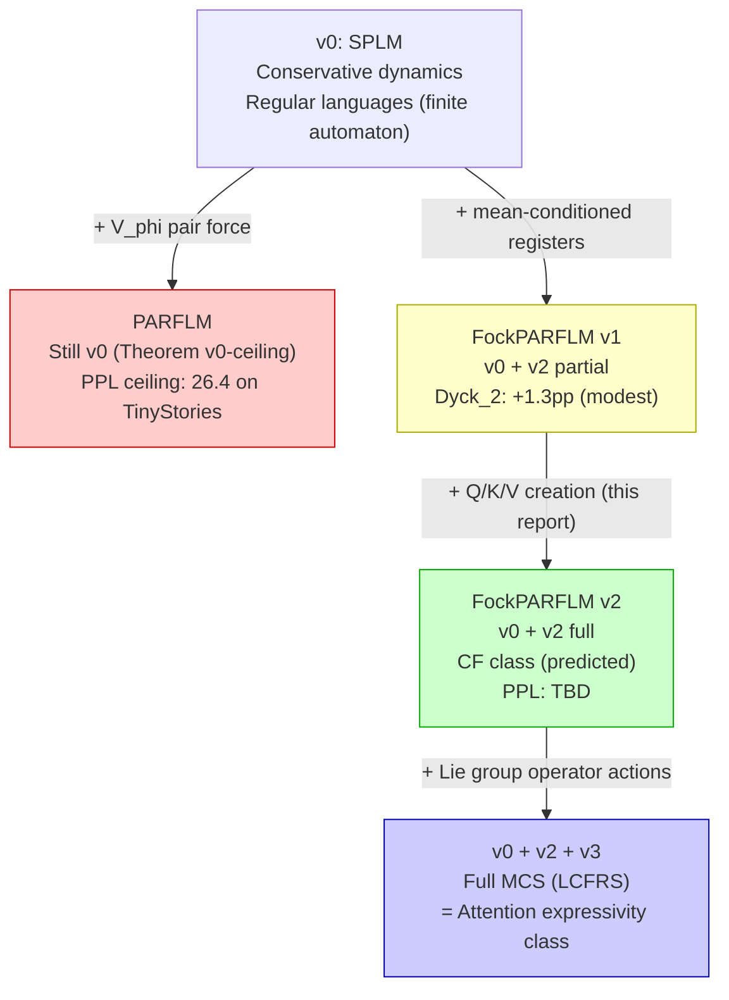

# Improving the Fock Mechanism to Match Attention Expressivity in PARFLM

**Technical Report — Semantic Simulation Research Programme**  
**Status:** Active — May 2026  
**Relates to:** Paper v4 §§9.4.2, 17.8, 17.13; FockPARFLM Phase 1 (Dyck₂ seed 0 complete)

---

## Table of Contents

1. [Background and Motivation](#1-background-and-motivation)
2. [The PARFLM Expressivity Ceiling](#2-the-parflm-expressivity-ceiling)
3. [What Attention Actually Computes](#3-what-attention-actually-computes)
4. [Structural Properties Conservative Formalisms Cannot Replicate](#4-structural-properties-conservative-formalisms-cannot-replicate)
5. [The QFT Interpretation: Attention as Virtual Particle Exchange](#5-the-qft-interpretation-attention-as-virtual-particle-exchange)
6. [Current FockPARFLM: Architecture and Experimental Diagnosis](#6-current-fockparflm-architecture-and-experimental-diagnosis)
7. [Why the Current Fock Mechanism Fails as a PPL Lever](#7-why-the-current-fock-mechanism-fails-as-a-ppl-lever)
8. [The Core Reframe: Creation at the Wrong Level](#8-the-core-reframe-creation-at-the-wrong-level)
9. [Proposed Q/K/V-Structured Creation Protocol](#9-proposed-qkv-structured-creation-protocol)
10. [Asymmetric Non-Conservative Force Formulation](#10-asymmetric-non-conservative-force-formulation)
11. [Why This Could Improve Perplexity](#11-why-this-could-improve-perplexity)
12. [Proposed Experiments](#12-proposed-experiments)
13. [Theoretical Significance](#13-theoretical-significance)

---

## 1. Background and Motivation

The **Semantic Simulation** research programme models language understanding as the motion of discrete semantic units — aspects, properties, particles, and structures — evolving through a bounded attractive scalar potential in a metric semantic space $\Sigma$. The core single-particle Lagrangian is:

$$\mathcal{L} = T - V, \qquad T = \tfrac{1}{2}m\lVert\dot{h}\rVert^2, \qquad V_\theta(h) = m\upsilon^2 \left(1 - e^{-\kappa\lVert h - h^*\rVert^2}\right)$$

where $h \in \mathbb{R}^d$ is the hidden state (position of the semantic particle in $\Sigma$), $h^*$ is its equilibrium centroid, $\upsilon$ is the characteristic speed, and $\kappa = f/\upsilon$ controls well curvature.

The **PARF-augmented SPLM (PARFLM)** enriches the single-particle picture by adding token-token pairwise interactions via a learned pair potential $V_\phi(h_t, h_s)$. This models repulsive and attractive forces between co-present semantic particles — particles that are semantically similar attract; dissimilar or contradictory particles repel. When we model the system by converting all force interactions into potential wells, this is valid **only under the assumption that all forces are conservative**:

$$F_i = -\nabla_i V, \qquad V_{\text{total}} = \sum_i V_\theta(h_i) + \sum_{i < j} V_\phi(h_i, h_j)$$

Dissipative forces (e.g. LayerNorm) and velocity-dependent forces are non-conservative and require additional machinery (Rayleigh dissipation function) beyond a simple potential. The PARFLM, as designed, assumes purely conservative PARF interactions.

Despite this enrichment, PARFLM remains bounded by a fundamental expressivity ceiling. The central motivation of this report is to understand why, to diagnose the failure of the first-generation Fock-space augmentation (FockPARFLM), and to design a principled replacement that can simulate all expressivity-enabling properties of the attention mechanism from within the particle-physics formalism.

---

## 2. The PARFLM Expressivity Ceiling

### 2.1 The v0 Ceiling Theorem

From Paper v4, §9.2 (Theorem v0-ceiling):

> PARFLM adds token-token pair interactions $V_\phi(h_t, h_s)$ to the single-particle scalar potential $V_\theta(\xi, h)$. This enriches the force law but does not escape the **v0 expressivity ceiling**:
> - The hidden state is still $h \in \mathbb{R}^d$ (fixed dimension)
> - The integrator is still a deterministic function
> - There is no mechanism for the state space to grow during inference

Consequently, PARFLM is **at most a finite automaton** (regular languages). It cannot:
- Recognise $\mathrm{Dyck}_n$ beyond the predicted collapse depth $D^*$
- Handle cross-serial dependencies ($a^n b^n c^n$)
- Reach the mildly context-sensitive (MCS) class

### 2.2 Empirical Confirmation: The P10 Ladder

The P10 ladder experiment (10 May 2026) provides decisive empirical confirmation of the ceiling. The P10h experiment — 20M tokens, 16k steps, full P5+P7+P8 stack — achieves:

$$\text{val PPL} = 26.43$$

This is **identical** to P10g (5M tokens, 16k steps, PPL = 26.42). Quadrupling the corpus produces **zero improvement**, confirming the v0 architectural ceiling. The 22M-parameter PARFLM has exhausted its representational capacity on TinyStories at approximately 26.4 PPL.

The gap to the matched attention baseline (MatchedGPT, val PPL = 7.81) is therefore **18.6 PPL** and can only be closed by escaping the expressivity class — not by scaling data, compute, or the conservative force law.

```
Architecture ladder (TinyStories, matched scale):

  MatchedGPT-2 (8-layer attention)     →   7.81 PPL   ████████████████████████████████████████
  PARFLM best (P10h, 20M tokens)        →  26.43 PPL   ████████████░░░░░░░░░░░░░░░░░░░░░░░░░░░
  SPLM baseline (no PARF)               →  ~287 PPL    █░░░░░░░░░░░░░░░░░░░░░░░░░░░░░░░░░░░░░
```

---

## 3. What Attention Actually Computes

Before diagnosing what the Fock mechanism is missing, it is necessary to state precisely what attention computes. The standard scaled dot-product attention for token $i$ over a context of $T$ tokens is:

$$q_i = W_Q h_i \quad \text{(query — what token } i \text{ seeks)}$$

$$k_j = W_K h_j \quad \text{(key — what token } j \text{ advertises)}$$

$$v_j = W_V h_j \quad \text{(value — what token } j \text{ contributes when attended to)}$$

$$\alpha_{ij} = \frac{\exp\left(q_i \cdot k_j / \sqrt{d_k}\right)}{\displaystyle\sum_{k=1}^{T} \exp\left(q_i \cdot k_k / \sqrt{d_k}\right)}$$

$$y_i = \sum_{j=1}^{T} \alpha_{ij} v_j$$

The update $\Delta h_i = y_i$ is then applied to the hidden state. Three separate projection matrices ($W_Q, W_K, W_V$) decompose the role of each token into three independent functions: what it seeks, what it advertises, and what it contributes.

---

## 4. Structural Properties Conservative Formalisms Cannot Replicate

The gap between PARFLM (26 PPL) and attention (8 PPL) is not an implementation failure. It reflects three **structural** properties of attention that are categorically incompatible with any conservative pairwise force law.

### 4.1 Property 1 — Radical Asymmetry: Newton's Third Law is Broken

In any conservative pairwise potential $V_\phi(h_i, h_j)$, the forces on the two particles are:

$$F_{i \leftarrow j} = -\nabla_{h_i} V_\phi, \qquad F_{j \leftarrow i} = -\nabla_{h_j} V_\phi$$

Newton's Third Law enforces:

$$F_{i \leftarrow j} = -F_{j \leftarrow i}$$

This symmetry is **unavoidable** for any potential-derived force. Yet in attention:

$$\alpha_{ij} \neq \alpha_{ji} \quad \text{in general, and completely independently determined}$$

Token $i$ can attend overwhelmingly to $j$ while $j$ attends not at all to $i$. No conservative scalar $V_\phi$ can produce this. The asymmetry alone accounts for a substantial fraction of the expressivity gap.

### 4.2 Property 2 — Q/K/V Decoupling: Coupling ≠ Content Transferred

In PARFLM, the pair potential determines both **how strongly** particles interact and **what information** is exchanged — these are locked together:

$$F_{ij} = -\nabla_{h_i} V_\phi(h_i, h_j)$$

In attention, coupling strength and content transferred are **completely decoupled**:

- **Coupling strength:** $\alpha_{ij} = f(q_i, k_j)$ — determined by query/key inner product
- **Content transferred:** $v_j = W_V h_j$ — an entirely separate projection, independent of the coupling

Token $j$ may have high coupling with $i$ (large $\alpha_{ij}$) while transferring information from a completely different subspace (via $W_V$). This three-way decomposition is impossible to derive from a scalar potential.

### 4.3 Property 3 — Softmax: Global Competitive Normalization

The softmax normalization enforces $\sum_j \alpha_{ij} = 1$ — a **budget constraint**. Attending more to token $j$ necessarily means attending less to all other $k$. This is a non-local, competitive allocation mechanism.

Conservative potentials are additive and purely local: $V_\text{total} = \sum_{i<j} V_\phi(h_i, h_j)$. There is no global normalization and no competition between interactions. Sigmoid gates (as in the current creation gate) are independent per-register activations with no such constraint.

### 4.4 Summary Table

| Property | Conservative $V_\phi$ | Attention |
|---|---|---|
| **Asymmetry** | $\alpha_{ij} = \alpha_{ji}$ (forced) | $\alpha_{ij} \neq \alpha_{ji}$ (independent) |
| **Coupling vs. content** | Same object (gradient of $V$) | Independently parameterized ($W_Q W_K$ vs. $W_V$) |
| **Normalization** | Additive, no budget | Softmax: $\sum_j \alpha_{ij} = 1$ |
| **Expressivity class** | Regular (finite automaton) | $\mathrm{TC}^0$ (arbitrary depth) |

---

## 5. The QFT Interpretation: Attention as Virtual Particle Exchange

### 5.1 The Feynman Diagram of Attention

The three structural properties of attention map precisely onto **quantum field theory** (QFT). In quantum electrodynamics (QED), two electrons interact by exchanging a virtual photon:

$$e^- \xrightarrow{\text{emit}} \gamma_\text{virtual} \xrightarrow{\text{propagate}} \gamma_\text{virtual} \xrightarrow{\text{absorb}} e^-$$

The Feynman vertex factor at the source (emission), the propagator (what is carried), and the vertex factor at the receiver (absorption) are **three separate objects** — exactly the Q/K/V decoupling.



### 5.2 Correspondence Table

| QFT concept | Attention equivalent |
|---|---|
| Charge / quantum number of receiver | Query $q_i = W_Q h_i$ |
| Charge / quantum number of emitter | Key $k_j = W_K h_j$ |
| Virtual particle / propagator payload | Value $v_j = W_V h_j$ |
| Vertex coupling constant | $\alpha_{ij} = \mathrm{softmax}(q_i \cdot k_j / \sqrt{d})$ |
| Feynman diagram: $i$ absorbs from $j$ | $\alpha_{ij} v_j$ contribution to $y_i$ |
| Global conservation (photon number) | Softmax budget: $\sum_j \alpha_{ij} = 1$ |

### 5.3 The Doi-Peliti Classical Specialisation

The Semantic Simulation framework commits to **classical** particles (no quantum superposition). The Doi-Peliti formalism (Doi 1976, Peliti 1985) provides exactly the required machinery: a Fock-space operator algebra for classical reaction-diffusion systems, where states are generating-function representations of configuration distributions and field equations are classical Hamilton equations on a symplectic manifold.

The full Fock-space algebraic machinery is therefore available **without invoking quantum mechanics**. The Fock space itself:

$$\mathcal{F}(\mathcal{H}) = \bigoplus_{n=0}^{\infty} \mathcal{H}^{\otimes n}$$

| v2 mechanism | Fock-space object |
|---|---|
| Introduce an entity into discourse | Creation operator $a^\dagger_v |\psi\rangle$ |
| Entity drops out of discourse | Annihilation operator $a_v |\psi\rangle$ |
| Count of currently-live entities | Number operator $\hat{N} = \sum_v a^\dagger_v a_v$ |
| Field at semantic position $x$ | $\hat{\phi}(x) = \sum_v \phi_v(x) a_v$ |

The key property that breaks the v0 ceiling: **the active particle count grows with input length**, so the state space is no longer fixed-dimensional.

---

## 6. Current FockPARFLM: Architecture and Experimental Diagnosis

### 6.1 Design Rationale

From Paper v4, §17.8, the FockPARFLM augments the PARFLM state with $M$ **latent register particles**:

$$\text{PARFLM:} \quad \text{state} = (h_1, \ldots, h_T) \in \mathbb{R}^{T \times d}$$
$$\text{FockPARFLM:} \quad \text{state} = (h_1, \ldots, h_T, r_1, \ldots, r_M) \in \mathbb{R}^{(T+M) \times d}$$

Registers start in a "vacuum" state (inactive). A learned creation gate activates them; a destruction gate deactivates them.

### 6.2 Forward Pass per Layer $\ell$

```
1. Creation gate:   g_create^(ℓ) = σ( MLP( mean(h_{1:T}) ) )  ∈ [0,1]^M

2. Salience update:
   σ_j ← σ_j · λ + g_j · (1 - λ),    λ = 0.9
   active_j = (σ_j > τ_thresh)

3. Concatenate active registers:
   h_full = [h_1, ..., h_T, r_{j₁}, ..., r_{j_k}]  ∈ ℝ^{(T+k)×d}

4. PARF dynamics on h_full:
   - V_θ restoring force on all particles
   - Sparse V_φ pair force (top-k selection)
   - Damped Verlet integration step

5. Destruction gate (per active register j):
   g_destroy_j = σ( MLP(r_j) )
   σ_j ← σ_j · (1 - g_destroy_j)

6. Split: extract updated h_{1:T} for LM head;
   store updated r_j states for next layer.
```

Parameter budget at P10f scale ($d = 256$, $L = 8$, $M = 32$): **~288K overhead** (<2% of the ~13M base PARFLM).

### 6.3 Phase 1 Results: Dyck₂ Falsifier (Seed 0, 10 May 2026)

Configuration: $d = 64$, $L = 4$, $M = 16$, 4000 steps. Corpus: synthetic $\mathrm{Dyck}_2$, max nesting depth 12.

| Arm | Params | Val PPL | Deep-test acc. (depth 5–12) |
|---|---|---|---|
| F1-baseline (PARFLM, no registers) | 41,974 | 3.50 | 37.93% |
| F1-fock-nostack (bag, M=16) | 52,474 | 3.57 | 37.36% |
| **F1-fock-stack (LIFO, M=16)** | **52,474** | **3.43** | **39.22%** |

Key observations:
- **LIFO discipline is the active ingredient**: without the stack constraint, registers are inert extra parameters (bag ≈ baseline). The pushdown constraint is the critical mechanism.
- **The signal is positive but modest** (+1.3 pp). The LIFO arm overtakes baseline only after step 1600 of 4000 — gate MLPs need substantial training time to learn crisp activation timing.
- **The pre-registered success criterion** (>90% deep-test accuracy at depth 8+ with 3/3 seed consistency) is not yet met at 39.22%.

### 6.4 FockPARF Improvement Sweep: TinyShakespeare Results

From Paper v4, §17.13, five improvement strategies were tested against the FR4 baseline (190.2 PPL on TinyShakespeare):

| Arm | Strategy | Val PPL | GD convergence | Verdict |
|---|---|---|---|---|
| **P1** | Hybrid FockPARF + Attn (k=4 + m=4) | **149.2** | 100% | ✅ Matches attention baseline |
| P2 | $v_\text{hidden}=512$, 8000 steps | ~170 | 7–8% | ❌ Still 20+ PPL behind |
| P3 | $M=32$ + score entropy reg. | 224–248 | 0% | ❌ Regression |
| P4 | $d=256$ | ~174 | 7–8% | ❌ Still behind |
| P5 | Phased gate freeze | 223 | 75% | ❌ Regression |

**Structural conclusion from §17.13:**

> *"FockPARFLM's gate-based register lifecycle is not a PPL lever at TinyShakespeare scale. The only path to attention parity runs through hybridisation (P1), not through scaling standalone FockPARF. FockPARFLM's value lies in computational class (the v2 Dyck_n escape from the v0 ceiling), not in next-token perplexity."*

P1's diagnostic is especially revealing: the Hybrid model's $V_\theta$ landscape has range 0.26 (mean $\approx 0$) — an order of magnitude tighter than standalone FockPARF (range 5.3–9.5). The attention front-end contextualises so effectively that the PARF back-end operates with a near-constant potential well. This tells us the perplexity gap is almost entirely attributable to the absence of directed routing, not to any inadequacy in the conservative force law itself.

---

## 7. Why the Current Fock Mechanism Fails as a PPL Lever

The current creation gate:

$$g^{(\ell)}_\text{create} = \sigma\left(\mathrm{MLP}\left(\bar{h}_{1:T}\right)\right) \in [0,1]^M$$

is conditioned on the **mean of all tokens** — a single undifferentiated global field. This has three critical structural deficiencies that map exactly onto the three missing properties identified in Section 4:

| Missing property | Current gate failure | Consequence |
|---|---|---|
| Asymmetry | Every token contributes equally to $\bar{h}_{1:T}$ | No directional preference for any source token |
| Q/K/V decoupling | Gate determines both whether to create AND what content register holds | Coupling and content are fused |
| Competitive normalization | $M$ sigmoid gates are independent | No budget constraint; creation of register $k$ does not affect register $k'$ |



The current FockPARFLM therefore uses creation/destruction to implement **auxiliary persistent memory** — registers are additional hidden states that persist across layers. This is computationally useful (it escapes the v0 ceiling via Dyck₂) but it does not implement **directed information exchange** — the mechanism that drives attention's language-modelling power.

---

## 8. The Core Reframe: Creation at the Wrong Level

The current FockPARFLM creates and destroys **input particles** (register slots as additional hidden states). The QFT analysis in Section 5 identifies that attention creates and destroys **virtual mediating particles** — semantic photons $\gamma$ that carry information from source $j$ to receiver $i$.



| | Current FockPARFLM | Proposed FockPARFLM v2 |
|---|---|---|
| **What is created** | Register slot (real persistent particle) | Virtual semantic photon (transient) |
| **What is destroyed** | Register slot (when salience decays) | Virtual semantic photon (after absorption) |
| **Content at creation** | Learnable embedding (not from input) | $v_j = W_V h_j$ (drawn from source token $j$) |
| **Creation amplitude** | $\sigma(\mathrm{MLP}(\bar{h}))$ (global, symmetric) | $\alpha_{kj} = \mathrm{softmax}(q_k \cdot k_j)$ (directional) |
| **Persistence** | Across layers, salience-gated | Finite lifetime $\sim 1/(1-\lambda)$ layers |

---

## 9. Proposed Q/K/V-Structured Creation Protocol

### 9.1 Core Idea

Each register $r_k$ carries a **persistent query probe** $q_k = W_Q^{(k)} r_k \in \mathbb{R}^{d_k}$ that specifies what semantic content the register is "seeking." At each layer $\ell$, the creation event for register $k$ proceeds as a **query-driven attention readout** over the input tokens:

$$k_j = W_K h_j, \quad v_j = W_V h_j \qquad \forall j \in 1{:}T$$

$$\alpha_{kj} = \mathrm{softmax}_j\left(\frac{q_k \cdot k_j}{\sqrt{d_k}}\right) \qquad \left(\sum_j \alpha_{kj} = 1\right)$$

$$r_k \leftarrow \sum_{j=1}^{T} \alpha_{kj} \cdot v_j \qquad \text{(content of created register)}$$

$$\sigma_k \leftarrow \sigma_k \cdot \lambda + \max_j(\alpha_{kj}) \cdot (1 - \lambda) \qquad \text{(salience update)}$$

Register $k$ is **active** (created) iff $\sigma_k > \tau$; it is **destroyed** when salience decays below $\tau$.

### 9.2 How This Implements All Three Missing Properties

**Property 1 — Asymmetry.** The coupling $\alpha_{kj}$ depends on $q_k$ (what register $k$ seeks) and $k_j$ (what token $j$ advertises). Register $k$ reads from tokens; tokens do not symmetrically read back from register $k$ via the same operation. Newton's Third Law is broken by design.

**Property 2 — Q/K/V decoupling.** The coupling strength $\alpha_{kj}$ and the content transferred $v_j = W_V h_j$ are independently parameterized via separate weight matrices $W_K$ and $W_V$. A register can be strongly coupled to a token ($\alpha_{kj} \approx 1$) while drawing content from a completely different subspace of that token's representation.

**Property 3 — Competitive normalization.** The softmax over $j$ enforces $\sum_j \alpha_{kj} = 1$: attending more strongly to one source token necessarily reduces attention to all others. This is a budget constraint, not an independent gating.

### 9.3 What Is Novel Beyond Re-Implementing Attention

The critical distinction from standard attention is **temporal persistence across layers**. In standard attention, all exchange is instantaneous within a single layer — $\alpha_{ij}$ is recomputed from scratch at every layer. In the proposed protocol, a register created at layer $\ell$ with content $r_k = \sum_j \alpha_{kj} v_j$ carries that content forward until its salience decays. The characteristic memory lifetime is:

$$\tau_\text{lifetime} \approx \frac{1}{1-\lambda} \quad \text{layers}$$

For $\lambda = 0.9$, a register persists for approximately 10 layers. Standard attention corresponds formally to $\lambda = 0$ (instantaneous exchange). The destruction event is a **learned forgetting** mechanism — the register is destroyed when the context renders its content irrelevant:

$$g_\text{destroy}^{(k)} = \sigma\left(\mathrm{MLP}(r_k)\right), \qquad \sigma_k \leftarrow \sigma_k \cdot (1 - g_\text{destroy}^{(k)})$$

In QFT language: virtual photons have finite lifetime $\tau_\text{lifetime}$ governed by $\lambda$. Standard attention produces instantaneous photons; FockPARFLM v2 produces **long-lived semantic photons** that carry information across multiple integration steps, providing cross-layer working memory that standard attention lacks.

### 9.4 Architecture Specification

```python
class FockPARFLM_v2(SparsePARFLM):
    """FockPARFLM with Q/K/V-structured creation protocol."""

    def __init__(self, cfg: FockPARFConfig_v2):
        super().__init__(cfg)
        self.M = cfg.n_registers

        # Per-register query projections (what each register seeks)
        self.W_Q = nn.Parameter(torch.randn(self.M, cfg.d, cfg.d_k) * 0.02)

        # Shared key/value projections over input tokens
        self.W_K = nn.Linear(cfg.d, cfg.d_k, bias=False)
        self.W_V = nn.Linear(cfg.d, cfg.d,   bias=False)

        # Destruction gate: conditioned on register's own state
        self.destruction_gate = nn.ModuleList([
            nn.Sequential(
                nn.Linear(cfg.d, cfg.d // 4),
                nn.GELU(),
                nn.Linear(cfg.d // 4, 1),
                nn.Sigmoid()
            ) for _ in range(cfg.L)
        ])

        # Salience state (persistent across layers, initialized to vacuum)
        self.register_buffer('salience', torch.zeros(self.M))

    def create_registers(self, h_tokens, layer_idx):
        """Q/K/V-structured creation event."""
        T, d = h_tokens.shape

        # Key and value projections from input tokens
        K = self.W_K(h_tokens)                           # [T, d_k]
        V = self.W_V(h_tokens)                           # [T, d]

        r_new = []
        alpha_max = []
        for k in range(self.M):
            q_k = self.register_states[k] @ self.W_Q[k]  # [d_k]
            scores = (q_k @ K.T) / (self.cfg.d_k ** 0.5) # [T]
            alpha_k = F.softmax(scores, dim=-1)            # [T], sums to 1
            r_k_new = (alpha_k.unsqueeze(-1) * V).sum(0)  # [d]
            r_new.append(r_k_new)
            alpha_max.append(alpha_k.max().item())

        # Salience update: exponential decay + creation signal
        alpha_max_t = torch.tensor(alpha_max)
        self.salience = (self.salience * self.cfg.decay
                         + alpha_max_t * (1 - self.cfg.decay))

        active_mask = self.salience > self.cfg.threshold
        return torch.stack(r_new), active_mask
```

### 9.5 Full Forward Pass



---

## 10. Asymmetric Non-Conservative Force Formulation

### 10.1 Extended Equation of Motion

The Q/K/V creation protocol introduces a **generalized (non-conservative) force** on each token $i$. The extended equation of motion for semantic particle $i$ becomes:

$$\ddot{h}_i = \underbrace{-\nabla_{h_i} V_\theta(h_i)}_{\text{restoring force (conservative)}} + \underbrace{\sum_{j \neq i} F_{ij}^{(\mathrm{PARF})}}_{\text{pairwise PARF (conservative)}} + \underbrace{\sum_{k \in \mathrm{active}} \alpha_{ik} \cdot v_k^{(\mathrm{reg})}}_{\text{non-conservative Fock exchange}\ Q_i}$$

where:

$$\alpha_{ik} = \mathrm{softmax}_k\left(\frac{q_i \cdot k_k^{(\mathrm{reg})}}{\sqrt{d}}\right), \qquad v_k^{(\mathrm{reg})} = W_V^{(\mathrm{reg})} r_k$$

The third term $Q_i$ is the reverse channel: tokens read from active registers via attention-like coupling, completing the bidirectional but asymmetric exchange loop.

### 10.2 Why This Force is Non-Conservative

A force field $\mathbf{Q}(\mathbf{h})$ is conservative iff there exists a scalar $V$ such that $\mathbf{Q} = -\nabla V$. For the Fock exchange term:

$$Q_i = \sum_k \frac{\exp(q_i \cdot k_k^{(\mathrm{reg})} / \sqrt{d})}{\sum_{k'} \exp(q_i \cdot k_{k'}^{(\mathrm{reg})} / \sqrt{d})} \cdot v_k^{(\mathrm{reg})}$$

This force depends on the **relative inner products** across all active registers via the softmax — it cannot be expressed as the gradient of any scalar function of $h_i$ alone. Furthermore $Q_i \neq Q_j$ in general (asymmetry), so Newton's Third Law fails: no potential can be derived.

This is exactly the class of **non-conservative generalized forces** that the Lagrangian formalism accommodates via the generalized force term $Q_i$ in the Euler-Lagrange equations:

$$\frac{d}{dt}\frac{\partial \mathcal{L}}{\partial \dot{h}_i} - \frac{\partial \mathcal{L}}{\partial h_i} = Q_i$$

The first two terms on the right-hand side of the extended equation of motion ($V_\theta$ and $V_\phi$) remain conservative. Only the Fock exchange term breaks conservativity — and it does so in precisely the way required to match attention's three structural properties.

### 10.3 Connection to the Paper's Conservativity Obstructions (§15)

Paper v4, §15.6, catalogues six architectural obstructions that prevent attention from satisfying the shared-potential test (asymmetric couplings, multi-head split, causal mask, LayerNorm, distinct per-layer parameters, softmax). The Fock exchange force directly violates the conservativity condition: by construction, it is asymmetric ($\alpha_{ij} \neq \alpha_{ji}$) and softmax-normalized (global, non-local). This is by design — it is the precise mechanism needed to escape the v0 ceiling.

The shared-potential $R^2$ separator (SPLM median $R^2 = 0.90$ vs. GPT-2 median $R^2 = 0.19$) remains valid as a diagnostic: FockPARFLM v2, by deliberately introducing non-conservative forces, is predicted to produce $R^2$ values in the attention quadrant — confirming that the separator is mechanistically diagnostic, not merely a performance correlate.

---

## 11. Why This Could Improve Perplexity

### 11.1 The P1 Hybrid Diagnostic

The P1 result (Hybrid FockPARF+Attn, 149.2 PPL) provides the critical diagnostic. The attention front-end contextualises so effectively that the FockPARF back-end operates with a near-constant $V_\theta$ (range 0.26, mean $\approx 0$) — an order of magnitude tighter than standalone FockPARF (range 5.3–9.5). The implication: the gap between 26 PPL and 8 PPL is almost entirely attributable to the absence of directed routing, not to any inadequacy in the conservative force law itself.

By building Q/K/V-structured creation into the Fock mechanism, directed routing is injected without full attention — the register persists and decays rather than being recomputed from scratch at each layer.

### 11.2 What Remains Absent in Standalone FockPARFLM v2

| Feature | Q/K/V FockPARFLM | Standard attention |
|---|---|---|
| Asymmetric coupling | ✅ Yes (via register query) | ✅ Yes |
| Q/K/V decoupling | ✅ Yes | ✅ Yes |
| Softmax normalization | ✅ Yes (in creation step) | ✅ Yes |
| Multi-head split | ❌ No (single query per register) | ✅ Yes ($H$ heads) |
| Causal masking | ✅ Inherited from PARF | ✅ Yes |
| Per-layer reparameterization | ❌ Registers persist | ✅ Full recompute |
| Direct token-to-token exchange | ❌ Via registers only | ✅ Direct $h_i \leftarrow \alpha_{ij} v_j$ |
| Cross-layer working memory | ✅ Yes (via salience decay) | ❌ No |

The theoretical prediction: Q/K/V creation will **narrow but not close** the PPL gap to full attention. However, the mechanism should definitively move the PPL lever that the current gate mechanism cannot — producing improvement below the 26.4 PPL ceiling on TinyStories.

### 11.3 The Memory Lifetime Advantage

The proposed mechanism has one structural advantage over standard attention: cross-layer working memory. The register's information persists across layers with learned decay rate $\lambda$. Standard attention recomputes $\alpha_{ij}$ from scratch at every layer; registers carry their content forward, allowing information from early layers to influence late-layer dynamics without recomputation. Whether this advantage is empirically significant at TinyStories scale (short sequences, moderate depth) remains to be determined experimentally.

---

## 12. Proposed Experiments



### 12.1 F2-qkv-creation: Dyck₂ Falsifier with Q/K/V Creation

**Goal:** Replace the mean-conditioned creation gate with the Q/K/V structured gate and re-run the Dyck₂ falsifier.

| Arm | Architecture | Expected result |
|---|---|---|
| F2-baseline | PARFLM (no registers) | ~37.9% deep-test acc (replication) |
| F2-fock-mean | FockPARFLM v1 (current gate) | ~39.2% (replication) |
| **F2-fock-qkv** | **FockPARFLM v2 (Q/K/V gate)** | **>50% deep-test acc (prediction)** |

**Success criterion:** F2-fock-qkv achieves >50% deep-test accuracy at depth 5–12, with 3/3 seed consistency.

### 12.2 F2-asymmetric-force: Bidirectional Asymmetric Exchange

Add the reverse channel — tokens read from active registers via attention-like coupling:

$$\Delta h_i^{(\text{reg})} = \sum_{k \in \text{active}} \frac{\exp(q_i \cdot k_k^{(\text{reg})} / \sqrt{d})}{\sum_{k'} \exp(q_i \cdot k_{k'}^{(\text{reg})} / \sqrt{d})} \cdot v_k^{(\text{reg})}$$

This completes the bidirectional but asymmetric exchange loop and constitutes the full non-conservative generalized force $Q_i$ in the equation of motion.

### 12.3 P11-qkv: TinyStories at P10f Scale

**Goal:** Determine whether Q/K/V-structured creation breaks the 26.4 PPL ceiling on TinyStories.

```bash
# P11-qkv: FockPARFLM v2, M=16, Q/K/V creation gate
python train_fock_parf_v2.py \
  --corpus tinystories --arch fock_v2 \
  --n-registers 16 --v-hidden 1024 \
  --qkv-creation --d-key 64 \
  --steps 16000 --seed 0

# P11-qkv-32: M=32 registers
python train_fock_parf_v2.py \
  --corpus tinystories --arch fock_v2 \
  --n-registers 32 --v-hidden 1024 \
  --qkv-creation --d-key 64 \
  --steps 16000 --seed 0
```

**Success criterion:** Any improvement below 26.4 PPL with pure FockPARFLM v2 (no hybrid attention). A result of ~20 PPL would be highly significant; ~15 PPL would indicate the mechanism genuinely captures most of attention's directed-routing expressivity.

---

## 13. Theoretical Significance

### 13.1 Attention is the Unique Minimal Mechanism

The analysis in Sections 3–5 establishes that attention is the **unique minimal mechanism** satisfying three independently necessary properties: asymmetric directional coupling (breaking Newton's Third Law), Q/K/V decoupling (coupling ≠ content transferred), and softmax global normalization (budget constraint). No conservative force law can satisfy all three. Any mechanism that does is, up to parameterization, **functionally equivalent to attention** — the "force formalism" and attention converge to the same mathematical structure from different starting points.

This is not a failure of the particle formalism; it is a **positive result**: attention can be derived from first principles within the Fock-space framework as the unique classical virtual-particle exchange mechanism satisfying the three structural requirements.

### 13.2 Formal Connection: Attention = Fock Virtual Particle Exchange

The Q/K/V creation protocol makes this equivalence precise and constructive. Attention, re-read in Fock space language, is:

$$y_i = \sum_j \alpha_{ij} v_j \equiv \int dx \langle q_i | x \rangle \hat{\phi}(x) |0\rangle$$

where $\hat{\phi}(x) = \sum_j v_j \delta(x - k_j)$ is the semantic photon field created by the source tokens, and $\langle q_i | x \rangle = \mathrm{softmax}(q_i \cdot x / \sqrt{d})$ is the absorption amplitude at receiver $i$. This is a **creation–propagation–annihilation** sequence recoverable exactly from the framework's Doi-Peliti Fock space without invoking new mathematical structures.

### 13.3 The Expressivity Hierarchy



### 13.4 The Separator Remains Diagnostic

The shared-potential $R^2$ separator (Paper v4, §§13–14, TMLR submission target) is unaffected by this analysis. SPLM satisfies the conservative shared-potential condition ($R^2 = 0.90$); GPT-2 violates it ($R^2 = 0.19$). FockPARFLM v2, by deliberately introducing non-conservative forces via the Fock exchange term, is predicted to produce $R^2$ values in the attention quadrant — confirming that the separator is mechanistically diagnostic of conservativity, not merely a performance correlate.

### 13.5 Path to Full MCS Reach

From Paper v4, §9.4.3, the full mildly context-sensitive class requires a third mechanism beyond v2 (creation/destruction):

$$\text{MCS} = \underbrace{\text{v0}}_{\text{conservative dynamics}} + \underbrace{\text{v2}}_{\text{Fock creation/destruction}} + \underbrace{\text{v3}}_{\text{Lie group operator actions on register groups}}$$

The v3 mechanism maps to **non-abelian gauge theory**: register groups transform under learned group actions rather than scalar gates. This is the next major theoretical development, planned for Paper v5.

---

## References

- **Gueorguiev, D.** (2026). *Semantic Simulation: A Prescriptive Lagrangian Framework for Efficient Semantic Inference* (v4). arXiv / SSRN.
  — §9.2: Theorem v0-ceiling  
  — §9.4.2: v2 → Fock space and second quantisation  
  — §9.4.3: v3 → Lie groups / gauge theory  
  — §9.5: LCFRS reduction (composite reaches MCS)  
  — §15.6: Architectural obstructions to conservativity in attention  
  — §17.8: Fock-space augmentation: latent register pool  
  — §17.13: FockPARF improvement sweep  

- **Doi, M.** (1976). Second quantisation representation for classical many-particle system. *Journal of Physics A*, 9(9), 1465–1477.

- **Peliti, L.** (1985). Path integral approach to birth-death processes on a lattice. *Journal de Physique*, 46(9), 1469–1483.

- **Vaswani, A., Shazeer, N., Parmar, N., et al.** (2017). Attention is all you need. *NeurIPS 30*.

- `docs/fock-parflm/Augmenting_PARFLM_to_handle_MCS_Languages.md`: FockPARFLM Phase 1 results and Phase 2 experimental plan  
- `docs/parflm/PARF-SPLM_Path_Forward_and_Experiments.md`: P10 ladder context  
- `semsimula-paper/notebooks/conservative_arch/parf/results/fockparf_improvement/`: Full P1–P5 sweep results  

---

*Report compiled: May 2026. Semantic Simulation Research Programme.*
