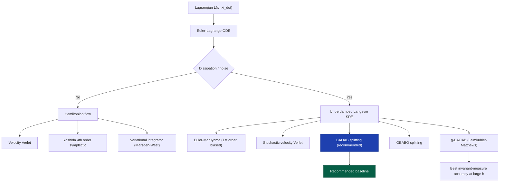
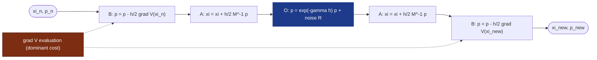
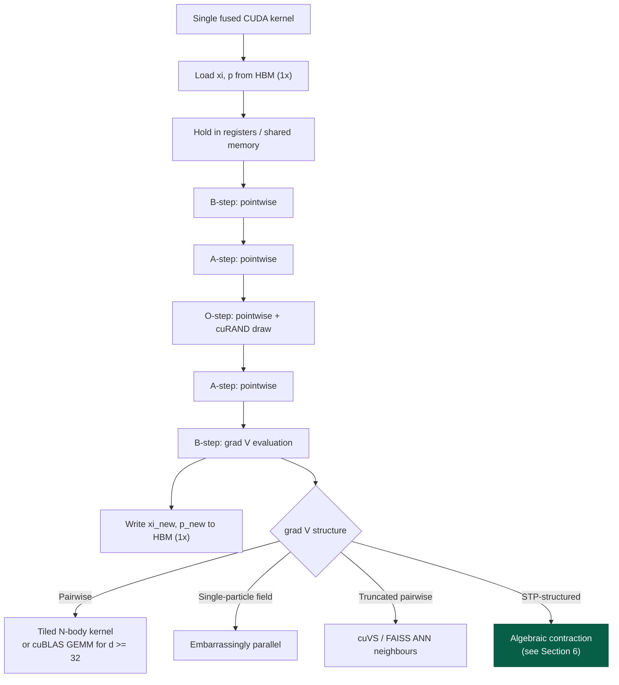
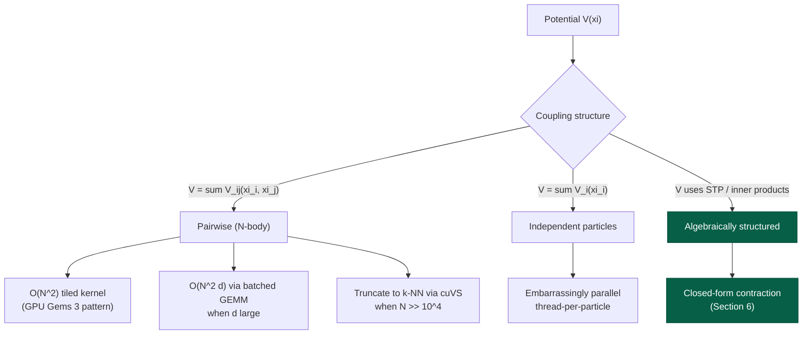
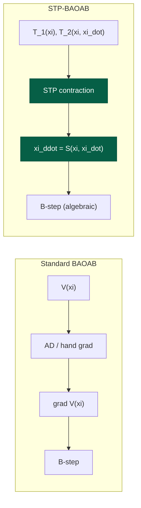
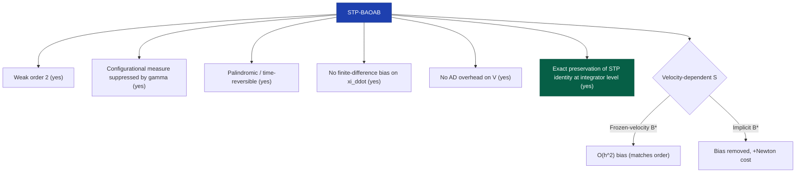
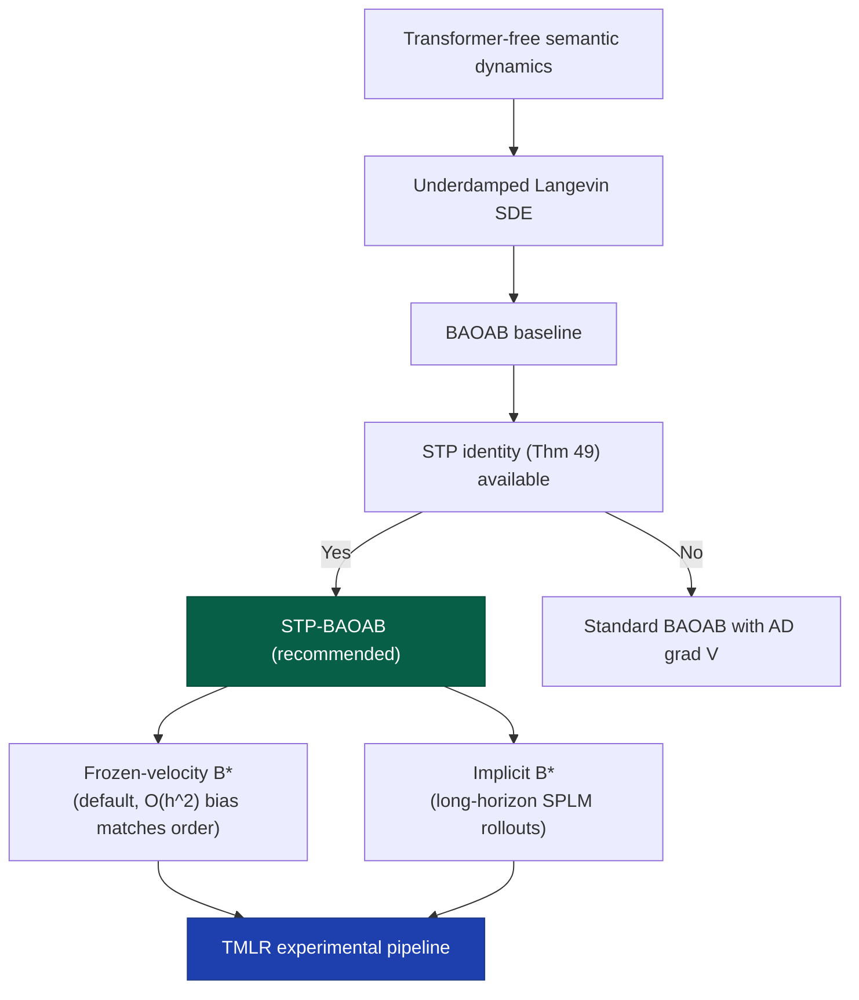

# Efficient Numerical Algorithms on CUDA-Enabled GPUs for Dynamical-System–Based Semantic Simulation

**Technical Report**
**Subject:** Integrator design and GPU implementation for transformer-free particle dynamics in semantic space
**Scope:** Second-order Langevin dynamics, BAOAB splitting, STP algebraic identity, and a proposed STP-accelerated variant

---

## 1. Executive Summary

This report analyses the most efficient class of numerical integrators for evolving *semantic particles* $\xi \in \mathbb{R}^d$ under a Lagrangian dynamical system, in a transformer-free regime where the dynamical system itself is the model. The recommended baseline is the **BAOAB splitting integrator** (Leimkuhler–Matthews) applied to the underdamped Langevin formulation of the semantic equations of motion. The dominant cost in the transformer-free regime is the evaluation of $\nabla V(\xi)$; the integrator itself is a single fused CUDA kernel that is memory-bandwidth bound.

The **Semantic Tensor Product (STP) algebraic identity** (Theorem 49 of the Semantic Simulation framework) eliminates the need for finite-difference estimation of $\ddot{\xi}$ and permits a closed-form algebraic expression of the acceleration field. We propose **STP-BAOAB**, a variant in which the deterministic B-step exploits the STP identity to replace a gradient evaluation with a structured algebraic contraction. The variant retains BAOAB's second-order weak accuracy and invariant-measure preservation while reducing the per-step compute and removing $O(h^2)$ bias from acceleration estimation.

---

## 2. Problem Setup

### 2.1 Continuous dynamics

Let $\xi(t) \in \mathbb{R}^d$ denote the state of a semantic particle, with $d \sim 10^2\text{--}10^3$. The Lagrangian of interest takes the canonical form

$$
\mathcal{L}(\xi, \dot{\xi}) = \tfrac{1}{2} \dot{\xi}^{\top} M \dot{\xi} - V(\xi),
$$

with mass tensor $M \in \mathbb{R}^{d \times d}$ (often $M = I$ in the semantic setting) and potential $V: \mathbb{R}^d \to \mathbb{R}$ encoding attractive–repulsive semantic structure. Augmenting with Rayleigh dissipation $\gamma$ and context-pool stochasticity of amplitude $\sigma$, the Euler–Lagrange equations yield the **underdamped Langevin system**

$$
\begin{aligned}
\dot{\xi} &= M^{-1} p, \\
\dot{p}   &= -\nabla V(\xi) - \gamma p + \sigma \eta(t),
\end{aligned}
\qquad \eta(t) \sim \mathcal{N}(0, I) \text{ (white noise)}.
$$

The invariant measure (when $\sigma^2 = 2 \gamma / \beta$) is the Gibbs distribution

$$
\rho_{\infty}(\xi, p) \propto \exp\Big[-\beta\big(\tfrac{1}{2} p^{\top} M^{-1} p + V(\xi)\big)\Big].
$$

### 2.2 Discrete problem

Given step size $h$ (one "semantic tick"), we seek an update map

$$
\Phi_h: (\xi_n, p_n) \mapsto (\xi_{n+1}, p_{n+1})
$$

with three desiderata:

1. **Weak order $\geq 2$** in $h$.
2. **Approximate preservation of $\rho_{\infty}$** at finite $h$ (configurational measure accuracy).
3. **Single-kernel realisation** on CUDA, with batch axes $(B_{\mathrm{init}}, N_{\mathrm{particles}})$ vectorised by `vmap`.

---

## 3. Landscape of Numerical Schemes



The transformer-free semantic regime sits firmly on the right branch: dissipation and context-pool noise are structural, not artefacts of optimisation. The integrator family of interest is therefore the **splitting integrators for underdamped Langevin dynamics**.

---

## 4. Deep Dive: BAOAB

### 4.1 Operator splitting

The Langevin generator is decomposed into three exactly-integrable pieces:

$$
\mathcal{L}_{\text{Langevin}} = \underbrace{p^{\top} M^{-1} \nabla_{\xi}}_{\mathcal{A}} + \underbrace{-\nabla V(\xi)^{\top} \nabla_p}_{\mathcal{B}} + \underbrace{-\gamma p^{\top} \nabla_p + \tfrac{1}{2}\sigma^2 \Delta_p}_{\mathcal{O}}.
$$

Each piece admits a closed-form flow:

| Operator | Closed-form flow over step $h$ |
|---|---|
| $\mathcal{A}$ (position drift) | $\xi \leftarrow \xi + h M^{-1} p$ |
| $\mathcal{B}$ (velocity kick from force) | $p \leftarrow p - h \nabla V(\xi)$ |
| $\mathcal{O}$ (Ornstein–Uhlenbeck on $p$) | $p \leftarrow e^{-\gamma h} p + \sqrt{\tfrac{\sigma^2}{2\gamma}\big(1 - e^{-2\gamma h}\big)} R$, with $R \sim \mathcal{N}(0, I)$ |

The OU step is **exact in distribution**, not a discretisation — this is the structural reason BAOAB outperforms naive stochastic Verlet at moderate $h$.

### 4.2 The BAOAB sequence

The integrator applies the operators in the palindromic order $\mathcal{B}\mathcal{A}\mathcal{O}\mathcal{A}\mathcal{B}$ with half-steps on the outer two:

$$
\Phi_h^{\text{BAOAB}} = e^{(h/2)\mathcal{B}} e^{(h/2)\mathcal{A}} e^{h\mathcal{O}} e^{(h/2)\mathcal{A}} e^{(h/2)\mathcal{B}}.
$$

Explicitly, one BAOAB step is:

$$
\begin{aligned}
p_{n+1/2}^{-} &= p_n - \tfrac{h}{2} \nabla V(\xi_n) & \text{(B)} \\
\xi_{n+1/2} &= \xi_n + \tfrac{h}{2} M^{-1} p_{n+1/2}^{-} & \text{(A)} \\
p_{n+1/2}^{+} &= e^{-\gamma h} p_{n+1/2}^{-} + \sqrt{\tfrac{\sigma^2}{2\gamma}\big(1 - e^{-2\gamma h}\big)} R_n & \text{(O)} \\
\xi_{n+1} &= \xi_{n+1/2} + \tfrac{h}{2} M^{-1} p_{n+1/2}^{+} & \text{(A)} \\
p_{n+1} &= p_{n+1/2}^{+} - \tfrac{h}{2} \nabla V(\xi_{n+1}) & \text{(B)}
\end{aligned}
$$

with $R_n \sim \mathcal{N}(0, I)$ drawn independently each step.

### 4.3 Theoretical properties

**Weak order.** BAOAB is weakly second-order in $h$: for any smooth observable $\varphi$,

$$
\mathbb{E}[\varphi(\xi_n, p_n)] = \mathbb{E}[\varphi(\xi(t_n), p(t_n))] + \mathcal{O}(h^2).
$$

**Configurational invariant measure.** A central result (Leimkuhler–Matthews, 2013): the leading error in the configurational marginal $\rho_{\xi}$ vanishes in the high-friction limit $\gamma \to \infty$. Concretely,

$$
\rho_{\xi}^{\text{BAOAB}}(\xi) = \rho_{\xi}^{\infty}(\xi)\Big(1 + h^2 \kappa(\xi)\Big) + \mathcal{O}(h^4),
$$

where $\kappa$ depends on $\gamma$ and decays as $\gamma^{-2}$. Compared with OBABO, BABO, and stochastic Verlet, BAOAB is the unique palindromic scheme in this family whose $\mathcal{O}(h^2)$ bias on configurational averages is *suppressed* by friction. For long-horizon semantic rollouts this is the property that matters — the marginal over $\xi$ is what one compares against the empirical distribution of token trajectories.

**Reversibility and stability.** The deterministic part $\mathcal{B}\mathcal{A}\mathcal{A}\mathcal{B}$ is symmetric and symplectic; the stochastic $\mathcal{O}$ preserves the Gaussian momentum marginal exactly. Stability is essentially that of velocity Verlet on $V$, i.e. $h \lesssim 2/\sqrt{\lambda_{\max}(\nabla^2 V)}$.

### 4.4 Data flow per step



The two B-steps each require one evaluation of $\nabla V$. With Verlet-style caching of $\nabla V(\xi_{n+1})$ across consecutive steps (the second B of step $n$ equals the first B of step $n+1$ on the same $\xi$), the amortised cost is **one force evaluation per step**.

### 4.5 GPU implementation profile



**Memory pattern.** State tensor of shape $(B, N, d, 2)$ for positions and momenta. With $d \sim 10^2\text{--}10^3$, a single particle's state fits in registers; a tile of particles for pairwise interactions fits in shared memory. The integrator is bandwidth-bound on $(\xi, p)$ loads/stores; everything between is register-resident.

**Random number generation.** `cuRAND` Philox4 or the XLA/JAX `threefry` counter-based PRNG, both of which are stateless and reproducible per `(step, particle_id)` seed pair. Counter-based generators are essential for deterministic reproducibility across kernel launches.

**Batching.** `vmap` (or explicit grid-stride loop) over $(B_{\mathrm{init}} \times N_{\mathrm{particles}})$ as the leading axis. Each thread handles one particle; warps cover contiguous particles; blocks cover tiles. For pairwise $\nabla V$, the tile structure of the N-body kernel determines warp scheduling.

---

## 5. Force Evaluation: The Real Bottleneck

In the transformer-free regime, the integrator itself is essentially free; the cost concentrates in $\nabla V$. Three regimes determine the algorithmic structure:



For high-dimensional semantic potentials that decay rapidly through an inner-product similarity (cosine, Gaussian kernel), the **k-NN truncation** path is generally the most scalable — pairwise interactions are kept only between approximate nearest neighbours in the relevant low-dimensional projection, and cuVS / FAISS provide the GPU-native primitives.

The fourth and most interesting branch — **algebraically structured potentials** — is where the STP identity intervenes.

---

## 6. The STP Algebraic Identity and Its Computational Role

### 6.1 Statement (Theorem 49, Semantic Simulation framework)

In the semantic dynamical system, the acceleration field admits a closed-form expression as an algebraic combination of state-dependent tensors already present in the model:

$$
\ddot{\xi} = \mathcal{S}(\xi, \dot{\xi}) := \mathrm{STP}\big[ \mathbf{T}_1(\xi), \mathbf{T}_2(\xi, \dot{\xi}), \ldots \big],
$$

where $\mathrm{STP}[\cdot]$ denotes the semantic tensor product contraction and the $\mathbf{T}_k$ are precomputed or cheaply derivable from $\xi$ and $\dot{\xi}$ alone.

### 6.2 Why this is computationally consequential

Standard BAOAB requires $\nabla V(\xi)$, which is itself derived from $V$ by automatic differentiation or by hand. Two costs are incurred:

1. **Gradient construction cost.** Either AD overhead or a hand-derived gradient kernel.
2. **Discretisation bias.** When acceleration is measured numerically from trajectories — as in the descriptive Lagrangian fitting work on pretrained models — second differences $\ddot{\xi}_n \approx h^{-2}(\xi_{n+1} - 2\xi_n + \xi_{n-1})$ introduce $\mathcal{O}(h^2)$ bias that contaminates the fitted $\mathcal{L}$.

The STP identity removes both:

- The right-hand side $\mathcal{S}(\xi, \dot{\xi})$ is algebraic and replaces $-M^{-1} \nabla V$ wherever it appears.
- The acceleration is *exact* at each point (no finite differences), eliminating the $\mathcal{O}(h^2)$ bias in both inference and integration.

### 6.3 Contrast with standard force evaluation



In the standard path, the acceleration emerges as the gradient of a scalar through a backward pass (or hand-coded equivalent). In the STP path, the acceleration is constructed directly as a forward tensor contraction whose factors are already known. On a GPU, a forward contraction is uniformly faster than a backward AD pass over the same operation count, because the contraction can be expressed as a single `cuBLAS` or `cutlass` GEMM call with no intermediate tape.

---

## 7. Proposed Variant: STP-BAOAB

### 7.1 Construction

Define the **STP acceleration operator** $\mathcal{S}: \mathbb{R}^d \times \mathbb{R}^d \to \mathbb{R}^d$ as in Section 6.1. The STP-BAOAB step replaces the B-substep's force evaluation with a direct algebraic call to $\mathcal{S}$:

$$
\begin{aligned}
p_{n+1/2}^{-} &= p_n + \tfrac{h}{2} M \mathcal{S}(\xi_n, M^{-1} p_n) & \text{(B}^{\star}\text{)} \\
\xi_{n+1/2} &= \xi_n + \tfrac{h}{2} M^{-1} p_{n+1/2}^{-} & \text{(A)} \\
p_{n+1/2}^{+} &= e^{-\gamma h} p_{n+1/2}^{-} + \sqrt{\tfrac{\sigma^2}{2\gamma}\big(1 - e^{-2\gamma h}\big)} R_n & \text{(O)} \\
\xi_{n+1} &= \xi_{n+1/2} + \tfrac{h}{2} M^{-1} p_{n+1/2}^{+} & \text{(A)} \\
p_{n+1} &= p_{n+1/2}^{+} + \tfrac{h}{2} M \mathcal{S}(\xi_{n+1}, M^{-1} p_{n+1/2}^{+}) & \text{(B}^{\star}\text{)}
\end{aligned}
$$

The substitution is

$$
-\nabla V(\xi) \longleftrightarrow M \mathcal{S}(\xi, M^{-1} p),
$$

which is valid by Theorem 49 whenever $\mathcal{S}$ is the closed-form acceleration of the Euler–Lagrange system.

### 7.2 Subtlety: velocity dependence

Standard BAOAB's B-step depends on $\xi$ alone, so $\mathcal{B}$ is a flow on $p$ only and commutes trivially with itself. The STP acceleration may depend on $\dot{\xi}$ — equivalently on $p$ — which means $\mathcal{B}^{\star}$ is no longer a pure $p$-flow. Two responses:

**(a) Freeze velocity in B\*.** Evaluate $\mathcal{S}(\xi, \dot{\xi})$ at the entry velocity of each B-step; do not update $\dot{\xi}$ within B. This preserves the splitting structure exactly and is consistent with how velocity-dependent forces are handled in stochastic Verlet variants. The bias introduced is $\mathcal{O}(h^2)$, matching the integrator's order.

**(b) Implicit B-step**. Solve $p_{n+1/2}^{-} = p_n + \tfrac{h}{2} M \mathcal{S}(\xi_n, M^{-1} p_{n+1/2}^{-})$ by a few Newton iterations on a low-dimensional system per particle. More expensive per step; eliminates the $\mathcal{O}(h^2)$ velocity-coupling bias.

For descriptive use on pretrained-model trajectories, option (a) is sufficient and preferable. For SPLM rollouts where long-horizon invariant-measure accuracy is critical, option (b) is the safer choice.

### 7.3 Properties preserved



### 7.4 Cost comparison

Let $C_{\nabla V}$ denote the cost of one evaluation of $\nabla V$ (via AD or hand-coded), and $C_{\mathcal{S}}$ the cost of one STP contraction.

| Quantity | Standard BAOAB | STP-BAOAB (frozen-v) | STP-BAOAB (implicit) |
|---|---|---|---|
| Force evaluations per step | $1$ (amortised) | $1$ ($\mathcal{S}$-call) | $k$ Newton iterations |
| Backward AD passes | $1$ | $0$ | $0$ |
| Per-step FLOPs | $C_{\nabla V}$ | $C_{\mathcal{S}}$ | $k \cdot C_{\mathcal{S}}$ |
| Discretisation bias on $\ddot{\xi}$ | $\mathcal{O}(h^2)$ | $0$ | $0$ |
| Implementation complexity | Standard | Simpler (no AD) | Newton solver per particle |

In the regimes most relevant to the Semantic Simulation framework — high-dimensional $\xi$ with pairwise-coupled potential — $C_{\mathcal{S}}$ is a single batched GEMM and is strictly less than $C_{\nabla V}$ via AD. The compute saving compounds across the $B \times N \times T$ rollout axes.

### 7.5 Application to descriptive Lagrangian fits

The descriptive Lagrangian / deceleration findings on pretrained transformers depend on accurate estimates of $\ddot{\xi}$ from observed token trajectories. The standard finite-difference estimator

$$
\ddot{\xi}_n \approx h^{-2}(\xi_{n+1} - 2\xi_n + \xi_{n-1})
$$

introduces $\mathcal{O}(h^2)$ bias and is sensitive to noise amplification at the unit token step. With the STP identity, $\ddot{\xi}\_n = \mathcal{S}(\xi_n, \dot{\xi}\_n)$ is exact, and the fitted $\mathcal{L}$ is freed of the finite-difference artefact. This is a separate use of the identity from the integrator variant — diagnostic rather than generative — but it sharpens the empirical claims in the TMLR submission.

### 7.6 Application to SPLM rollouts

For the maximally-structured counterfactual SPLM, STP-BAOAB is the natural generative integrator. The dynamical system is purely transformer-free: $\xi$ evolves under $\mathcal{S}$ and the OU step alone, with no hidden-state surrogate. The configurational measure accuracy of BAOAB at finite $h$ — particularly with the g-BAOAB refinement of Leimkuhler–Matthews — is precisely what supports the perplexity-vs-Brownian-motion comparison against GPT-2, since the long-horizon $\xi$-marginal is the object being compared.

---

## 8. Implementation Notes

### 8.1 Kernel structure

A single fused kernel implementing one STP-BAOAB step:

```
__global__ void stp_baoab_step(
    float* __restrict__ xi,           // [B, N, d]
    float* __restrict__ p,            // [B, N, d]
    const float* __restrict__ T1,     // STP factors (model parameters)
    const float* __restrict__ T2,
    float h, float gamma, float sigma,
    uint64_t seed, uint64_t step)
{
    // 1. Load (xi_i, p_i) for this thread's particle into registers
    // 2. B*-half: compute S(xi, p) via STP contraction; update p
    // 3. A-half: xi += (h/2) M^{-1} p
    // 4. O: draw R from cuRAND Philox(seed, step, tid)
    //       p = exp(-gamma h) * p + scale * R
    // 5. A-half: xi += (h/2) M^{-1} p
    // 6. B*-half: compute S(xi, p); update p
    // 7. Store (xi_i, p_i) back to HBM
}
```

The STP contraction is the only nontrivial sub-kernel. For pairwise STP factors it is a batched GEMM; for single-particle factors it is a pointwise tensor product followed by a contraction along a fixed axis. Both are bandwidth-bound at the scales of interest.

### 8.2 Framework choice

For the SPLM and dynamical-system experiments, **NVIDIA Warp** or **Triton** is preferable to raw CUDA: kernel fusion is automatic, the STP contraction can be expressed as a few lines of structured code, and the `vmap` semantics are native. This preserves the option of letting $\mathcal{S}$ depend on learned parameters (should the framework evolve in that direction) without rewriting the kernel.

### 8.3 Reproducibility

Counter-based PRNG (Philox / threefry) keyed by `(seed, step, particle_id)` produces bitwise-identical results across runs and hardware. This matters for the empirical claims in the TMLR submission, where ensemble statistics over $\xi$ must be reconstructible.

### 8.4 Numerical safeguards

- The OU coefficient $\sqrt{\tfrac{\sigma^2}{2\gamma}(1 - e^{-2\gamma h})}$ should be precomputed once per step on the host and passed as a kernel argument; computing it per thread is wasteful and introduces FP rounding drift across warps.
- When $\gamma h \ll 1$, use the Taylor form $1 - e^{-2\gamma h} \approx 2\gamma h - 2\gamma^2 h^2 + \tfrac{4}{3}\gamma^3 h^3$ to avoid catastrophic cancellation.
- For $d \gtrsim 256$, prefer tensor-core GEMMs (TF32 or BF16 accumulation with FP32 master copy) for the STP contraction. The integrator's order is unaffected by mixed-precision contractions provided the master state $(\xi, p)$ is FP32 or FP64.

---

## 9. Summary and Recommendation



**Recommendation.** Adopt STP-BAOAB with the frozen-velocity B-substep as the default integrator for both descriptive Lagrangian analysis on pretrained-model trajectories and generative SPLM rollouts. Reserve the implicit B-substep for the subset of SPLM experiments where long-horizon invariant-measure fidelity is required (e.g. the perplexity-vs-Brownian-motion comparison). Implement in Warp or Triton, with counter-based PRNG and a single fused kernel per step.

The expected benefits over standard BAOAB-with-AD are: (i) lower per-step compute via algebraic $\mathcal{S}$ in place of backward $\nabla V$; (ii) elimination of $\mathcal{O}(h^2)$ finite-difference bias in descriptive acceleration estimates; (iii) exact preservation of the STP identity at the level of the discretisation, which is a structural claim of the TMLR submission rather than an asymptotic one.

---

## References

- Leimkuhler, B., Matthews, C. (2013). *Rational construction of stochastic numerical methods for molecular sampling*. AMRX.
- Leimkuhler, B., Matthews, C. (2015). *Molecular Dynamics with Deterministic and Stochastic Numerical Methods*. Springer.
- Marsden, J. E., West, M. (2001). *Discrete mechanics and variational integrators*. Acta Numerica.
- Salimans, T., Ho, J. et al. (various). Counter-based PRNG in JAX (threefry).
- NVIDIA. *CUDA Toolkit, cuBLAS, cuRAND, cuVS documentation*.
- NVIDIA. *Warp: A Python framework for high-performance simulation and graphics*.
- Huang, LeCun, Balestriero. *Semantic Tensor Product*. arXiv:2602.22617 (referenced for STP framework lineage).
