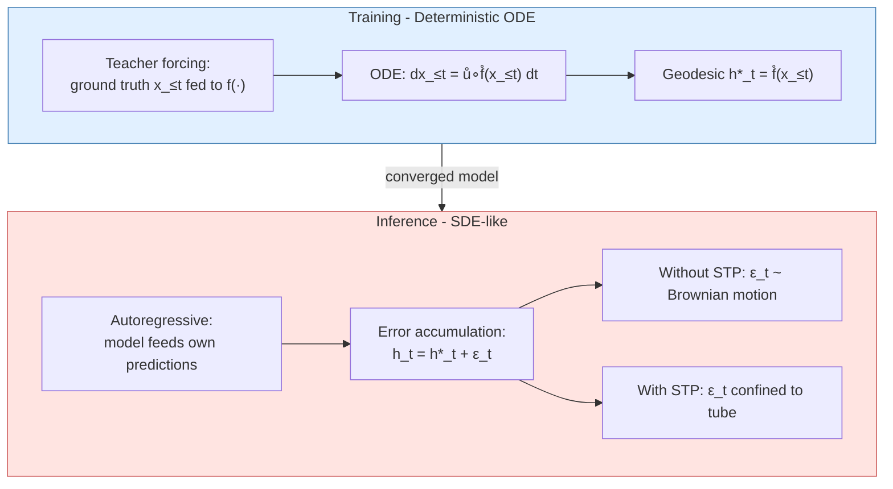
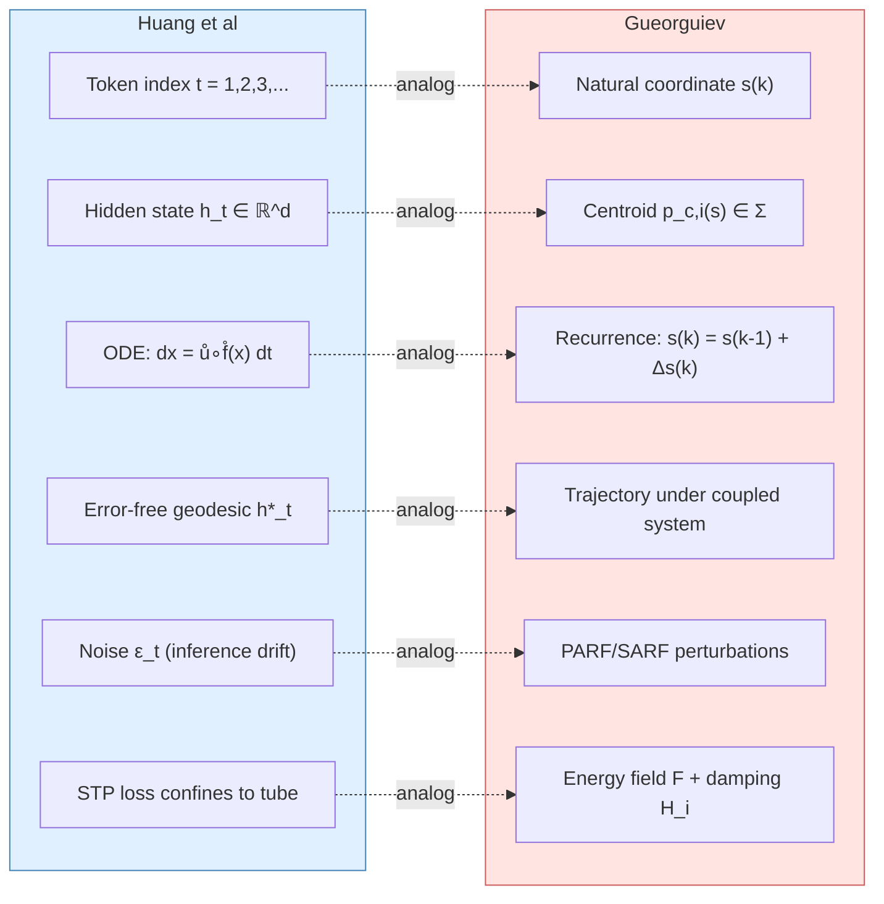
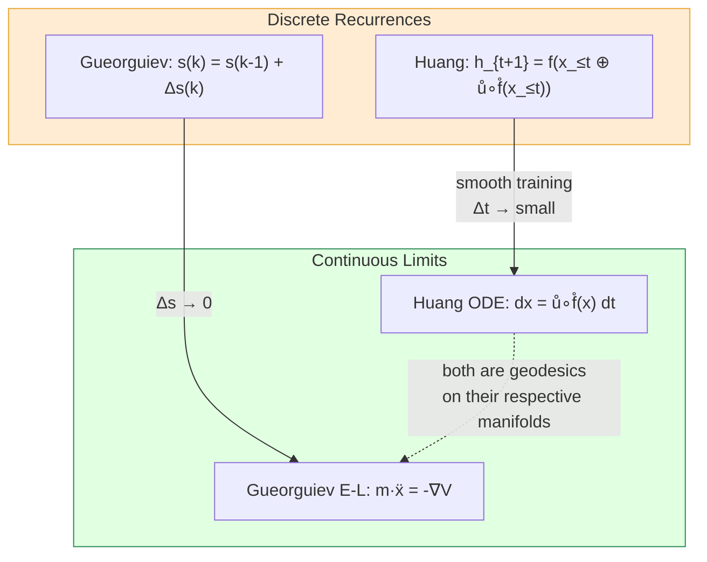

# Equivalence between the Evolution of Hidden States and the Evolution of Semantic Structures

**An ongoing discussion — D. Gueorguiev (framework) with AI assistant, April 2026**

---

## 1. Motivation

The Semantic Tube Prediction (STP) framework by Huang, LeCun, and Balestriero [1] models the evolution of hidden states $h_t$ inside a transformer-based LLM as trajectories on a smooth semantic manifold. The Semantic Simulation framework by Gueorguiev [2][3][4][5] models the evolution of semantic structures — collections of semantic particles — as trajectories in a continuous metric Semantic Space $\Sigma$ governed by conservation laws and a Lagrangian [6].

Despite the fact that the former is a **discrete process** (one step per token) while the latter is a **continuous process** in time, both frameworks describe constrained trajectories in a continuous representation space governed by differential equations. The question is:

> **Can we establish a formal mapping between the governing equations of hidden state evolution and the governing equations of semantic structure evolution?**

<!--  -->


**Figure 1**: The hierarchy of semantic space. Properties aggregate into Particles, which interact via SARF forces to form Structures. The semantic energy field $\mathfrak{F}$ permeates all levels.

---

## 2. The Transformer Architecture

The model discussed in Huang et al. [1] is a **decoder-only autoregressive transformer** with multi-head self-attention. Specifically, the paper runs experiments on:

- Llama-3.2-1B/3B/8B-Instruct
- Gemma-2-2b-it
- OpenELM-1.1B-Instruct
- OLMo-2-0425-1B-Instruct
- Qwen3-1.7B
- DeepSeek-R1-Distill-Qwen-1.5B

The hidden state $h_t = f(x_{\leq t}) \in \mathbb{R}^d$ is the output of the **last transformer layer** at position $t$, shaped by all attention layers processing the entire context $x_{\leq t}$. Each $h_t$ is then unembedded to predict the next token $x_{t+1}$.

The attention mechanism means $h_t$ is a **global** function of the entire prefix — not a local Markov update. This is architecturally significant for the mapping: in the Semantic Simulation framework, each property's trajectory likewise depends on the state of the *entire ensemble* (via the energy-weighted centroid $\vec{p}_E$ and the coupled system [3, eq. 8]).

---

## 3. Huang's Governing Equations for Hidden State Evolution

### 3.1 Training Dynamics (Deterministic ODE)

The evolution of token sequences is modeled as an ODE in token sequence space $\mathbb{R}^{T \times d_{model}}$ [1, Proposition 2.1]:

$$dx_{\leq t} = \mathring{u} \circ \mathring{f}(x_{\leq t}) \ dt$$

where $\mathring{f}$ is the converged transformer network and $\mathring{u}$ is the unembedding function. The hidden state trajectory is:

$$h_t^{\ast} = \mathring{f}(x_{\leq t})$$

This is the **error-free geodesic** — the trajectory hidden states would follow if the model were perfect.

### 3.2 Inference Dynamics (Stochastic, SDE-like)

At inference time, the model feeds its own (imperfect) predictions back as input, so errors accumulate. The actual hidden state deviates from the geodesic:

$$h_t = h_t^{\ast} + \epsilon_t$$

Without the STP loss, $\epsilon_t$ accumulates like Brownian motion, effectively turning the deterministic ODE into an SDE. The STP loss confines the trajectory to a tubular neighborhood of the geodesic, keeping $\epsilon_t$ small.



---

## 4. The STP Loss in Detail

### 4.1 Definition

Given three token indices $s < r < t$ (where $r$ is a random intermediate point), the STP loss measures how much the hidden state trajectory **fails to be locally linear**:

$$\mathcal{L}_{STP} = 1 - \cos(h_t - h_r, \ h_r - h_s)$$

where $\cos(\vec{a}, \vec{b}) = \frac{\vec{a} \cdot \vec{b}}{|\vec{a}||\vec{b}|}$.

| Value of $\mathcal{L}_{STP}$ | Geometric meaning |
|---|---|
| $0$ | Vectors $h_t - h_r$ and $h_r - h_s$ are perfectly parallel (geodesic) |
| $1$ | Vectors are perpendicular (random walk) |
| $2$ | Vectors point in opposite directions (trajectory reversal) |


**Figure 2**: The STP loss geometry. The signal component lies along the tube axis (geodesic direction); the noise component is perpendicular to it. The angle $\theta$ between consecutive difference vectors $h_r - h_s$ and $h_t - h_r$ determines the loss: $\mathcal{L}_{STP} = 0$ when parallel (geodesic), $1$ when perpendicular, $2$ when reversed.

### 4.2 Signal and Noise Decomposition

The vector $h_r - h_s$ is decomposed relative to the global direction $h_t - h_s$:

- **Signal**: $(h_r - h_s)_{\parallel h_t - h_s}$ — the component along the trajectory. Semantically meaningful.
- **Noise**: $(h_r - h_s)_{\perp h_t - h_s}$ — the component perpendicular to the trajectory. Erratic wandering.

Minimizing $\mathcal{L}_{STP}$ suppresses the noise component and amplifies the signal-to-noise ratio (SNR).

### 4.3 Geometric Picture

```
Perfect geodesic (L_STP = 0):

    h_s ---------> h_r ---------> h_t
        (same direction throughout)


Noisy trajectory (L_STP > 0):

    h_s -----> h_r
                    \
                     \----> h_t
        (direction changes at h_r)


Erratic trajectory (L_STP ≈ 2):

    h_s ---------> h_r <--------- h_t
        (trajectory reverses — Brownian-motion-like)
```

### 4.4 Training Integration

The total training loss is:

$$\mathcal{L} = \mathcal{L}_{NTP} + \lambda \cdot \mathcal{L}_{STP}$$

where $\mathcal{L}_{NTP}$ is the standard next-token prediction cross-entropy loss and $\lambda$ is a small hyperparameter ($\lambda = 0.02$ works well in practice [1]).

Key implementation details:
- Indices $s, r, t$ are chosen **randomly** during training (5 random triplets per batch)
- The hidden state $h$ is taken from the **last transformer layer**
- STP loss is used **only during training**, not at inference
- **No additional forward passes** needed — hidden states are already computed for NTP

### 4.5 Empirical Findings

| Condition | $\mathcal{L}_{STP}$ value | Interpretation |
|---|---|---|
| $\lambda = 0$ (no STP) | $\approx 1.4$ | Worse than random — trajectories actively reverse direction |
| $\lambda = 0.08$ | $\approx 0.6$ | Substantially smoother paths |
| $\lambda = 0.02$ (optimal) | Between 0.6 and 1.0 | Best accuracy–smoothness trade-off |

$\mathcal{L}_{NTP}$ alone **cannot** drive $\mathcal{L}_{STP}$ to zero. The NTP objective only needs the hidden state to land in the correct Voronoi cell for token prediction, without constraining *where within the cell* it lands. STP provides the missing geometric constraint.

With STP, the model matches full-dataset accuracy using only $\frac{1}{16}$ of the training data — directly violating Chinchilla-style scaling laws.

---

## 5. Mapping the Governing Equations


**Figure 3**: Detailed mapping between the two frameworks. Left: hidden state evolution with the semantic tube constraining the trajectory around the geodesic. Right: semantic structure evolution with properties traveling toward the energy-weighted centroid $\vec{p}_E$ under the Gaussian energy well. Dashed arrows indicate the conceptual analogs.

### 5.1 The Correspondence



The detailed mapping:

| Huang et al. (discrete steps, continuous space) | Gueorguiev (continuous time, continuous space) |
|---|---|
| Token index $t = 1, 2, 3, \ldots$ | Natural coordinate $s$ along travel path, or time $t_k$ |
| Hidden state $h_t = f(x_{\leq t}) \in \mathbb{R}^d$ | Property/particle centroid $\vec{p}_{c,i}(s) \in \Sigma$ |
| Error-free geodesic $h_t^{\ast}$ | Trajectory under the coupled system [3, eq. 8] with converged field $\mathfrak{F}$ |
| ODE: $dx_{\leq t} = \mathring{u} \circ \mathring{f}(x_{\leq t}) dt$ | Recurrence: $\vec{p}_{c,i}(k) = \vec{p}_{c,i}(k-1) + \Delta\vec{p}_i(k)$ |
| Noise $\epsilon_t$ (inference drift) | Perturbations from PARF/SARF forces and field fluctuations |
| STP loss (confines to tube) | Energy field $\mathfrak{F}$ + damping $H_i$ (confines to bound state) |
| $h_t$ depends on full prefix $x_{\leq t}$ (attention) | $\vec{p}_{c,i}$ depends on full ensemble (coupled system) |

### 5.2 Why the Discrete-vs-Continuous Gap is Bridgeable

Huang's ODE is itself an approximation of a discrete process. The transformer processes tokens one at a time, but Huang argues this can be modeled as an ODE because token embeddings live in a continuous vector space $\mathbb{R}^{d_{model}}$. The step from $h_t$ to $h_{t+1}$ is analogous to the step from $\vec{p}_{c,i}(k)$ to $\vec{p}_{c,i}(k+1)$ in the recurrence [3, eq. 2]:

$$s(k) = s(k-1) + \Delta s(k)$$

Both are **difference equations** that admit ODE approximations when the steps are small relative to the trajectory curvature:

- **Huang**: as the token-to-token changes become smooth (which training enforces), the discrete updates approach the ODE $dx = \mathring{u} \circ \mathring{f}(x) dt$
- **Gueorguiev**: as $\Delta s \to 0$, the recurrence becomes a continuous trajectory governed by the Euler-Lagrange equations from the Lagrangian [6]



### 5.3 The Crucial Difference in Force Laws

Both frameworks share the same mathematical skeleton, but differ fundamentally in how the trajectories are constrained:

| Aspect | Huang et al. | Gueorguiev |
|---|---|---|
| Acceleration | $\ddot{h}\_t \approx 0$ (locally linear — zero net force) | $\mathfrak{m}\_i \ddot{x}\_i = -2\mathfrak{m}\_i \upsilon^2 \kappa^2 x_i e^{-\kappa^2 x_i^2}$ (explicit restoring force) |
| Constraint origin | STP loss (externally imposed regularizer) | Gaussian well potential (derived from axioms) |
| What is derived | Linearity is *assumed* (Geodesic Hypothesis) | Linearity would *emerge* from the Lagrangian in flat-potential regions |
| Force law | Not specified — only the *consequence* (straightness) is enforced | Fully specified — field $\mathfrak{F}$, PARF [5], SARF [7] |
| Potential | Implicit (not derived) | Explicit: $V(x) = \mathfrak{m}_i \cdot \upsilon^2 \cdot (1 - e^{-\kappa^2 x^2})$ |


*Figure 4: The Property Lagrangian (left) provides an explicit potential energy well that governs trajectories. The Structure Lagrangian (right) generalizes this to multi-particle systems with SARF interaction terms. In Huang et al., the analogous potential is implicit in the trained transformer weights.*

### 5.4 The Deep Question

The STP loss enforces something analogous to what the energy field $\mathfrak{F}$ and the damping factor $H_i$ enforce naturally in the Semantic Simulation framework: **smooth, directed trajectories toward a target state**.

- In your framework, the trajectory is constrained to be smooth by the Gaussian well potential (restoring force toward bound state) and the damping factor $H_i$ ensures deceleration near equilibrium.
- In Huang's framework, the STP loss is an externally imposed regularizer that achieves a similar geometric effect — but without deriving it from an explicit potential or force law.

Your framework provides the **why** (energy minimization under a specific potential). Huang provides the **what** (enforce local linearity) without the underlying mechanics.

This suggests a fundamental question:

> **Could the STP loss be understood as an emergent property of an underlying Lagrangian with a Gaussian-well-type potential?** If the transformer's learned representation space implicitly defines an energy landscape similar to $\mathfrak{F}$, then the STP geodesic would be the natural trajectory through that landscape — and the Semantic Simulation framework would provide the theoretical underpinning for *why* the Geodesic Hypothesis works.

---

## References

[1] H. Huang, Y. LeCun, R. Balestriero, "Semantic Tube Prediction: Beating LLM Data Efficiency with JEPA," arXiv:2602.22617, 2026.

[2] D. Gueorguiev, "The Notion of Semantic Simulation," 2023/2024.

[3] D. Gueorguiev, "On the Need of Dynamic Simulation when Modeling Interactions of Semantic Structures," 2022.

[4] D. Gueorguiev, "On the Gaussian Inverse Semantic Energy Well," 2022.

[5] D. Gueorguiev, "Modeling Attractive and Repulsive Forces in Semantic Properties," 2022.

[6] D. Gueorguiev, "Constructing the Lagrangian for Semantic Space," 2026.

[7] D. Gueorguiev, "Modeling Attractive and Repulsive Forces between Semantic Structures," 2022.
