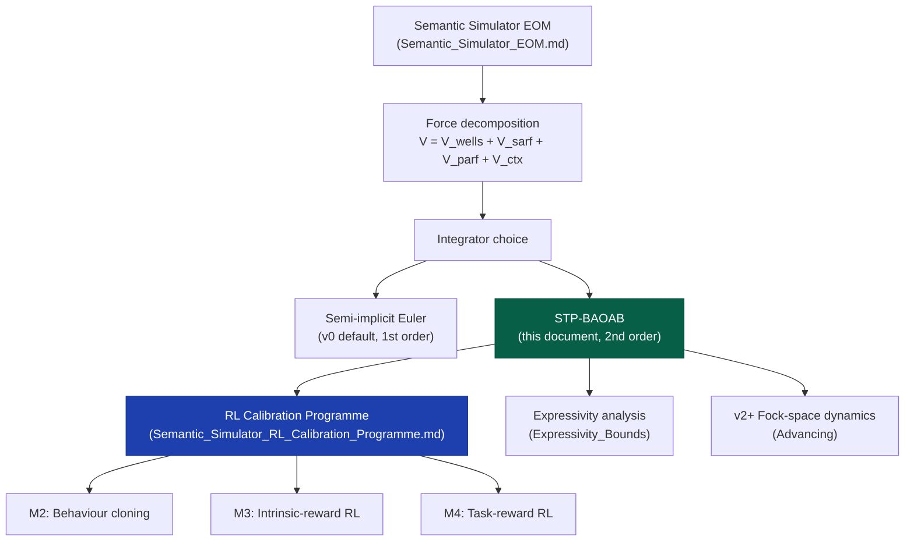
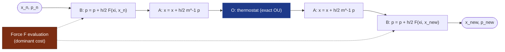
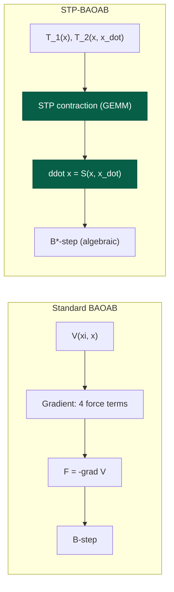
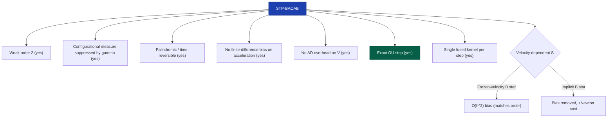
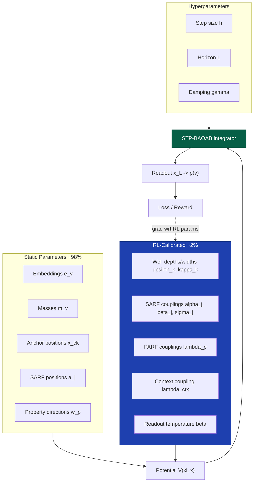
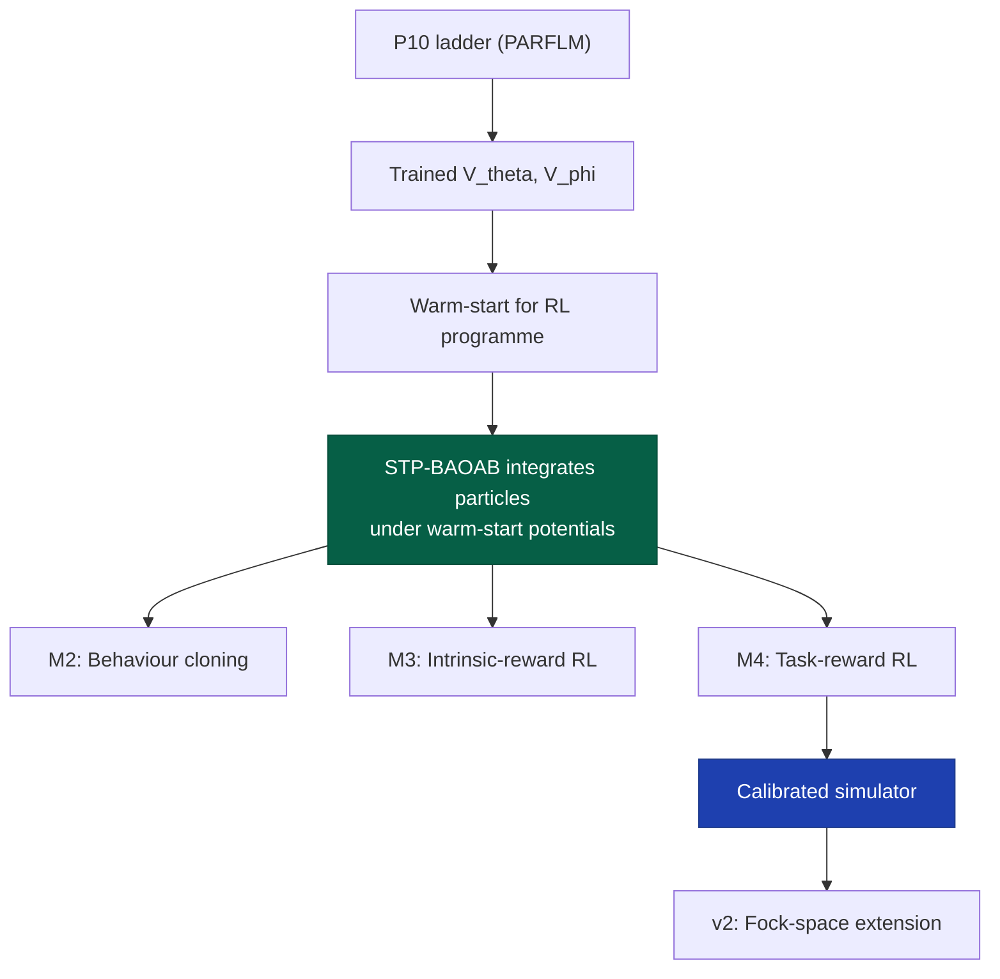
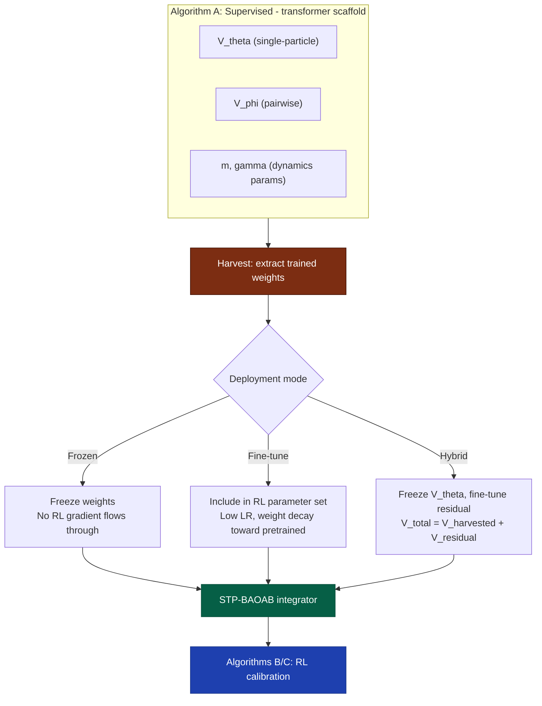

# Modified BAOAB with STP Identity: Detailed Analysis

**Technical Report**
**Subject:** Deep dive into the STP-BAOAB integrator as the computational backbone of the Dynamical-System–Based Semantic Simulator
**Scope:** Component-by-component analysis, EOM coupling, RL calibration integration, theoretical properties, trade-offs, and implementation strategy

Companion to:
- `Semantic_Simulator_EOM.md` — v0 Equations of Motion
- `Semantic_Simulator_RL_Calibration_Programme.md` — RL calibration programme memo
- `Efficient_Numerical_Algorithm_on_GPU_for_Dynamical_System_based_Models.md` — integrator design report
- `Expressivity_Bounds_For_v0_Simulator.md` — v0 expressivity ceiling
- `Advancing_The_Dynamic_Simulation_Model.md` — v0 through v3 staging

Last updated: 11 May 2026.

---

## 1. Introduction and Motivation

### 1.1 The problem

The Semantic Simulator (`Semantic_Simulator_EOM.md`) specifies a damped Euler-Lagrange flow on a finite-dimensional semantic space as its core dynamics. At each output position $t$, a particle $x_t$ is integrated for $L$ steps inside a context-conditioned potential $V(\xi_t, x)$, then read out into a token distribution. The EOM is

$$
\mathfrak{m}_t \ddot{x}_t = -\nabla_x V(\xi_t, x_t) - \gamma \dot{x}_t,
$$

where $\mathfrak{m}_t$ is the per-position semantic mass, $\gamma$ the damping coefficient, and $V = V_{\text{wells}} + V_{\text{SARF}} + V_{\text{PARF}} + V_{\text{ctx}}$ the composite potential with four named force terms.

The current v0 EOM specification (`Semantic_Simulator_EOM.md` §5) uses a **damped semi-implicit Euler** integrator — a first-order, non-symplectic scheme chosen because the SPLM attractor-extraction experiments (paper §14.15) showed that lower-order integrators produce richer content-bearing attractors than higher-order ones. This was the right prior for the descriptive SPLM programme, where the integrator is an approximation to a transformer's actual computation.

But the dynamical-system simulator is a different regime. Here the integrator **is the model**: there is no transformer underneath, no hidden-state surrogate. The quality of the integrator directly determines:

1. **Long-horizon faithfulness** — whether the simulator's equilibrium distribution matches the Gibbs measure of $V$, which is what the readout softmax samples from.
2. **Gradient quality** — whether backpropagation through $L$ integration steps produces useful gradients for the RL-calibrated parameters.
3. **Computational cost** — the per-step FLOP budget sets the wall-clock time of the RL calibration loop across $B \times N \times T$ rollout axes.
4. **Reproducibility** — whether the trajectory is deterministic given the parameters and the seed.

The STP-BAOAB integrator addresses all four by combining the BAOAB splitting scheme (Leimkuhler-Matthews 2013) — the gold-standard integrator for underdamped Langevin dynamics — with the Semantic Tensor Product (STP) algebraic identity (Theorem 49 of the framework), which replaces the gradient evaluation with a forward algebraic contraction.

### 1.2 Why BAOAB and not semi-implicit Euler

The argument for semi-implicit Euler in the descriptive SPLM setting was empirical: richer attractors at low integration order. But four structural differences distinguish the direct simulator:

| Criterion | Descriptive SPLM | Direct Simulator |
|-----------|-----------------|------------------|
| Integrator role | Approximation to transformer layers | **The model itself** |
| Invariant measure | Irrelevant (transformer defines the measure) | **Must match Gibbs** |
| Gradient through integrator | Not needed (descriptive) | **Critical** (RL calibration backprop) |
| Step count $L$ | 8-12 (transformer layers) | 8-100+ (variable horizon) |
| Stochasticity | None (deterministic descriptive fit) | **Structural** (context-pool noise) |

BAOAB is uniquely suited to the direct-simulator regime because of three properties that semi-implicit Euler lacks:

1. **Second-order weak accuracy.** For any smooth observable $\varphi$, $\mathbb{E}[\varphi(\xi_n)] = \mathbb{E}[\varphi(\xi(t_n))] + \mathcal{O}(h^2)$, versus $\mathcal{O}(h)$ for Euler.
2. **Configurational measure preservation.** The leading error in the $\xi$-marginal is suppressed by $\gamma^{-2}$ — the very damping that the EOM demands.
3. **Exact OU step.** The Ornstein-Uhlenbeck substep on momenta is exact in distribution, not a discretisation.

### 1.3 Where this document fits



---

## 2. The EOM in Langevin Form

### 2.1 From Euler-Lagrange to underdamped Langevin

The EOM specification (`Semantic_Simulator_EOM.md` §3-§5) gives the deterministic damped flow. For the direct simulator, we augment with context-pool stochasticity of amplitude $\sigma$, yielding the **underdamped Langevin system**:

$$
\begin{aligned}
\dot{x} &= \mathfrak{m}^{-1} p, \\
\dot{p} &= -\nabla_x V(\xi, x) - \gamma p + \sigma \eta(t),
\end{aligned}
\qquad \eta(t) \sim \mathcal{N}(0, I).
$$

The momentum $p = \mathfrak{m} \dot{x}$ and the fluctuation-dissipation relation $\sigma^2 = 2\gamma / \beta$ ensures the invariant measure is the Gibbs distribution

$$
\rho_\infty(x, p) \propto \exp\Big[-\beta\big(\tfrac{1}{2} p^\top \mathfrak{m}^{-1} p + V(\xi, x)\big)\Big],
$$

where $\beta$ is the readout inverse temperature from `Semantic_Simulator_EOM.md` §6. The readout softmax $p(v \mid x_L) \propto \exp(\beta \langle e_v, x_L \rangle)$ samples from this Gibbs measure — the integrator's job is to deliver a state $x_L$ whose distribution matches it.

### 2.2 The four force terms in momentum form

Each potential term from `Semantic_Simulator_EOM.md` §4 contributes to the total force $F = -\nabla_x V$. In the BAOAB framework, the force appears in the **B-step** (velocity kick). The four terms are:

**Wells force** (§4.1): Gaussian attractors at concept anchors:

$$
F_{\text{wells}}(x) = -\sum_{k=1}^{K} 2\mathfrak{m}_k \upsilon_k^2 \kappa_k^2 (x - x_{c,k}) e^{-\kappa_k^2 \lVert x - x_{c,k} \rVert^2}.
$$

**SARF force** (§4.2): anisotropic attractor-repellor field:

$$
F_{\text{SARF}}(x) = 2\sum_{j=1}^{N_S} \alpha_j (x - a_j) \Big[ \frac{\beta_j}{\sigma_{j,-}^2} e^{-\lVert x - a_j \rVert^2 / \sigma_{j,-}^2} - \frac{1}{\sigma_{j,+}^2} e^{-\lVert x - a_j \rVert^2 / \sigma_{j,+}^2} \Big].
$$

**PARF force** (§4.3): property-conditioned linear force:

$$
F_{\text{PARF}}(\xi, x) = -\sum_{p=1}^{P} \lambda_p c_p(\xi) w_p, \quad c_p(\xi) = \langle w_p, \xi \rangle.
$$

**Context force** (§4.4): harmonic coupling to cumulative context:

$$
F_{\text{ctx}}(\xi, x) = -\lambda_{\text{ctx}} (x - \xi).
$$

The **composite force** is $F(\xi, x) = F_{\text{wells}} + F_{\text{SARF}} + F_{\text{PARF}} + F_{\text{ctx}}$. All four gradients are in closed form — no autograd is needed at the forward-pass level.

### 2.3 Per-step cost analysis

| Force term | Parameters | Cost per step | Static / RL |
|-----------|-----------|--------------|-------------|
| $F_{\text{wells}}$ | $K$ anchors | $O(K \cdot d)$ | anchors static; $\upsilon_k, \kappa_k$ RL |
| $F_{\text{SARF}}$ | $N_S$ anchors | $O(N_S \cdot d)$ | positions static; $\alpha_j, \beta_j, \sigma_{j,\pm}$ RL |
| $F_{\text{PARF}}$ | $P$ properties | $O(P \cdot d)$ | directions static; $\lambda_p$ RL |
| $F_{\text{ctx}}$ | 1 scalar | $O(d)$ | $\lambda_{\text{ctx}}$ RL |
| **Total** | | $O((K + N_S + P) \cdot d)$ | ~98% static, ~2% RL |

At toy scale ($K=32, N_S=16, P=5, d=64$): ~3400 FLOPs per force evaluation. The force evaluation is the **dominant cost** — the integrator arithmetic (additions, scalar multiplications, one random draw) is negligible.

---

## 3. The BAOAB Splitting: Component-by-Component

### 3.1 Operator decomposition

The Langevin generator decomposes into three exactly-integrable pieces:

$$
\mathcal{L}_{\text{Langevin}} = \underbrace{p^\top \mathfrak{m}^{-1} \nabla_x}_{\mathcal{A}} + \underbrace{F(x)^\top \nabla_p}_{\mathcal{B}} + \underbrace{-\gamma p^\top \nabla_p + \tfrac{1}{2}\sigma^2 \Delta_p}_{\mathcal{O}}.
$$

Each admits a closed-form flow over any time step $h$:

| Operator | Name | Closed-form flow |
|----------|------|-----------------|
| $\mathcal{A}$ | Position drift | $x \leftarrow x + h \mathfrak{m}^{-1} p$ |
| $\mathcal{B}$ | Velocity kick | $p \leftarrow p + h F(\xi, x)$ |
| $\mathcal{O}$ | OU thermostat | $p \leftarrow e^{-\gamma h} p + \sqrt{\frac{\sigma^2}{2\gamma}(1 - e^{-2\gamma h})} R$, $R \sim \mathcal{N}(0, I)$ |

The OU step is **exact in distribution** — not a discretisation. This is the structural reason BAOAB outperforms naive stochastic Verlet at moderate $h$.

### 3.2 The palindromic sequence

BAOAB applies the operators in the palindromic order $\mathcal{B}\mathcal{A}\mathcal{O}\mathcal{A}\mathcal{B}$ with half-steps on the outer two:

$$
\Phi_h^{\text{BAOAB}} = e^{(h/2)\mathcal{B}} e^{(h/2)\mathcal{A}} e^{h\mathcal{O}} e^{(h/2)\mathcal{A}} e^{(h/2)\mathcal{B}}.
$$

Explicitly, one BAOAB step for the semantic simulator is:

$$
\begin{aligned}
p^- &= p_n + \tfrac{h}{2} F(\xi_t, x_n) & \text{(B: half-kick)} \\
x_{1/2} &= x_n + \tfrac{h}{2} \mathfrak{m}_t^{-1} p^- & \text{(A: half-drift)} \\
p^+ &= e^{-\gamma h} p^- + \sqrt{\tfrac{\sigma^2}{2\gamma}(1 - e^{-2\gamma h})} R_n & \text{(O: thermostat)} \\
x_{n+1} &= x_{1/2} + \tfrac{h}{2} \mathfrak{m}_t^{-1} p^+ & \text{(A: half-drift)} \\
p_{n+1} &= p^+ + \tfrac{h}{2} F(\xi_t, x_{n+1}) & \text{(B: half-kick)}
\end{aligned}
$$

with $R_n \sim \mathcal{N}(0, I)$ drawn independently each step.

### 3.3 Step-by-step data flow



**Key observation:** the two B-steps each require one force evaluation. With Verlet-style caching ($F(x_{n+1})$ from step $n$'s second B becomes step $n+1$'s first B on the same $x$), the amortised cost is **one force evaluation per step**.

### 3.4 Connecting to the EOM pseudocode

The current `Semantic_Simulator_EOM.md` §8 pseudocode uses damped semi-implicit Euler:

```python
# Current v0 integrator (semi-implicit Euler)
for ell in range(L):
    F = force_wells(x, p) + force_sarf(x, p) + force_parf(x, xi, p) + force_ctx(x, xi, p)
    v = (1 - gamma * dt) * v + (dt / m_t) * F
    x = x + dt * v
```

The BAOAB replacement:

```python
# Proposed STP-BAOAB integrator
for ell in range(L):
    # B: half-kick
    F = composite_force(xi_t, x)
    p = p + (dt / 2) * F

    # A: half-drift
    x = x + (dt / 2) * (p / m_t)

    # O: exact OU thermostat
    R = rng.standard_normal(d)
    p = ou_decay * p + ou_noise_scale * R

    # A: half-drift
    x = x + (dt / 2) * (p / m_t)

    # B: half-kick (at new x)
    F = composite_force(xi_t, x)
    p = p + (dt / 2) * F
```

The structural change: momenta are explicit, the OU step handles damping and stochasticity in one exact operation, and the palindromic ordering gives second-order accuracy.

---

## 4. The STP Modification: Replacing Gradients with Algebra

### 4.1 The STP algebraic identity (Theorem 49)

The Semantic Tensor Product identity provides a closed-form expression for the acceleration field:

$$
\ddot{x} = \mathcal{S}(x, \dot{x}) := \mathrm{STP}\big[\mathbf{T}_1(x), \mathbf{T}_2(x, \dot{x}), \ldots\big],
$$

where the $\mathbf{T}_k$ are state-dependent tensors already present in the model. The substitution in the B-step is:

$$
F(\xi, x) = -\nabla_x V(\xi, x) \quad\longleftrightarrow\quad \mathfrak{m}_t \mathcal{S}(x, \mathfrak{m}_t^{-1} p).
$$

### 4.2 Why this matters for the simulator

Two distinct computational advantages:

**1. No backward AD pass.** Standard BAOAB requires $\nabla_x V$ at each B-step. For the composite potential, this means computing gradients of four terms — either by hand-coded gradient kernels or by AD. The STP identity replaces this with a single forward algebraic contraction (a batched GEMM on GPU). No AD tape, no backward pass.

**2. No finite-difference bias.** When fitting Lagrangians to observed trajectories (the descriptive use case), the standard finite-difference estimator $\ddot{x}_n \approx h^{-2}(x_{n+1} - 2x_n + x_{n-1})$ introduces $\mathcal{O}(h^2)$ bias. The STP identity gives exact acceleration at each point.

### 4.3 STP-BAOAB: the modified B-step

The STP-BAOAB integrator replaces each B-step with B*:

$$
\begin{aligned}
p^- &= p_n + \tfrac{h}{2} \mathfrak{m}_t \mathcal{S}(x_n, \mathfrak{m}_t^{-1} p_n) & \text{(B*: algebraic kick)} \\
x_{1/2} &= x_n + \tfrac{h}{2} \mathfrak{m}_t^{-1} p^- & \text{(A: half-drift)} \\
p^+ &= e^{-\gamma h} p^- + \sqrt{\tfrac{\sigma^2}{2\gamma}(1 - e^{-2\gamma h})} R_n & \text{(O: thermostat)} \\
x_{n+1} &= x_{1/2} + \tfrac{h}{2} \mathfrak{m}_t^{-1} p^+ & \text{(A: half-drift)} \\
p_{n+1} &= p^+ + \tfrac{h}{2} \mathfrak{m}_t \mathcal{S}(x_{n+1}, \mathfrak{m}_t^{-1} p^+) & \text{(B*: algebraic kick)}
\end{aligned}
$$

The **frozen-velocity variant** (default): evaluate $\mathcal{S}$ at the entry velocity of each B*-step without updating $\dot{x}$ within B*. This preserves the splitting structure and introduces $\mathcal{O}(h^2)$ bias, matching the integrator's order.

### 4.4 Contrast with standard force evaluation



### 4.5 Hybrid mode: partial STP coverage

Not all four potential terms may have a derived STP contraction at any given point in the programme. The architecture supports a **hybrid mode**: terms with a known STP identity use the algebraic path; the remainder fall back to the standard gradient. The `CompositeSTP` class in the implementation wraps both:

```python
class CompositeSTP(STPOperator):
    """Sum of STP operators: some algebraic, some gradient-fallback."""

    def acceleration(self, xi, xi_dot):
        acc = np.zeros_like(xi)
        for op in self.operators:
            acc += op.acceleration(xi, xi_dot)
        return acc
```

This means the STP modification can be adopted incrementally, term by term, as the algebraic identities are derived.

---

## 5. Theoretical Properties

### 5.1 Properties preserved by STP-BAOAB



### 5.2 Configurational measure accuracy and the role of damping

A central result (Leimkuhler-Matthews 2013): the leading error in the configurational marginal $\rho_x$ for BAOAB is

$$
\rho_x^{\text{BAOAB}}(x) = \rho_x^\infty(x)\Big(1 + h^2 \kappa(x)\Big) + \mathcal{O}(h^4),
$$

where $\kappa$ depends on $\gamma$ and decays as $\gamma^{-2}$. This means the very damping that the EOM demands — $\gamma > 0$ in the Euler-Lagrange equation — also **suppresses the integrator's measure error**. No other palindromic splitting scheme in this family has this property.

For the semantic simulator, this is structurally critical: the readout softmax $p(v \mid x_L) \propto \exp(\beta \langle e_v, x_L \rangle)$ is a sample from the Gibbs measure. If the integrator's equilibrium distribution deviates from Gibbs, the readout is systematically biased, and no amount of RL calibration can correct a measure-level error.

### 5.3 Connection to the v0 expressivity ceiling

The `Expressivity_Bounds_For_v0_Simulator.md` proves that the v0 simulator is at most a finite automaton, with the collapse depth

$$
D^\ast \le \frac{\dim M \cdot \log_2(L_M / \epsilon)}{\log_2 n} - \frac{L \cdot \dim M \cdot \gamma}{\ln 2 \cdot \log_2 n}.
$$

The damping rate $\gamma$ appears in both the expressivity bound (as information loss per step) and in BAOAB's measure accuracy (as error suppression). The integrator choice interacts with the expressivity theory through $\gamma$: a better integrator does not increase the expressivity class (still regular for v0), but it ensures the simulator operates at the **maximum fidelity** within that class — so the P10-ladder type experiments reach the true architectural ceiling rather than an integrator-induced floor.

### 5.4 Stability bound

BAOAB's stability condition is inherited from velocity Verlet on the deterministic part:

$$
h \lesssim \frac{2}{\sqrt{\lambda_{\max}(\nabla^2 V / \mathfrak{m})}}.
$$

For the simulator's potential, $\lambda_{\max}$ is dominated by the sharpest well ($\max_k \kappa_k^2 \mathfrak{m}_k \upsilon_k^2$) or the steepest SARF repulsive core ($\max_j \alpha_j \beta_j / \sigma_{j,-}^2$). At v0 toy scale with $\kappa_k \sim 2, \upsilon_k \sim 0.5, \mathfrak{m}_k \sim 5$: $\lambda_{\max} \sim 10$, giving $h_{\max} \sim 0.6$. The EOM default $\Delta t = 0.5$ is near this limit; BAOAB is more robust than semi-implicit Euler at this operating point.

---

## 6. Integration with the RL Calibration Programme

### 6.1 Parameter classification and gradient flow

The RL calibration programme (`Semantic_Simulator_RL_Calibration_Programme.md` §4) classifies parameters into three buckets. The integrator sits at the interface between all three:



The key architectural property: **gradients flow through the entire integration chain**. The BAOAB step is differentiable with respect to every RL-calibrated parameter because every operation — the force evaluation, the position/momentum updates, the OU coefficients — is a smooth function of the parameters. The STP modification preserves this: the algebraic contraction $\mathcal{S}$ is a differentiable function of the potential parameters.

### 6.2 M2: Behaviour cloning through STP-BAOAB

The behaviour cloning loss (`Semantic_Simulator_EOM.md` §9.1) is:

$$
\mathcal{L}_{\text{BC}} = \frac{1}{T} \sum_{t=0}^{T-1} \mathrm{KL}\big(p_{\text{corpus}}(\cdot \mid v_{0:t}) \| p_{\text{sim}}(\cdot \mid x_t^{(L)})\big).
$$

The gradient with respect to each RL parameter $\theta$ is:

$$
\nabla_\theta \mathcal{L}_{\text{BC}} = \frac{1}{T} \sum_t \nabla_\theta \log p_{\text{sim}}(v_{t+1} \mid x_t^{(L)}) \cdot \frac{\partial x_t^{(L)}}{\partial \theta}.
$$

The Jacobian $\partial x_t^{(L)} / \partial \theta$ requires differentiating through $L$ integration steps. For BAOAB, each step is a composition of linear operations (A-steps, O-step) and one nonlinear force evaluation (B-step). The chain rule accumulates across steps:

$$
\frac{\partial x_t^{(L)}}{\partial \theta} = \prod_{\ell=0}^{L-1} \frac{\partial \Phi_h^{(\ell)}}{\partial (x^{(\ell)}, p^{(\ell)})} \cdot \frac{\partial (x^{(0)}, p^{(0)})}{\partial \theta} + \sum_{\ell=0}^{L-1} \prod_{k=\ell+1}^{L-1} \frac{\partial \Phi_h^{(k)}}{\partial (x^{(k)}, p^{(k)})} \cdot \frac{\partial \Phi_h^{(\ell)}}{\partial \theta}.
$$

The STP modification makes the per-step Jacobian cheaper to compute: the algebraic contraction has a simpler derivative structure than a backward AD pass through the four-term potential.

### 6.3 M3: Intrinsic-reward RL and energy regularity

The intrinsic-reward terms from the programme memo (§9.2 of `Semantic_Simulator_EOM.md`) include:

**Energy regularity** $r_{\text{energy}}$: penalise violation of the energy balance $E^{(L)} - E^{(0)} + \gamma \int_0^L T d\ell$. BAOAB's second-order accuracy and measure preservation make this reward term more informative — with a first-order integrator, energy drift is dominated by integrator error, masking the physically meaningful energy balance.

**Trajectory predictability** $r_{\text{predict}}$: reward smooth flows (low variance of $\lVert x^{(\ell+1)} - x^{(\ell)} \rVert$ across $\ell$). BAOAB's symmetric time-stepping produces smoother trajectories than asymmetric Euler, giving this reward a cleaner signal.

**STP-loss reduction** $r_{\text{stp}}$: reward low residual STP loss along the trajectory. With STP-BAOAB, the STP identity is **exact at the integrator level** — the residual STP loss is identically zero for terms where the algebraic contraction is used. This converts a reward-based soft constraint into a hard structural guarantee.

### 6.4 M4: Task-reward RL and gradient variance

At M4, the reward is held-out next-token NLL — a sparse, high-variance signal. The integrator affects gradient variance through two channels:

1. **Measure accuracy** — BAOAB's suppressed measure error means the readout distribution is closer to the true Gibbs, so the NLL gradient points in a more useful direction.
2. **OU noise** — the exact OU step injects noise with the correct variance-covariance structure, giving the policy-gradient estimator lower variance than approximate noise injection.

Both channels reduce sample complexity at M4, which the programme memo identifies as the milestone most vulnerable to sample-complexity explosion (§11, risk 1).

---

## 7. Pros and Cons

### 7.1 Advantages over semi-implicit Euler

| Property | Semi-implicit Euler | STP-BAOAB |
|----------|-------------------|-----------|
| Weak order | 1 | **2** |
| Invariant measure | Biased (no correction) | **Suppressed by** $\gamma^{-2}$ |
| Damping handling | Explicit factor $(1 - \gamma h)$ | **Exact OU step** |
| Stochasticity | Not built in | **Native** (OU thermostat) |
| Force evals per step | 1 | 1 (amortised) |
| AD required | Yes ($\nabla V$) | **No** (STP algebraic) |
| Finite-difference bias | $\mathcal{O}(h)$ | **0** (exact acceleration) |
| Gradient through integrator | Noisy (1st order) | **Cleaner** (2nd order) |
| Memory (positions + momenta) | 1 vector | 2 vectors |
| Implementation complexity | Trivial | Moderate |

### 7.2 Advantages of semi-implicit Euler (what we give up)

1. **Simplicity.** Two lines of code versus the five-substep BAOAB sequence. Debugging, profiling, and mental modelling are simpler.

2. **Attractor richness prior.** The SPLM §14.15 finding that lower-order integrators produce richer attractors. This is an empirical prior, not a theorem, and it applies to the descriptive (transformer-backed) setting. It may not transfer to the direct simulator, but it is worth testing.

3. **No momentum storage.** Semi-implicit Euler needs only $x$ and $v$; BAOAB explicitly tracks momenta $p$. At $d=64$ this is negligible; at $d=256$ with large batch sizes it is a 2x memory increase for the state tensor.

4. **No OU noise when determinism is desired.** The v0 EOM specification is deterministic. Adding stochasticity via the OU step changes the model. However, the $\sigma \to 0$ limit recovers deterministic BAOAB (the OU step becomes $p \leftarrow e^{-\gamma h} p$, which is exact damping without noise).

### 7.3 Risks and mitigations

| Risk | Impact | Mitigation |
|------|--------|-----------|
| Attractor landscape changes under BAOAB | RL-calibrated parameters don't transfer from Euler-trained models | Retrain from scratch; compare attractor structure side-by-side |
| Step-size sensitivity shifts | Stability bound may exclude the v0 default $\Delta t = 0.5$ | BAOAB is more stable than Euler at the same $h$; sweep $h \in [0.01, 0.5]$ |
| STP identity not yet derived for all terms | Hybrid mode introduces code complexity | Gradient fallback for unresolved terms; incremental STP coverage |
| Momentum doubles state size | Memory pressure at scale | Negligible at v0; at v2+ Fock scale, momenta are needed anyway |

---

## 8. Implementation Architecture

### 8.1 Module layout

The implementation lives in `notebooks/semsim_simulator/dynamics/`:

```
dynamics/
  __init__.py         -- module exports
  state.py            -- ParticleState(xi, p), SimulatorConfig
  potential.py        -- WellPotential, SARFPotential, PARFPotential,
                         ContextPotential, CompositePotential
  stp.py              -- STPOperator protocol, PairwiseSTP,
                         GradientFallback, CompositeSTP
  integrators.py      -- baoab_step(), stp_baoab_step(), rollout()
```

### 8.2 Key design decisions

1. **Pure functions, no hidden mutation.** Each integrator step is `(state, config, forces) -> new_state`. No in-place updates. This ensures clean gradient flow for AD through the integration chain.

2. **Counter-based PRNG.** Philox keyed by `(seed, step)` for bitwise-reproducible noise across runs and hardware, matching the CUDA kernel specification.

3. **Protocol-based STP dispatch.** The `STPOperator` protocol lets the integrator be agnostic to whether acceleration comes from an algebraic contraction or a gradient fallback. New STP derivations are registered as additional operators without changing the integrator.

4. **NumPy-first, GPU-ready structure.** The v0 prototype uses NumPy; the algorithmic structure (batched operations, einsum contractions, no Python loops over particles) translates directly to PyTorch/JAX/Triton.

### 8.3 Integration with the calibration loop

```python
# M2 behaviour-cloning loop skeleton
for epoch in range(n_epochs):
    for batch in corpus.batches():
        # Forward pass: L integration steps per position
        trajectories = []
        for t in range(T):
            state = ParticleState.from_embeddings(batch.embeddings[t])
            traj = rollout(state, config, stp_operator=stp_op, n_steps=L)
            trajectories.append(traj[-1])  # x_t^{(L)}

        # Readout
        logits = beta * (E @ stack([s.xi for s in trajectories]))
        loss = cross_entropy(logits, batch.next_tokens)

        # Backward pass: gradient flows through L BAOAB steps
        loss.backward()  # differentiates through rollout
        optimizer.step()  # updates only RL-calibrated params
```

---

## 9. Scaling: From v0 to v2+ Fock-Space Dynamics

### 9.1 Why the integrator choice matters for v2

The `Advancing_The_Dynamic_Simulation_Model.md` specifies that v2 introduces creation/destruction operators on a Fock space. The particle count $N$ is no longer fixed — it grows with input length. This has three implications for the integrator:

1. **Variable-size state.** The `ParticleState` tensor changes shape during inference. BAOAB handles this naturally: each step operates on the current $(N_\ell, d)$ state. Semi-implicit Euler does too, but BAOAB's momentum formulation is better matched to the Fock-space Hamiltonian (which is naturally expressed in terms of $p$ and $x$).

2. **N-body force evaluation.** Pairwise interactions scale as $O(N^2 d)$. The STP contraction for pairwise potentials is a single batched GEMM — the most GPU-efficient path. The alternative (AD through a loop over pairs) is $O(N^2)$ backward passes. At $N > 100$ this becomes the dominant cost, and the STP advantage compounds.

3. **Creation/destruction events between integration steps.** The Doi-Peliti formalism (§5.2 of `Advancing`) maps creation operators onto the Fock-space Hamiltonian. Between BAOAB steps, v2-creation events add new particles to the state; v1.5-destruction events remove them. The palindromic structure of BAOAB is preserved because creation/destruction events are interleaved between complete steps, not within substeps.

### 9.2 The warm-start pathway

The P10 experimental ladder confirmed that the PARFLM's trained potentials $V_\theta, V_\phi$ saturate at ~26.4 PPL on TinyStories — the v0 expressivity ceiling. These potentials are the empirical warm-start artefacts that the RL calibration programme will consume. STP-BAOAB is the integrator that will evolve particles under these warm-start potentials during Algorithms B and C of the RL programme, where the per-step cost directly determines wall-clock time.



---

## 10. Summary of Theoretical Guarantees

| Property | Guarantee | Reference |
|----------|-----------|-----------|
| Weak order | 2 in step size $h$ | Leimkuhler-Matthews 2013 |
| Configurational measure | Error suppressed by $\gamma^{-2}$ | Leimkuhler-Matthews 2013 |
| OU step | Exact in distribution | Ornstein-Uhlenbeck process |
| Time reversibility | Palindromic splitting | BAOAB construction |
| Acceleration bias | Zero (STP exact) | Theorem 49 |
| AD overhead | Zero (forward contraction) | STP algebraic identity |
| Stability | $h \lesssim 2 / \sqrt{\lambda_{\max}}$ | Velocity-Verlet stability |
| Reproducibility | Bitwise (counter-based PRNG) | Philox/threefry |
| Gradient flow | Smooth through all $L$ steps | All substeps differentiable |

---

## 11. Harvesting Trained Potentials from Transformer-Based Experiments

### 11.1 The warm-start opportunity

The P10 experimental ladder (PARFLM), FockPARFLM, and Helmholtz SPLM all train scalar potential networks $V_\theta, V_\phi$ inside a transformer scaffold via Algorithm A (supervised next-token prediction). These networks encode empirically calibrated energy landscapes — the attractor positions, basin depths, force profiles, and coupling structures that the transformer's hidden states actually traverse. The P10h result confirmed that these potentials saturate at the v0 expressivity ceiling (~26.4 PPL on TinyStories), meaning Algorithm A has extracted the maximum information encodable in the v0 potential form.

The STP-BAOAB integrator can **directly consume** these trained potentials as force-field components, eliminating the cold-start problem that would otherwise face a randomly initialised direct simulator.

### 11.2 Architecture: the `HarvestedPotential` adapter

The trained `ScalarPotential` (from the PARFLM implementation) has the signature:

```python
class ScalarPotential(nn.Module):
    """MLP  (xi, h) in R^(2d)  ->  scalar energy."""
    def forward(self, xi: torch.Tensor, h: torch.Tensor) -> torch.Tensor:
        return self.net(torch.cat([xi, h], dim=-1))  # -> (..., 1)
```

This maps directly to the `PotentialTerm` protocol:

```python
class HarvestedPotential(PotentialTerm):
    """Wraps a trained ScalarPotential network as an STP-BAOAB force term.

    Supports two modes:
      - frozen: weights are not updated during RL calibration (pure warm-start)
      - fine-tune: weights are included in RL-calibrated parameter set
    """

    def __init__(self, trained_net: nn.Module, context: np.ndarray, frozen: bool = True):
        self.net = trained_net
        self.context = context  # xi_t for current position
        if frozen:
            for p in self.net.parameters():
                p.requires_grad_(False)

    def energy(self, xi: np.ndarray) -> float:
        """Forward pass through the trained MLP."""
        xi_t = torch.from_numpy(self.context).unsqueeze(0)
        h_t = torch.from_numpy(xi).unsqueeze(0)
        with torch.no_grad():
            return self.net(xi_t, h_t).item()

    def grad(self, xi: np.ndarray) -> np.ndarray:
        """Gradient via torch.autograd.grad (or hand-coded for simple MLPs)."""
        xi_t = torch.from_numpy(self.context).float().unsqueeze(0)
        h_t = torch.from_numpy(xi).float().unsqueeze(0).requires_grad_(True)
        V = self.net(xi_t, h_t).sum()
        grad_V = torch.autograd.grad(V, h_t)[0]
        return grad_V.squeeze(0).numpy()
```

### 11.3 Three harvesting sources

| Source | What is harvested | Shape | Role in STP-BAOAB |
|--------|------------------|-------|-------------------|
| **PARFLM** $V_\theta$ | Single-particle potential MLP | $(2d) \to 1$ | Replaces/augments $V_{\text{wells}} + V_{\text{ctx}}$ |
| **PARFLM** $V_\phi$ | Pairwise interaction potential | $(d, d) \to 1$ | Replaces/augments $V_{\text{SARF}}$ |
| **FockPARFLM** | Potentials + creation/destruction gates | $(N \cdot d) \to 1$ | v2 extension: variable-$N$ force field |
| **Helmholtz SPLM** | Helmholtz-decomposed potentials (conservative + solenoidal) | $(2d) \to 1$ | Provides guaranteed irrotational component |

### 11.4 Frozen vs fine-tune: parameter classification

The RL calibration programme (§4) classifies parameters into static / RL-calibrated / hyperparameter. Harvested potentials introduce a fourth category: **warm-start parameters** — pre-trained by Algorithm A, optionally refinable by Algorithms B and C.



The recommended sequence:

1. **M2 (behaviour cloning):** Frozen harvested $V_\theta$ provides the entire force field. The RL loop calibrates only the residual parameters ($\gamma$, $\beta$, coupling strengths). This tests whether the PARFLM-trained landscape is already sufficient for the direct simulator.

2. **M3 (intrinsic-reward RL):** If M2 succeeds, keep frozen. If M2 shows systematic bias, switch to hybrid mode — a learnable residual $V_{\text{res}}$ (small MLP or parametric correction) is added on top of the frozen harvested potential.

3. **M4 (task-reward RL):** Full fine-tuning of the harvested weights with low learning rate and elastic weight decay $\lambda_{\text{elastic}} \lVert \theta - \theta_{\text{PARFLM}} \rVert^2$, penalising large departures from the pretrained landscape.

### 11.5 Composite potential with harvested + parametric terms

The total potential consumed by STP-BAOAB becomes:

$$
V_{\text{total}}(\xi, x) = \underbrace{V_\theta^{\text{PARFLM}}(\xi, x)}_{\text{harvested, frozen or fine-tuned}} + \underbrace{V_{\text{residual}}(\xi, x)}_{\text{RL-calibrated parametric correction}}
$$

where $V_{\text{residual}}$ is the small parametric potential (wells + SARF + PARF + context coupling) from the EOM specification. This decomposition has two benefits:

1. **The harvested potential handles the bulk of the energy landscape** — attractor positions, basin depths, and rough force profiles are already calibrated by Algorithm A on corpus data.
2. **The residual potential handles the simulator-specific corrections** — aspects of the dynamics that the transformer-backed training could not surface (e.g., trajectory-level properties, basin stability).

### 11.6 STP coverage for harvested potentials

For the harvested $V_\theta$ (a generic MLP), the closed-form STP contraction is not available — the algebraic identity requires specific functional forms. Two paths forward:

| Path | Mechanism | Trade-off |
|------|-----------|-----------|
| **Gradient fallback** | Use `GradientFallback(HarvestedPotential)` | Works immediately; requires one AD pass per B-step |
| **Distilled STP** | Train a structured approximation of $V_\theta$ (e.g., sum of Gaussians) whose STP is algebraic | Eliminates AD; introduces approximation error |
| **Analytic architecture** | Constrain $V_\theta$'s MLP to a form with known STP (e.g., radial basis functions) | Exact + fast; may reduce expressivity |

The recommended approach for M2 is **gradient fallback** (immediate, no approximation), transitioning to **distilled STP** at M4+ when wall-clock cost becomes the bottleneck.

### 11.7 Code sketch: full integration pipeline

```python
import torch
from semsim_simulator.dynamics import (
    ParticleState, SimulatorConfig,
    CompositePotential, WellPotential, ContextPotential,
    stp_acceleration, baoab_step, stp_baoab_step,
)
from semsim_simulator.dynamics.stp import GradientFallback, CompositeSTP

# --- 1. Load harvested potential from PARFLM checkpoint ---
checkpoint = torch.load("results/parflm/p10h/best_model.pt")
v_theta_net = ScalarPotential(d=256, hidden=2048, depth=3)
v_theta_net.load_state_dict(checkpoint["V_theta"])
v_theta_net.eval()
for p in v_theta_net.parameters():
    p.requires_grad_(False)

# --- 2. Wrap as PotentialTerm ---
harvested = HarvestedPotential(v_theta_net, context=xi_t, frozen=True)

# --- 3. Build composite: harvested + small parametric residual ---
residual = CompositePotential([
    WellPotential(anchor_positions, anchor_depths, anchor_widths),
    ContextPotential(lambda_diag),
])
total_potential = CompositePotential([harvested, residual])

# --- 4. Build STP operator (hybrid: gradient fallback for harvested) ---
stp_op = CompositeSTP([
    GradientFallback(harvested),        # AD for the neural potential
    GradientFallback(residual),         # AD for residual (or algebraic if derived)
])

# --- 5. Run STP-BAOAB integration ---
state = ParticleState.from_embeddings(embeddings)
config = SimulatorConfig(d=256, n_particles=128, gamma=1.0, sigma=1.0, dt=0.01)
trajectory = rollout(state, config, stp_operator=stp_op, n_steps=L)
```

### 11.8 What the harvested potentials buy

The warm-start from harvested potentials resolves the **cold-start problem** identified in the RL calibration programme (§11, risk 3): without warm-start, the RL loop must discover the entire energy landscape from reward signal alone — an $O(10^6)$-sample problem. With warm-start:

- The **attractor positions** are already calibrated (from P10-ladder corpus training).
- The **force magnitudes** are approximately correct (the PARFLM's loss trained them for next-token prediction, which is the same objective the simulator pursues).
- The **damping coefficient** $\gamma$ and **mass** $\mathfrak{m}$ have empirical values from the PARFLM training (the `raw_m` and `raw_gamma` parameters in `model.py`).

The RL loop then only needs to calibrate the **trajectory-level** properties that Algorithm A cannot access: basin stability, energy conservation along rollouts, long-range coherence. This is a fundamentally easier problem — correcting a good initialisation rather than learning from scratch.

---

## 12. Recommended Experimental Plan

The STP-BAOAB integrator enters the programme at M2 (behaviour cloning). The recommended experimental sequence:

| Experiment | Integrator | Purpose |
|-----------|-----------|---------|
| **E1**: BAOAB vs Euler on PCFG | Both | Does BAOAB improve BC loss at matched $L$ and compute? |
| **E2**: STP-BAOAB vs BAOAB on PCFG | Both | Does the STP modification reduce wall-clock time per step? |
| **E3**: Attractor comparison | Both | Does BAOAB preserve the attractor richness found with Euler? |
| **E4**: RL gradient quality | STP-BAOAB | Is the gradient variance lower at M3/M4 than with Euler? |
| **E5**: Step-size sweep | STP-BAOAB | What is the practical $h$ range for the simulator's $V$? |
| **E6**: Deterministic limit ($\sigma \to 0$) | STP-BAOAB | Does the $\sigma=0$ variant match Euler's behaviour? |

| **E7**: Harvested $V_\theta$ warm-start vs random init | STP-BAOAB | Does the PARFLM-trained potential reduce M2 sample complexity? |
| **E8**: Frozen vs fine-tuned harvested potential | STP-BAOAB | Does fine-tuning the harvested weights improve or destabilise M3? |

The go/no-go gate is E1: if BAOAB does not improve (or at least match) the behaviour-cloning loss relative to semi-implicit Euler at matched compute, the modification is not justified for v0. If it does, E2-E8 characterise the full benefit profile. E7 is the key warm-start validation: if the PARFLM-trained $V_\theta$ significantly reduces sample complexity at M2, the entire harvesting pathway is validated.

---

## 13. Conclusion

The STP-BAOAB integrator is proposed as the computational backbone of the Dynamical-System–Based Semantic Simulator for three structural reasons:

1. **Measure fidelity.** The readout softmax samples from the Gibbs measure of $V$. BAOAB is the unique palindromic splitting whose measure error is suppressed by the damping the EOM requires. No other integrator in the family offers this.

2. **Computational efficiency.** The STP identity replaces backward AD with a forward algebraic contraction, eliminating the dominant per-step cost. This compounds across the $B \times N \times T$ rollout axes of the RL calibration loop.

3. **Programme coherence.** The integrator connects seamlessly to the RL calibration programme (clean gradient flow through $L$ steps), the expressivity analysis (interacts correctly with the $\gamma$-dependent capacity bound), and the v2+ Fock-space extension (momentum formulation matches the Hamiltonian structure of creation/destruction dynamics).

The modification is incremental, not disruptive: the existing codebase gains a `dynamics/` module with the same functional interface as the current EOM pseudocode, and the STP coverage can be expanded term-by-term as the algebraic identities are derived. The recommended path is to enter the programme at M2 with a head-to-head comparison (BAOAB vs Euler on the PCFG toy task) and adopt STP-BAOAB as the default if it matches or improves the behaviour-cloning loss.

---

## References

- Leimkuhler, B., Matthews, C. (2013). *Rational construction of stochastic numerical methods for molecular sampling*. AMRX.
- Leimkuhler, B., Matthews, C. (2015). *Molecular Dynamics with Deterministic and Stochastic Numerical Methods*. Springer.
- Huang, LeCun, Balestriero. *Semantic Tensor Product*. arXiv:2602.22617.
- Gueorguiev, D. P. (2026a). *Semantic Simulator EOM* (`Semantic_Simulator_EOM.md`).
- Gueorguiev, D. P. (2026b). *Semantic Simulator with RL-calibrated Force Fields: a programme memo* (`Semantic_Simulator_RL_Calibration_Programme.md`).
- Gueorguiev, D. P. (2026c). *Efficient Numerical Algorithms on CUDA-Enabled GPUs for Dynamical-System–Based Semantic Simulation* (`Efficient_Numerical_Algorithm_on_GPU_for_Dynamical_System_based_Models.md`).
- Gueorguiev, D. P. (2026d). *Expressivity Bounds for the v0 Simulator* (`Expressivity_Bounds_For_v0_Simulator.md`).
- Gueorguiev, D. P. (2026e). *Advancing the Dynamic Simulation Model* (`Advancing_The_Dynamic_Simulation_Model.md`).
