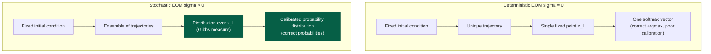
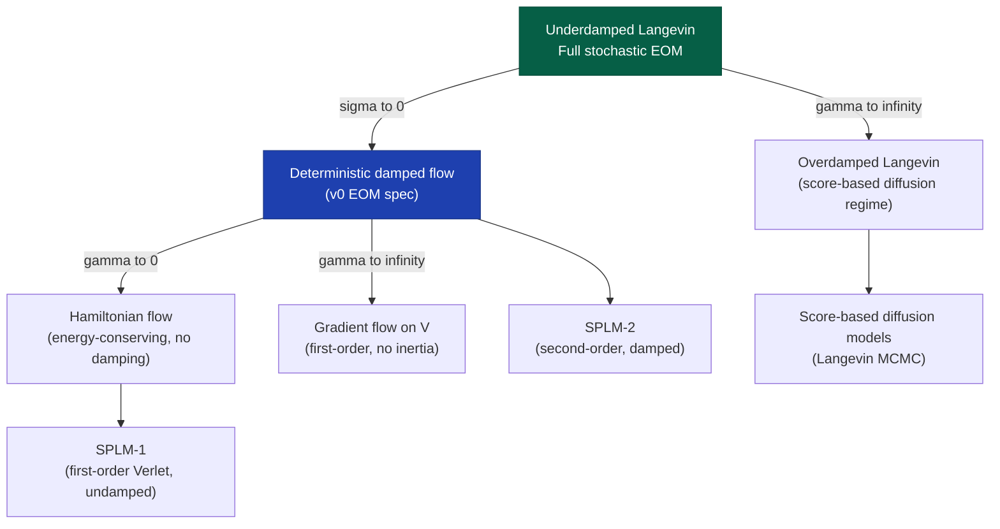
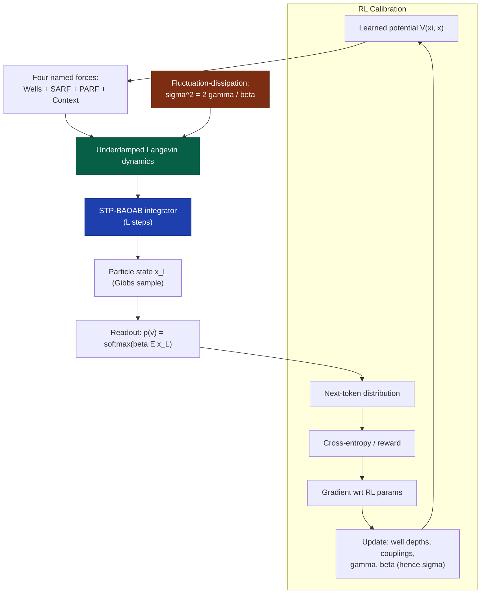

# Probabilistic Modeling in the Direct Dynamical Simulator: Why Stochastic Equations of Motion

**Technical Report**
**Subject:** Theoretical analysis of why the direct dynamical simulator requires stochastic (Langevin) equations of motion rather than deterministic dynamics
**Scope:** Thermodynamic, information-theoretic, and linguistic arguments for stochasticity; connection to the readout mechanism, RL calibration, and the v0-v3 programme

Companion to:
- `docs/Semantic_Simulator_EOM.md` — v0 Equations of Motion
- `docs/Semantic_Simulator_RL_Calibration_Programme.md` — RL calibration programme
- `docs/Note_on_Langevin_Dynamics.md` — mathematical background on Langevin SDEs
- `docs/Efficient_Numerical_Algorithm_on_GPU_for_Dynamical_System_based_Models.md` — integrator design
- `docs/Advancing_The_Dynamic_Simulation_Model.md` — v0 through v3 staging
- `docs/Modified_BAOAB_with_STP_identity_Detailed_Analysis.md` — STP-BAOAB analysis

Last updated: 11 May 2026.

---

## 1. The Central Question

The v0 EOM specification (`Semantic_Simulator_EOM.md` §5) defines a **deterministic** damped Euler-Lagrange flow:

$$
\mathfrak{m}_t \ddot{x}_t = -\nabla_x V(\xi_t, x_t) - \gamma \dot{x}_t.
$$

The direct dynamical simulator (paper v5 §20) instead employs the **underdamped Langevin SDE**:

$$
\begin{aligned}
\dot{x} &= \mathfrak{m}^{-1} p, \\
\dot{p} &= -\nabla_x V(\xi, x) - \gamma p + \sigma \eta(t), \quad \eta(t) \sim \mathcal{N}(0, I).
\end{aligned}
$$

The addition of the noise term $\sigma \eta(t)$ is not a computational approximation, not a regularisation trick, and not an arbitrary modelling choice. It is **structurally necessary** for the simulator to function as a language model. This document provides the detailed analysis of why.

---

## 2. The Readout Mechanism Demands a Probability Distribution

### 2.1 What a language model must produce

A language model, by definition, produces a **conditional probability distribution** over the vocabulary at each position:

$$
p(v_{t+1} \mid v_0, v_1, \ldots, v_t) \quad \text{for all } v_{t+1} \in \{1, \ldots, V\}.
$$

This is not a single prediction — it is a full probability vector of dimension $V$. The model must assign nonzero probability to multiple tokens at each position, reflecting the inherent ambiguity of natural language.

### 2.2 The readout softmax as a Gibbs sample

The simulator's readout mechanism (`Semantic_Simulator_EOM.md` §6) is:

$$
p(v \mid x_t^{(L)}) = \frac{\exp(\beta \langle e_v, x_t^{(L)} \rangle)}{\sum_{v'=1}^{V} \exp(\beta \langle e_{v'}, x_t^{(L)} \rangle)},
$$

where $x_t^{(L)}$ is the particle's final position after $L$ integration steps. This is a softmax — it converts a position in semantic space into a probability distribution over tokens. But here is the critical observation: **the quality of this distribution depends on where $x_t^{(L)}$ ends up relative to the vocabulary embeddings $\{e_v\}$.**

### 2.3 The deterministic failure mode

Under the **deterministic** EOM (no noise, $\sigma = 0$), the particle's trajectory from a fixed initial condition $x_t^{(0)} = e_{v_t}$ is entirely determined by the potential $V$ and the context $\xi_t$. After $L$ steps of damped flow, the particle converges toward the nearest attractor basin of $V$. The resulting $x_t^{(L)}$ is a **single fixed point** — it produces one softmax vector, always the same for the same input.

This is adequate for **point estimation** (what is the most likely next token?) but insufficient for **distributional modelling** (what is the probability of each possible next token?). The deterministic simulator produces the correct argmax but a potentially incorrect probability calibration over the tails.

### 2.4 The stochastic solution: sampling from the Gibbs measure

The underdamped Langevin dynamics, with the fluctuation-dissipation relation $\sigma^2 = 2\gamma / \beta$, has a unique invariant measure — the **Gibbs distribution**:

$$
\rho_\infty(x, p) \propto \exp\Big[-\beta\big(\tfrac{1}{2} p^\top \mathfrak{m}^{-1} p + V(\xi, x)\big)\Big].
$$

The configurational marginal (integrating out momenta) is:

$$
\rho_x(x) \propto \exp(-\beta V(\xi, x)).
$$

This is precisely the distribution whose samples produce the readout softmax. If the particle is drawn from $\rho_x$ rather than placed deterministically at a fixed point, then the **expected readout** averages over all attractor basins of $V$ weighted by their Boltzmann probability. The readout softmax is no longer conditioned on a single trajectory endpoint — it reflects the full energy landscape.

### 2.5 The fluctuation-dissipation relation is not a free parameter

The noise amplitude $\sigma$ is **uniquely determined** by the requirement that the invariant measure matches the readout distribution. The relation

$$
\sigma^2 = 2\gamma / \beta
$$

ties together three independently meaningful quantities:

| Quantity | Meaning in the simulator |
|----------|------------------------|
| $\gamma$ (dissipation) | Rate at which the particle forgets its initial momentum — the "semantic damping" rate |
| $\beta$ (inverse temperature) | Sharpness of the readout distribution — high $\beta$ = peaked, low $\beta$ = uniform |
| $\sigma$ (noise amplitude) | Strength of context-pool stochasticity — how much uncertainty enters per step |

This is the **Einstein relation** in disguise: the diffusivity $D = \beta^{-1}\gamma^{-1}$ relates transport to fluctuation-dissipation. Any other choice of $\sigma$ would produce an invariant measure that does not match the readout softmax — the integrator would converge to the wrong distribution, and no amount of RL calibration could correct this measure-level error.

---

## 3. Language Is Inherently Probabilistic

### 3.1 The residual uncertainty argument

The composite potential $V = V_{\text{wells}} + V_{\text{SARF}} + V_{\text{PARF}} + V_{\text{ctx}}$ captures the **systematic** component of next-token prediction: which tokens are attracted to which contexts, how strongly, and with what directional preferences. But language has a fundamental residual uncertainty that no finite-dimensional potential can resolve:

Given "The cat sat on the ___":
- "mat" (probability 0.15)
- "floor" (probability 0.12)
- "chair" (probability 0.10)
- "roof" (probability 0.08)
- "table" (probability 0.07)
- ... (hundreds more with decreasing probability)

The deterministic EOM can encode which basin the particle falls into (the argmax), but cannot simultaneously encode the probability ratio between the second and third most likely tokens. The stochastic term is what gives the simulator access to this distributional information: different realisations of the noise $\eta(t)$ push the particle into different basins, and the relative frequency of landing in each basin matches the Gibbs weight $\exp(-\beta V(\xi, x))$ at the basin's bottom.

### 3.2 The molecular dynamics analogy

The analogy to molecular dynamics (detailed in `Note_on_Langevin_Dynamics.md`) is precise:

| Molecular dynamics | Semantic simulator |
|-------------------|-------------------|
| Particle in a solvent bath | Semantic particle in the context pool |
| Solvent molecules (unresolved) | All contextual information not in the named forces |
| Thermal fluctuations | Linguistic uncertainty over valid continuations |
| Boltzmann distribution at temperature $T$ | Gibbs distribution at readout temperature $1/\beta$ |
| Particle explores multiple energy minima | Particle explores multiple attractor basins |
| Time average = ensemble average (ergodicity) | Trajectory average = distributional prediction |

In molecular dynamics, the solvent degrees of freedom are too numerous to track individually, so their cumulative effect on the solute particle is modelled as drag + noise. In the semantic simulator, the contextual information not captured by the four named force terms (Wells, SARF, PARF, Context coupling) is too complex to model deterministically, so its cumulative effect on the particle is modelled as dissipation + context-pool stochasticity.

### 3.3 The temperature as a calibration target

The readout temperature $\beta$ is classified as RL-calibrated in the parameter classification table (`Semantic_Simulator_EOM.md` §10, `Semantic_Simulator_RL_Calibration_Programme.md` §4.2). Through the fluctuation-dissipation relation, calibrating $\beta$ simultaneously calibrates the noise amplitude $\sigma = \sqrt{2\gamma/\beta}$. A perfectly calibrated simulator has:

- $\beta \to \infty$ (zero temperature): deterministic dynamics, greedy decoding. The model is maximally confident — appropriate when the potential perfectly predicts the next token.
- $\beta \to 0$ (infinite temperature): noise dominates, uniform distribution. The model has no information — the potential is useless.
- $\beta^*$ (optimal): the learned potential explains a fraction of the uncertainty; the residual is modelled by the stochastic term.

The RL calibration programme discovers $\beta^*$ as part of its M2-M4 loop. The noise amplitude follows automatically.

---

## 4. Information-Theoretic Perspective

### 4.1 The v0 expressivity ceiling and noise

The `Advancing_The_Dynamic_Simulation_Model.md` proves that the deterministic v0 simulator is at most a finite automaton, with phase-space capacity bounded by:

$$
\log_2 N_\epsilon(M) \le \dim M \cdot \log_2(L_M / \epsilon).
$$

Damping at rate $\gamma$ further contracts this capacity per step:

$$
I(s_0; s_\ell) \le \dim M \cdot \log_2(L_M/\epsilon) - \frac{\ell \cdot \dim M \cdot \gamma}{\ln 2}.
$$

The deterministic simulator loses information monotonically: damping is anti-memory. This is the formal content of the P10 experimental ceiling at ~26.4 PPL — the deterministic flow, however enriched the potential, cannot encode more than $O(\dim M \cdot \log(1/\epsilon))$ bits about the input.

The stochastic EOM **does not increase the expressivity class** — the simulator remains regular for v0. But it serves a different purpose: it converts the simulator from a **state machine** (which attractor basin?) to a **probabilistic state machine** (what distribution over attractor basins?). The noise does not add memory; it adds **calibration** — the ability to produce correctly calibrated probabilities within the expressivity class.

### 4.2 The entropy production interpretation

The underdamped Langevin dynamics has a well-defined entropy production rate (Jarzynski equality, fluctuation theorems). In the semantic simulator, this has a natural information-theoretic interpretation:

$$
\frac{dS}{dt} = \frac{d}{dt}\Big[-\int \rho \log \rho \ dx \ dp\Big] = \text{(entropy injection by noise)} - \text{(entropy extraction by damping)}.
$$

At equilibrium (the Gibbs measure), entropy production is zero. During transient dynamics (the $L$ integration steps from $x_t^{(0)}$ to $x_t^{(L)}$), the system's entropy changes reflect how much the particle's distribution broadens (noise pushes it toward multiple basins) versus narrows (the potential funnels it toward specific attractors). The readout at step $L$ captures this balance as the next-token entropy.

### 4.3 Connection to the readout entropy

The entropy of the readout distribution is:

$$
H[p(\cdot \mid x_L)] = -\sum_v p(v \mid x_L) \log p(v \mid x_L) = \log Z(\beta, x_L) - \beta \langle V \rangle,
$$

where $Z$ is the softmax normaliser. When the particle is at a deep attractor basin (low $V$), the readout is peaked (low entropy). When the particle is at a saddle or in a flat region, the readout is broad (high entropy). The stochastic dynamics allows the particle to **sample** from the distribution over these entropy levels, rather than being locked to a single level by deterministic convergence.

---

## 5. The Deterministic Limit as a Special Case

### 5.1 Recovering deterministic dynamics

The stochastic EOM reduces to the deterministic EOM in the limit $\sigma \to 0$ (equivalently $\beta \to \infty$). In the BAOAB integrator, the OU thermostat step:

$$
p \leftarrow e^{-\gamma h} p + \sqrt{\frac{\sigma^2}{2\gamma}(1 - e^{-2\gamma h})} R
$$

becomes, when $\sigma = 0$:

$$
p \leftarrow e^{-\gamma h} p.
$$

This is pure exponential damping without noise — exactly the deterministic damping of the v0 EOM specification. The BAOAB step with $\sigma = 0$ is a symmetric, time-reversible damped integrator that reduces to velocity Verlet in the limit $\gamma \to 0$.

### 5.2 The hierarchy of limits

The stochastic formulation is the most general: it contains the deterministic EOM, the overdamped limit, the Hamiltonian limit, and the gradient-flow limit as special cases. By parameterising $\sigma$ (equivalently $\beta$) as an RL-calibrated quantity, the programme allows the data to determine how much noise the model needs — from zero (fully deterministic, greedy decoding) to large (high uncertainty, broad distributions).

### 5.3 The overdamped connection to score-based diffusion

In the overdamped limit ($\gamma \to \infty$, momenta slaved to force), the dynamics becomes the first-order SDE:

$$
dx = -\nabla V(\xi, x) dt + \sqrt{2\beta^{-1}} dW_t.
$$

This is precisely the **Langevin MCMC** equation used in score-based diffusion models (Song-Ermon 2019, Ho et al. 2020). The semantic simulator in its overdamped limit is a diffusion sampler whose score function is $-\nabla V(\xi, x)$. The connection is not coincidental: both are sampling from the Gibbs measure of a learned energy function. The difference is that the semantic simulator uses the **underdamped** form (retaining inertia) because:

1. Inertial mixing is faster than overdamped mixing when the potential has multiple separated basins (the semantic attractor landscape).
2. The second-order SPLM-2 integrator dominates SPLM-1 by +5.09 PPL (paper v4, §15.4) — empirical confirmation that inertia matters.
3. The Langevin dynamics literature (`Note_on_Langevin_Dynamics.md`, §Analysis) proves that underdamped Langevin has quadratically better mixing times in dimension than the overdamped form for strongly convex potentials.

---

## 6. Ergodicity and the Readout Mechanism

### 6.1 The hypoellipticity argument

A potential objection: the noise enters only the momentum equation, not the position equation directly. Can the system still explore the full configuration space? The answer is yes, by **hypoellipticity** (`Note_on_Langevin_Dynamics.md`, §Analysis):

The commutator of the momentum noise with the kinematic coupling $\dot{x} = \mathfrak{m}^{-1} p$ generates noise in the position direction:

$$
[\nabla_p, \mathfrak{m}^{-1} p \cdot \nabla_x] = \mathfrak{m}^{-1} \nabla_x.
$$

Hormander's condition is satisfied, the operator is hypoelliptic, and the system is ergodic — it will visit any neighbourhood of any point in phase space given sufficient time. This guarantees that the invariant measure is unique and that time averages converge to ensemble averages.

### 6.2 Mixing time and the optimal damping

The rate at which the system converges to the Gibbs measure depends on $\gamma$. Two regimes:

- **Small $\gamma$ (underdamped):** trajectories are nearly Hamiltonian; the particle oscillates through energy shells without equilibrating. Mixing is slow because energy transfer between kinetic and potential is inefficient.
- **Large $\gamma$ (overdamped):** the particle crawls along the potential gradient; configurational mixing slows as $1/\gamma$ because inertial ballistic transport is suppressed.

The optimal mixing rate $\gamma^*$ is comparable to the slowest harmonic frequency of $V$ — this is exactly the regime the SPLM damping sweep identifies at $\gamma^* = 0.10$ (paper v4, abstract). The stochastic simulator inherits this optimal damping: the OU step in BAOAB implements exactly the friction that the mixing-time theory prescribes.

### 6.3 Finite-horizon sampling: $L$ steps is not $\infty$

In practice, the simulator runs for $L$ steps (8-100), not to equilibrium. The particle at step $L$ is not a perfect Gibbs sample — it is a finite-time approximation. The quality of this approximation depends on:

1. **Step size $h$:** BAOAB's second-order accuracy gives $O(h^2)$ bias on configurational averages.
2. **Number of steps $L$:** more steps = closer to equilibrium.
3. **Damping $\gamma$:** the configurational bias is suppressed by $\gamma^{-2}$ — the higher the damping, the more accurate the finite-time sample.

This is the structural reason BAOAB was chosen (`Efficient_Numerical_Algorithm_on_GPU_for_Dynamical_System_based_Models.md` §4.3): it is the unique palindromic splitting whose finite-time configurational bias is suppressed by the damping the EOM requires. For the direct simulator, where the integrator **is** the model, this property is essential — it means the readout distribution is close to Gibbs even at moderate $L$.

---

## 7. The Role of Noise in RL Calibration

### 7.1 Exploration in the parameter landscape

The RL calibration programme (`Semantic_Simulator_RL_Calibration_Programme.md` §6) sequences four RL substrates. At M3 (intrinsic-reward RL) and M4 (task-reward RL), the gradient signal is:

$$
\nabla_\theta J(\theta) = \mathbb{E}_{\tau \sim \pi_\theta}\Big[\sum_{t} \nabla_\theta \log \pi_\theta(a_t \mid s_t) \cdot R(\tau)\Big],
$$

where $\tau$ is a trajectory under the current parameters. The stochastic dynamics provides **natural exploration**: the noise perturbs the particle away from local minima of $V$, causing different trajectories to visit different attractor basins. This diversity in the trajectory distribution is what gives the policy gradient a useful signal — without noise, every trajectory from the same initial condition follows the same deterministic path, and the gradient is degenerate.

### 7.2 Gradient variance reduction

The BAOAB integrator's exact OU step injects noise with the correct variance-covariance structure. This means the trajectory distribution $\pi_\theta$ has lower variance than if noise were injected by a naive Euler discretisation (which adds spurious correlations). Lower variance in $\pi_\theta$ translates to lower variance in the policy-gradient estimator, reducing sample complexity at M4 — identified in the programme memo (§11, risk 1) as the milestone most vulnerable to sample-complexity explosion.

### 7.3 The intrinsic rewards are noise-dependent

Two of the four intrinsic-reward terms (`Semantic_Simulator_EOM.md` §9.2) are meaningless without stochasticity:

- **Energy regularity** $r_{\text{energy}}$: penalises violation of the energy balance $E^{(L)} - E^{(0)} + \gamma \int_0^L T d\ell$. Without noise, the damped deterministic system monotonically loses energy and this reward is trivially satisfied. With noise, energy is continuously injected and extracted; the reward measures whether the balance is physically consistent.
- **Basin stability** $r_{\text{basin}}$: rewards low variance of $x_t^{(L)}$ across nearby initialisations. Without noise, nearby initialisations produce nearby endpoints (deterministic continuity); the reward adds no information. With noise, nearby initialisations can diverge stochastically; the reward measures whether the potential's attractor basins are robust to perturbation.

---

## 8. Comparison: Deterministic vs Stochastic in Context

| Criterion | Deterministic EOM | Stochastic EOM (Langevin) |
|-----------|------------------|--------------------------|
| Output type | Single point $x_L$ (delta distribution) | Distribution over $x_L$ (Gibbs measure) |
| Token prediction | Argmax only (greedy) | Full calibrated $p(v \mid x_L)$ |
| Invariant measure | Fixed point(s) of the flow | Gibbs distribution of $V$ |
| Temperature control | None (always "zero temperature") | $\beta$ controls distribution sharpness |
| RL exploration | No natural exploration | Noise provides exploration |
| Energy balance | Monotone loss (damping only) | Injection + extraction (fluctuation-dissipation) |
| Expressivity class | Same (regular for v0) | Same (regular for v0) |
| Mixing / ergodicity | Not applicable (no ensemble) | Ergodic; quantitative mixing rates |
| Integrator bias | First-order (Euler) or second-order (Verlet) | BAOAB: second-order, measure-preserving |
| Readout calibration | Potentially poor | Guaranteed by Gibbs-softmax correspondence |
| Computational cost | One force eval per step | One force eval + one random draw per step |

---

## 9. When Is the Deterministic Limit Appropriate?

Despite the arguments above, the deterministic limit ($\sigma = 0$) remains useful in specific contexts:

1. **Greedy generation.** At inference time, when the user wants the single most likely continuation, the deterministic limit produces the argmax without sampling overhead.

2. **Attractor analysis.** For interpretability — visualising which basins the potential defines, how deep they are, what their content is — the deterministic flow is simpler to analyse and visualise.

3. **Descriptive SPLM fitting.** The SPLM experiments of paper v4 §14-§15 use deterministic dynamics because they are fitting to a transformer's deterministic hidden-state trajectory. Noise would introduce a model mismatch.

4. **Warm-start potential training.** The PARFLM P10 experiments train $V_\theta$ under deterministic dynamics (Algorithm A, supervised next-token). The trained potential is then harvested and used as warm-start for the stochastic simulator.

The recommended architecture supports both modes via a single parameter: set $\sigma = 0$ for deterministic, $\sigma = \sqrt{2\gamma/\beta}$ for the full stochastic model. The BAOAB integrator handles both correctly — the OU step reduces to pure damping when $\sigma = 0$.

---

## 10. The Full Picture: From Potential to Probability

The chain of reasoning:

1. A language model must produce a **probability distribution** over tokens.
2. The readout softmax is a **Gibbs distribution** parameterised by $\beta$ and $V$.
3. For the readout to be correctly calibrated, the particle's final state must be a **sample from the Gibbs measure** of $V$.
4. The Gibbs measure is the unique invariant measure of the **underdamped Langevin SDE** with fluctuation-dissipation $\sigma^2 = 2\gamma/\beta$.
5. The BAOAB integrator produces finite-time samples from this measure with $O(h^2/\gamma^2)$ bias — the tightest guarantee available.
6. The STP modification accelerates the force evaluation without changing the measure-theoretic properties.
7. The RL calibration loop discovers the optimal $\beta$ (and hence $\sigma$) for the trained potential's explanatory power.

This is the complete justification for stochastic equations of motion in the direct dynamical simulator. The noise is not added for computational reasons — it is the **thermodynamic bridge** between the scalar potential $V$ and the probability distribution $p(v \mid x_L)$ that the language model must produce.

---

## 11. Implications for the v1.5 / v2 / v3 Programme

The stochastic formulation interacts with the expressivity extensions of `Advancing_The_Dynamic_Simulation_Model.md`:

### 11.1 v1.5 (Salience decay)

Particle destruction via salience decay $s(\tau)$ can be implemented as a **temperature-dependent** threshold: when a particle's local temperature exceeds a critical value (it has "thermalised" — lost all directed motion), it is demoted. The stochastic dynamics provides the natural trigger mechanism.

### 11.2 v2 (Creation / Fock space)

The Fock-space extension adds creation/destruction operators. In the stochastic formulation, creation events can be triggered by thermal fluctuations pushing particles into binding configurations — a stochastic creation process rather than a deterministic threshold. This connects to the Doi-Peliti formalism for stochastic particle systems, providing a rigorous mathematical framework for variable-particle-count Langevin dynamics.

### 11.3 v3 (Operator-valued execution)

When particles carry operators $\hat{O}$ that act on other particles, the noise amplitude controls the **fidelity of transmission**: at low noise, the operator application is nearly deterministic; at high noise, it is probabilistic. This naturally models the certainty of predicate composition — "the cat certainly sat" versus "the cat might have sat" — without additional mechanism.

---

## 12. Summary

The stochastic equations of motion are necessary for three independent reasons, each sufficient on its own:

1. **Thermodynamic necessity.** The readout softmax samples from the Gibbs measure of $V$. The Gibbs measure is the invariant distribution of the Langevin SDE. No other SDE preserves it. The fluctuation-dissipation relation $\sigma^2 = 2\gamma/\beta$ is uniquely determined by this requirement.

2. **Distributional completeness.** A language model must produce calibrated probabilities, not just argmax predictions. The noise converts a point-prediction (which basin?) into a distribution-prediction (what probability per basin?) by enabling the particle to explore multiple attractor regions with Boltzmann-weighted frequency.

3. **Calibration learnability.** The RL calibration programme requires exploration (noise provides it), diverse trajectory distributions (noise generates them), and physically meaningful intrinsic rewards (noise makes energy balance and basin stability nontrivial). Without stochasticity, the RL signal is degenerate and the programme cannot calibrate the simulator.

The deterministic limit ($\sigma \to 0$) remains available as a special case for greedy inference, attractor analysis, and warm-start potential training. The stochastic formulation is the general case that contains all others.

---

## References

- Langevin, P. (1908). *Sur la theorie du mouvement brownien*. C. R. Acad. Sci.
- Leimkuhler, B., Matthews, C. (2013). *Rational construction of stochastic numerical methods for molecular sampling*. AMRX.
- Leimkuhler, B., Matthews, C. (2015). *Molecular Dynamics with Deterministic and Stochastic Numerical Methods*. Springer.
- Villani, C. (2009). *Hypocoercivity*. Memoirs of the AMS.
- Song, Y., Ermon, S. (2019). *Generative modeling by estimating gradients of the data distribution*. NeurIPS.
- Ho, J., Jain, A., Abbeel, P. (2020). *Denoising diffusion probabilistic models*. NeurIPS.
- Gueorguiev, D. P. (2026). *Semantic Simulator EOM* (`docs/Semantic_Simulator_EOM.md`).
- Gueorguiev, D. P. (2026). *Note on Langevin Dynamics* (`docs/Note_on_Langevin_Dynamics.md`).
- Gueorguiev, D. P. (2026). *Advancing the Dynamic Simulation Model* (`docs/Advancing_The_Dynamic_Simulation_Model.md`).
- Gueorguiev, D. P. (2026). *Semantic Simulator with RL-calibrated Force Fields* (`docs/Semantic_Simulator_RL_Calibration_Programme.md`).
- Gueorguiev, D. P. (2026). *Efficient Numerical Algorithms on CUDA-Enabled GPUs* (`docs/Efficient_Numerical_Algorithm_on_GPU_for_Dynamical_System_based_Models.md`).
