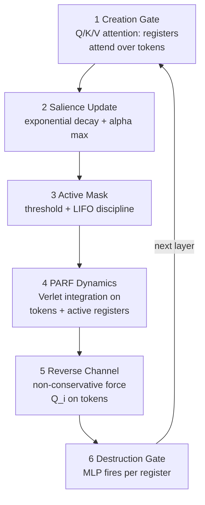
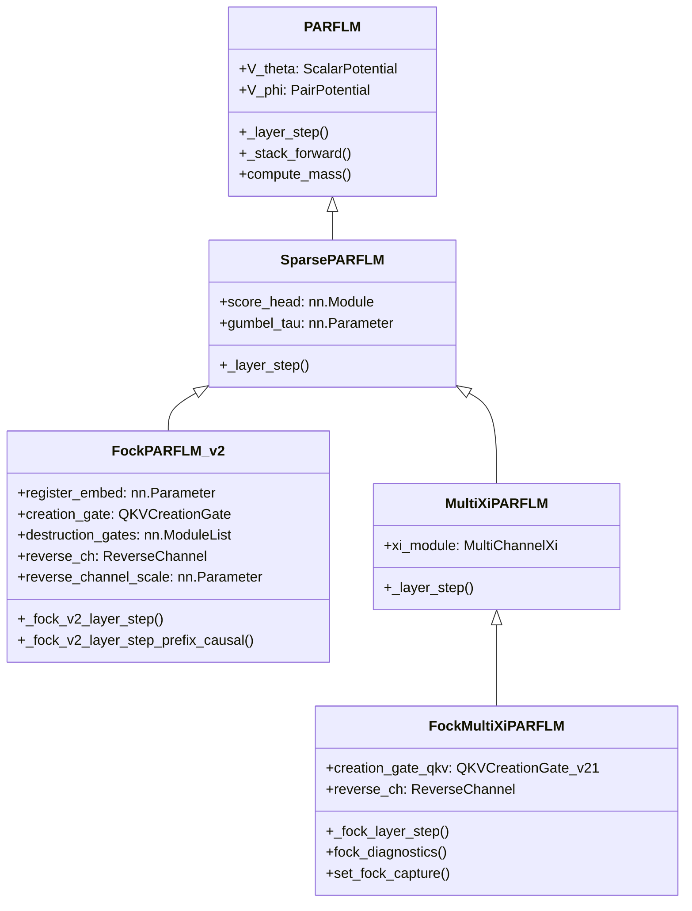
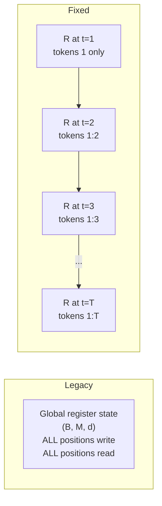
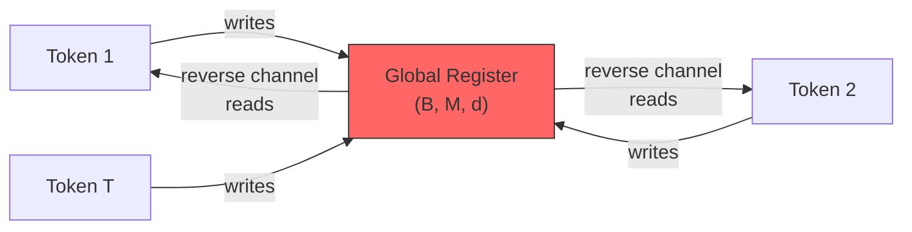
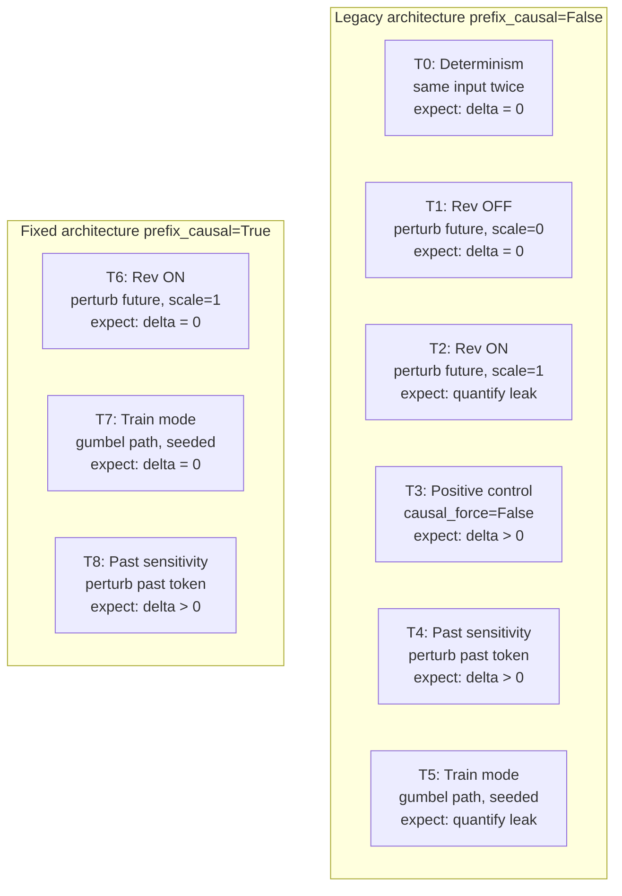

# Deep Dive into the Fock v2.1 Mechanism and Code

> A thorough analysis of the Fock-space augmentation for scalar-potential language models (SPLM), its PyTorch implementation, and the three causal leaks discovered during development.

---

## Table of Contents

1. [Motivation: the expressivity ceiling and the R6 ladder](#1-motivation-the-expressivity-ceiling-and-the-r6-ladder)
2. [Architecture overview](#2-architecture-overview)
3. [Inheritance hierarchy](#3-inheritance-hierarchy)
4. [Configuration: `FockPARFConfig_v2` and `FockMultiXiPARFConfig`](#4-configuration)
5. [The register lifecycle in detail](#5-the-register-lifecycle-in-detail)
   - 5.1 [Creation gate: Q/K/V-structured attention](#51-creation-gate-qkv-structured-attention)
   - 5.2 [v2.1 improvements: B1/B2/B3](#52-v21-improvements-b1b2b3)
   - 5.3 [Salience update and exponential decay](#53-salience-update-and-exponential-decay)
   - 5.4 [Active mask and LIFO stack discipline](#54-active-mask-and-lifo-stack-discipline)
   - 5.5 [PARF dynamics on the extended state](#55-parf-dynamics-on-the-extended-state)
   - 5.6 [Reverse channel: the non-conservative force](#56-reverse-channel-the-non-conservative-force)
   - 5.7 [Destruction gate](#57-destruction-gate)
6. [Prefix-causal register lifecycle](#6-prefix-causal-register-lifecycle)
7. [Causal readout: cumulative softmax internals](#7-causal-readout-cumulative-softmax-internals)
8. [Register repulsion: the B4 anti-collapse penalty](#8-register-repulsion-the-b4-anti-collapse-penalty)
9. [The three causal leaks: L1, L2, L3](#9-the-three-causal-leaks-l1-l2-l3)
   - 9.1 [L1: integrator xi-update bug](#91-l1-integrator-xi-update-bug)
   - 9.2 [L2: creation-gate full-sequence softmax](#92-l2-creation-gate-full-sequence-softmax)
   - 9.3 [L3: shared register-state leak via the reverse channel](#93-l3-shared-register-state-leak-via-the-reverse-channel)
10. [The causality probe: `fock_causality_probe.py`](#10-the-causality-probe)
11. [Diagnostic capture and health monitoring](#11-diagnostic-capture-and-health-monitoring)
12. [Parameter budget](#12-parameter-budget)
13. [Summary](#13-summary)

---

## 1. Motivation: the expressivity ceiling and the R6 ladder

The Semantic Simulation framework builds language models from physics-inspired scalar potentials. A base SPLM (Scalar-Potential Language Model) integrates the gradient of a learned potential $V_\theta(\xi, h)$ using a damped Verlet scheme. This is expressive enough for local context but hits a fundamental ceiling for hierarchical structure.

The **v0 Expressivity Ceiling** (Theorem v0-ceiling) states that a depth-$L$ SPLM with finite-dimensional context $\xi$ and no token-token routing cannot recognise $\mathrm{Dyck}_n$ past a critical nesting depth $D^*$ that depends on $L$ and the context channel count $K$.

The Fock mechanism escapes this ceiling by introducing **latent register particles** that can be dynamically created and destroyed, providing unbounded hierarchical working memory. With a LIFO activation discipline, the system implements a pushdown automaton.

<p align="center">

</p>
<p align="center"><em>Figure 1: The R6 expressivity ladder. The Fock mechanism lifts scalar-potential models past the v0 ceiling at R4 (pushdown automaton) and R5 (full attention equivalent via the reverse channel).</em></p>

The ladder consists of six rungs, each adding a mechanism that strictly widens the class of recognisable languages:

| Rung | Mechanism | Language class gained |
|------|-----------|---------------------|
| R0 | No memory | Finite-state |
| R1 | Cumulative mean $\xi$ | Counter machine |
| R2 | K-channel EMA | Finite-depth context |
| R3 | Sparse PARF $V_\phi$ | Token-token routing |
| R4 | Fock registers + LIFO | Pushdown automaton |
| R5 | Fock + reverse channel | Full attention equivalent |

---

## 2. Architecture overview

The Fock v2.1 PARFLM adds M latent register particles to the base PARFLM. Each register carries a persistent hidden state $r_k \in \mathbb{R}^d$ and a scalar salience $\sigma_k \in [0, 1]$ that tracks whether the register is "alive."

The register lifecycle repeats at each layer $\ell$:



<p align="center">

</p>
<p align="center"><em>Figure 2: The six-stage register lifecycle per layer. Registers flow downward through creation, dynamics, and destruction; tokens participate in stages 1, 4, and 5.</em></p>

---

## 3. Inheritance hierarchy

The Fock models build on a deep inheritance chain:



Each class adds one layer of functionality:

- **PARFLM** (`model_parf.py`): base Verlet integrator with $V_\theta$ (single-particle) and $V_\phi$ (pair-interaction) potentials.
- **SparsePARFLM** (`model_parf_sparse.py`): Gumbel-softmax top-$k$ pair routing for $O(T \cdot k)$ instead of $O(T^2)$.
- **MultiXiPARFLM** (`model_parf_multixi.py`): $K$-channel EMA context $\xi^{(k)}$ with learnable decay rates.
- **FockPARFLM_v2** (`model_fock_parf_v2.py`): standalone Fock v2 with Q/K/V creation.
- **FockMultiXiPARFLM** (`model_fock_parf_multixi.py`): the full production model combining multi-$\xi$ PARF with Fock registers.

The production model trained on OpenWebText is `FockMultiXiPARFLM` with `fock_version='v2'`.

---

## 4. Configuration

The `FockMultiXiPARFConfig` dataclass extends the multi-$\xi$ PARF config with Fock-specific knobs. Key fields:

```python
@dataclass
class FockMultiXiPARFConfig(MultiXiPARFConfig):
    fock_version: str = "v2"             # 'v1' (mean-conditioned) or 'v2' (Q/K/V)
    n_registers: int = 16               # Pool size M
    register_salience_decay: float = 0.9 # Exponential decay lambda per layer
    register_salience_threshold: float = 0.1
    stack_discipline: bool = True        # LIFO activation order
    register_init_scale: float = 0.02    # Std of vacuum embeddings

    # v2-only:
    d_k: int = 64                        # Key/query projection dimension
    tau_create_init: Optional[float] = 0.1  # Learnable creation temperature
    destruction_gate_hidden: int = 64
    reverse_channel: bool = True         # Non-conservative force Q_i
    prefix_causal_registers: bool = True # Per-position causal registers

    # v2.1 improvements:
    per_register_tau: bool = False       # B1: per-register temperature
    per_register_keys: bool = False      # B2: per-register key subspaces
    ortho_register_init: bool = False    # B3: orthogonal register init
    register_repulsion: bool = False     # B4: anti-collapse penalty

    # Reverse channel stabilisation:
    reverse_channel_stable: bool = False     # QK-norm + output RMS-norm
    reverse_channel_pre_ln: bool = True      # pre-LayerNorm on q/k/v
    reverse_channel_soft_norm: bool = False   # soft-floored output norm
    reverse_channel_warmup_steps: int = 0    # linear gate warmup
    reverse_channel_per_layer: bool = False   # per-layer gate scalar
```

The `prefix_causal_registers` flag is the critical causal-integrity switch. When `True` (default), the register state is per-position $(B, T, M, d)$ and provably leak-free. When `False`, it reproduces the legacy $(B, M, d)$ global-state architecture for loading pre-fix checkpoints.

---

## 5. The register lifecycle in detail

### 5.1 Creation gate: Q/K/V-structured attention

The v2 creation gate replaces v1's mean-pooled MLP with a Q/K/V attention readout. Each register $k$ carries a persistent query probe derived from its current state:

$$Q_k = r_k W_Q^{[k]} \in \mathbb{R}^{d_k}$$

$$K = h W_K \in \mathbb{R}^{T \times d_k}, \quad V = h W_V \in \mathbb{R}^{T \times d}$$

$$\alpha_{k,j} = \mathrm{softmax}_j\left(\frac{Q_k \cdot K_j}{\tau_k}\right)$$

$$r_k^{\mathrm{new}} = \sum_j \alpha_{k,j} V_j$$

The implementation in `QKVCreationGate`:

```python
class QKVCreationGate(nn.Module):
    def __init__(self, d, d_k, M, init_scale=0.02, tau_create_init=None):
        super().__init__()
        self.W_Q = nn.Parameter(torch.randn(M, d, d_k) * init_scale)
        self.W_K = nn.Linear(d, d_k, bias=False)
        self.W_V = nn.Linear(d, d, bias=False)
        if tau_create_init is not None:
            self.log_tau = nn.Parameter(torch.tensor(tau_create_init).log())

    def forward(self, h_tokens, register_states):
        B, T, d = h_tokens.shape
        K = self.W_K(h_tokens)                                    # (B, T, d_k)
        V = self.W_V(h_tokens)                                    # (B, T, d)
        Q = torch.einsum("bmd,mdk->bmk", register_states, self.W_Q)  # (B, M, d_k)

        scores = torch.bmm(
            Q.reshape(B * M, 1, self.d_k),
            K.unsqueeze(1).expand(B, M, T, self.d_k)
             .reshape(B * M, self.d_k, T),
        ).reshape(B, M, T)

        tau = self.log_tau.exp().clamp(min=1e-4)
        scores = scores / tau
        return _causal_creation_readout(scores, V)
```

This restores three properties of attention that v1's mean-conditioned gate lacked:

1. **Asymmetry** -- register-to-token coupling $\neq$ token-to-register coupling
2. **Q/K/V decoupling** -- coupling strength ($Q \cdot K$) $\neq$ content ($V$)
3. **Competitive normalisation** -- the softmax budget $\sum_j \alpha_{k,j} = 1$

### 5.2 v2.1 improvements: B1/B2/B3

`QKVCreationGate_v21` addresses the **temperature collapse** diagnostic observed in early v2 training:

**B1 -- Per-register learnable temperature.** Each register $k$ has its own $\tau_k$, allowing the model to learn different selectivity levels per register:

```python
self.log_tau = nn.Parameter(torch.full((M,), math.log(tau_init)))
# ...
tau = self.log_tau.exp().clamp(min=1e-4)  # (M,)
scores = scores / tau.unsqueeze(0).unsqueeze(-1)  # (B, M, T)
```

**B2 -- Per-register key subspaces.** $W_K$ becomes $(M, d, d_k)$ instead of $(d, d_k)$, giving each register an independent key projection:

```python
if per_register_keys:
    self.W_K = nn.Parameter(torch.randn(M, d, d_k) * init_scale)
    # forward:
    K = torch.einsum("btd,mdk->bmtk", h_tokens, self.W_K)   # (B, M, T, d_k)
    scores = torch.einsum("bmk,bmtk->bmt", Q, K)
```

**B3 -- Orthogonal register embedding init.** The vacuum embeddings are initialised as rows of a random orthogonal matrix, so the register bank starts maximally differentiated:

```python
if cfg.ortho_register_init and M <= d:
    U, _, _ = torch.linalg.svd(torch.randn(d, d))
    self.register_embed = nn.Parameter(U[:M] * cfg.register_init_scale)
```

### 5.3 Salience update and exponential decay

After creation, salience is updated with an exponential moving average that blends the old salience with the new creation signal:

$$\sigma_k^{(\ell)} = \lambda \cdot \sigma_k^{(\ell-1)} + (1 - \lambda) \cdot \alpha_k^{\max}$$

where $\lambda$ = `register_salience_decay` (default 0.5 for v2) and $\alpha_k^{\max} = \max_j \alpha_{k,j}$ is the peak attention weight from the creation gate. The register content is similarly blended:

$$r_k = \sigma_k \cdot r_k^{\mathrm{old}} + (1 - \sigma_k) \cdot r_k^{\mathrm{new}}$$

In code:

```python
blend = salience.unsqueeze(-1)  # (B, M, 1)
r = blend * r + (1.0 - blend) * r_new_content
salience = salience * decay + alpha_max * (1.0 - decay)
```

### 5.4 Active mask and LIFO stack discipline

The active mask determines which registers participate in dynamics. Without LIFO, any register above the threshold is active:

$$\mathrm{active}_k = \mathbf{1}[\sigma_k \gt \theta]$$

With **LIFO stack discipline** (`stack_discipline=True`), only the contiguous leading block of above-threshold registers in salience order is active. This enforces a pushdown constraint where the most recently created register must be destroyed before earlier ones:

```python
def _active_mask(self, salience):
    above_thresh = salience > cfg.register_salience_threshold

    if not cfg.stack_discipline:
        return above_thresh

    sorted_sal, sort_idx = salience.sort(dim=-1, descending=True)
    sorted_above = sorted_sal > cfg.register_salience_threshold
    sorted_active = torch.cumprod(sorted_above.float(), dim=-1).bool()

    active = torch.zeros_like(sorted_active)
    active.scatter_(-1, sort_idx, sorted_active)
    return active
```

The `cumprod` is the key trick: it implements `cummin` portably (MPS lacks `cummin`). The moment a sorted slot is below threshold, the cumulative product drops to 0 and everything after it is inactive.

### 5.5 PARF dynamics on the extended state

In the **legacy** (non-prefix-causal) lifecycle, active registers are concatenated to the token hidden states and the full multi-$\xi$ PARF dynamics run on the extended state:

```python
h_ext = torch.cat([h, r_gated], dim=1)        # (B, T+M, d)
h_prev_ext = torch.cat([h_prev, r_gated], dim=1)

h_ext_new = super()._layer_step(
    h_ext, h_prev_ext, m_ext, gamma, dt, layer_idx=layer_idx,
)

h_new = h_ext_new[:, :T, :]  # tokens back
r_new = h_ext_new[:, T:, :]  # registers back
```

The `_layer_step` of `MultiXiPARFLM` computes forces from $V_\theta$, $V_\phi$ (sparse pair interactions), and the damped Verlet integrator, treating registers identically to tokens. This is what makes registers participate in the physics -- they feel forces from tokens and exert forces back.

In the **prefix-causal** lifecycle, registers do NOT join the extended state (because that channel is inherently full-window). Tokens run standard dynamics alone:

```python
h_new = super()._layer_step(
    h, h_prev, m_b, gamma, dt, layer_idx=layer_idx,
)
```

### 5.6 Reverse channel: the non-conservative force

The reverse channel is the mechanism that makes Fock-PARFLM capable of matching attention's full information routing. It injects a non-conservative force $Q_i$ where tokens read from active registers:

$$Q_i = \sum_{k \in \mathrm{active}} \mathrm{softmax}_k\left(\frac{q_i \cdot k_k^{\mathrm{reg}}}{\sqrt{d_k}}\right) \cdot v_k^{\mathrm{reg}}$$

This force is **non-conservative** because:
- It depends on relative inner products across all registers (softmax normalisation)
- $Q_i \neq Q_j$ in general (asymmetric -- tokens see different register mixtures)
- No scalar potential $V$ exists such that $Q_i = -\nabla_{h_i} V$

The force is injected into the hidden state update scaled by a learnable gate:

$$h_i \leftarrow h_i + \frac{\Delta t^2}{m_i} \cdot \tanh(s_{\mathrm{rev}}) \cdot Q_i$$

where $s_{\mathrm{rev}}$ is initialised to 0 (so $\tanh(0) = 0$: the channel starts fully off) and the model learns when to open it.

The `ReverseChannel` module implements three stabilisation devices (enabled by `reverse_channel_stable=True`):

1. **QK-normalisation**: queries and keys are L2-normalised with a learnable logit temperature:

```python
q = F.normalize(q, dim=-1)
k = F.normalize(k, dim=-1)
logit_scale = self.logit_scale.exp().clamp(max=self.logit_scale_max)
scores = torch.einsum("btk,btmk->btm", q, k) * logit_scale
```

2. **Output RMS-normalisation**: the force magnitude is bounded per token. With `soft_norm=True` (the default for production), the norm uses $\epsilon = 1.0$ instead of $10^{-6}$:

$$Q_{\mathrm{norm}} = \frac{Q}{\sqrt{\mathrm{mean}(Q^2) + \epsilon}}$$

This is the identity for small forces (backward Jacobian $\approx 1$, no $1/\|Q\|$ blow-up) and a soft cap at $\sim$unit RMS for large ones.

3. **Pre-LayerNorm**: q/k/v inputs are LayerNorm-ed, bounding magnitudes at the source.

### 5.7 Destruction gate

The destruction gate is a per-register MLP that decides whether to annihilate a register:

$$g_k^{\mathrm{destroy}} = \sigma(\mathrm{MLP}(r_k)) \in [0, 1]$$

$$\sigma_k \leftarrow \sigma_k \cdot (1 - g_k^{\mathrm{destroy}} \cdot \mathrm{active}_k)$$

In code:

```python
class DestructionGate_v2(nn.Module):
    def __init__(self, d, hidden, init_scale=0.02):
        self.net = nn.Sequential(
            nn.Linear(d, hidden), nn.GELU(), nn.Linear(hidden, 1),
        )

    def forward(self, r):
        return torch.sigmoid(self.net(r).squeeze(-1))  # (B, M) in [0, 1]
```

Salience is multiplicatively decayed only for active registers; inactive registers retain their salience and can be re-activated later.

---

## 6. Prefix-causal register lifecycle

The prefix-causal lifecycle is the fix for causal leak L3. It changes the register state from a global $(B, M, d)$ tensor to a per-position $(B, T, M, d)$ tensor.



Key differences from the legacy step:

| Aspect | Legacy | Prefix-causal |
|--------|--------|---------------|
| Register state shape | $(B, M, d)$ | $(B, T, M, d)$ |
| Salience shape | $(B, M)$ | $(B, T, M)$ |
| Active mask shape | $(B, M)$ | $(B, T, M)$ |
| Creation queries | Global: same query for all $t$ | Diagonal: token $t$ scored by register state as of $t$ |
| Registers in Verlet | Yes (concatenated to tokens) | No (removed -- it was the leak channel) |
| Reverse channel source | Causal readout or global state | Per-position register slice |

The core of `_fock_v2_layer_step_prefix_causal`:

```python
def _fock_v2_layer_step_prefix_causal(self, h, h_prev, r, salience, ...):
    # 1. Prefix-causal creation (diagonal queries)
    readout, alpha_max = self.creation_gate.forward_prefix(h, r)
    blend = salience.unsqueeze(-1)                  # (B, Tr, M, 1)
    r_new = blend * r + (1.0 - blend) * readout     # (B, T, M, d)
    salience = salience * decay + alpha_max * (1 - decay)  # (B, T, M)

    # 2. Per-position active mask
    active = self._active_mask(salience)             # (B, T, M) bool

    # 3. Token dynamics only (registers NOT concatenated)
    h_new = super()._layer_step(h, h_prev, m_b, gamma, dt, ...)

    # 4. Reverse channel reads per-position causal registers
    if self.reverse_ch is not None and active.any():
        Q_force = self.reverse_ch(h_new, r_new, active)
        scale = torch.tanh(self.reverse_channel_scale)
        h_new = h_new + (dt * dt / m_b) * scale * Q_force

    # 5. Destruction gate (per position)
    g_destroy = self.destruction_gates[layer_idx](r_new)  # (B, T, M)
    salience = salience * (1 - g_destroy * active.float())

    return h_new, h, r_new, salience
```

The crucial difference is in `forward_prefix`, which uses **diagonal queries** -- token $t$ is scored by the register bank as of position $t$:

```python
def forward_prefix(self, h_tokens, r_state):
    Q = torch.einsum("btmd,mdk->btmk", r_state, self.W_Q)  # (B, Tr, M, d_k)
    if Q.shape[1] == 1:
        Q = Q.expand(B, T, M, self.d_k)

    scores = torch.einsum("btmk,btk->btm", Q, K)
    scores = scores.permute(0, 2, 1)                        # (B, M, T)
    return _prefix_causal_creation_readout(scores, V)
```

---

## 7. Causal readout: cumulative softmax internals

The cumulative softmax is how register content at position $t$ is restricted to only reflect tokens $1 \ldots t$. There are two implementations: the legacy one and the prefix-causal one.

### Legacy: `_causal_creation_readout`

Uses the **full-sequence max** for numerical stability:

$$s_{\max} = \max_j s_j, \quad e_j = \exp(s_j - s_{\max})$$

$$Z_t = \sum_{j \le t} e_j, \quad r_t = \frac{\sum_{j \le t} e_j \cdot V_j}{Z_t}$$

```python
def _causal_creation_readout(scores, V):
    s_max = scores.max(dim=-1, keepdim=True).values     # (B, M, 1)
    exp_s = torch.exp(scores - s_max)                   # (B, M, T)
    Z = torch.cumsum(exp_s, dim=-1)                     # (B, M, T)

    weighted_V = exp_s.unsqueeze(-1) * V.unsqueeze(1)   # (B, M, T, d)
    numerator = torch.cumsum(weighted_V, dim=2)          # (B, M, T, d)
    r_causal = numerator / Z.unsqueeze(-1).clamp(min=1e-8)
    return ...
```

**Problem**: the full-sequence max cancels analytically, but in floating point it makes outputs at position $t$ depend on the rounding induced by future scores. This is the root cause of non-zero (but small) perturbation signals even after the L2 fix.

### Prefix-causal: `_prefix_causal_creation_readout`

Uses a **constant shift** instead of the data-dependent max:

$$s_j' = \mathrm{clamp}(s_j, \max{=}\tau) - \tau, \quad s_j' \le 0$$

$$e_j = \exp(s_j'), \quad Z_t = \sum_{j \le t} e_j$$

```python
def _prefix_causal_creation_readout(scores, V, clamp=40.0):
    s32 = scores.float().clamp(max=clamp) - clamp       # <= 0
    exp_s = torch.exp(s32)                               # (B, M, T), <= 1
    Z = torch.cumsum(exp_s, dim=-1).clamp(min=1e-30)

    weighted_V = exp_s.unsqueeze(-1) * V.float().unsqueeze(1)
    numerator = torch.cumsum(weighted_V, dim=2)
    r_mt = numerator / Z.unsqueeze(-1)                   # (B, M, T, d)

    alpha_max = exp_s.cummax(dim=-1).values / Z          # (B, M, T)
    return r_mt.permute(0, 2, 1, 3), alpha_max.permute(0, 2, 1)
```

The constant clamp makes every output at position $t$ a bit-exact function of positions $\le t$. The causality probe returns literal `0.0` in float64.

The salience is also returned **per position** via `cummax`, so the active mask can be maintained causally.

---

## 8. Register repulsion: the B4 anti-collapse penalty

B3 (orthogonal init) sets the initial pairwise similarity to zero, and B2 (per-register keys) makes the collapsed manifold a saddle. But neither supplies a continuous restoring force, so register rows drift back together under NTP gradients.

B4 adds a differentiable anti-collapse penalty on the dynamic register states:

```python
def _dynamic_repulsion(self, r_new, active):
    r = F.normalize(r_new, dim=-1)
    gram = torch.bmm(r, r.transpose(1, 2))         # (B, M, M)
    eye = torch.eye(M, dtype=torch.bool, device=gram.device)
    pair = (active.unsqueeze(2) & active.unsqueeze(1)) & ~eye

    if kind == "coulomb":
        cos = (gram * pmask).clamp(-0.999, 0.999)
        penalty = ((1.0 / (1.0 - cos + 1e-3)) * pmask).sum() / n
    else:  # "gram": mean squared off-diagonal cosine
        penalty = (gram.pow(2) * pmask).sum() / n

    return coeff * penalty
```

The penalty is accumulated per layer and drained via `pop_repulsion_loss()` before `backward()`:

```python
loss = ntp_loss + model.pop_repulsion_loss()
loss.backward()
```

Keeping the repulsion out of `forward()` guarantees it never enters the eval PPL.

---

## 9. The three causal leaks: L1, L2, L3

Autoregressive language models require strict left-to-right causality: the prediction at position $t$ must depend only on tokens $x_{1:t}$. The SPLM family introduced three distinct violations during development.

<p align="center">

</p>
<p align="center"><em>Figure 3: The three causal leaks and their fixes. L1 affects the integrator context; L2 affects the creation softmax; L3 affects the shared register state via the reverse channel.</em></p>

### 9.1 L1: integrator xi-update bug

**Mechanism.** The multi-channel context summary $\xi_t^{(k)}$ is computed as a causal exponential moving average of $h$. The original (v2) implementation used an attention-style update that evaluated the EMA *after* the full-sequence $h$ was available, giving $\xi_t$ access to $h_{\gt t}$.

**Where in code.** The fix is in the base SPLM integrator, controlled by `cfg.causal_force = True`. When enabled, the context vector is re-derived from `h.detach()` at every layer, and the EMA evaluates $\xi_t$ using only $h_{1:t}$:

```python
if self.cfg.causal_force:
    xi = causal_cumulative_mean(h.detach())
```

The `causal_cumulative_mean` function computes a running mean that only accumulates past tokens.

**Magnitude.** On the multi-$\xi$ K-channel SPLM pilot: $389\times$ PPL inflation (train PPL 1.05 $\to$ fixed-eval PPL 408.12). SARF-side cells inflated by $1.31$--$1.59\times$ under the Scope 3 retrain.

**Status.** Fully resolved. All results in the paper use the post-fix integrator.

### 9.2 L2: creation-gate full-sequence softmax

**Mechanism.** The creation gate's attention scores are position-independent (the register query does not depend on token position), but a full-sequence softmax $\alpha_{k,j} = \mathrm{softmax}(\{s_{k,1}, \ldots, s_{k,T}\})$ means the register content at position $t$ includes normalisation contributions from tokens $t{+}1{:}T$.

**Where in code.** Fixed by replacing full-sequence softmax with **cumulative softmax** in `_causal_creation_readout`. At position $t$, the normaliser is the prefix-sum of exp-scores up to $t$:

$$\alpha_{k,j}^{(t)} = \frac{\exp(s_{k,j})}{\sum_{i=1}^{t} \exp(s_{k,i})}, \quad j \le t$$

```python
Z = torch.cumsum(exp_s, dim=-1)                     # (B, M, T)
weighted_V = exp_s.unsqueeze(-1) * V.unsqueeze(1)   # (B, M, T, d)
numerator = torch.cumsum(weighted_V, dim=2)          # (B, M, T, d)
r_causal = numerator / Z.unsqueeze(-1).clamp(min=1e-8)
```

**Status.** This fix is **necessary but not sufficient**: the creation *readout* is now causal, but the register *state* is still a single $(B, M, d)$ tensor shared across all positions (leak L3 below).

### 9.3 L3: shared register-state leak via the reverse channel

**Mechanism.** Even after the L2 fix, the register pool maintains a **global** state tensor of shape $(B, M, d)$ shared across all $T$ positions within the same integration step. At each step, every token's creation gate writes into this shared pool, and the reverse channel reads from it. Because the pool is updated by all positions before being read, position $t$'s reverse-channel force carries information deposited by tokens $t{+}1{:}T$.



**Where in code.** In the legacy `_fock_v2_layer_step`:

```python
# Creation writes to global state:
r = blend * r + (1.0 - blend) * r_new_content  # (B, M, d) -- all T wrote here

# Reverse channel reads from r_causal, but r_causal was computed
# from scores stabilised with the full-sequence max (s_max depends
# on future scores), AND r itself is the global state.
Q_force = self.reverse_ch(h_new, r_causal, active)
```

Even when using `r_causal` (the cumulative-softmax readout), the per-register **query** $Q_k = r_k W_Q$ was derived from the global state $r$, which blended in content from all positions. The blend weight $\sigma_k$ (salience) was also computed globally: $\sigma_k$ at layer $\ell$ depends on $\alpha_k^{\max}$ from layer $\ell - 1$, which was computed over all $T$ positions.

**Magnitude.** On the $d{=}384$ OpenWebText checkpoint at step 103,500:

$$\mathrm{PPL}_{\mathrm{standard}} = 7.69, \quad \mathrm{PPL}_{\mathrm{honest}} = 258.07$$

$$\Delta_{\mathrm{NLL}} = +3.51 \text{ nats}, \quad \text{inflation factor} \approx 33\times$$

The model optimised for leak exploitation rather than legitimate causal language modelling.

**Fix.** `prefix_causal_registers = True` changes the register lifecycle to maintain per-position state. Every piece of the lifecycle -- creation queries, blend, salience, active mask, destruction -- becomes per-position. The cumulative softmax uses a constant shift instead of the data-dependent max for bit-exact causality. Registers no longer join the extended Verlet state.

**Verification.** The prefix-causal probe (tests T6--T8 in `fock_causality_probe.py`) returns **exact 0.0** in float64 with the reverse channel fully open:

| Test | Mode | Reverse channel | Future delta (float64) |
|------|------|-----------------|----------------------|
| T6 | eval | fully open | **0.0** |
| T7 | train | fully open | **0.0** |
| T8 | eval | past perturb | **signal (expected)** |

---

## 10. The causality probe

`fock_causality_probe.py` is the regression-tested causal-violation probe. It builds a small model with the same structural features as the training config, runs it in float64 on CPU, and measures:

$$\delta = \max_{t \lt t_p} |\mathrm{logits}(x)[t] - \mathrm{logits}(x')[t]|$$

where $x'$ differs from $x$ only at positions $\ge t_p$. For a strictly causal model, $\delta$ must be exactly 0.

The probe runs 8 tests covering both legacy and fixed architectures:



The probe configuration mirrors the production training config:

```python
cfg = FockMultiXiPARFConfig(
    vocab_size=101, d=32, max_len=64, L=4,
    fock_version="v2",
    n_registers=8,
    reverse_channel=True,
    reverse_channel_stable=True,
    reverse_channel_pre_ln=True,
    reverse_channel_soft_norm=True,
    reverse_channel_warmup_steps=4000,
    reverse_channel_per_layer=True,
    per_register_tau=True,
    per_register_keys=True,
    ortho_register_init=True,
    prefix_causal_registers=prefix_causal,
)
```

---

## 11. Diagnostic capture and health monitoring

`FockMultiXiPARFLM` includes a zero-cost diagnostic system that can be toggled on for a single eval forward. When enabled, it captures per-layer health scalars:

```python
model.set_fock_capture(True)
with torch.no_grad():
    model(x_val)
report = model.fock_component_report()
```

The report includes per-layer stats and derived health flags:

| Metric | What it detects |
|--------|----------------|
| `active_frac` | Register utilisation (low = pool oversized or starved) |
| `reg_cos_sim` | Register content diversity (high = collapsed, wasted capacity) |
| `create_entropy` | Creation attention sharpness (too uniform = not routing; too peaked = temperature collapse) |
| `destroy_mean` | Destruction aggressiveness (high = short-lived memory) |
| `qforce_ratio` | Reverse channel dominance (high = non-conservative force too large) |
| `rev_scale` | Gate opening ($\approx 0$ = channel effectively off) |

The `fock_component_report()` method produces human-readable flags:

```text
register bank COLLAPSING (cos_sim=0.72 > 0.6): registers are redundant
  -> B2 per-register keys / B3 orthogonal init may add capacity

reverse channel effectively OFF (|scale|=2.3e-04): the non-conservative
  force is not being used -> warmup is still ramping / gate init needs help
```

---

## 12. Parameter budget

At the production scale ($d{=}384$, $L{=}12$, $M{=}32$, $d_k{=}64$):

| Component | Parameters | Notes |
|-----------|-----------|-------|
| `register_embed` ($M \times d$) | 12,288 | Learnable vacuum embeddings |
| `QKVCreationGate_v21` | ~2.7M | $W_Q$ ($M \times d \times d_k$), $W_K$ ($M \times d \times d_k$), $W_V$ ($d \times d$), $\log\tau$ ($M$) |
| `DestructionGate_v2` ($\times L$) | ~600K | Per-layer 2-layer GELU MLP |
| `ReverseChannel` | ~450K | $W_Q^{\mathrm{rev}}$, $W_K^{\mathrm{rev}}$, $W_V^{\mathrm{rev}}$, LayerNorms, logit\_scale |
| `reverse_channel_scale` | $L$ or 1 | Learnable gate, $\tanh$-squashed |
| **Total Fock overhead** | **~3.8M** | **~15% of 25M total** |

The overhead is modest: the Fock augmentation adds roughly 15% to the parameter count while lifting the model past the expressivity ceiling.

---

## 13. Summary

The Fock v2.1 mechanism is a physics-inspired attention augmentation for scalar-potential language models. It adds latent register particles with a Q/K/V-structured creation gate, LIFO stack discipline, and a non-conservative reverse channel that enables full information routing.

The three causal leaks discovered during development (L1: integrator bug, L2: creation softmax, L3: shared register state) were systematically identified and fixed:

- **L1** is closed by `causal_force=True` in the base integrator.
- **L2** is closed by the cumulative softmax in the creation readout.
- **L3** is closed by `prefix_causal_registers=True`, which maintains per-position register state $(B, T, M, d)$ with diagonal creation queries and constant-shift numerical stabilisation.

The prefix-causal probe returns **exact 0.0** in float64, confirming bit-exact causality with the reverse channel fully open. All three fixes are architectural and do not change the state dictionary, so pre-fix checkpoints remain loadable (with `prefix_causal_registers=False`) for analysis.

---

**Source files:**
- `model_fock_parf_v2.py` -- standalone Fock v2 implementation
- `model_fock_parf_multixi.py` -- production model (multi-$\xi$ + Fock)
- `model_fock_parf.py` -- original v1 Fock (mean-conditioned creation)
- `fock_causality_probe.py` -- causal-leak regression probe
