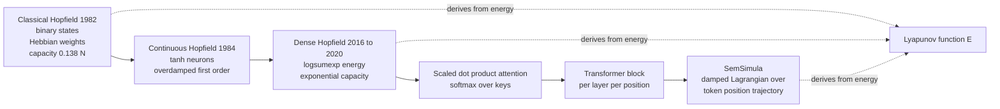
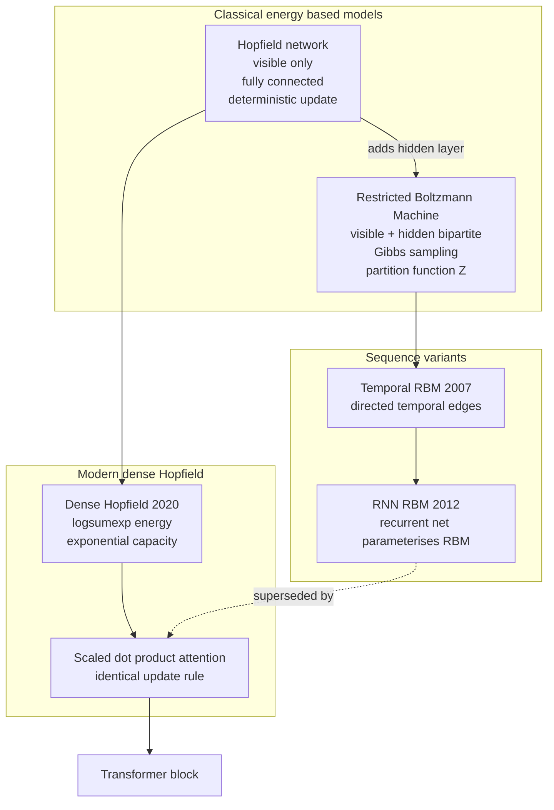
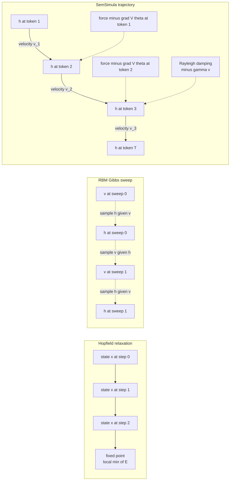

# Semantic Simulation and the Energy-Based Lineage: A Technical Comparison with Hopfield Networks and Restricted Boltzmann Machines

**Technical Report — SemSimula Project, Companion Notes Series**  
**Author:** D. P. Gueorguiev  
**Date:** May 2026  
**Version:** 1.0

---

## Abstract

This report examines the formal and operational relationship between the Semantic Simulation (SemSimula) framework and two classical energy-based models — the Hopfield network and the Restricted Boltzmann Machine (RBM) — that are sometimes proposed as theoretical antecedents of energy-based language modelling. Section 2 develops the mathematical formulations of the classical Hopfield network, the Goles–Hopfield energy theorem, the continuous-time Hopfield model, and the dense Hopfield network of Ramsauer et al. (2020), including the explicit algebraic identification of the dense Hopfield update with scaled dot-product attention. Section 3 develops the analogous treatment of Restricted Boltzmann Machines and their conditional/temporal variants. Section 4 formalises the SemSimula damped-Lagrangian flow as a second-order dynamical system on the token-position axis, together with the STP-acceleration identity and the SPLM constructive instantiation. Section 5 presents a comparative analysis along eight structural dimensions. The principal finding is that the Hopfield/RBM lineage operates on a *relaxation* time axis (steps toward a fixed point within a single inference call), whereas SemSimula operates on a *trajectory* time axis (the sequence of hidden states indexed by token position). The two frameworks are therefore compositional: SemSimula reads each Hopfield-equivalent attention step as the inner update of a larger trajectory-axis dynamical system whose observables (velocity, acceleration, dissipation, the per-layer $R^{2}$ separator) are not contained in or derivable from the predecessor literature.

**Keywords:** Hopfield networks, Restricted Boltzmann Machines, dense associative memory, transformer attention, Lagrangian mechanics, Semantic Simulation, SPLM, language modelling, trajectory dynamics.

---

## Table of contents

1. [Introduction](#1-introduction)
2. [Hopfield networks](#2-hopfield-networks)
   - 2.1 [Classical formulation](#21-classical-formulation)
   - 2.2 [The Goles–Hopfield energy theorem](#22-the-goleshopfield-energy-theorem)
   - 2.3 [Continuous-time extension](#23-continuous-time-extension)
   - 2.4 [Dense Hopfield networks and the attention identity](#24-dense-hopfield-networks-and-the-attention-identity)
3. [Restricted Boltzmann Machines](#3-restricted-boltzmann-machines)
   - 3.1 [Definition and Gibbs structure](#31-definition-and-gibbs-structure)
   - 3.2 [Conditional and temporal variants](#32-conditional-and-temporal-variants)
   - 3.3 [Empirical limitations for sequence modelling](#33-empirical-limitations-for-sequence-modelling)
4. [The Semantic Simulation framework](#4-the-semantic-simulation-framework)
   - 4.1 [Hidden-state trajectories as second-order dynamics](#41-hidden-state-trajectories-as-second-order-dynamics)
   - 4.2 [The STP-acceleration identity](#42-the-stp-acceleration-identity)
   - 4.3 [Constructive instantiation: the Scalar-Potential Language Model](#43-constructive-instantiation-the-scalar-potential-language-model)
5. [Comparative analysis](#5-comparative-analysis)
   - 5.1 [Time axis: relaxation versus trajectory](#51-time-axis-relaxation-versus-trajectory)
   - 5.2 [Order of dynamics and the role of velocity](#52-order-of-dynamics-and-the-role-of-velocity)
   - 5.3 [Interaction symmetry and causal directedness](#53-interaction-symmetry-and-causal-directedness)
   - 5.4 [Variational backbone and diagnostic targets](#54-variational-backbone-and-diagnostic-targets)
   - 5.5 [Why a second-order Hopfield extension does not recover SemSimula](#55-why-a-second-order-hopfield-extension-does-not-recover-semsimula)
6. [Conclusions](#6-conclusions)
7. [References](#7-references)

---

## 1. Introduction

The proliferation of energy-based formulations in deep learning — from classical Hopfield networks (1982) through Restricted Boltzmann Machines (1986–2002), through dense Hopfield networks (2016–2020), to the identification of attention as Hopfield retrieval (Ramsauer et al., 2020) — raises a precise question for any new energy-based framework: whether it offers a genuinely new dynamical regime, or whether it recovers what the predecessor literature already provides.

The Semantic Simulation framework presents exactly such a case. It is energy-based: forces on hidden states are gradients of a learned scalar potential. It targets language modelling: the same domain in which dense Hopfield was identified with attention. It is constructive: the Scalar-Potential Language Model instantiates the framework as a working architecture.

This report examines, in technical detail, whether the SemSimula framework is recoverable from the Hopfield / RBM lineage or whether it operates in a structurally distinct regime that the predecessor literature does not cover. The analysis proceeds by formally developing each predecessor, identifying the mathematical axes along which it operates, and comparing those axes against the formal definition of SemSimula's damped-Lagrangian flow.

The principal finding, derived in Section 5, is that the Hopfield / RBM lineage operates on a *relaxation* time axis (steps toward a fixed point within a single inference call), whereas SemSimula operates on a *trajectory* time axis (the sequence of hidden states indexed by token position). This axis difference is not removable by raising the order of the predecessor ODE; it reflects a fundamentally different choice of which mathematical object the dynamical system acts upon.

---

## 2. Hopfield networks

### 2.1 Classical formulation

A classical Hopfield network is an undirected graph of $N$ binary neurons $s_i \in \lbrace -1, +1 \rbrace$ for $i = 1, \dots, N$, equipped with a symmetric synaptic weight matrix $W \in \mathbb{R}^{N \times N}$ with $W = W^T$ and $W_{ii} = 0$, and an external bias $b \in \mathbb{R}^N$.

The defining quantity is the energy (Lyapunov function)

$$
E(s) = -\tfrac{1}{2} s^{T} W s - b^{T} s.
$$

The asynchronous update rule visits one neuron $i$ at a time and applies

$$
s_i \leftarrow \mathrm{sgn}\Big( \sum_{j \neq i} W_{ij} s_j + b_i \Big),
$$

where $\mathrm{sgn}(\cdot)$ returns $+1$ if its argument is non-negative and $-1$ otherwise.

Each stored pattern $\xi^{\mu} \in \lbrace -1, +1 \rbrace^{N}$ is impressed into $W$ by the Hebbian rule

$$
W_{ij} = \frac{1}{N} \sum_{\mu=1}^{P} \xi^{\mu}_{i} \xi^{\mu}_{j} \qquad (i \neq j),
$$

so that each stored pattern is, by construction, a local minimum of $E$ under the asynchronous update rule (Hopfield, 1982).

For $P$ patterns drawn uniformly at random from $\lbrace -1, +1 \rbrace^{N}$, asymptotically reliable retrieval is possible up to $P \approx 0.138 N$ patterns. Above this Hopfield capacity, retrieval errors grow superlinearly.

### 2.2 The Goles–Hopfield energy theorem

The reason Hopfield dynamics constitute a canonical example of energy-derived cellular automata is the following classical theorem.

**Theorem (Goles–Hopfield).** For any symmetric $W = W^T$ with $W_{ii} = 0$ and any bias $b$, under asynchronous updates the energy

$$
E(s) = -\tfrac{1}{2} s^{T} W s - b^{T} s
$$

is non-increasing at every step, i.e., $E(s^{\text{new}}) \le E(s^{\text{old}})$. Since $E$ takes finitely many values on the discrete state space $\lbrace -1, +1 \rbrace^{N}$, every trajectory converges in finite time to a fixed point (a local minimum of $E$).

**Proof sketch.** Updating neuron $i$ changes the energy by

$$
\Delta E_i = -\Delta s_i \cdot \Big( \sum_{j \neq i} W_{ij} s_j + b_i \Big) = -\Delta s_i \cdot h_i,
$$

where $h_i$ is the local field at neuron $i$ and $\Delta s_i = s_i^{\text{new}} - s_i^{\text{old}} \in \lbrace -2, 0, +2 \rbrace$. The update rule selects $s_i^{\text{new}} = \mathrm{sgn}(h_i)$, so $\Delta s_i$ and $h_i$ have the same sign whenever $\Delta s_i \neq 0$, giving $\Delta E_i \le 0$. $\square$

The theorem provides a cellular automaton derived entirely from a prescribed energy landscape. The dynamics are the update rule; the energy is the Lyapunov function; convergence is guaranteed.

The symmetry constraint $W = W^T$ is load-bearing: the proof combines the $(i, j)$ and $(j, i)$ contributions into the symmetric quadratic form $-\tfrac{1}{2} s^{T} W s$. Without symmetry, no global Lyapunov function exists; the dynamics can cycle indefinitely or diverge. This restriction is one of the structural axes along which the Hopfield framework will not extend cleanly to autoregressive language modelling, since the causal context pool $\xi_t = \frac{1}{t} \sum_{s \le t} h_s$ used by SemSimula is intrinsically asymmetric (past influences future, not the reverse).

### 2.3 Continuous-time extension

Hopfield (1984) extended the discrete model to continuous-valued neurons $u_i \in \mathbb{R}$ with a smooth gain function $V_i = g(u_i)$ (typically $g = \tanh$), and showed that the gradient flow

$$
\dot{u}_i = -\frac{u_i}{\tau} + \sum_{j} W_{ij} g(u_j) + b_i
$$

minimises the Lyapunov function

$$
E(u) = -\tfrac{1}{2} \sum_{i,j} W_{ij} g(u_i) g(u_j) + \sum_{i} \frac{1}{\tau} \int_{0}^{u_i} g^{-1}(v) dv - \sum_{i} b_i g(u_i).
$$

The continuous Hopfield network inherits all the symmetry constraints of its discrete counterpart. The flow is first-order (overdamped): a single time-derivative $\dot{u}$ appears, no acceleration, and the dynamics admit no concept of momentum. This is the second structural axis along which the predecessor lineage and SemSimula diverge, since the central observation of the SemSimula trajectory paper is that pretrained-transformer hidden-state trajectories carry both velocity and acceleration, with the latter decomposable into tangential and normal components (Section 4.2).

### 2.4 Dense Hopfield networks and the attention identity

The classical Hopfield capacity of $0.138 N$ patterns is insufficient for modern applications. Krotov & Hopfield (2016) and Demircigil et al. (2017) introduced higher-order Hopfield variants whose energy is a higher-degree polynomial in the state, raising the storage capacity polynomially or exponentially in $N$. Ramsauer et al. (2020) closed this development with a dense Hopfield network whose energy is

$$
E(\xi) = -\mathrm{lse}(\beta, \Xi^{T}\xi) + \tfrac{1}{2} \xi^{T}\xi + \beta^{-1} \log P + \tfrac{1}{2} M^{2},
$$

where $\xi \in \mathbb{R}^{d}$ is the query state, $\Xi \in \mathbb{R}^{d \times P}$ stacks $P$ stored patterns column-wise, $\beta \gt 0$ is an inverse-temperature parameter, $M = \max_{\mu} \lVert \xi^{\mu} \rVert$, and

$$
\mathrm{lse}(\beta, z) = \beta^{-1} \log \Big( \sum_{\mu} \exp(\beta z_{\mu}) \Big)
$$

is the log-sum-exp operator. The corresponding update rule is one step of fixed-point iteration on the energy gradient:

$$
\xi^{\text{new}} = \Xi \mathrm{softmax}(\beta \Xi^{T}\xi).
$$

With this energy, $\Theta(\exp(d/2))$ random patterns can be stored and retrieved with vanishing error probability, a complete reversal of the classical $0.138 N$ ceiling.

**The attention identity.** The right-hand side of the update rule above is, under the identification $(\xi, \Xi, \beta) \leftrightarrow (\text{query}, \text{keys}, 1/\sqrt{d_k})$, exactly the scaled dot-product attention of a single head in a transformer block:

$$
\text{Attn}(Q, K, V) = V \cdot \mathrm{softmax}\Big( \frac{K^{T} Q}{\sqrt{d_k}} \Big).
$$

A single attention head is therefore, in a precise algebraic sense, one step of dense-Hopfield energy minimisation toward the nearest stored pattern. This identification is the principal point of contact between the Hopfield lineage and SemSimula: the attention operator whose hidden-state trajectories SemSimula studies is itself energy-derived in the dense Hopfield sense.

The canonical lineage from classical Hopfield through dense Hopfield to transformer attention is summarised in Figure 1.

**Figure 1.** Canonical lineage from classical Hopfield through dense Hopfield to transformer attention, with SemSimula positioned as the next-level dynamical system whose inner update rule is the dense-Hopfield attention step.

---

## 3. Restricted Boltzmann Machines

### 3.1 Definition and Gibbs structure

A Restricted Boltzmann Machine (Smolensky, 1986; Hinton, 2002) is a bipartite undirected graphical model with $n_v$ visible binary units $v \in \lbrace 0, 1 \rbrace^{n_v}$ and $n_h$ hidden binary units $h \in \lbrace 0, 1 \rbrace^{n_h}$. The energy is bilinear:

$$
E(v, h) = - v^{T} W h - a^{T} v - b^{T} h,
$$

with $W \in \mathbb{R}^{n_v \times n_h}$, visible biases $a$, and hidden biases $b$. The joint distribution is the Gibbs distribution

$$
p(v, h) = \frac{1}{Z} \exp(-E(v, h)), \qquad Z = \sum_{v, h} \exp(-E(v, h)).
$$

The restricted topology — no visible-to-visible or hidden-to-hidden connections — yields tractable conditional distributions:

$$
p(h_j = 1 \mid v) = \sigma\Big( b_j + \sum_{i} W_{ij} v_i \Big),
$$

$$
p(v_i = 1 \mid h) = \sigma\Big( a_i + \sum_{j} W_{ij} h_j \Big),
$$

with $\sigma$ the logistic sigmoid. This factorisation makes RBMs practical by enabling block-Gibbs sampling (alternating updates of $v$ and $h$) and the Contrastive Divergence training algorithm of Hinton (2002).

The maximum-likelihood gradient of $\log p(v)$ has the form

$$
\frac{\partial \log p(v)}{\partial W_{ij}} = \mathbb{E}_{\text{data}}[v_i h_j] - \mathbb{E}_{\text{model}}[v_i h_j],
$$

where the data expectation is closed-form (by the factorised $p(h \mid v)$) and the model expectation is approximated by truncated Gibbs sampling.

An RBM with binary $\pm 1$ neurons (instead of $\lbrace 0, 1 \rbrace$), and visibles and hiddens collapsed into a single layer, recovers the Hopfield energy form. RBMs may be viewed as a stochastic relative of Hopfield networks that adds a hidden layer to capture higher-order statistics.

### 3.2 Conditional and temporal variants

Two notable extensions of RBMs to sequence modelling appeared in the late 2000s:

The Temporal Restricted Boltzmann Machine (Sutskever & Hinton, 2007) introduces directed connections from past hidden states $h_{t-k}, \dots, h_{t-1}$ into the current $h_t$. The conditional structure becomes a Markov chain of RBMs.

The RNN-RBM (Boulanger-Lewandowski, Bengio, & Vincent, 2012) generalises this by replacing directed temporal connections with a recurrent neural network whose hidden state parameterises an RBM at each step. This architecture achieved competitive results on polyphonic music modelling at the time.

### 3.3 Empirical limitations for sequence modelling

Neither of these extensions became the standard for language modelling. The failure modes are summarised in Table 1.

| Failure mode | Mechanism |
|---|---|
| Intractable partition function $Z$ | Exact likelihood evaluation is exponential in $\min(n_v, n_h)$; cross-architecture comparisons rely on noisy estimators (Annealed Importance Sampling). |
| Slow autoregressive sampling | Generation requires Gibbs sampling at every time step, with no closed-form sampling shortcut. Per-token cost is $O(K \cdot n_h)$ for $K$ Gibbs steps. |
| Symmetric bipartite structure | The energy assumes undirected, symmetric pairwise interactions between $v$ and $h$. Modelling causal next-token prediction requires grafting on directed temporal edges that break the energy formalism. |
| No depth-stacking guarantee | Stacking RBMs into Deep Belief Networks gives a generative model whose lower layers no longer admit closed-form conditional structure; training is greedy and layer-wise. |
| Empirical dominance by LSTMs and transformers | By 2014–2017 LSTMs and then transformers had taken decisive perplexity leadership on character- and word-level benchmarks, with two orders of magnitude faster training and one order of magnitude faster sampling. |

**Table 1.** Failure modes of the RBM-based language-modelling line that prevented it from scaling to modern benchmarks.

The structural relationship between the two energy-based families is summarised in Figure 2.

**Figure 2.** Structural relationship between the Hopfield and RBM families and their sequence variants. The dense-Hopfield branch reaches modern language modelling through the attention identity; the RBM-sequence branch is superseded by transformer architectures.

---

## 4. The Semantic Simulation framework

### 4.1 Hidden-state trajectories as second-order dynamics

Let $h^{(\ell)}_t \in \mathbb{R}^d$ denote the hidden state at layer $\ell$ and token position $t$ of a transformer-class model. The Semantic Simulation framework posits that the per-position trajectory

$$
t \mapsto h^{(\ell)}_t, \qquad t = 1, 2, \dots, T,
$$

is governed approximately by a second-order damped Lagrangian flow in continuous time:

$$
w_t \ddot{h}\_t + \gamma(h_t) \dot{h}\_t = -\nabla\_h V_\theta(\xi_t, h_t),
$$

where the discrete time-derivatives along the sequence axis are defined as

$$
\dot{h}_t = h_{t+1} - h_t, \qquad \ddot{h}_t = h_{t+1} - 2 h_t + h_{t-1},
$$

and:

- $\dot{h}\_t$ and $\ddot{h}\_t$ are the discrete velocity and acceleration;
- $w_t \gt 0$ is an effective inertial weight (semantic mass);
- $\gamma(h_t) \ge 0$ is a Rayleigh dissipation coefficient;
- $V_\theta(\xi, h)$ is a learned scalar potential conditioned on the causal context pool $\xi_t = \frac{1}{t} \sum_{s \le t} h_s$.

The right-hand side is a conservative force (the negative gradient of a scalar potential), placing the framework in the Hopfield lineage at the level of force-law specification. The left-hand side carries the temporal structure that Hopfield and RBM dynamics lack: a second-order time derivative and a velocity-dependent damping term.

### 4.2 The STP-acceleration identity

The empirical content of the SemSimula trajectory paper (Gueorguiev, 2026a) is summarised by the STP-acceleration identity:

$$
\mathcal{L}\_{\mathrm{STP}}(h_{t-1}, h_t, h_{t+1}) = 1 - \sqrt{ 1 - \frac{ \lVert \vec{a}_{\perp} \rVert^{2} }{ \lVert \Delta^{2} h \rVert^{2} } },
$$

verified at machine precision on GPT-2 small over 1,314 consecutive triplets ($r = 1.000000000$, max residual $1.7 \times 10^{-13}$).

The decomposition $\Delta^{2} h = \vec{a}\_{\parallel} + \vec{a}\_{\perp}$ — tangential plus normal acceleration along the trajectory direction — supplies the diagnostic reach of the framework. The framework supports three categorical observations about hidden-state trajectories:

- whether trajectories decelerate (do work against the conservative force),
- whether trajectories curve (transfer energy from tangential into normal components), and
- whether trajectories behave as pure relaxation flows (negligible acceleration).

The descriptive answer for pretrained transformers (Sections 5–6 of Gueorguiev, 2026a) is unambiguous: tangential deceleration dominates normal acceleration, and the trajectory profile is that of a damped Lagrangian flow rather than an overdamped relaxation. Figure 3 shows the supporting evidence on GPT-2 small.

**Figure 3.** Tangential versus normal acceleration on GPT-2 small. The distribution is strongly biased toward $a_{\parallel} \lt 0$ (deceleration), with the tangential component dominating the normal component on every measured triplet. This is the empirical signature of a damped Lagrangian flow rather than a Hopfield-style overdamped relaxation.

### 4.3 Constructive instantiation: the Scalar-Potential Language Model

The Scalar-Potential Language Model (SPLM), introduced in Section 8 of Gueorguiev (2026a) and Section 15 of Gueorguiev (2026b), instantiates the damped Lagrangian equation of Section 4.1 as a working language model. The model integrates $\ddot{h}\_t$ via a velocity-Verlet scheme and learns $V_\theta$ end-to-end. The SPLM positive control achieves a per-layer shared-potential separator $R^{2}\_{\mathrm{SPLM}} = 0.957$, against $R^{2}\_{\text{matched-attention}} = 0.54$ and $R^{2}\_{\text{GPT-2}} = 0.46$, establishing the three-way separator of Gueorguiev (2026a, §8).

**Figure 4.** The vanilla SPLM architecture (Section 15 of Gueorguiev, 2026b). The conservative force $-\nabla_h V_\theta(\xi_t, h_t)$ acts at every layer-step; the velocity-Verlet integrator carries momentum across token positions; the Rayleigh damping $-\gamma \dot{h}\_t$ is folded into the integrator update. The closest Hopfield-lineage analogue is the dense Hopfield energy of Section 2.4, with the distinction that the SemSimula potential acts along the token-position axis rather than the relaxation-step axis of a single forward pass.

---

## 5. Comparative analysis

The structural distinctions between SemSimula and the energy-based predecessors are summarised in Table 2 and developed in detail in the subsections below.

| Axis | Hopfield / dense Hopfield | RBM family | SemSimula |
|---|---|---|---|
| Time variable | Relaxation step $k$ (within one inference call) | Gibbs-sweep step $k$ | Token position $t$ in the input sequence |
| Order of dynamics | First-order overdamped | Stochastic (no ODE) | Second-order damped |
| State velocity | Not defined | Not defined | $\dot{h}_t = \Delta h_t$ |
| State acceleration | Not defined | Not defined | $\ddot{h}_t = \Delta^{2} h_t$ |
| Force law | $-\nabla E$, purely conservative | Stochastic Gibbs flips | Conservative $-\nabla V_\theta$ plus dissipative $-\gamma \dot h$ |
| Interaction symmetry | $W = W^{T}$ (required for Lyapunov) | $W$ bipartite symmetric | Causal asymmetric (force on $h_t$ depends on $\xi_{s \le t}$ only) |
| Context conditioning | None (single state) | None per sample | Causal context pool $\xi_t$ over past trajectory |
| Convergence target | Stored pattern (attractor) | Equilibrium distribution | Next-token prediction; trajectory geometry |
| Central observable | Pattern-retrieval success rate | Held-out log-likelihood | STP loss; tangential/normal acceleration; per-layer $R^{2}$ |
| Variational backbone | Lyapunov $E$ on state space | Free energy $-\log Z$ | Action functional along trajectory (Lagrangian density) |

**Table 2.** Side-by-side structural comparison across ten dimensions.

### 5.1 Time axis: relaxation versus trajectory

Hopfield and RBM dynamics operate on a single time axis: the inference-time relaxation that maps an input to a fixed point or a sample. SemSimula's hidden-state dynamics operate on a different time axis indexed by token position. The central empirical claim of the SemSimula trajectory paper is that, on this axis, the second-order structure (velocity, acceleration, dissipation) is non-negligible and diagnostically informative.

Figure 5 shows the three time axes side by side.

**Figure 5.** Three time axes for energy-based dynamical systems. The Hopfield axis is vertical relaxation within a single inference (the network iterates until it converges). The RBM axis is Gibbs sweeps within a single inference. The SemSimula axis is the horizontal sequence of token positions — a structurally different object that no energy-based predecessor models directly.

### 5.2 Order of dynamics and the role of velocity

Both the continuous Hopfield equation of Section 2.3 and the implicit Gibbs dynamics of RBMs are first-order in time: only a single derivative of the state appears, and the dynamics correspond to overdamped flow on the energy landscape. No notion of momentum, velocity, or acceleration is intrinsic to either framework.

The SemSimula formulation is second-order: the inertial term $w_t \ddot{h}\_t$ on the left-hand side of the damped Lagrangian equation enables trajectories to carry kinetic energy and to exhibit deceleration patterns under the dissipative term $\gamma(h_t) \dot{h}\_t$. The STP-acceleration identity of Section 4.2 is a direct consequence of this second-order structure and has no analogue in the first-order Hopfield / RBM framework.

### 5.3 Interaction symmetry and causal directedness

The Goles–Hopfield theorem requires $W = W^{T}$ for the Lyapunov function to exist. The RBM bipartite structure is similarly symmetric in $(v, h)$. Both frameworks model undirected pairwise interactions.

The SemSimula force law is causally directed: the force on $h_t$ depends on the context pool $\xi_t = \frac{1}{t} \sum_{s \le t} h_s$, which averages only over past positions $s \le t$. Future positions $s \gt t$ do not influence the current force. This causal asymmetry is incompatible with the symmetric-interaction premise of Hopfield and RBM, and is what makes the framework compatible with autoregressive generation.

### 5.4 Variational backbone and diagnostic targets

All three frameworks derive forces from a scalar quantity:

- Hopfield uses a Lyapunov function $E(s)$ defined on state space.
- RBMs use a free energy $-\log Z$ derived from the partition function.
- SemSimula uses an action functional along the trajectory (a Lagrangian density on the token-position axis).

The variational backbones are mathematically analogous but the objects they act on are structurally different. The Hopfield Lyapunov function acts on instantaneous states; the SemSimula Lagrangian acts on trajectories. The Hopfield observable is retrieval success; the SemSimula observables are velocity, acceleration, the tangential/normal decomposition, and the per-layer $R^{2}$ separator. These observables are not derivable from the Hopfield / RBM corpus because they are properties of the trajectory, not of any single state.

### 5.5 Why a second-order Hopfield extension does not recover SemSimula

A natural objection at this point is that adding a second-derivative term to the continuous Hopfield equation should recover SemSimula's structure. Mechanically, the resulting Hopfield-with-momentum equation

$$
m \ddot{u}_i + \gamma \dot{u}_i = -\nabla_{u_i} E(u)
$$

is a well-defined second-order damped flow on the relaxation axis. However, the resulting dynamics still live on the relaxation axis (steps within a single forward pass toward a stored pattern), not on the sequence axis (the trajectory $t \mapsto h_t$ over the input tokens). The mismatch is not resolved by raising the order of the ODE; it is a mismatch in which axis the differential equation lives on. Hopfield-with-momentum yields damped pattern retrieval; SemSimula yields damped sentence generation.

A further observation: each attention block in a transformer is, by the Ramsauer identification of Section 2.4, one step of dense-Hopfield energy minimisation against the layer's keys and values. SemSimula reads the resulting per-position hidden state $h^{(\ell+1)}\_t$ as the next sample along a continuous-time trajectory, then asks whether successive per-layer-step outputs $h^{(\ell+1)}\_1, h^{(\ell+1)}\_2, \dots$ trace out a damped Lagrangian flow. SemSimula is therefore the outer dynamical system whose inner update rule is dense-Hopfield attention; the two frameworks are compositional rather than competing.

---

## 6. Conclusions

The structural analysis of Sections 2–5 supports the following conclusions.

**(C1) The Hopfield and RBM lineages are not language models on the sequence axis.** They are relaxation dynamics for pattern retrieval (Hopfield) and stochastic generative samplers (RBM). The dimension they do not model is the trajectory of hidden states $t \mapsto h^{(\ell)}_t$ over the token sequence.

**(C2) The variational structure that SemSimula adds is genuinely new on the trajectory axis.** Velocity, acceleration, the tangential/normal decomposition, the Rayleigh dissipation term, the STP-acceleration identity, and the per-layer $R^{2}$ diagnostic are all trajectory-axis observables. None of them have analogues in the classical or dense Hopfield literature, or in the RBM literature.

**(C3) The empirical content is independent of the predecessor literature.** The three-way $R^{2}$ separator ($0.957$ / $0.54$ / $0.46$) reported in Gueorguiev (2026a) measures how well the trajectory of hidden states fits a damped-Lagrangian ansatz. The Hopfield / RBM framework does not predict this number; it predicts pattern-retrieval success or held-out log-likelihood instead. The two diagnostic targets are orthogonal.

**(C4) The frameworks are compositional, not competing.** SemSimula uses the Hopfield-attention identification of Ramsauer et al. (2020) as a working description of the per-layer-step inner loop, and addresses a structurally orthogonal question about the trajectory produced when these inner loops are chained along the sequence axis. The answer — damped Lagrangian flow with a tangential-deceleration signature — is not contained in or derivable from the Hopfield / RBM corpus. The SPLM architecture (Section 4.3) is a constructive demonstration that the trajectory-axis dynamics can be turned into a working language model in their own right.

---

## 7. References

- Boulanger-Lewandowski, N., Bengio, Y., & Vincent, P. (2012). *Modeling temporal dependencies in high-dimensional sequences: application to polyphonic music generation and transcription.* ICML.
- Demircigil, M., Heusel, J., Löwe, M., Upgang, S., & Vermet, F. (2017). *On a model of associative memory with huge storage capacity.* Journal of Statistical Physics.
- Goles-Chacc, E., Fogelman-Soulié, F., & Pellegrin, D. (1985). *Decreasing energy functions as a tool for studying threshold networks.* Discrete Applied Mathematics.
- Hinton, G. E. (2002). *Training products of experts by minimizing contrastive divergence.* Neural Computation.
- Hopfield, J. J. (1982). *Neural networks and physical systems with emergent collective computational abilities.* PNAS.
- Hopfield, J. J. (1984). *Neurons with graded response have collective computational properties like those of two-state neurons.* PNAS.
- Krotov, D., & Hopfield, J. J. (2016). *Dense associative memory for pattern recognition.* NeurIPS.
- Ramsauer, H., Schäfl, B., Lehner, J., Seidl, P., Widrich, M., Adler, T., Gruber, L., Holzleitner, M., Pavlović, M., Sandve, G. K., Greiff, V., Kreil, D., Kopp, M., Klambauer, G., Brandstetter, J., & Hochreiter, S. (2020). *Hopfield networks is all you need.* arXiv:2008.02217.
- Smolensky, P. (1986). *Information processing in dynamical systems: foundations of harmony theory.* In *Parallel Distributed Processing*, vol. 1.
- Sutskever, I., & Hinton, G. E. (2007). *Learning multilevel distributed representations for high-dimensional sequences.* AISTATS.
- Gueorguiev, D. P. (2026a). *Locally Conservative, Globally Not: Diagnosing the Lagrangian Structure of Pretrained Transformers.* Transactions on Machine Learning Research (under review). Companion code: `paper_tmlr_1`.
- Gueorguiev, D. P. (2026b). *Semantic Simulation: A Lagrangian-Mechanical Framework for Language Modeling.* Project mega-paper, `paper_v4` / `paper_v5`.
