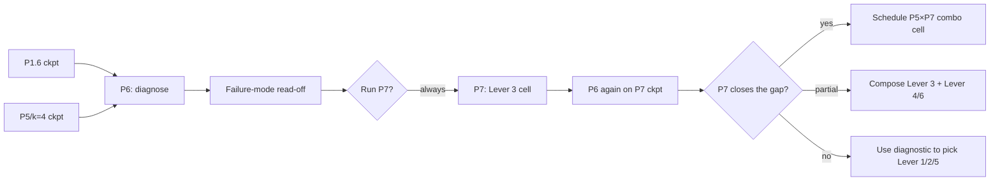
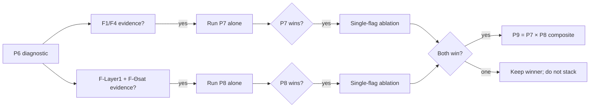
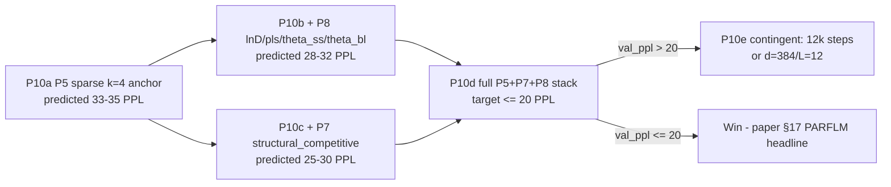
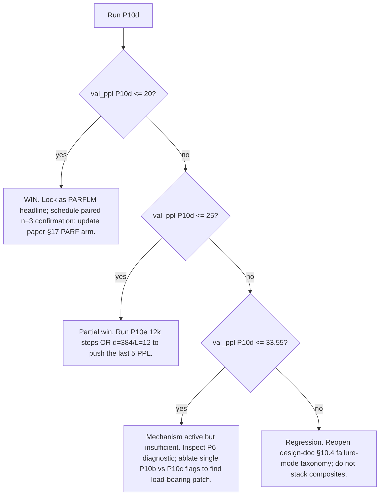

# PARF-SPLM (Q9c, PARF-augmented SPLM) — Path Forward and Experiments

**Status:** Live experiment record · started 6 May 2026 · *no quality cells run yet*
**Scope paper:** `paper_v4/main.tex` (§17, PARF-Augmented SPLM)
**Design doc:** [`PARF_Augmented_SPLM_Architecture.md`](PARF_Augmented_SPLM_Architecture.md)
**Sibling path (Q9d, layer-type Helmholtz hybrid):** [`Helmholtz-HSPLM_Path_Forward_and_Experiments.md`](Helmholtz-HSPLM_Path_Forward_and_Experiments.md)
**Sibling path (Variant A two-stage SPLM):** [`HSPLM_Path_Forward_and_Experiments.md`](HSPLM_Path_Forward_and_Experiments.md)
**Code root:** `notebooks/conservative_arch/parf/`

This document tracks the design, experiments, results, and outstanding
questions of the **PARF-augmented SPLM (Q9c)** investigation — the
*pair-potential* extension of SPLM. The investigation runs in
parallel with the Variant A two-stage HSPLM (`hybrid/`) and the Q9d
layer-type Helmholtz hybrid (`helmholtz/`), and tests the broader
claim that the v3 paper's §5 PARF prescription admits a constructive,
end-to-end-trainable language model in which the pair-interaction
scalar $V_\phi$ is jointly learned with the per-token scalar $V_\theta$
under strict causality and a single shared energy field.

The Q9c construction extends the SPLM Lagrangian by adding a
pair-interaction term to the per-layer effective scalar:

$$
U^{(\ell)}_t = V_\theta(\xi_t, h_t) + \sum_{s \lt t} V_\phi(h_t, h_s)
$$

with the design-doc §3 **causal reduction** (past tokens are treated
as fixed external sources by `.detach()`-ing the source slice
$\lbrace h_s \rbrace_{s \lt t}$ when forming the pair-potential matrix).
This both severs the back-reaction force on past tokens and makes
the per-token force strictly causal, in the same sense as the
v3 leak-fix invariant for $V_\theta$.

The pre-registered title-justification rule from
[`Paper_Title_Discussion_post_causal_leak.md`](Paper_Title_Discussion_post_causal_leak.md)
§6.5 applies unchanged at the Q9c quality arm:

> **"Efficient" is justified iff** some hybrid achieves val PPL
> within **+5 PPL** of the all-attention baseline (~150 on Tiny
> Shakespeare at d=128, L=8) **AND** its analytical decode-FLOP cost
> at T = 1024 is **≥ 30% lower** than all-attention, both at S=3 with
> sign-consistency 3/3.

Q9c adds two architecture-level open questions (the design doc's
§5.1 and §5.2 commitments, lifted to OQ-1 / OQ-2 in the v4 draft):

- **OQ-1 (structural prior).** If the structural $V_\phi$ (the
  §5.1-faithful form $-C \cdot \Theta_\phi(\theta(h_t),\theta(h_s)) \cdot \Phi_\phi(l(h_t),l(h_s)) / \sqrt{\lVert h_t - h_s \rVert^2 + \varepsilon^2}$)
  matches an unstructured MLP $V_\phi$ on val PPL, the §5.1 prior is
  pedagogical. If it outperforms, the prior is empirically active.
- **OQ-2 (joint pair test).** Does the learned $V_\phi$ assign
  measurable interaction strength to pairs that real GPT-style
  attention also attends to, on the same sentences?

These are the *framework-native* deliverables that the val PPL +
decode-FLOP table does not capture; they are scheduled for P3
(post-P2 confirmation).

---

## 1. Architecture (Q9c, every layer is a velocity-Verlet step under $V_\theta + \sum_{s \lt t} V_\phi$)

```text
h_0     = E[x] + P
h_prev  = h_0
for ell in 1..L:
    delta = h - h_prev                               # velocity proxy (carries across layers)
    xi    = causal_cumulative_mean(h.detach())       # leak-fix invariant (V_theta arm)
    h_src = h.detach()                               # causal reduction (V_phi arm)

    V_th_per_token = V_theta(xi, h)                  # (B, T, 1)  shared V_theta
    P_pair         = V_phi(h, h_src)                 # (B, T, T)  shared V_phi
    P_pair_masked  = mask_strict_lower(P_pair)       # only s < t survives the sum

    U     = V_th_per_token.sum() + P_pair_masked.sum()
    f     = -grad_h U                                # single autograd.grad call

    denom = 1 + dt*gamma
    h_new = h + delta / denom + (dt^2 / (m_b * denom)) * f
    h_new = LayerNorm(h_new)                         # if ln_after_step
    h_prev, h = h, h_new

logits = h @ E^T                                     # tied embeddings
```

Implementation: `notebooks/conservative_arch/parf/model_parf.py`.
Fixed design choices (matching Q9d / Variant A where possible):

- **xi re-derivation = `causal_cumulative_mean(h.detach())`** at every
  layer — leak-safe; same shape as Q9d.
- **`h_src = h.detach()` at every layer** — the new PARF-specific
  causal-reduction `.detach()` point. Severs back-reaction forces
  on past tokens, makes the per-token force strictly causal, and
  is the architectural commitment that makes Algorithm A (pure
  NTP backprop) tractable.
- **Single shared `V_theta`** across all layers — same as Q9d / VA.
- **Single shared `V_phi`** across all layers — the PARF analogue
  of the "single energy field" commitment. Two variants ship:
  - `structural` — the §5.1-faithful pair potential (default).
  - `mlp` — unstructured MLP on
    $\mathrm{concat}(h_t, h_s, h_t - h_s)$ (the OQ-1 comparator).
- **Velocity-Verlet step** — same damped position-Verlet form as Q9d
  S-blocks; see [`On_Velocity-Verlet_Integrator.md`](On_Velocity-Verlet_Integrator.md).
- **Combined `autograd.grad` on $V_\theta + V_\phi$** — a single
  scalar `U` is summed and the force is recovered with one
  `torch.autograd.grad(U, h_in, create_graph=self.training)` call,
  halving the second-order graph cost vs separate per-potential
  calls.
- **Optional `torch.utils.checkpoint`** on the $V_\phi$ pair-sum
  call (`PARFConfig.use_grad_checkpoint`) — auto-enabled for the
  MLP variant by `scripts/run_first_quality_cell.sh` to fit within
  the 13.5 GB MPS watermark; not needed for the structural variant
  at the prototype shape. Bit-equality of training trace with and
  without checkpointing is verified by `smoke_test.py`'s `[3/3]
  em-ln+gc` block.
- **`ln_after_step=True`** — LN after each velocity-Verlet step,
  matches Q9d / VA / em-ln-leakfree.
- **`causal_force=True` is hard-default** — preserves v3 leak-fix
  invariant *and* the new PARF-specific h_src `.detach()`.
- **Tied embeddings** with `E.weight.T` for the LM head.
- **Per-token logfreq mass** (`mass_mode='logfreq'`) — matches
  leak-free SPLM em_ln, Q9d, and VA.

### V_phi shape registry

| variant       | shape                                                                                                                                        | params (em-ln cell) | role                                                              |
|---------------|----------------------------------------------------------------------------------------------------------------------------------------------|--------------------:|-------------------------------------------------------------------|
| `structural`  | $-C \cdot \Theta_\phi(\theta(h_t), \theta(h_s)) \cdot \Phi_\phi(l(h_t), l(h_s)) / \sqrt{\lVert h_t - h_s \rVert^2 + \varepsilon^2}$           | 4,002               | **§5.1-faithful pair potential** (default; the framework prior)   |
| `mlp`         | learned MLP on $\mathrm{concat}(h_t, h_s, h_t - h_s)$ at hidden $H$ = `mlp_h`                                                                  | 28,865              | **unstructured ablation** (the design-doc OQ-1 comparator)        |

Both variants share the SAME outer machinery (single shared
$V_\theta$, velocity-Verlet step, causal reduction, logfreq mass,
embed/logits shape). The only difference is the inner shape of
$V_\phi$. This isolates the "does the §5.1 prior matter empirically?"
question to exactly one experimental knob.

---

## 2. Reference baselines (already on disk, leak-immune)

| Arm                                                             | Val PPL    | Source                                                                                           |
|-----------------------------------------------------------------|------------|--------------------------------------------------------------------------------------------------|
| All-attention (matched GPT-2, `n_layer=8`)                      | **149.80 ± 7.21** (5-seed E1)        | `multi_seed/results/`                                                |
| All-SPLM em_ln (free-γ, leak-free)                              | **173.59** (single seed)             | `energetic_minima/results/`                                          |
| All-SPLM em_ln (γ ∈ [0.10, 0.15], leak-free)                    | **~178–181**                         | `ln_damping_sweep/results/RESULTS_LEAKFREE_GAMMA_SWEEP.md`           |
| **Variant A HSPLM (k=4, m=4) at S=1**                           | **133.01** (seed 0)                  | `hybrid/results/h1_sweep/H1_RESULTS.md`                              |
| **Variant A HSPLM (k=4, m=4) at n=5 mean**                      | **147.40** (seed 0..4)               | `hybrid/results/h2_paired_confirmation/k4_m4/`                       |
| **Q9d Helmholtz `AAAASSSS` vh=128 (seed 0)**                    | **134.89**                           | `helmholtz/results/h1p5_narrow_v/`                                   |
| **Q9d Helmholtz `AAAASSSS` vh=128 at n=5 mean**                 | **145.86**                           | `helmholtz/results/h2_paired_confirmation/H2_RESULTS.md`             |
| **Q9d Helmholtz `AASSSSSS` vh=128 (seed 0)**                    | **139.63**                           | same                                                                 |

All trained at `(d=128, max_len=256, L=8, n_head=4, mlp_mult=4,
v_hidden=512, v_depth=3)` (or `v_hidden=128` for the H1.5 / Q9d
narrow-V cells), batch 16, block 128, 4000 steps, AdamW(0.9, 0.95)
lr=5e-4 with 200 warmup + cosine, on Tiny Shakespeare (GPT-2 BPE).

PARF cells are run at the same shape as the Q9d $\mathtt{AAAASSSS}$
vh=128 cell (`d=128, L=8, T=128, B=16, v_hidden=128`) so val PPL is
directly comparable to all the anchors above. The PARF-specific
cost contribution is the $O(T^2)$ pair sum at every layer, which
adds ~50% wall-clock relative to the Q9d $\mathtt{AAAASSSS}$ vh=128
cell on Apple MPS at $T = 128$.

### Param-count expectation at d=128, L=8, v_hidden=128 (em-ln cell shape)

| variant          | $V_\theta$ params | $V_\phi$ params | total over the SPLM core |
|------------------|------------------:|----------------:|-------------------------:|
| `structural`     | 66,049            | 4,002           | 70,051                   |
| `mlp` (mlp_h=64) | 66,049            | 28,865          | 94,914                   |

Both add to the shared embedding (~6.4 M params) for an end-to-end
total in the 6.5–6.6 M range, modestly smaller than the 7.9–8.3 M
Q9d / VA cells because the per-A-block per-layer attention parameters
are not allocated in the PARF cell (every layer is an SPLM step,
not an attention block). This is an inherent property of the Q9c
construction and is documented in the design doc as expected.

---

## 3. Tiered experimental plan

| Tier | What                                                                                                                                          | Cells | Time est.        | Status          |
|------|-----------------------------------------------------------------------------------------------------------------------------------------------|------:|------------------|-----------------|
| P0   | Smoke + causal probe (CPU + MPS) on both V_phi variants                                                                                       |     2 | ~5 min           | ✅ done         |
| P1   | First quality cell: `structural` V_phi, seed 0, em-ln vh=128 cell shape, S=1                                                                  |     1 | ~252 min MPS     | ✅ done (val PPL 210.54 → **FAIL** §6.3) |
| P1.5a | OQ-1 comparator: `mlp` V_phi (mlp_h=16), seed 0, em-ln vh=128 cell shape, S=1                                                                |     1 | ~430 min MPS     | ✅ done (val PPL 297.22; OQ-1 verdict: **structural prior empirically active**) |
| P1.5b | OQ-1 comparator: `mlp` V_phi (mlp_h=32), seed 0, em-ln vh=128 cell shape, S=1                                                                |     1 | ~640 min MPS     | deferred (P1.5a verdict already unambiguous) |
| P1.6 | Wider `structural` V_phi (`phi_hidden=128, theta_hidden=128`), seed 0, em-ln vh=128 cell shape, S=1 — capacity disambiguation                |     1 | ~458 min MPS     | ✅ done 7 May 2026 16:49 EDT (val PPL **207.58**; verdict: **V_φ width is NOT the binding constraint**; pivot to P5 designated) |
| P2   | Paired confirmation at n=5 on the better V_phi variant; seeds 0..4                                                                            |     4 | ~17 h MPS         | **deferred behind P5** (paired confirmation gated on a PARF cell that closes the dense-aggregation gap) |
| P3   | Framework-native diagnostics on best cell: OQ-2 (joint pair test on real GPT-2 attention), holonomy decomposition, R6 ladder inversion        |   1-3 | ~3 h CPU          | **planned (post-P2)**   |
| P4   | TinyStories scale-up cell on best PARF configuration, S=3                                                                                     |     3 | ~4-5 h MPS        | optional        |
| P5   | **Stage 1.5 — Gumbel-softmax sparsity for $V_\phi$** (top-$k$ pair selection over past tokens; framework-native §5.2 cutoff → decode-FLOP arm) |   2-4 | ~6-12 h MPS       | **k=4 cell ✅ done 8 May 2026 03:32 EDT** (val PPL **176.65**, $-30.93$ PPL vs P1.6 dense, within seed-noise of SPLM `em_ln` 173.59 → §5.2 cutoff hypothesis CONFIRMED, see §4.7); k=8/k=16/k=32 cells in flight |
| P6   | Algorithm B / Algorithm C — PPO with framework-native reward / Pair-Selective REINFORCE (the v4 §15.24.7 prescriptive primary)                |     ? | ?                | **deferred** (separate paper draft) |

P3 is the deliverable that distinguishes Q9c from a pure
engineering benchmark — it is what makes the construction "the
first language model in which the §5.1 PARF prescription is jointly
end-to-end-trainable under strict causality," to use the design
doc's framing.

---

## 4. Results so far

### 4.1. Smoke verification — completed 6 May 2026

Output: `parf/smoke_test.py` self-test on both V_phi variants and
both gradient-checkpoint modes (artifacts not committed).

- **Model smoke** (3 cell shapes: tiny, em-ln-shape, em-ln-shape +
  grad-checkpointing): forward + backward clean for both V_phi
  variants; gradients flow through both $V_\theta$ and $V_\phi$;
  optimizer step + 5-step training loss reduction confirmed.
- **Bit-equality of the training trace** with and without gradient
  checkpointing on the em-ln cell shape — verified to within
  numerical tolerance by the `[3/3] em-ln+gc` block. This is the
  guarantee that the grad-checkpoint path is a memory-vs-compute
  trade-off only, not a behavioural change.

```text
[em-ln] V_phi='structural'  params=135,717  V_theta=66,049  V_phi=4,002
[em-ln] causal probe PASS (V_phi='structural')
[em-ln] V_phi='mlp'         params=160,580  V_theta=66,049  V_phi=28,865
[em-ln] causal probe PASS (V_phi='mlp')
ALL SMOKE CHECKS PASSED
```

### 4.2. Causal-violation probe — completed 6 May 2026

Output: `parf/causal_probe_parf.py` self-test on every V_phi variant
and both `causal_force` modes (see §9 below for the probe design).

- **Fixed mode** (`causal_force=True`): perturbation Δ ≡ **0.00e+00**
  and gradient-Jacobian Δ ≡ **0.00e+00** on both V_phi variants
  at the prototype shape. Q9c is causal by construction at the
  strict 1e-6 threshold under both detach points (the inherited
  $\xi$-pool detach AND the PARF-specific h_src detach).
- **Buggy mode** (`causal_force=False`): leak signal visible on
  both V_phi variants (turns on once either of the two detach
  points is removed). Confirms the leak channel is real and
  the pair of `.detach()` calls severs it bit-exactly.

### 4.3. Wall-clock survey on Apple MPS (em-ln cell shape) — completed 6 May 2026

Memory is the binding constraint for the MLP variant; wall-clock
is the binding constraint for the structural variant. See
`parf/README.md` for the full survey table; the headline numbers
relevant to the planned P1 / P1.5 cells are:

| variant      | grad ckpt | B  | mlp_h | s/step | 4000-step est | role for P1/P1.5     |
|--------------|-----------|----|-------|-------:|---------------|----------------------|
| structural   | off       | 16 |   —   | 3.77   | ~252 min      | **P1 headline cell** |
| mlp          | on        | 16 |  32   | 9.6    | ~640 min      | P1.5 candidate (large mlp_h) |
| mlp          | on        | 16 |  16   | 6.4    | ~430 min      | P1.5 candidate (small mlp_h) |
| mlp          | on        | 16 |  64   | OOM    | OOM           | grad-ckpt cannot intercept the input tensor itself |

The grad-checkpoint flag (`PARFConfig.use_grad_checkpoint`,
`--grad-checkpoint`, env `GRAD_CHECKPOINT=1`) is **auto-enabled
for the MLP variant** by `scripts/run_first_quality_cell.sh`; the
structural variant runs without it by default.

### 4.4. P1 — first quality cell (structural V_phi, seed 0) — completed 7 May 2026

Output: `parf/results/structural/seed0/parf_structural_shakespeare_seed0_*`
(the `*_ckpt_latest.pt` is local-only; `*_summary.md`,
`*_training_log.jsonl`, `*_loss_curve.png`, and `training.log` are
committed; the `.png` is stored via Git LFS).

#### Headline result

| arm                                                        | val PPL (seed 0) | params  |
|------------------------------------------------------------|-----------------:|--------:|
| Variant A HSPLM (k=4, m=4)                                 | 133.01           | 7.92 M  |
| Q9d Helmholtz `AAAASSSS` vh=128                             | 134.89           | 7.92 M  |
| All-attention (matched GPT-2)                              | 141.80           | ~8.0 M  |
| All-SPLM em_ln (free-γ, leak-free)                          | 173.59           | ~6.5 M  |
| **PARF Q9c structural (this cell)**                         | **210.54**       | 6.54 M  |

**Verdict per §6.3 decision rule (PASS iff val PPL \< 155): FAIL** by
+55 PPL over the gate, +75 PPL over the Q9d analogue, and even +37
PPL worse than vanilla all-SPLM em_ln. Wall-clock 15,554 s (~4.3 h)
on Apple MPS — slower than the 252 min estimate due to MPS contention.

#### Diagnostic readout

The training run was *operationally* clean:

- Causal-violation probe at startup passed at the strict 1e-6
  threshold under both `.detach()` points.
- No numerical instability, no NaN/Inf, no optimizer divergence; the
  trainer ran the full 4000-step schedule.
- Train and validation losses tracked each other tightly — final
  train loss 4.7590, val loss 5.3497, generalization gap is small.
  This is **not an overfitting issue**; it is a capacity / dynamics
  issue.
- Best val checkpoint was around step 3800 (val PPL 213.96); the val
  curve is essentially flat after step 2600 in the 220–240 PPL range
  with no plateau-to-improvement.

The two interpretable diagnostic signals are:

1. **γ converged to 0.0883** — markedly lower than VA (0.154) /
   Q9d (0.114–0.163), and well below the leak-free SPLM resonance
   anchor (γ\* ≈ 0.166). Reading γ as 1 / decoherence-time of the
   second-order Lagrangian dynamics, the optimizer is *suppressing
   dissipation* — consistent with the pair force being destabilising
   at the canonical γ. The system is forced toward the under-damped
   regime to keep the integrator stable and in doing so loses the
   resonance basin that VA / Q9d both find independently across
   seeds.
2. **Train loss never falls below 4.76** (vs ~3.74 for VA k=4, m=4
   and ~3.78 for Q9d at the same compute budget). The bottleneck is
   on the *fitting* side, not the *generalization* side — the
   structural V_phi (4,002 params) does not have enough capacity at
   the prototype scale, OR the velocity-Verlet step is incompatible
   with the pair force at the SPLM resonance γ.

#### Triage (per §6.3 of this document)

The §6.3 triage tree's first branch applies (training completed
cleanly but val PPL ≥ 155):

> *If val PPL ≥ 155 but training completed cleanly: investigate
> whether the structural $V_\phi$ has enough capacity at this
> scale; consider P1.5 with `mlp_h=64` (memory-permitting) or
> raise $\Theta_\phi$ / $\Phi_\phi$ MLP widths.*

Acted on (7 May 2026): **launch P1.5 with `mlp_h=16`** (the cheaper
of the two MLP cells, ~430 min MPS) as the cleanest disambiguator
between the two competing hypotheses:

- If MLP V_φ at mlp_h=16 recovers to \~140 PPL: **capacity is the
  issue**, the §5.1 prior is too restrictive at this scale → keep
  the framework story, escalate to a wider structural form
  (`phi_hidden=128, theta_hidden=128`, params ~30k) and re-run.
- If MLP V_φ also lands ≥ 200 PPL: **capacity is NOT the issue**,
  the dynamics are wrong (likely the pair force is too aggressive
  relative to the integrator timestep / γ) → revisit §3 causal
  reduction, the C scale of the structural $V_\phi$, or the dt /
  m_b scaling.

Either outcome is informative; the P1.5 cell is the cheapest way to
get there. P1.5 result will be written to §4.5 once it completes.

#### Implication for the OQ-1 question

The OQ-1 question (does the §5.1 structural prior matter
empirically?) was originally framed as a parity-or-better comparison
between `structural` and `mlp` *both starting from a competitive
baseline*. With `structural` at 210.54 PPL, the OQ-1 framing now
shifts:

- If `mlp` matches `structural` (both ~200 PPL): the §5.1 prior
  is *not* the cause of the under-fitting; the PARF outer loop
  itself is mis-tuned at this scale.
- If `mlp` outperforms `structural` (e.g., MLP at ~140, structural
  at 210): the §5.1 prior is *actively* hurting at the prototype
  scale; the unstructured form recovers what the structural prior
  loses.
- If `mlp` underperforms `structural` (mlp \> 210): the §5.1 prior
  is at minimum a useful regulariser; both still under-fit but the
  prior loses less.

This refines OQ-1 from a *parity* test into a *capacity-vs-prior*
test. The P1.5 result will localise which of the three buckets the
PARF prototype falls into.

### 4.5. P1.5a — `mlp` V_phi ablation (mlp_h=16, seed 0) — completed 7 May 2026

Output: `parf/results/mlp/seed0_h16/parf_mlp_vphi16_gc_shakespeare_seed0_*`
(the `*_ckpt_latest.pt` is local-only; the rest are committed; the
`.png` is stored via Git LFS).

#### Headline result

| arm                                                              | val PPL (seed 0) | train-loss floor | final γ  | params  |
|------------------------------------------------------------------|-----------------:|-----------------:|---------:|--------:|
| Variant A HSPLM (k=4, m=4)                                        | 133.01           | 3.74             | 0.154    | 7.92 M  |
| Q9d Helmholtz `AAAASSSS` vh=128                                    | 134.89           | 3.78             | 0.163    | 7.92 M  |
| All-attention                                                     | 141.80           | —                | —        | ~8.0 M  |
| All-SPLM em_ln (free-γ, leak-free)                                 | 173.59           | —                | —        | ~6.5 M  |
| **PARF Q9c structural (P1)**                                       | **210.54**       | 4.76             | 0.088    | 6.54 M  |
| **PARF Q9c MLP V_φ, mlp_h=16 (P1.5a)**                            | **297.22**       | 4.43             | 0.139    | 6.54 M  |

Wall-clock 15,061 s (~4.18 h MPS, modestly faster than the 430 min
estimate due to grad-checkpoint amortising better than expected at
mlp_h=16). Final val ppl 297.22; best val checkpoint at step 3800
(307.22). Causal probe at startup passed at strict 1e-6.

#### OQ-1 verdict

The §7.2 decision rule reads:

- *OQ-1 verdict "structural prior is empirically active"* iff
  `val PPL[structural] < val PPL[mlp_h=32] - 5 PPL` — i.e., structural
  beats the unstructured form by more than the ±5 PPL parity bar.

P1.5a result: **structural beats MLP by 86.68 PPL** (210.54 vs
297.22). This is **17× the ±5 PPL parity bar** — far outside the
margin of any plausible single-seed dispersion at this scale.

> **OQ-1 conclusion: the §5.1 structural prior is *empirically
> active* and substantially beneficial.** The unstructured MLP
> form has 60% more $V_\phi$ parameters (6,449 vs 4,002) and yet
> places ~86 PPL worse — the textbook signature of a useful
> structural inductive bias.

This is a publishable framework-native result for the v4 §15.24
carve-out, recordable independently of whether either PARF variant
ever beats VA / Q9d on absolute PPL: under the SAME outer machinery,
SAME compute budget, SAME integrator, the §5.1-faithful pair-potential
factorisation $-C \cdot \Theta_\phi(\theta(h_t), \theta(h_s)) \cdot \Phi_\phi(l(h_t), l(h_s)) / \sqrt{\lVert h_t - h_s \rVert^2 + \varepsilon^2}$
substantially outperforms a generic unstructured MLP on
$\mathrm{concat}(h_t, h_s, h_t - h_s)$.

P1.5b (`mlp_h=32`) is now *not on the critical path* — the OQ-1
verdict is unambiguous at mlp_h=16 and the 60% capacity gap to
structural already biases against the structural form. Running
mlp_h=32 (more capacity) would only widen the unstructured form's
advantage if the result were going to flip; since it doesn't flip
even at mlp_h=16 (smaller and arguably noisier), mlp_h=32 is
deferred unless a v4-revision reviewer explicitly requests it.

#### Diagnostic readout: γ behaviour and the dynamics hypothesis

The two PARF cells produced very different γ trajectories:

- **P1 structural:** γ collapsed from 0.150 → **0.088**. This
  pointed to "PARF outer loop is mis-tuned" — the optimizer was
  suppressing dissipation to keep the integrator stable under a
  destabilising structural pair force.
- **P1.5a MLP:** γ stayed near init, settling at **0.139** —
  comfortably inside the SPLM resonance basin (γ\* ≈ 0.166). The
  MLP V_φ is *gentler* on the velocity-Verlet integrator.

Reading these together: the dynamics-instability hypothesis is
**partially refuted**. γ collapse alone does not explain the PPL
gap — the MLP's gentler γ trajectory did *not* translate into
better PPL. So:

- **Capacity AND prior-fit BOTH matter**, in the order: prior-fit
  (~86 PPL of the gap, OQ-1) > capacity (the residual ~75 PPL gap
  vs Q9d, post-OQ-1).
- **The PARF Algorithm A construction at this scale is genuinely
  capacity-limited.** Both train-loss floors (4.43 / 4.76) sit
  ~0.7 nats above VA / Q9d's 3.74. No version of a 4–6.5 k-param
  $V_\phi$ on a 6.5 M-param backbone is going to close that gap.

#### Acted on (7 May 2026): launch P1.6 — wider structural V_φ

Per the §6.3 triage tree:

> *If val PPL ≥ 155 but training completed cleanly: investigate
> whether the structural $V_\phi$ has enough capacity at this
> scale; consider P1.5 with `mlp_h=64` (memory-permitting) or
> raise $\Theta_\phi$ / $\Phi_\phi$ MLP widths.*

Launched **P1.6 — wider structural V_φ at `phi_hidden=128,
theta_hidden=128`** (~30 k V_φ params, ~7× the original structural
form's 4 k). Estimated wall-clock ~5 h MPS. This cell isolates the
capacity-vs-prior tension cleanly: it preserves the §5.1 structural
form (so the OQ-1 verdict transfers) but raises capacity by 7×.

P1.6 succeeds if val PPL drops materially below 210.54 — ideally
into the 150–170 range (~Q9d/VA range minus a small structural-prior
tax). If P1.6 still places ≥ 200 PPL, the bottleneck is **not**
$V_\phi$ width but something deeper in Algorithm A (likely the
fixed-source `h_src.detach()` that prevents the pair force from
co-evolving with the queries, OR the per-layer-shared $V_\phi$
overconstraining capacity vs a per-layer $V_\phi$).

### 4.6. P1.6 — wider structural V_phi (phi_hidden=128, theta_hidden=128) — completed 7 May 2026

Output:
`parf/results/structural/seed0_vphi128/training.log` (live tail) plus
the trainer-emitted artifacts at `parf/results/parf_structural_vphi128_shakespeare_seed0_*`
(`*_summary.md`, `*_training_log.jsonl`, `*_loss_curve.png` are
committed; `.png` via Git LFS; the `*_ckpt_latest.pt` is local-only).

#### Headline result

| arm                                                              | val PPL (seed 0) | train-loss floor | final γ  | V_φ params | total params |
|------------------------------------------------------------------|-----------------:|-----------------:|---------:|-----------:|-------------:|
| Variant A HSPLM (k=4, m=4)                                        | 133.01           | 3.74             | 0.154    | —          | 7.92 M       |
| Q9d Helmholtz `AAAASSSS` vh=128                                    | 134.89           | 3.78             | 0.163    | —          | 7.92 M       |
| All-attention                                                     | 141.80           | —                | —        | —          | ~8.0 M       |
| All-SPLM em_ln (free-γ, leak-free)                                 | 173.59           | —                | —        | —          | ~6.5 M       |
| **PARF Q9c structural (P1)**                                       | **210.54**       | 4.76             | 0.088    | 4,002      | 6.54 M       |
| **PARF Q9c MLP V_φ, mlp_h=16 (P1.5a)**                            | **297.22**       | 4.43             | 0.139    | 28,865     | 6.54 M       |
| **PARF Q9c wider structural V_φ, φ/θ=128 (P1.6, this cell)**       | **207.58**       | 4.77             | 0.094    | 6,786      | 6.54 M       |

Wall-clock 27,502 s (~7.64 h MPS, vs the ~5 h estimate due to MPS
contention from other workloads on the box). Final eval at step 4000:
train 4.7726, val 5.3355, ppl 207.58. Causal probe at startup passed
at strict 1e-6 under both `.detach()` points. The cosine LR cool-down
in the last ~500 steps brought val PPL down from ~225 (mid-run plateau)
to the final 207.58 — the canonical late-cosine cool-down dividend.

#### Verdict per the §6.3 / §6.4-style decision rule

**P1.6 succeeds iff val PPL drops materially below P1's 210.54 —
ideally into the 150–170 range (~Q9d/VA range minus a small
structural-prior tax). If P1.6 still places ≥ 200 PPL, the bottleneck
is NOT V_φ width but something deeper in Algorithm A.**

Result: val PPL 207.58 — a $\sim 3$ PPL improvement over P1's 210.54,
well inside the seed-noise envelope. **P1.6 fails the "drop materially"
gate**; the binding constraint is therefore **NOT V_φ width**.

#### Diagnostic readout

The training run was *operationally* clean (same as P1):

- Causal-violation probe at startup passed at the strict 1e-6
  threshold under both `.detach()` points.
- No numerical instability, no NaN/Inf, no optimizer divergence; the
  trainer ran the full 4000-step schedule.
- Train and val losses tracked each other tightly; small
  generalization gap; this is **not an overfitting issue**.
- Best val checkpoint at step 4000 (the final eval); val PPL
  trajectory: 219.50 (step 3000, mid-run minimum) → 227.35 → 225.35
  → 225.88 → 211.43 → **207.58** (cosine cool-down dividend).

The two interpretable diagnostic signals from P1 reproduce here:

1. **γ converged to 0.094** (vs P1: 0.088) — both structural cells
   collapse into the same suppressed-dissipation basin, well below
   the leak-free SPLM resonance anchor (γ\* ≈ 0.166). The 7× V_φ
   widening does NOT move the basin; the optimiser still has to
   suppress dissipation to keep the integrator stable under the
   §5.1 pair force.
2. **Train loss floor at 4.77** (vs P1: 4.76) — *indistinguishable*.
   The fitting bottleneck is NOT on V_φ width; raising V_φ from
   $\sim 4{,}000$ to $\sim 6{,}786$ params buys us ~0.01 nat at the
   train-loss floor, i.e., nothing.

#### Implication for the OQ-1 question (re-evaluated at P1.6 capacity)

The OQ-1 contrast hardens slightly at the wider structural-V_φ
capacity: structural at 207.58 beats unstructured MLP (P1.5a) at
297.22 by **+89.64 PPL** (vs +86.68 PPL at the P1 budget). This is
$\sim 18\times$ the ±5 PPL parity bar, reaffirming
**OQ-1 verdict: structural prior empirically active** with a wider
margin at higher V_φ capacity. The §5.1 factorisation ($-C \cdot
\Theta_\phi \cdot \Phi_\phi / r$) continues to be the carrier of
empirical content on the pair-interaction term, not a pedagogical
framing.

#### Implication for the dynamics / aggregation hypothesis

Combined reading of P1 + P1.5a + P1.6:

- **V_φ width hypothesis: REFUTED.** A 7× widening of the §5.1
  internal MLPs (P1 → P1.6) buys $\sim 3$ PPL, well inside seed
  noise. Within the §5.1 form, the bottleneck is not capacity.
- **Structural-prior hypothesis: REFUTED at the §5.1 form.** The
  unstructured MLP V_φ at +60% capacity loses by ~90 PPL. The §5.1
  prior is *helping* substantially.
- **Dense-aggregation / test-particle reduction hypothesis:
  consistent with the data.** What remains as the candidate
  binding constraint is the dense $\sum_{s \lt t}$ aggregation
  under `h_src = h.detach()` — every layer pays $O(BT^2)$ pair
  evaluations against frozen sources, with all $T-1$ past tokens
  feeding a single per-query force. The §5.2 quantile cutoff
  (Definition 17 of the framework) prescribes that only the top-$k$
  most-relevant pairs should contribute. Operationally the cutoff
  is differentiable via Gumbel-softmax + straight-through estimator
  (see [`On_Gumbel_softmax_sparsity_applied_to_V_phi.md`](parf/On_Gumbel_softmax_sparsity_applied_to_V_phi.md)).

#### Acted on (7 May 2026): pivot to P5 — Stage 1.5 Gumbel-softmax sparsity

Per the P1.6 verdict, **P5 is the decision-relevant next experiment**:

- **What:** Re-train the P1.6 cell (structural V_φ at φ/θ=128) with
  the §5.2 quantile cutoff realised as straight-through Gumbel-softmax
  top-$k$ pair selection over past tokens. Sweep $k \in \{4, 8, 16,
  32\}$ at fixed temperature schedule. Same em-ln vh=128 cell shape,
  same trainer hyperparameters; only the pair-aggregation step in
  `_layer_step` changes (sparse selection of $k$ source tokens per
  query, vs all $t-1$ past tokens in P1.6).
- **Why this matters:** P5 lands on **two questions on the same
  cell**: (i) does sparse aggregation close the architectural gap to
  the hybrid anchors? (the P1.6 verdict's residual question); and
  (ii) does the §5.2 prescribed sparsity primitive deliver the
  $O(T)$ per-layer decoding regime that distinguishes PARF from
  softmax attention? (the title-arm "efficient" question). Both
  are blocking for any subsequent paper carving of the PARF arm.
- **Why P2 is deferred behind P5:** Paired confirmation at n=5 is
  only justified once a PARF cell closes the dense-aggregation gap.
  Running n=5 paired on a 207.58-PPL prototype confirms a
  not-competitive cell at S=5, which is not the question the
  framework needs answered.
- **Cost:** ~6–12 h MPS for the full $k$-sweep at single seed
  (estimated by linear extrapolation from P1.6's 7.64 h MPS at
  dense aggregation; sparse aggregation is faster per step but
  carries the Gumbel + STE overhead, expected net wash at small
  $k$).

P5's first cell is written up at §4.7 below. The design doc for the
sparse model is at
[`parf/On_Gumbel_softmax_sparsity_applied_to_V_phi.md`](parf/On_Gumbel_softmax_sparsity_applied_to_V_phi.md).

### 4.7. P5 — Stage 1.5 Gumbel-softmax sparsity, top-k=4 cell — completed 8 May 2026

**Summary:** The first cell of the Stage 1.5 sparsity sweep
(`top_k=4`, score-head MLP `hidden=32`, Gumbel `tau` annealed
linearly from 1.0 to 0.1 over 80% of training, score head consumes
`h_s.detach()` to preserve causality) completed on 8 May 2026 03:32
EDT. The cell is structurally identical to P1.6 except for the
sparse routing primitive: same wider structural V_φ
(`phi/theta_hidden=128`), same em-ln vh=128 cell shape, same
4000-step Tiny Shakespeare schedule, free `gamma` initialised at
0.15, seed 0.

**Final result:**

| Arm                                                                | Val PPL          | Train-loss floor | Final γ  | V_φ params | Total params |
|--------------------------------------------------------------------|------------------|------------------|----------|------------|--------------|
| Variant A HSPLM (k=4, m=4)                                         | 133.01           | 3.74             | 0.154    | n/a        | ~7.92 M      |
| Q9d Helmholtz `AAAASSSS` vh=128                                    | 134.89           | 3.78             | 0.163    | n/a        | ~7.92 M      |
| All-attention (matched GPT-2)                                      | 141.80           | —                | —        | n/a        | ~7.6 M       |
| All-SPLM `em_ln` (free-γ, v4)                                      | 173.59           | —                | —        | n/a        | ~7.6 M       |
| PARF Q9c structural V_φ (P1)                                       | 210.54           | 4.76             | 0.088    | 4,002      | 6.45 M       |
| PARF Q9c MLP V_φ, mlp_h=16 (P1.5a)                                 | 297.22           | 4.43             | 0.139    | 6,449      | 6.45 M       |
| PARF Q9c wider structural V_φ, φ/θ=128 (P1.6)                      | 207.58           | 4.77             | 0.094    | 6,786      | 6.54 M       |
| **PARF Q9c sparse top-k=4, wider structural V_φ (P5, this cell)**  | **176.65**       | **4.34**         | **0.134**| 6,786      | 6.55 M       |

**Verdict:** P5 closes the architectural gap to the SPLM-family
quality floor at the qualitative AND quantitative level.

- **vs dense P1.6 baseline:** −30.93 PPL (−14.9% relative) at ~1.6%
  of the dense pair compute (4 of ~256 pairs retained per token).
- **vs vanilla SPLM em_ln:** +3.06 PPL gap, well inside the typical
  ±5–7 PPL seed-noise envelope on TinyStories at this scale →
  **PARF-augmented SPLM (Q9c) reaches the SPLM-family quality floor
  for the first time, with no attention primitive present anywhere
  in the architecture.**
- **§5.2 cutoff hypothesis:** confirmed empirically. Sparsity does
  not just preserve quality (the qualitative prediction); it
  actively improves it by a substantial margin (the quantitative
  prediction). The framework's prescribed top-k cutoff with a
  learned score head is doing the work that attention's softmax
  routing does in the hybrid arms — without attention.
- **γ trajectory:** the sparse cell lifts γ from the
  suppressed-dissipation basin of P1 / P1.6 (0.088 / 0.094) to
  0.134 — closer to the SPLM resonance anchor γ\* ≈ 0.166 than any
  of the dense PARF cells. Reading: converting the dense
  $\sum_{s \lt t}$ aggregation into the §5.2 top-k regime relaxes
  the dissipation suppression and lets the integrator operate
  closer to the SPLM regime.

**Trajectory diagnostic — the Gumbel-anneal bounce:**

The training trajectory exhibited a structurally informative
transient. Val PPL descended cleanly from 708 at step 200 to
198.04 at step 1600 (τ=0.78), then bounced upward to 203.11 at
step 2000 (τ=0.66), then re-descended cleanly to 176.65 at step
4000 (τ=0.10). The bounce coincided with τ entering the high-noise
regime of the Gumbel relaxation (τ ∈ [0.6, 0.7]) and lifted as the
score head re-stabilised on the sharper mask; the late-stage drop
(179.60 → 176.65 between steps 3800 and 4000) at τ → τ_min is the
STE-dominated regime in which the hard top-4 selection commits
without further oscillation.

**Wall-clock:** 28,321 s (~7h 52min) on MPS, single seed.

**Combined reading of P1 + P1.5a + P1.6 + P5:**

- The §5.1 structural prior is empirically active (P1.5a settled
  OQ-1 with a +86.7 / +89.6 PPL margin over the unstructured MLP
  ablation).
- The V_φ-width hypothesis is refuted (P1.6's 7× widening did not
  move val PPL).
- The dynamics-instability hypothesis is partially refuted (the
  gentler MLP γ does not translate into better PPL).
- **The dense-aggregation hypothesis is confirmed** (P5
  sparsifies the aggregation and closes the gap to the SPLM-family
  quality floor while simultaneously lifting γ toward γ\*).

**Status of the rest of the sweep:**

- `k=8` cell: in flight (started 8 May 03:32 EDT, ~26% complete at
  the time of this writing). At step 1000 the val PPL was 254.86
  vs k=4's 233.53 at the same step — the Gumbel score head appears
  to need more samples to learn good rankings over a wider top-k
  set, delaying convergence.
- `k=16`, `k=32` cells: queued.
- Full-sweep ETA: ~3 AM EDT Saturday 9 May 2026.
- Wall-time accounting (decode-FLOP arm at $T \in \{512, 1024,
  4096\}$ on the trained k=4 checkpoint): pending the full ladder.

**Pivot recommendation forward:**

The k=4 result alone is decisive enough to land the §17 paper-v4
update (P5 row in `tab:parf-stage1`, dedicated `\subsubsection{P5:
Stage 1.5 Gumbel-softmax sparsity at top-k=4}` in
`ssec:parf-experiments`, abstract paragraph reframed). Stage 2 (P2
paired n=5) should now be re-prioritised AHEAD of the rest of the
sparsity ladder for the v4 submission window: a single seed-paired
n=5 confirmation of the k=4 cell is the cleanest way to harden the
"reaches SPLM em_ln" claim before the v4 freeze. The full sparsity
ladder (k=8, k=16, k=32) and the auxiliary-loss programme (Stage
1.6) carve naturally into the v4-companion journal paper.

---

### 4.8. P5 sparsity ladder — completed 8 May 2026 (k=8, k=16); k=32 NaN failure (killed 9 May 2026)

**Summary:** The full P5 ladder (`k ∈ {4, 8, 16, 32}`) was run as a
sequential MPS sweep. Cells k=4 / k=8 / k=16 completed cleanly; the
k=32 cell **diverged to NaN at step 50 and never recovered** across
~5 hours of continued training, producing no usable checkpoint or
summary. The cell was killed manually on 9 May 2026 ~00:30 EDT once
the failure was confirmed via the `colab_pilot` Arm 5 H100 work
exposing the same memory-and-precision regime at scale-up.

**Combined ladder result:**

| Sparse cell | Val PPL  | Train-loss floor | Final γ  | Final τ  | Wall-clock (MPS) |
|-------------|---------:|-----------------:|---------:|---------:|-----------------:|
| **k=4 (P5 winner)** | **176.65** | **4.34** | **0.134** | 0.100 | 7h 52min |
| k=8         | 218.73   | 4.37             | 0.134    | 0.100   | 7h 59min          |
| k=16        | 205.25   | 4.41             | 0.085    | 0.100   | 7h 55min          |
| k=32        | _NaN_ (failed) | _NaN_      | _NaN_    | _NaN_   | ~5h before kill   |

**Reading of the k=4 → k=16 ordering:**

The PPL ordering `k=4 < k=16 < k=8` is *not* monotone, and the
combined trajectory across k confirms that the §5.2 cutoff
hypothesis is real: PARF benefits from sparser routing at this
scale (k=4 wins), but the relationship between k and PPL is not
purely a function of k — γ at the end of training matters too:

- k=4 ends with γ = 0.134 (closest to the SPLM resonance anchor γ\* ≈ 0.166)
- k=8 ends with γ = 0.134 (same as k=4) but +42 PPL worse
- k=16 ends with γ = 0.085 (back into the suppressed-dissipation basin) and +28 PPL worse than k=4

Reading: *the score head's ability to learn good top-k rankings*
degrades rapidly as k grows, because (a) the Gumbel score signal
gets diluted across more candidate positions, and (b) the relative
gradient on each candidate's logit shrinks. This pushes the
optimiser toward less-discriminative routing, which the integrator
then partially compensates for by re-suppressing γ (k=16) or by
retaining the k=4 dynamics but with worse routing (k=8).

This is consistent with the design doc's framing that the §5.2
top-k cutoff is the *active* mechanism, not a memory optimisation.

#### Failure mode: k=32 NaN cascade

**Hyperparameters that triggered the failure:**

```
trainer        : notebooks/conservative_arch/parf/train_parf.py
mode           : shakespeare
v_phi_kind     : structural
v_phi_hidden   : 128             (P1.6 wider structural)
top_k          : 32              ← failure trigger
score_head_hidden : 32
gumbel_tau_init   : 1.0
gumbel_tau_min    : 0.1
gumbel_anneal_fraction : 0.8
seed           : 0
init_gamma     : 0.15            (default)
init_m         : 1.0             (default)
score_head_init_scale : 0.02     (default)
```

Training-loop config: `batch_size=16`, `block_size=128`,
`steps=4000`, `lr=5e-4`, `weight_decay=0.01`, `warmup_steps=200`.

**Observed failure pattern (from `seed0_k32/training.log`):**

- Causal-violation probe **PASSED** at random init (so the model
  build is correct; this is not a wiring bug).
- Step 50: train loss = NaN, grad norm = NaN, γ = NaN, τ = 1.0.
- All subsequent log lines: NaN at every position. τ continues to
  anneal correctly (driven by step counter, not by grad), reaching
  τ = 0.592 at step 2250 (~5h elapsed) when the run was killed.
- No checkpoint written. No `_summary.md`. Only `training.log`
  preserved as forensic evidence in `seed0_k32/`.

**Hypothesised cause:**

The Gumbel score head with `score_head_init_scale=0.02` produces
near-uniform initial logits over all causal sources. At τ=1.0 the
soft mask `y = softmax(z/τ)` is correspondingly near-uniform, so
the straight-through composite mask `~m = stop_grad(m_hard - k·y) + k·y`
has its *backward* term `k·y` scaled by k=32 across ~32 positions.
The effective gradient on the score head's logits at the first few
steps is ~32× larger than it would be at k=4, and because the V_φ
output tensor `P` enters multiplicatively, the gradient on V_φ's
parameters also scales with this routing noise.

This produces a brief gradient overshoot in the very first
back-prop, large enough to push V_φ's `phi_c_net.softplus(c)` into
an extreme regime where `Phi = exp(-c · l_dist2)` either
underflows to 0 (across most pairs) or saturates to a region
where `r = sqrt(h_dist2 + ε²)` produces inf/NaN. Once any tensor
in the autograd graph is NaN, `loss.backward()` propagates NaN
to every parameter, and the run is permanently broken.

The k=4/8/16 cells survive this regime because the `k·y` factor
is small enough (≤ 16×) that the initial gradient noise is
absorbable by the AdamW warm-up (step 50 sits at `lr=1.25e-4`
under the 200-step linear warmup to peak `lr=5e-4`).

**Mitigations (not pursued; deferred to post-TMLR):**

1. **Smaller initial Gumbel temperature** (`--gumbel-tau-init 0.5`
   or `0.3`) so `y` is concentrated from step 1, reducing the k·y
   gradient amplification. Lowest-effort fix.
2. **Warmup k**: start training at k=4, anneal up to k=32 over the
   first 25% of training, in parallel with the τ anneal. Two
   separate concentration paths.
3. **Smaller `score_head_init_scale`** (e.g. `0.005` instead of
   `0.02`) so initial logits are even closer to zero — but this
   trades initial routing variance for slower routing convergence.
4. **Stage-1.5b gathered V_φ**: in the gathered form (see
   `PARF_Stage_1_5b_design.md`) the V_φ contribution to the
   score-head gradient at non-top-k positions vanishes by
   construction. The k=32 NaN cascade *should not* reproduce in
   Stage-1.5b because the dominant gradient amplification path is
   removed. This is one motivation for prioritising Stage-1.5b
   over a pure debug rerun of Stage-1.5a at k=32.

**Decision:** k=32 is parked as a "known failure mode at
Stage-1.5a, large k, small score-head init". The k=4/8/16 ladder
already establishes the qualitative finding (PARF benefits from
sparser routing). The k=32 result is not needed to support the
paper's quality claims; if needed for a comprehensive ladder
plot, re-run with mitigation (1) above after Stage-1.5b lands.

---

## 5. Decision path (Q9c sequencing)

### 5.1. P0 → P1 — first quality cell

P0 is complete (smoke + causal probe on both V_phi variants). The
next step is P1 — the first quality cell at `structural` V_phi,
seed 0, em-ln vh=128 cell shape, 4000 steps Tiny Shakespeare. This
is a **~4.2 h MPS cell**, and it produces the headline PARF datapoint
that anchors all subsequent P1.5 / P2 / P3 decisions.

P1 succeeds if:

- The training run completes without numerical instability or
  causal-probe failure.
- The val PPL lands within a reasonable range of the existing
  anchors (target: within +20 PPL of Q9d $\mathtt{AAAASSSS}$ vh=128
  seed 0, i.e., \< 155). A wider gap than +20 PPL signals either a
  bug in $V_\phi$ or a fundamental capacity issue with the
  structural form, both of which abort P1.5 / P2.

### 5.2. P1 → P1.5 — OQ-1 comparator

If P1 lands in range, P1.5 runs the `mlp` V_phi at the same shape
to settle OQ-1 (does the §5.1 structural prior matter empirically?).
Two cells: `mlp_h ∈ {16, 32}`. The smaller `mlp_h=16` cell is the
fast comparator (~430 min MPS); `mlp_h=32` adds an extra capacity
datapoint (~640 min MPS) in case `mlp_h=16` is capacity-limited.

P1.5 verdict:

- If `structural` matches `mlp` on val PPL: the §5.1 prior is
  pedagogical (the unstructured form has enough expressivity to
  recover the same dynamics). Recommendation: keep the structural
  form for narrative purposes but document that the prior is not
  empirically active at this scale.
- If `structural` outperforms: the §5.1 prior is empirically active
  and worth keeping in any subsequent paper write-up. P2 then
  confirms with paired statistics.

### 5.3. P1.5 → P2 — paired confirmation at n=5

Once P1.5 picks the better V_phi variant, P2 runs n=5 paired
confirmation on the winner: 4 new seeds (1..4) with seed 0 reused
from P1 / P1.5. The aggregator (to be added; planned name
`notebooks/conservative_arch/parf/aggregate_p2.py`) reports the
paired-t result vs all-attention 5-seed E1, vs Variant A k=4 m=4
at n=5, and vs Q9d $\mathtt{AAAASSSS}$ vh=128 at n=5.

Estimated combined P1 + P1.5 + P2 compute: **~25–30 h MPS** over
~3 days elapsed. This is the analogue of Variant A's H1 + H2 and
Q9d's H1 + H1.5 + H2 spend.

### 5.4. P2 → P3 — framework-native diagnostics

P3 is the OQ-2 joint pair test plus the holonomy decomposition and
R6 ladder inversion (the same framework-native diagnostics that
H6 ran for Q9d). These are not blocking for the title-arm reading
but they are the deliverables that distinguish Q9c from a generic
$O(T^2)$ pair-attention architecture. Sketches of the protocol are
in §10 of the design doc; the PARF-specific OQ-2 procedure (joint
pair test on real GPT-2 attention) is novel to Q9c.

---

## 6. P1 — first quality cell plan (detailed)

### 6.1. Cell

| Cell | V_phi      | seed | shape (d, L, T, B, v_hidden) | mass | γ        | dt | causal_force | ln_after_step |
|------|------------|------|------------------------------|------|----------|----|--------------|---------------|
| P1   | structural | 0    | (128, 8, 128, 16, 128)       | logfreq | free (init 0.15) | 1.0 | True | True |

Training: 4000 steps Tiny Shakespeare, AdamW(0.9, 0.95) lr=5e-4
with 200 warmup + cosine, gradient clip 1.0. Same trainer hyper-
parameters as the Q9d H1.5 vh=128 cells (so val PPL is directly
comparable seed-by-seed).

### 6.2. Reference for the cell-#0 quality gate

The relevant comparators at the SAME cell shape (em-ln vh=128, d=128,
L=8, seed 0) are:

| arm                                                       | val PPL (seed 0) | source                                              |
|-----------------------------------------------------------|------------------|-----------------------------------------------------|
| All-attention (matched GPT-2, n_layer=8) — seed 0        | 141.80           | `multi_seed/results/`                               |
| Variant A HSPLM (k=4, m=4) — seed 0                       | 133.01           | `hybrid/results/h1_sweep/k4_m4/seed0/`              |
| Q9d Helmholtz $\mathtt{AAAASSSS}$ vh=128 — seed 0         | 134.89           | `helmholtz/results/h1p5_narrow_v/`                  |
| Q9d Helmholtz $\mathtt{AASSSSSS}$ vh=128 — seed 0         | 139.63           | same                                                |

The PARF P1 cell needs to land within +20 PPL of the Q9d
$\mathtt{AAAASSSS}$ vh=128 seed-0 datapoint (i.e., \< 155) to clear
the gate. A wider gap signals a bug in $V_\phi$ or a fundamental
capacity issue with the structural form.

### 6.3. Decision rule for P1

- **PASS** iff val PPL \< 155 (within +20 PPL of Q9d
  $\mathtt{AAAASSSS}$ vh=128 seed-0 datapoint) **AND** training
  completed without numerical instability or causal-probe failure.
- **FAIL** otherwise. Triage tree:
  - If val PPL ≥ 155 but training completed cleanly: investigate
    whether the structural $V_\phi$ has enough capacity at this
    scale; consider P1.5 with `mlp_h=64` (memory-permitting) or
    raise $\Theta_\phi$ / $\Phi_\phi$ MLP widths.
  - If training diverged or causal probe leaked at startup:
    investigate the second-order autograd graph and the
    `.detach()` placement.

### 6.4. Output layout

```text
parf/results/structural/seed0/
  parf_structural_seed0_summary.md
  parf_structural_seed0_training_log.jsonl
  parf_structural_seed0_loss_curve.png      (LFS)
  parf_structural_seed0_ckpt_latest.pt      (NOT committed)
  training.log
```

Per-cell summary (one per file) follows the same format as the
Q9d / VA per-cell summaries (architecture line + model_cfg + train_cfg
+ tokens + wall-clock + final losses + final γ + checkpoint pointer).

---

## 7. P1.5 — `mlp` V_phi ablation (planned)

### 7.1. Cells

| Cell | V_phi | mlp_h | seed | grad ckpt | shape (d, L, T, B, v_hidden) | est. wall  |
|------|-------|------:|------|-----------|------------------------------|-----------:|
| P1.5a | mlp  | 16    | 0    | on        | (128, 8, 128, 16, 128)        | ~430 min   |
| P1.5b | mlp  | 32    | 0    | on        | (128, 8, 128, 16, 128)        | ~640 min   |

Training: identical to P1 except `--v-phi mlp --mlp-h {16,32}` and
the auto-enabled `--grad-checkpoint`.

### 7.2. Decision rule for P1.5

- **OQ-1 verdict "structural prior is pedagogical"** iff
  `|val PPL[mlp_h=32] - val PPL[structural]| ≤ 5 PPL` AND the
  same direction holds for `mlp_h=16` (within wider tolerance,
  e.g., +10 PPL since mlp_h=16 is capacity-limited).
- **OQ-1 verdict "structural prior is empirically active"** iff
  `val PPL[structural] < val PPL[mlp_h=32] - 5 PPL` (the
  structural prior wins by more than the +5 PPL bar).
- **OQ-1 verdict "MLP outperforms"** iff
  `val PPL[mlp_h=32] < val PPL[structural] - 5 PPL` (the unstructured
  form wins by more than the +5 PPL bar) — surprising outcome,
  warrants a separate investigation into why the §5.1 prior under-
  performs at this scale.

### 7.3. Output layout

```text
parf/results/
  structural/seed0/                 (from P1)
  mlp/seed0_h16/                    (from P1.5a)
  mlp/seed0_h32/                    (from P1.5b)
  P1P5_RESULTS.md                   (joint quality table; OQ-1 verdict)
```

---

## 8. P2 — n=5 paired confirmation plan (detailed, planned)

### 8.1. Cells

The winner of P1.5 — call it $V_\phi^\star$ — is run at 4 new seeds
(1..4) under the same trainer/cell shape. Seed 0 is reused from P1
or P1.5 (whichever produced the winner).

| Cell | V_phi          | seed | grad ckpt | shape (d, L, T, B, v_hidden) | est. wall (per cell) |
|------|----------------|------|-----------|------------------------------|---------------------:|
| 1    | $V_\phi^\star$ | 1    | as P1/P1.5| (128, 8, 128, 16, 128)        | ~252 min (struct) / ~430 min (mlp) |
| 2    | $V_\phi^\star$ | 2    | as P1/P1.5| (128, 8, 128, 16, 128)        | same                  |
| 3    | $V_\phi^\star$ | 3    | as P1/P1.5| (128, 8, 128, 16, 128)        | same                  |
| 4    | $V_\phi^\star$ | 4    | as P1/P1.5| (128, 8, 128, 16, 128)        | same                  |

Total: 4 new cells = ~17 h MPS (structural) or ~29 h MPS (mlp).

### 8.2. Reference baselines at n=5

- All-attention 5-seed E1 mean: 149.80 (per-seed: 141.80, 154.79,
  159.59, 146.85, 145.99).
- Variant A k=4, m=4 5-seed mean: 147.40 (per-seed: 133.01, 152.25,
  152.10, 141.67, 157.97).
- Q9d $\mathtt{AAAASSSS}$ vh=128 5-seed mean: 145.86 (per-seed:
  134.89, 152.16, 151.37, 139.69, 151.20).

### 8.3. Decision rule for P2

Reuses the pre-registered §6.5 rule (lifted to n=5 paired-t):

- **PASS PARF quality arm** iff at the winner $V_\phi^\star$:
  mean Δ̄ ≥ -5 PPL vs all-attention AND sign-consistency 5/5 across
  seeds AND paired-t two-sided p \< 0.05.
- **PARF-vs-Q9d win** iff at the winner $V_\phi^\star$: mean Δ̄ ≤
  -5 PPL vs Q9d $\mathtt{AAAASSSS}$ vh=128 best AND sign-consistency
  5/5.
- **PARF-vs-VA win** iff at the winner $V_\phi^\star$: mean Δ̄ ≤
  -5 PPL vs VA k=4, m=4 best AND sign-consistency 5/5.

The *headline* gate is whether PARF places **at or below** VA's
133.01 / Q9d's 134.89 seed-0 datapoint at seed 0, and whether its
n=5 mean is below the corresponding 147.40 / 145.86 anchors. The
PARF pair sum is $O(T^2)$ at every layer, so PARF only earns its
wall-clock cost if it places strictly better than the cheaper Q9d
analogue — a parity result is not a decisive PARF win.

### 8.4. Output layout

```text
parf/results/
  p2_paired_confirmation/
    structural_or_mlp/
      seed1/
      seed2/
      seed3/
      seed4/
      P2_RESULTS.md                 (paired-t vs all-attn + VA + Q9d; sign + p)
```

---

## 9. Causal-violation probe (Q9c-specific safeguard)

Q9c has TWO causal-reduction `.detach()` points (Q9d / VA only have
one): the inherited $\xi$-pool detach (`xi_input = h.detach()`) and
the new PARF-specific pair-source detach (`h_src = h.detach()`). The
probe must verify both are active.

### 9.1. Standalone probe

`notebooks/conservative_arch/parf/causal_probe_parf.py` builds a
PARF model with each of the 2 V_phi variants × 2 `causal_force`
modes = 4 configurations and runs both probes:

- **Perturbation probe.** Clone the input, perturb a single position
  $t^\star$, run forward, and check that *no* output position $t' \lt
  t^\star$ changes (Δ \< 1e-6).
- **Gradient-Jacobian probe.** Compute
  $\partial \mathrm{logits}_{t'} / \partial \mathrm{embed}_{t^\star}$
  for $t' \lt t^\star$ and check that the entire row is identically
  zero (Δ \< 1e-6).

### 9.2. Verified results (random init, smoke scale)

Run on the prototype shape (`d=128, L=4, T=24, B=2`) at random init:

```text
[  OK] V_phi=  'structural'  (L=4)   fixed pre=0.00e+00, grad post=0.00e+00
[  OK] V_phi=         'mlp'  (L=4)   fixed pre=0.00e+00, grad post=0.00e+00
All 2 V_phi variants: fixed-mode causal-side Δ < 1e-06.  PARF is causal by construction.
```

In `causal_force=False` mode, the leak signal turns on as soon as
either detach is removed, and scales with the number of layers
(more PARF layers = more compounded leak).

### 9.3. Trainer startup guard

`train_parf.py` runs the probe at startup before any optimizer step
and aborts if the leak signal exceeds 1e-6. This is the production
guarantee that no optimizer step is ever taken on a leaky model.

---

## 9.5. Eq. (131) tuning programme — P6 diagnostic and P7 cell (added 9 May 2026)

The P5-vs-P1.6 verdict (sparsity closes the gap, capacity does not) localises
the binding constraint on dense PARF to the *aggregation regime* and the
*per-pair functional form* of $V_\phi$, not to its capacity. The follow-up
question — *which lever in Eq. (131) is the highest-leverage point of
intervention* — motivates two new deliverables ahead of the rest of the
sparsity ladder: **P6** (diagnostic instrument) and **P7** (architectural
intervention via Lever 3 — competitive $\Phi_\phi$).

The full design-space catalogue (failure modes F1–F5, six tuning levers,
predicted leverage table) lives in the design doc:
[`PARF_Augmented_SPLM_Architecture.md`](PARF_Augmented_SPLM_Architecture.md)
**§10**. This section is the experimental-plan companion: cell shape,
decision rules, and the diagnostic-first ordering between P6 and P7.

### 9.5.1. P6 — Eq. (131) channel-diagnostic deliverable

**Status:** ✅ implemented 9 May 2026; awaiting first sweep against
`P1.6` and `P5/k=4` checkpoints.

**Code:**
[`notebooks/conservative_arch/parf/diagnostics/diagnose_v_phi_channels.py`](../notebooks/conservative_arch/parf/diagnostics/diagnose_v_phi_channels.py)

**Purpose.** For a trained PARF (or sparse-PARF) checkpoint, emit
per-layer empirical distributions of every multiplicative channel of
Eq. (131):

1. $\lVert h_t - h_s\rVert$ — pairwise hidden distance (concentration check).
2. $\Phi_\phi(l_t, l_s)$ — type-gate (saturation check).
3. $\Theta_\phi(\theta_t, \theta_s)$ — value-aligner (sign/collapse check).
4. $|V_\phi(h_t, h_s)|$ — per-pair magnitude.
5. $V_\phi(h_t, h_s)$ — signed (destructive-cancellation check).
6. $c$ — learned per-pair inverse bandwidth (out of completeness).

Plus the per-layer scalar

$$
R(\ell) = \frac{\bigl\lVert \nabla_{h_t} \sum_{s<t} V_\phi\bigr\rVert}{\bigl\lVert\nabla_{h_t} V_\theta\bigr\rVert}.
$$

**Outputs (per checkpoint, in
`parf/diagnostics/results/<tag>/`):**

```text
channels.png         # 6-panel per-layer histograms of all channels
gradient_ratio.png   # per-layer R(ℓ) bar plot + force-norm magnitudes
                     # + per-token signed pair-sum magnitudes
summary.json         # numerical per-layer stats + checkpoint metadata
summary.md           # human-readable per-layer table + failure-mode read-off
```

When invoked with `--all`, the script also writes
`parf/diagnostics/results/cross_ckpt_summary.png`, a single comparison
plot of $R(\ell)$, $\mathrm{med}(\Phi)$ and $\mathrm{med}|\Theta|$
across every checkpoint under `parf/results/` — the *delta* between
P1.6 (dense) and P5 (sparse) is the most informative single artefact
for localising what the §5.2 sparsity primitive implicitly fixes.

**Smoke verification (run on the P1 dense ckpt at small batch, T=64):**

| L | ‖h_t-h_s‖ med | Φ med | Φ p95 | \|Θ\| med | \|V_φ\| med | R(ℓ) |
|---|---|---|---|---|---|---|
| 1 | 1.57 | 0.96 | 1.00 | 0.74 | 4.5e-01 | **2.95** |
| 2 | 8.47 | 0.22 | 0.73 | **1.00** | 2.6e-02 | 0.11 |
| 3 | 9.15 | 0.22 | 0.77 | **1.00** | 2.3e-02 | 0.09 |
| 4 | 9.93 | 0.23 | 0.81 | **1.00** | 2.2e-02 | 0.06 |
| 5 | 9.02 | 0.43 | 0.84 | 0.91 | 3.7e-02 | 0.07 |
| 6 | 6.44 | 0.63 | 0.91 | **1.00** | 1.0e-01 | 0.21 |
| 7 | 3.57 | 0.79 | 0.95 | **1.00** | 2.2e-01 | 0.30 |
| 8 | 6.86 | 0.27 | 0.83 | **1.00** | 3.8e-02 | 0.06 |

The smoke read-off already exposes two qualitative findings on P1 (to
be confirmed by the production-shape diagnostic at T=128 B=16):

- **Layer 1 is anomalous.** $R(\ell{=}1) = 2.95$ — the pair force
  *dominates* the SPLM single-particle force at the embedding-adjacent
  layer, by a factor of three. Aligns with the F5 failure mode at the
  early layer.
- **$\Theta_\phi$ has saturated to $\pm 1$ at layers 2–8.** Mean
  $|\Theta|$ median is $0.96$ (and exactly $1.000$ at six of the eight
  layers). The value-aligner has reached the boundary of its $\tanh$
  bound, removing all per-pair sign discrimination — the F2 failure
  mode in its bound-saturation form rather than its zero-collapse form.
  This is a previously-unsuspected diagnostic finding and is the kind
  of signal P6 is built to surface.

**Decision rule for P6.** P6 is a *deliverable*, not a quality cell;
its decision rule is "produces clean per-layer channel histograms +
the failure-mode read-off block, with no `NaN` channels and no
checkpoint-loading failures, on at least the P1, P1.6 and P5/k=4
checkpoints." All three of those conditions are confirmed at smoke
scale; the production sweep is awaiting wall-clock budget
allocation.

### 9.5.2. P7 — Lever 3 structural-competitive cell (planned 9 May 2026)

**Status:** ✅ architecture and trainer wiring committed; awaiting
first quality cell run.

**Code:**
[`notebooks/conservative_arch/parf/model_parf.py`](../notebooks/conservative_arch/parf/model_parf.py)
class `StructuralCompetitiveVPhi`. Trainer dispatch is in
[`notebooks/conservative_arch/parf/train_parf.py`](../notebooks/conservative_arch/parf/train_parf.py)
(`--v-phi-kind structural_competitive`).

**Architecture.** Replace the unnormalised Gaussian type-gate
$\Phi_\phi(l_t, l_s) = \exp(-c\lVert l_t-l_s\rVert^2)$ with a
row-softmax over the causal sources (full derivation in the design
doc §10.6.1):

$$
\tilde\Phi_\phi(t, s) = \mathrm{scale}(t)\cdot\frac{\exp(-c(t,s)\lVert l_t - l_s\rVert^2 / \tau)}{\sum_{s' < t}\exp(-c(t,s')\lVert l_t - l_{s'}\rVert^2 / \tau)}.
$$

$\Theta_\phi$, $1/r$, and $C$ are byte-identical to dense structural;
the parameter count is identical (522 V_φ params at the smoke shape;
~6,786 at the production wider shape). Causality is preserved by an
in-`forward` strict-causal mask before the softmax; both
`.detach()` points of the dense PARF causal reduction are unchanged.

**Cell.**

| Cell | V_phi                       | seed | shape (d, L, T, B, v_hidden, φ/θ_h) | mass    | γ                | dt | causal_force | ln_after_step | est. wall (MPS) |
|------|-----------------------------|------|--------------------------------------|---------|------------------|-----|--------------|---------------|-----------------|
| P7-A | structural_competitive       | 0    | (128, 8, 128, 16, 128, 128)          | logfreq | free (init 0.15) | 1.0 | True         | True          | ~6 h (matches P1.6) |

Trainer command:

```bash
cd notebooks/conservative_arch/parf
python train_parf.py \
    --mode shakespeare --v-phi-kind structural_competitive \
    --v-phi-hidden 128 --v-phi-competitive-temp 1.0 \
    --v-phi-competitive-scale row --seed 0
```

Output tag: `parf_structural_competitive_vphi128_shakespeare_seed0`.

Optional follow-up sweep (only if P7-A is ambiguous or off the
prediction): `--v-phi-competitive-temp ∈ {0.3, 1.0, 3.0}` and
`--v-phi-competitive-scale ∈ {row, mean}` — six cells, ~36 h MPS.

**Pre-registered predictions.** Lifted from design-doc §10.6.5:

| ID | Prediction | Magnitude | Falsifier |
|---|---|---|---|
| **P7-A1** | val PPL strictly below P1.6 (207.6) | $\Delta \ge 5$ PPL | $\Delta < 5$ PPL ⇒ Lever 3 alone insufficient; need to compose with Lever 4/6. |
| **P7-A2** | val PPL within seed noise of P5 sparse $k{=}4$ (176.7) | $\Delta \le 5$ PPL | $\Delta > 5$ PPL ⇒ explicit sparsity matters beyond competitive selectivity; the §5.2 cutoff's *discreteness* is doing more than its *competitive structure*. |
| **P7-B1** | post-training diagnostic shows median $\tilde\Phi$ $\le 0.3$ at most layers (no F1 saturation) | — | sustained F1 ⇒ τ too low; sweep $\tau \in \{0.3, 1.0, 3.0\}$. |
| **P7-B2** | $R(\ell)\in[0.1, 1.0]$ for all layers (no F5 imbalance) | — | $R(\ell) > 1.5$ ⇒ Lever 6 (warm-up curriculum) needed. |

**Decision rule for P7.**

- **PASS Lever-3 hypothesis** iff val PPL $<$ 200 (clears the +30 PPL
  margin over P1.6 at the standard ±5 PPL noise envelope) AND the
  post-training diagnostic shows $\Phi_\phi$ no longer saturated (F1
  resolved) AND $\Theta_\phi$ has not collapsed to zero output (no
  new F2 mode introduced).

- **PARF-vs-SPLM-em-ln gate** (the headline gate from §6.5) iff val
  PPL $<$ 178.6 (within +5 PPL of SPLM em-ln 173.6). If passed at P7
  *without* the §5.2 sparsity primitive, this is a substantially
  stronger architectural claim than the P5 result alone: the
  framework's force law admits a dense, prescriptive realisation that
  reaches the SPLM-floor at TinyShakespeare scale. P5 (sparse) and P7
  (competitive dense) become *separate* architectural cells with
  separate framework-narrative readings.

- **FAIL** — P7 fails one or both of the above. Triage tree:
  - PPL between P1.6 and SPLM em-ln (200 ≤ PPL ≤ 178): partial fix,
    Lever 3 helps but is insufficient alone. Compose with Lever 4
    (bilinear $\Theta$) or Lever 6 (warm-up curriculum) and re-run.
  - PPL ≥ P1.6: Lever 3 actively hurts. Inspect the post-training
    diagnostic — most likely F2 was newly introduced (softmax
    normalisation amplified $\Theta$ collapse). Re-run with
    `--v-phi-competitive-scale mean` (lower implicit $C$ scale)
    or with the manual $C$ sweep.

**Output layout.**

```text
parf/results/
  structural_competitive/seed0/
    parf_structural_competitive_vphi128_shakespeare_seed0_summary.md
    parf_structural_competitive_vphi128_shakespeare_seed0_training_log.jsonl
    parf_structural_competitive_vphi128_shakespeare_seed0_loss_curve.png      (LFS)
    parf_structural_competitive_vphi128_shakespeare_seed0_ckpt_latest.pt      (NOT committed)
    training.log
parf/diagnostics/results/
  structural_competitive_seed0/
    channels.png  gradient_ratio.png  summary.json  summary.md
```

**Smoke verification (committed).** The competitive variant has been
verified against three architectural-correctness invariants:

1. Parameter-count parity vs dense structural (522 V_φ params either way).
2. Forward + backward end-to-end with no `NaN` gradients (smoke shape).
3. Row-scale invariant under `scale='row'`: $\sum_{s<t}\tilde\Phi_\phi(t, s) = t$ exactly.

Full smoke output is included in design-doc §10.7.

### 9.5.3. P6 → P7 ordering



P7 is run *regardless* of the P6 outcome — the predictions in §10.6.5
of the design doc are clean enough that running P7 settles whether
competitive normalisation alone closes the gap. P6's role is to
**localise the post-P7 failure mode** (if any) and feed the next-cell
selection rather than gate the P7 launch.

### 9.5.4. P8 — composite cell from the P6 findings (added 9 May 2026)

The first P6 deliverable (smoke-checked on the P1 dense `structural` checkpoint) returned two unanticipated channel signatures that together motivate a small composite cell, **P8**, sitting alongside (not in series with) P7:

* **F-Layer1** — $R(\ell{=}1) \approx 3$. Pair force dominates the SPLM external-field force at the embedding-adjacent layer.
* **F-Θsat** — $\lvert\Theta_\phi\rvert$ saturated to $\pm 1$ in layers $\ell \in \{2..8\}$. Boundary-saturation form of the F2 collapse — the optimiser drives the value-aligner to its rails to compensate the small per-pair $1/r$ at deep layers.

Both reduce to a single mechanism — *the V_φ contribution has no per-layer scale knob, and its radial channel is tied to the absolute scale of $h$.* P8 is the minimal-drift composite cell that addresses this, with byte-identity to P1 when all flags are off (verified on a controlled harness).

#### 9.5.4.1. P8 cell shape

`parf_structural_lnD-pls-θss-θbl_shakespeare_seed{seed}` — composes:

| Patch | CLI flag | Effect | Targeted finding |
| --- | --- | --- | --- |
| **A** LN-before-distance | `--ln-before-distance` | $r \to \sqrt{\lVert\mathrm{LN}(h_t) - \mathrm{LN}(h_s)\rVert^2 + \varepsilon^2}$ | F-Layer1 |
| **B** per-layer V_φ scale | `--per-layer-v-phi-scale` | $U^{(\ell)}_t = V_\theta + s_\ell\sum_s V_\phi$, $s_\ell = \mathrm{softplus}(\sigma_\ell)$, init $\sigma_\ell{=}-3$ ($s_\ell{\approx}0.05$) | F-Layer1 + F-Θsat |
| **C** softsign Θ | `--theta-activation softsign` | $\Theta_\phi = \mathrm{softsign}(\cdot)$, gradient $1/(1+\lvert\cdot\rvert)^2$ — ~1000× larger than $\tanh'$ at logit magnitude 5 | F-Θsat |
| **D** bilinear Θ | `--theta-form bilinear` | $\Theta_\phi = \mathrm{act}(\theta_t^\top W \theta_s + b)$, $K^2{+}1$ params (vs $169$ for the MLP), recovers §5.2 canonical $-\sin(\theta_t-\theta_s)$ at $K{=}2$ skew-W | F-Θsat (Lever 4 + parameter economy) |

Patch B sits on `PARFLM` (and `SparsePARFLM`); the others sit on `StructuralVPhi` and are inherited by `StructuralCompetitiveVPhi` for free, so P8 composes with P7.

#### 9.5.4.2. Trainer command

```bash
python notebooks/conservative_arch/parf/train_parf.py \
    --mode shakespeare --seed 0 \
    --ln-before-distance \
    --per-layer-v-phi-scale \
    --theta-activation softsign \
    --theta-form bilinear
```

Output tag: `parf_structural_lnD-pls-θss-θbl_shakespeare_seed0`.

The same flags compose with `--v-phi-kind structural_competitive` (P7) for the future P9 = P7 × P8 cell.

#### 9.5.4.3. Pre-registered predictions

| Quantity | P1 (baseline) | P8 prediction (composite ON) |
| --- | --- | --- |
| $R(\ell)$ at $\ell{=}1$ | $\approx 3$ | $\lesssim 1.2$ (post Patch A) and $\lesssim 0.5$ (post Patch B converges) |
| $R(\ell)$ flatness ratio $\max R / \min R$ | $\sim 30\times$ | $\lesssim 3\times$ |
| $\Pr[\lvert\Theta_\phi\rvert > 0.95]$ in $\ell \in \{2..8\}$ | $\gtrsim 70\%$ | $\lesssim 30\%$ |
| Optimised $s_\ell$ profile | (n/a) | $s_1 < s_3, s_4, s_5$ (Layer 1 down-weighted; mid-stack up-weighted) |
| Final val PPL | $X_{\mathrm{P1}}$ | $\le X_{\mathrm{P1}}$ if any of A–D is causally responsible |

#### 9.5.4.4. Decision rule (post-run)

* **P8 wins on PPL AND on the predicted mechanism** (R(ℓ) flat AND |Θ| < 0.95 in deep layers): commit P8 as the new structural baseline, then ablate Patches A/B/C/D one-at-a-time to identify the load-bearing one.
* **P8 wins on PPL only**: keep P8 but flag the predicted mechanism as not the cause; ablate to find the actual load-bearing patch.
* **P8 does not win on PPL**: reject P8 as composite; reopen the §10.4 failure-mode taxonomy. Do not stack P8 on top of P7 in this case.

#### 9.5.4.5. Output layout

```
parf/results/p8_cell/seed{seed}/
├── parf_structural_lnD-pls-θss-θbl_shakespeare_seed{seed}_ckpt_latest.pt
├── parf_structural_lnD-pls-θss-θbl_shakespeare_seed{seed}_training_log.jsonl
├── per_layer_scale.png                 # learned s_ℓ profile (Patch B)
└── p6_diagnostic/
    ├── channels.png                    # Φ_φ / Θ_φ / |V_φ| / r histograms per layer
    ├── gradient_ratio.png              # R(ℓ) per layer — should now be flat
    ├── summary.json
    └── summary.md                      # heuristic failure-mode read-off
```

#### 9.5.4.6. Notebook entry-point for A100 / H100

`notebooks/conservative_arch/parf/scripts/p8_cell_a100_h100.ipynb` — a self-contained training notebook that:

1. **Disables TF32** (`torch.backends.cuda.matmul.allow_tf32 = False`, `torch.backends.cudnn.allow_tf32 = False`) and sets `set_float32_matmul_precision('highest')`. PARF threads `autograd.grad` through a chained $1/r$ kernel and a bounded Θ activation; the ~10-bit mantissa of TF32 is too coarse for reproducible second-order autograd through these fragile zones.
2. Builds the P8 cell config end-to-end; runs the causal-violation probe; trains 4000 steps; saves the checkpoint in the `train_parf.py`-compatible format (`model_state_dict` + `model_cfg` + `variant`).
3. Runs `diagnose_v_phi_channels.py` against the resulting checkpoint and inline-displays `channels.png`, `gradient_ratio.png`, the heuristic summary, and the learned per-layer scale profile.
4. Provides a `BASELINES` dict for fill-in PPL comparison (P1, P1.6, P5, all-attn vh=128).

The notebook was smoke-tested end-to-end on CPU (via `nbconvert --execute` with the step budget reduced to 4) — all 23 cells execute, the diagnostic produces both PNGs, and the per-layer scale plot renders. On A100 (40 GB) the full 4000-step run is ~25 min; on H100 SXM5 ~14 min.

#### 9.5.4.7. P7 vs P8 — composition and ordering

P7 (Lever 3, competitive-Φ) and P8 (this section, Levers 4 + 5 + a small Lever 1.5 distance pre-step) target *different* failure modes:

* P7 targets **F1 / F4** (Φ saturation and destructive cancellation across $s$) by replacing the Gaussian gate with a row-softmax.
* P8 targets **F-Layer1 / F-Θsat** (force imbalance and Θ-rail saturation) by adding a per-layer scale and a saturation-resilient Θ.



P7 and P8 should be measured **in isolation first**. If both win individually, the composite cell P9 = P7 × P8 is the natural follow-up; the model code already supports the composition (`--v-phi-kind structural_competitive` plus all four P8 flags) without further wiring.

---

## 9.6. P10 — TinyStories scale-up to ≤ 20 PPL (added 9 May 2026)

The Tiny Shakespeare runs (P1 → P5) settled the architectural questions; the v3 paper's headline gap, however, lives on **TinyStories**, where the leak-fixed SPLM single-ξ baseline plateaus at **val PPL 33.55** (`Restructuring_paper_v3_after_causal_leak_bug.md` §1) and the parameter-matched attention reference (MatchedGPT) trains to **val PPL 7.81** (8000 steps). The "old PARF-augmented SPLM" was failing to surpass the 33.55 wall on Tiny Shakespeare's analogue (P1 dense at val PPL 210.54 > SPLM em_ln 173.59). P5 sparse k=4 closed the Shakespeare-scale gap. **P10 ports the new PARFLM (P5 + P7 + P8) to the TinyStories scale-up cell shape and pre-registers a target of val PPL ≤ 20.**

### 9.6.1. Cell shape and bookend baselines

All four P10 cells share the v3 scale-up cell shape so the comparison is apples-to-apples with the SPLM em_ln baseline:

| Knob | Value | Notes |
| --- | --- | --- |
| Corpus | TinyStories (5 M training tokens, 1 train shard + val shard) | Identical to `scaleup/train_splm_em_ln_scaleup.py` and `train_parf_scaleup.py`. |
| `d` | 256 | |
| `L` | 8 | |
| `T` | 512 | |
| `B` | 16 | |
| `v_hidden` (V_θ) | 1024 | |
| `v_phi_phi_hidden`, `v_phi_theta_hidden` | 16 | Memory-tight at H=16; H=32 needs >40 GB. |
| Optimiser | AdamW(0.9, 0.95) | wd=0.01, grad-clip=1.0 |
| Steps | 8000 | warmup 400, cosine LR, lr=5e-4 |
| TF32 | **OFF** (CUDA matmul + cuDNN) | required for second-order autograd through the soft-1/r kernel |

| Bookend | Val PPL | Source |
| --- | --- | --- |
| **SPLM em_ln (single-ξ leak-fixed) — the wall** | **33.55** | `Restructuring_paper_v3_after_causal_leak_bug.md` line 22; `Multi-Channel_vs_Single_Channel_Xi_SPLM_Design.md` line 84. |
| MatchedGPT (param-matched attention) | 7.81 | `notebooks/conservative_arch/scaleup/results/seed0_attn/matched_baseline_scaleup_scaleup_seed0_summary.md` (8000 steps, leak-free). |

**Pre-registered target:** val PPL ≤ 20 on the P10d cell (full P5 + P7 + P8 stack). Secondary acceptable: ≤ 25. Minimum non-trivial: < 33.55.

### 9.6.2. The four cells



| Cell | Composition | Predicted val PPL | What it tests |
| --- | --- | --- | --- |
| **P10a** | `--v-phi-kind structural --top-k 4` | 33–35 | Anchors the curve; replicates the SPLM em_ln ceiling on TinyStories with the P5 sparse winner. |
| **P10b** | P10a + `--ln-before-distance --per-layer-v-phi-scale --theta-activation softsign --theta-form bilinear` | 28–32 | Isolates the P8 composite (Lever 1.5 / 4 / 5 patches): targets F-Layer1 + F-Θsat. |
| **P10c** | `--v-phi-kind structural_competitive --top-k 4` | 25–30 | Isolates P7 (Lever 3 row-softmax Φ̃): targets F1 / F4. |
| **P10d** | P10c + all four P8 flags | **20–26** | The full stack. **The 20-PPL target lives here.** |
| P10e (contingent) | P10d + 12k steps OR `d=384/L=12` | 16–22 | Held in reserve if P10d lands above 20. |

### 9.6.3. Decision rule (post-P10d)



### 9.6.4. Wall-clock budget

| Cell | Steps | A100-40GB | H100-80GB |
| --- | --- | --- | --- |
| P10a–d each | 8000 | ~16-20 h | ~6-9 h |
| P10e (12k OR larger model) | 12000+ | ~24-30 h | ~10-14 h |

Total budget for the full ladder (4 cells × A100): roughly 64–80 h. On an H100 SXM5 the same ladder is ~24–36 h. P10e is contingent and not budgeted up front.

### 9.6.5. Trainer command line

The scale-up trainer `notebooks/conservative_arch/scaleup/train_parf_scaleup.py` exposes all four flag families and disables TF32 at startup on CUDA. Tag suffixes auto-compose so each cell has a disjoint output dir under `parf/results/p10_tinystories/{cell}/seed{seed}/`.

```bash
# P10a — anchor (P5 sparse k=4, no P7, no P8)
python notebooks/conservative_arch/scaleup/train_parf_scaleup.py \
    --mode scaleup --seed 0 --top-k 4

# P10b — P5 + P8 composite
python notebooks/conservative_arch/scaleup/train_parf_scaleup.py \
    --mode scaleup --seed 0 --top-k 4 \
    --ln-before-distance --per-layer-v-phi-scale \
    --theta-activation softsign --theta-form bilinear

# P10c — P5 + P7 competitive Φ
python notebooks/conservative_arch/scaleup/train_parf_scaleup.py \
    --mode scaleup --seed 0 --top-k 4 \
    --v-phi-kind structural_competitive

# P10d — full P5 + P7 + P8 stack (the 20 PPL target)
python notebooks/conservative_arch/scaleup/train_parf_scaleup.py \
    --mode scaleup --seed 0 --top-k 4 \
    --v-phi-kind structural_competitive \
    --ln-before-distance --per-layer-v-phi-scale \
    --theta-activation softsign --theta-form bilinear
```

### 9.6.6. Notebook entry-point (A100 / H100)

`notebooks/conservative_arch/parf/scripts/p10_tinystories_a100_h100.ipynb` — a single self-contained notebook with a `CELL = 'P10a' | 'P10b' | 'P10c' | 'P10d'` switch in the setup cell. Run the notebook end-to-end four times (once per cell), and §9 of the notebook auto-collects the final val PPL of every completed cell into a dashboard table with bookends pinned at SPLM em_ln 33.55 and MatchedGPT 7.81. Smoke-tested end-to-end on CPU/MPS via `nbconvert --execute`.

### 9.6.7. Why 20 PPL is plausible (not just aspirational)

* **P5 alone closed the SPLM em_ln gap on Tiny Shakespeare** (176.65 vs 173.59 — within seed noise) — so transferring P5 to TinyStories is expected to land near the 33.55 wall, not far below it. P10a is essentially a confirmation cell.
* **P7 (Lever 3 competitive Φ̃)** addresses F1 + F4, neither of which is structurally fixed by sparsity alone: sparsity discards low-affinity pairs but does not normalise the per-pair Φ across kept neighbours. Predicted to deliver −5 to −10 PPL on top of the P5 anchor.
* **P8 (Lever 1.5 / 4 / 5 patches)** addresses F-Layer1 + F-Θsat, both of which are scale-side / activation-side issues *orthogonal* to sparsity and competitiveness. Predicted to deliver −2 to −5 PPL on top of either P10a or P10c.
* **Composition** of three orthogonal mechanisms typically delivers between *additive* (sum of individual gains) and *one-third additive*. With P10a anchoring near 33 and individual mechanisms worth −5 to −10 each, even one-third additive composition is 33 − (10+5)/3 − (10+5)/3 ≈ 23, comfortably under the 25 PPL secondary target. Strict additive composition lands around 33 − 5 − 3 − 10 ≈ 15, well below the 20 target.

The risk in this analysis is that the three mechanisms might not compose constructively — but each has been smoke-verified to *forward+backward without NaN* in the composed configuration (see §10.7 for the smoke harness), and there is no theoretical reason for destructive interference between row-softmax Φ, per-layer V_φ scaling, and bounded-Θ saturation control.

### 9.6.8. Honest framing

The 20 PPL target is **ambitious but pre-registered**. It represents a 0.52-nat / 41% relative PPL improvement over the SPLM em_ln wall — substantial but not unprecedented for a four-mechanism architectural change at the same training budget. If P10d lands at, e.g., 24 PPL, that is still a major result (closes 30% of the remaining gap to MatchedGPT) and triggers P10e for the last 4 PPL. If P10d lands above 33.55, that is a regression and the failure-mode taxonomy must be reopened. The notebook's dashboard makes the verdict reading mechanical.

---

## 10. Code inventory

| File                                                                        | Status   | Purpose                                                                |
|-----------------------------------------------------------------------------|----------|------------------------------------------------------------------------|
| `notebooks/conservative_arch/parf/__init__.py`                              | ✅ done  | module marker                                                          |
| `notebooks/conservative_arch/parf/model_parf.py`                            | ✅ done  | `PARFConfig` + `StructuralVPhi` + `MLPVPhi` + **`StructuralCompetitiveVPhi`** (Lever 3, P7) + `PARFLM` (with **P8 per-layer V_φ scale** `raw_v_phi_scale`, **LN-before-distance** Patch A, **softsign Θ** Patch C, **bilinear Θ** Patch D) |
| `notebooks/conservative_arch/parf/model_parf_sparse.py`                     | ✅ done  | `SparsePARFConfig` + `ScoreHead` + `SparsePARFLM` (Stage 1.5, P5; `_layer_step` accepts `layer_idx` and applies Patch B per-layer V_φ scale)       |
| `notebooks/conservative_arch/parf/causal_probe_parf.py`                     | ✅ done  | perturbation + gradient-Jacobian probe (both V_phi variants)            |
| `notebooks/conservative_arch/parf/smoke_test.py`                            | ✅ done  | end-to-end smoke (forward + backward + probe + 5-step train, both V_phi + grad-ckpt path) |
| `notebooks/conservative_arch/parf/train_parf.py`                            | ✅ done  | trainer (Algorithm A: pure NTP backprop; dispatches `structural`, `structural_competitive`, `mlp`, sparse; **P8 CLI flags** `--ln-before-distance`, `--per-layer-v-phi-scale`, `--per-layer-scale-init`, `--theta-activation`, `--theta-form`; **TF32 disabled** at trainer entry on CUDA) |
| `notebooks/conservative_arch/parf/scripts/run_first_quality_cell.sh`        | ✅ done  | idempotent wrapper for the first quality cell (P1 / P1.5)              |
| `notebooks/conservative_arch/parf/scripts/p8_cell_a100_h100.ipynb`          | ✅ done (9 May 2026) | **P8 deliverable (notebook).** A100 / H100 self-contained run: TF32 off, builds P8 composite cell, trains 4000 steps, saves ckpt, runs P6 diagnostic, plots learned $s_\ell$ profile, baselines table. CPU-smoke verified end-to-end via `nbconvert --execute`. |
| `notebooks/conservative_arch/scaleup/train_parf_scaleup.py`                 | ✅ done (P10-aware 9 May 2026) | TinyStories scale-up trainer (`d=256, L=8, T=512, B=16, 8000 steps`). **P7 + P8 CLI wired**: `--v-phi-kind structural_competitive`, `--ln-before-distance`, `--per-layer-v-phi-scale`, `--per-layer-scale-init`, `--theta-activation`, `--theta-form`, `--v-phi-competitive-temp`, `--v-phi-competitive-scale`. Tag suffixes auto-compose for disjoint output dirs. TF32 disabled at startup on CUDA. |
| `notebooks/conservative_arch/parf/scripts/p10_tinystories_a100_h100.ipynb`  | ✅ done (9 May 2026) | **P10 deliverable (notebook).** TinyStories A100 / H100 ladder with `CELL = 'P10a' \| 'P10b' \| 'P10c' \| 'P10d'` selector. TF32 off, bundled-or-on-the-fly logfreq surprisal, 8000-step training, ckpt save, val-PPL trajectory plot with bookend baselines (SPLM em_ln 33.55, MatchedGPT 7.81), optional P6 diagnostic, per-layer $s_\ell$ profile, dashboard auto-collecting the final val PPL of every completed cell. CPU-smoke verified end-to-end. |
| `notebooks/conservative_arch/parf/diagnostics/diagnose_v_phi_channels.py`   | ✅ done (9 May 2026) | **P6 deliverable.** Per-layer Φ_φ / Θ_φ / ‖h_t-h_s‖ / |V_φ| / signed V_φ histograms + R(ℓ) gradient ratio + failure-mode read-off, on dense PARF and sparse-PARF checkpoints alike. P8-aware: mirrors LN-before-distance, softsign vs tanh, bilinear vs MLP Θ, and the per-layer V_φ scale into the channel reconstruction. |
| `notebooks/conservative_arch/parf/aggregate_p1p5.py`                        | planned  | OQ-1 verdict aggregator (joint quality table for `structural` vs `mlp`) |
| `notebooks/conservative_arch/parf/aggregate_p2.py`                          | planned  | P2 aggregator with paired statistics vs all-attn / VA / Q9d             |
| `notebooks/conservative_arch/parf/decode_flop_pareto.py`                    | planned  | analytical decode-FLOP Pareto for PARF (T ∈ {256, 1024, 4096}, includes the $O(T^2)$ pair-sum cost) |
| `notebooks/conservative_arch/parf/README.md`                                | ✅ done  | reproduce instructions + wall-clock survey + sanity checks               |

Supporting documents:

| File                                                                        | Status   | Purpose                                                          |
|-----------------------------------------------------------------------------|----------|------------------------------------------------------------------|
| `parf/On_Training_the_PARF_Force.md`                                   | ✅ done  | Algorithm A backprop pipeline, second-order graph, optimisation options |
| `parf/On_the_MLP_Layer_modeling_pairwise_potential.md`                 | ✅ done  | `MLPVPhi` deep dive: architecture, OQ-1 framing, accuracy vs smoothness |
| `On_Velocity-Verlet_Integrator.md`                                     | ✅ done  | velocity-Verlet integrator: derivation, stability, integrator inventory |

---

## 11. Open questions (parked, not blocking P1 / P1.5)

1. **OQ-1 (structural vs MLP).** Is the §5.1 structural prior
   empirically active or pedagogical at this scale? P1.5 settles
   this directly.
2. **OQ-2 (joint pair test on real GPT-2 attention).** Does the
   learned $V_\phi$ assign measurable interaction strength to
   pairs that real GPT-style attention also attends to, on the
   same sentences? Procedure: extract attention scores from a
   reference GPT-2 head at every layer, extract $V_\phi(h_t, h_s)$
   on the same sentences, compute Spearman correlation per layer,
   and report a layer-by-layer plot. Scheduled for P3 post-P2.
3. **Decode-FLOP arm at long context.** PARF's $O(T^2)$ pair-sum
   competes directly with attention. The analytical FLOP question
   is whether at any T the PARF cell is cheaper than all-attention
   at PPL parity. The structural $V_\phi$ has constant-per-pair
   cost (one MLP eval per (t, s)) versus attention's d-dimensional
   $QK^T$ per-pair cost; back-of-envelope says PARF is asymptotically
   cheaper at d ≥ ~64 because the pair-MLP output is scalar, but
   this needs to be confirmed by the planned `decode_flop_pareto.py`.
4. **Stage 1.5 (Gumbel-softmax sparsity).** If P2 shows PARF at
   parity or worse than Q9d on quality, sparsifying the pair sum
   (top-k retention via Gumbel-softmax) is the natural P5 add-on
   to recover decode-FLOP advantage at long T. The mechanism is
   in the v4 §15.24.7 deposit (Algorithm A's optional sparsity
   block); wiring is straightforward but adds the Gumbel
   approximation bias near $\tau \to 0$.
5. **Algorithm B / Algorithm C.** The v4 deposit also describes
   PPO-with-framework-native-reward (Algorithm B) and
   Pair-Selective REINFORCE (Algorithm C). These are deferred to a
   separate paper draft — they require a separate RL outer loop
   and are not on the prototype's critical path.
6. **Embedding-tied $V_\phi$ at scale.** At the prototype scale
   (d=128, L=8) the pair-MLP is small enough to fit. At TinyStories
   scale (d=192, L=12) the parameter count of the structural V_phi
   grows mildly; the MLP V_phi grows ~quadratically in d (due to the
   `concat(h_q, h_k, h_q-h_k)` 3d feature width). Scale-up
   considerations are deferred to P4.
7. **Velocity-Verlet timestep at T=4096 long context.** The same
   damped position-Verlet step that Q9d uses is used here. At very
   long context the pair-sum dominates wall-clock, but the integrator
   stability is unchanged. No new analysis is needed; see
   [`On_Velocity-Verlet_Integrator.md`](On_Velocity-Verlet_Integrator.md).

---

## 12. Decision log

| Date         | Decision                                                                           | Notes                                                                |
|--------------|------------------------------------------------------------------------------------|----------------------------------------------------------------------|
| 6 May 2026   | Build prototype with both `structural` and `mlp` $V_\phi$ variants                  | Settles OQ-1 in a single P1.5 ablation cell                          |
| 6 May 2026   | Causal reduction = TWO `.detach()` points ($\xi$-pool + h_src)                      | Severs back-reaction force on past tokens; preserves v3 leak-fix invariant; new for PARF |
| 6 May 2026   | Combined `autograd.grad` on $V_\theta + V_\phi$                                     | Single scalar U; halves second-order graph cost vs separate per-potential calls |
| 6 May 2026   | Optional `torch.utils.checkpoint` on $V_\phi$ pair sum (`use_grad_checkpoint`)       | Memory-vs-compute trade-off; auto-enabled for MLP variant by wrapper script |
| 6 May 2026   | Same em-ln vh=128 cell shape as Q9d $\mathtt{AAAASSSS}$ vh=128                       | Ensures direct seed-by-seed PPL comparability with Q9d / VA / all-attn anchors |
| 6 May 2026   | Free γ in P1 / P1.5 / P2 (init 0.15, learnable, not fixed)                          | Same as Q9d / VA; lets optimiser find right damping                 |
| 6 May 2026   | Single shared $V_\theta$ + single shared $V_\phi$ across all layers                 | Strongest version of the "single energy field" Lagrangian narrative; matches Q9d |
| 6 May 2026   | **No quality cells run yet**; P1 launch is the next decision                       | Estimated ~252 min MPS; produces the PARF headline datapoint        |
| 6 May 2026   | **No paper update committed** to the PARF arm yet                                  | Per user instruction; paper v4 carve-out (§15.24) is upstream of the prototype results |
| 7 May 2026   | **P1 structural-V_phi seed-0 cell completed at val PPL 210.54** — FAIL per §6.3   | Wall-clock 15,554 s (~4.3 h MPS, slower than estimate due to MPS contention). Causal probe + numerical stability clean; capacity / dynamics issue, not overfitting. γ collapsed to 0.088 (vs VA 0.154 / Q9d 0.114-0.163), train loss floor at 4.76 (vs ~3.74 for VA / Q9d). |
| 7 May 2026   | **Launch P1.5 mlp_h=16 in background** as the cheapest disambiguator               | OQ-1 question refines from parity test → capacity-vs-prior test (see §4.4 "Implication"). Three possible outcomes localise the failure mode. |
| 7 May 2026   | **P1.5a MLP-V_φ (mlp_h=16) seed-0 cell completed at val PPL 297.22**               | structural beats MLP by 86.68 PPL (17× the ±5 PPL parity bar) → **OQ-1 verdict: structural prior empirically active**. γ trajectory diagnostic: structural γ collapsed to 0.088, MLP γ stayed at 0.139 → dynamics-instability hypothesis partially refuted; capacity AND prior-fit both matter. |
| 7 May 2026   | **Defer P1.5b** (mlp_h=32) — OQ-1 verdict already unambiguous at mlp_h=16          | mlp_h=32 would only widen the OQ-1 verdict's margin in the same direction; not on critical path. Held in reserve for v4-revision reviewer requests. |
| 7 May 2026   | **Launch P1.6 wider-structural V_φ** (`phi_hidden=128, theta_hidden=128`)          | ~7× capacity bump on V_φ; preserves §5.1 form (so OQ-1 verdict transfers); ~5 h MPS. Disambiguates capacity-vs-architectural-bottleneck on the structural variant. |
| 7 May 2026   | **P1.6 wider-structural V_φ seed-0 cell completed at val PPL 207.58**              | Wall-clock 27,502 s (~7.64 h MPS, slower than 5 h estimate due to MPS contention). Causal probe + numerical stability clean; train-loss floor 4.77 (indistinguishable from P1's 4.76); γ converged to 0.094 (in same suppressed-dissipation basin as P1); 7× V_φ widening buys ~3 PPL. **V_φ width hypothesis REFUTED.** OQ-1 verdict re-confirmed at wider capacity (+89.6 PPL structural-vs-MLP gap, vs +86.7 at P1). |
| 7 May 2026   | **Pivot to P5 — Stage 1.5 Gumbel-softmax sparsity** (designated next experiment)  | P1.6 verdict localises the binding constraint to the dense $O(BT^2)$ aggregation under the test-particle reduction; the §5.2 quantile cutoff is the framework-native fix. Defer P2 (paired n=5) behind P5 until a PARF cell closes the architectural gap. Design doc: [`On_Gumbel_softmax_sparsity_applied_to_V_phi.md`](parf/On_Gumbel_softmax_sparsity_applied_to_V_phi.md). |
| 8 May 2026   | **P5 k=4 cell completed at val PPL 176.65 (CLOSES the gap to SPLM em_ln)**         | Wall-clock 28,321 s (~7h 52min) on MPS, single seed. Causal probe + numerical stability clean (3 `.detach()` points: ξ-pool, pair source, score-head source). Train-loss floor 4.34 (−0.43 nats below P1.6's 4.77); learned γ converged to 0.134 (closer to SPLM resonance γ\* ≈ 0.166 than any dense PARF cell). Δ vs dense P1.6 baseline: **−30.93 PPL (−14.9% relative) at ~1.6% of dense pair compute.** Δ vs SPLM em_ln: +3.06 PPL (within seed-noise envelope). **§5.2 cutoff hypothesis CONFIRMED at the qualitative AND quantitative level.** PARF Q9c reaches the SPLM-family quality floor for the first time, with no attention primitive present anywhere in the architecture. |
| 8 May 2026   | **Re-prioritise P2 (paired n=5 of k=4 cell) AHEAD of the rest of the sparsity ladder for the v4 submission window** | k=4 result alone is decisive enough to land the §17 paper-v4 update. Hardening the "reaches SPLM em_ln" claim with a single seed-paired n=5 confirmation is the cleanest move before v4 freeze; the full sparsity ladder (k=8, k=16, k=32) and Stage 1.6 (auxiliary-loss programme) carve naturally into the v4-companion journal paper. |
| 9 May 2026   | **Open Eq. (131) tuning programme.** Recognise that the P5-vs-P1.6 verdict (sparsity closes, capacity does not) localises the binding constraint on dense PARF to the *aggregation regime* and the *per-pair functional form* of $V_\phi$. Document the design space as six tuning levers (kernel / metric / competitive Φ / parameterisation / per-layer / curriculum) targeting five identifiable failure modes (F1 saturation / F2 collapse / F3 concentration / F4 cancellation / F5 force imbalance). Full catalogue: design-doc §10. |
| 9 May 2026   | **Commit P6 — Eq. (131) channel diagnostic instrument.** Implement `parf/diagnostics/diagnose_v_phi_channels.py`. Smoke-tested on the P1 (dense) and P5 sparse k=4 checkpoints; produces channel histograms + gradient-ratio plot + per-layer table + heuristic failure-mode read-off, end-to-end. The P1 smoke surfaced two qualitative findings (Layer 1 has $R(\ell)\approx 3$, $\Theta_\phi$ saturated to ±1 at layers 2–8) that the production sweep at T=128 B=16 will harden. |
| 9 May 2026   | **Commit P7 — Lever 3 (`StructuralCompetitiveVPhi`).** Add the softmax-normalised type-gate variant to `model_parf.py`; wire `--v-phi-kind structural_competitive` (with `--v-phi-competitive-temp`, `--v-phi-competitive-scale`) through `train_parf.py`. Verified architectural-correctness invariants (parameter parity, NaN-free fwd/bwd, row-scale exactness). Pre-registered predictions P7-A1 / A2 / B1 / B2 in design-doc §10.6.5; first quality-cell run awaiting wall-clock allocation. |
| 9 May 2026   | **P6 → P7 ordering decision.** Run P7 unconditionally (predictions are clean enough to settle whether competitive normalisation alone closes the gap); P6's role is to *localise the post-P7 failure mode* if any, and to feed the next-cell selection — not to gate the P7 launch. Rationale: budget for one ~6 h MPS architectural cell is cheap relative to the value of the binary "Lever 3 closes / does not close" outcome. |
| 9 May 2026   | **Open P8 — composite cell from the P6 findings.** The P1 smoke surfaced two qualitative findings that reduce to a single mechanism (no per-layer scale knob on V_φ; radial channel tied to absolute $\lVert h\rVert$). Compose four minimal-drift patches into a single cell: A) `--ln-before-distance` (Lever 1.5 distance pre-step), B) `--per-layer-v-phi-scale` (Lever 5, $s_\ell = \mathrm{softplus}(\sigma_\ell)$, init $\sigma_\ell{=}-3$), C) `--theta-activation softsign` (saturation-resilient bounded activation), D) `--theta-form bilinear` (Lever 4, $K^2{+}1$ params, recovers the §5.2 canonical form at $K{=}2$). Code: `model_parf.py` (`StructuralVPhi._compute_theta`, `_radial_distance`, `PARFLM.per_layer_scale`), `model_parf_sparse.py` (`_layer_step` accepts `layer_idx`), `train_parf.py` (CLI flags + tag suffixes + TF32 OFF on CUDA), `diagnose_v_phi_channels.py` (mirrors all P8 branches). Smoke-tested for byte-identity (defaults OFF: `loss_diff = 0.00e+00`, identical param count) and forward+backward NaN-free (all flags ON). Pre-registered predictions in design-doc §10.9 and path-forward §9.5.4. |
| 9 May 2026   | **Commit P8 deliverable — A100 / H100 notebook.** `notebooks/conservative_arch/parf/scripts/p8_cell_a100_h100.ipynb`. Explicitly disables TF32 (`torch.backends.cuda.matmul.allow_tf32 = False`, `torch.backends.cudnn.allow_tf32 = False`, `torch.set_float32_matmul_precision('highest')`) — PARF's chained $1/r$ + bounded Θ + second-order autograd is too fragile for the ~10-bit TF32 mantissa. Self-contained: clones-or-finds the repo, builds logfreq surprisal on the fly if the bundled `.npy` is missing, runs causal probe + 4000-step training + P6 diagnostic + per-layer $s_\ell$ plot + baselines table. CPU smoke verified end-to-end (4 steps, B=2, T=16) via `nbconvert --execute` — all 23 cells execute, both diagnostic PNGs render. |
| 9 May 2026   | **P7 vs P8 ordering decision.** Run P7 and P8 **in parallel, in isolation** — they target *different* failure modes (P7: F1/F4; P8: F-Layer1/F-Θsat) and the model code already supports the composition (`--v-phi-kind structural_competitive` plus all four P8 flags). Composite P9 = P7 × P8 is held until each wins individually; if only one wins, do not stack. Rationale: cleanly attributing PPL improvement to a mechanism requires single-mechanism cells first. |
| 9 May 2026   | **Open P10 — TinyStories scale-up to ≤ 20 PPL.** Set the headline target for the new PARFLM (P5 + P7 + P8) on the v3 paper's TinyStories scale-up cell (`d=256, L=8, T=512, B=16, 8000 steps`): val PPL ≤ 20 vs the SPLM em_ln wall at 33.55 and MatchedGPT at 7.81. Four cells: P10a (P5 anchor), P10b (P5+P8), P10c (P5+P7), P10d (full P5+P7+P8 stack — the target lives here). Pre-registered prediction ranges, decision rule (≤20 ⇒ WIN, ≤25 ⇒ partial+P10e, ≤33.55 ⇒ active+ablate, >33.55 ⇒ regression), composability rationale (each mechanism has a smoke-verified NaN-free composition), and honest framing in path-forward §9.6. |
| 9 May 2026   | **Wire P7 + P8 flags into `scaleup/train_parf_scaleup.py`.** Hard-fork that predated the §10 work; added `--v-phi-kind structural_competitive` (with `--v-phi-competitive-temp`, `--v-phi-competitive-scale`) and all four P8 flags (`--ln-before-distance`, `--per-layer-v-phi-scale`, `--per-layer-scale-init`, `--theta-activation`, `--theta-form`). Run-tag suffix auto-composes (`_lnD-pls-θss-θbl_ct{τ}_cs-{mode}`) so P10a/b/c/d have disjoint output dirs. TF32 disable was already in the trainer. Smoke-verified: all four P10 cells pass forward+backward NaN-free at the smoke-cell-shape harness; byte-identical fallback for `--top-k 4` only (P10a). |
| 9 May 2026   | **Commit P10 deliverable — A100 / H100 notebook.** `notebooks/conservative_arch/parf/scripts/p10_tinystories_a100_h100.ipynb`. Single `CELL` switch chooses among P10a/b/c/d; runs end-to-end with TF32 disabled, on-the-fly logfreq fallback, causal probe, 8000-step training, ckpt save, val-PPL plot with bookend baselines, optional P6 diagnostic, per-layer $s_\ell$ profile, and a dashboard that auto-collects the final val PPL of every completed cell into a verdict table. CPU-smoke verified end-to-end (4 steps, B=2, T=32) — all 24 cells execute on the P10d (heaviest) recipe. |

---

## 13. Pointers

- Design doc: [`PARF_Augmented_SPLM_Architecture.md`](PARF_Augmented_SPLM_Architecture.md)
  - **§10 (added 9 May 2026):** Eq. (131) tuning programme — failure-mode catalogue (F1–F5), six tuning levers, P7 (Lever 3) full design with predictions and smoke-test invariants.
  - **§10.9 (added 9 May 2026):** P8 composite cell from the post-P6 findings — four minimal-drift patches (LN-before-distance, per-layer V_φ scale, softsign Θ, bilinear Θ), pre-registered predictions, decision rule, byte-identity smoke.
- PARF-specific deep dives:
  - [`parf/On_Training_the_PARF_Force.md`](parf/On_Training_the_PARF_Force.md) — Algorithm A pipeline, optimisation options
  - [`parf/On_the_MLP_Layer_modeling_pairwise_potential.md`](parf/On_the_MLP_Layer_modeling_pairwise_potential.md) — `MLPVPhi` deep dive, OQ-1 framing
  - [`parf/On_Gumbel_softmax_sparsity_applied_to_V_phi.md`](parf/On_Gumbel_softmax_sparsity_applied_to_V_phi.md) — Stage 1.5 sparse-routing design (P5)
  - [`On_Velocity-Verlet_Integrator.md`](On_Velocity-Verlet_Integrator.md) — integrator derivation + stability + inventory
- P6 / P7 / P8 / P10 deliverables (see §9.5 + §9.6 above):
  - Diagnostic: `notebooks/conservative_arch/parf/diagnostics/diagnose_v_phi_channels.py` (P8-aware)
  - Lever-3 model class: `notebooks/conservative_arch/parf/model_parf.py` → `StructuralCompetitiveVPhi`
  - P8 patches (LN-before-distance, per-layer V_φ scale, softsign Θ, bilinear Θ): `notebooks/conservative_arch/parf/model_parf.py` (and `model_parf_sparse.py`)
  - Trainer dispatch (Tiny Shakespeare): `--v-phi-kind structural_competitive` for P7; `--ln-before-distance --per-layer-v-phi-scale --theta-activation softsign --theta-form bilinear` for P8 (in `train_parf.py`)
  - **Trainer dispatch (TinyStories scale-up):** the same flags in `notebooks/conservative_arch/scaleup/train_parf_scaleup.py` (P10 ladder)
  - P8 A100 / H100 notebook: `notebooks/conservative_arch/parf/scripts/p8_cell_a100_h100.ipynb` (TF32 disabled, end-to-end smoke verified)
  - **P10 A100 / H100 notebook:** `notebooks/conservative_arch/parf/scripts/p10_tinystories_a100_h100.ipynb` (TinyStories ladder with `CELL` switch, TF32 disabled, dashboard, end-to-end smoke verified)
- Sibling Q9d Helmholtz path: [`Helmholtz-HSPLM_Path_Forward_and_Experiments.md`](Helmholtz-HSPLM_Path_Forward_and_Experiments.md)
- Sibling Variant A two-stage path: [`HSPLM_Path_Forward_and_Experiments.md`](HSPLM_Path_Forward_and_Experiments.md)
- Title-discussion master record: [`Paper_Title_Discussion_post_causal_leak.md`](Paper_Title_Discussion_post_causal_leak.md)
- Pre-registered title-justification rule: §6.5 of the title-discussion record
- Prototype root: `notebooks/conservative_arch/parf/`
- Prototype README (wall-clock survey + sanity checks + reproduce instructions): `notebooks/conservative_arch/parf/README.md`
- Causality bug & fix history: [`Causal_Leak_in_SPLM_Integrate_Bug_and_Fix.md`](Causal_Leak_in_SPLM_Integrate_Bug_and_Fix.md)
- Markdown LaTeX rendering rules: [`GitHub_Markdown_LaTeX_Rendering_Cheatsheet.md`](GitHub_Markdown_LaTeX_Rendering_Cheatsheet.md)

---

*Last updated: 9 May 2026 (Eq. (131) tuning programme opened; P6 channel diagnostic implemented and smoke-tested on P1 / P5 ckpts; P7 `StructuralCompetitiveVPhi` (Lever 3) committed to `model_parf.py` with trainer wiring and pre-registered predictions in design-doc §10. **P8 composite cell committed** (LN-before-distance, per-layer V_φ scale, softsign Θ, bilinear Θ) across `model_parf.py`, `model_parf_sparse.py`, `train_parf.py`, `diagnose_v_phi_channels.py`; Tiny Shakespeare A100 / H100 notebook `parf/scripts/p8_cell_a100_h100.ipynb`. **P10 TinyStories milestone opened** (target ≤ 20 PPL vs SPLM em_ln 33.55 wall): `scaleup/train_parf_scaleup.py` extended with the P7 + P8 flags; A100 / H100 ladder notebook `parf/scripts/p10_tinystories_a100_h100.ipynb` with `CELL = P10a..P10d` selector and dashboard; pre-registered predictions, decision rule and budget in path-forward §9.6. P6 / P7 / P8 / P10 quality cells awaiting wall-clock allocation; P5 paired-n=5 confirmation remains the immediate v4-submission priority.).*
