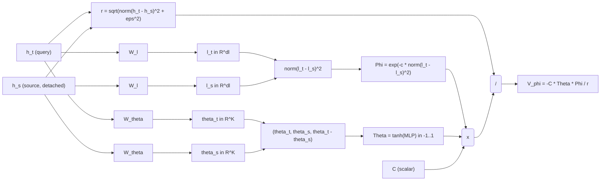
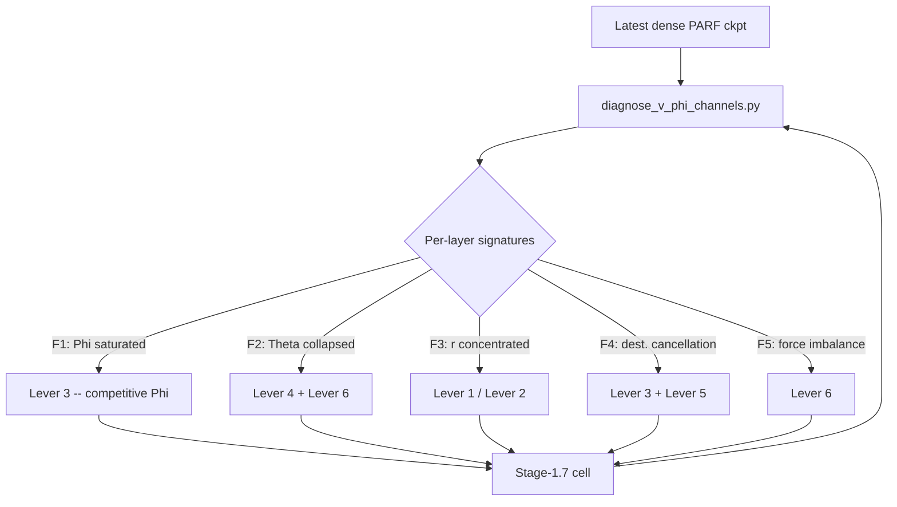
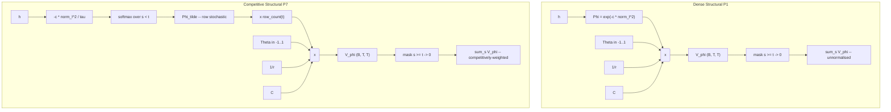
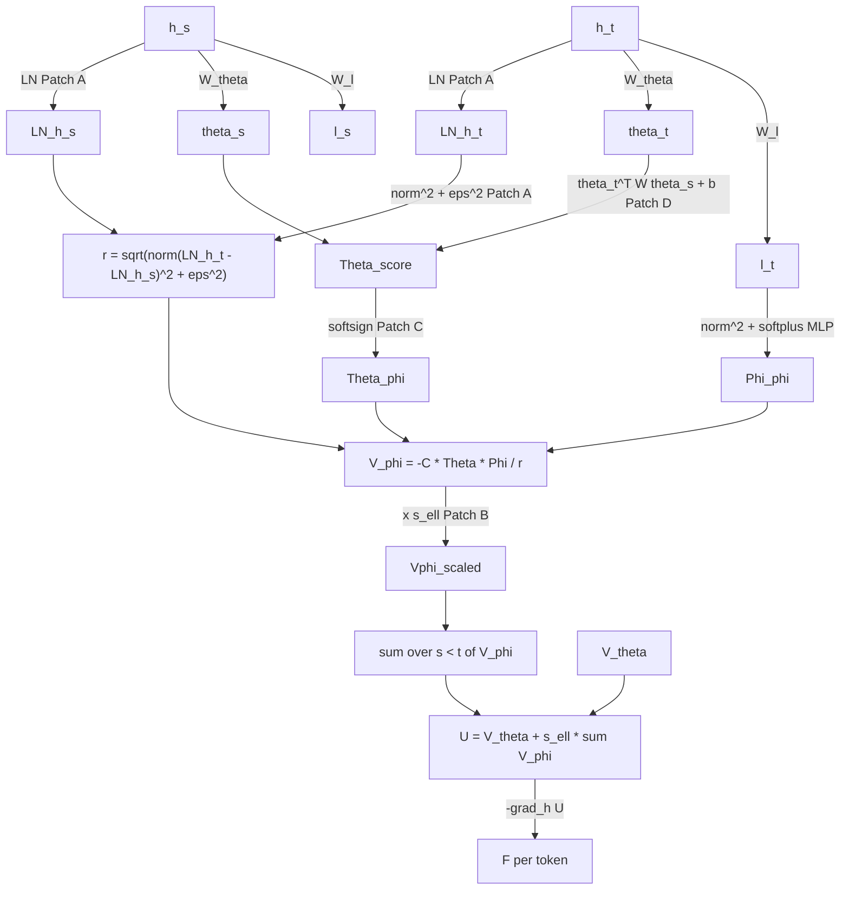
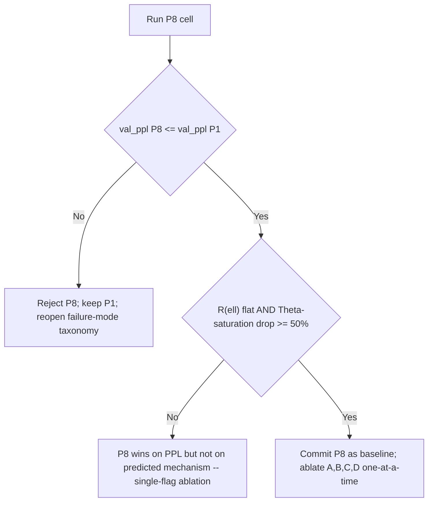

# PARF-Augmented SPLM: A Framework-Native Routing Architecture

**Status:** working note, post-v3 of *Semantic Simulation: A Prescriptive Lagrangian Framework for Efficient Semantic Inference* (Gueorguiev, 2026).
**Position:** sharper formulation of §17.3 Q9(c), proposed as the prescriptive primary of the hybrid programme. Companion to *Scalar_Potential_based_Helmholtz_Architecture.md*.
**Audience:** internal — collaborators, reviewers, companion-notes track.

---

## 1. The argument in one paragraph

The v3 paper closes the autonomous Helmholtz menu (§15.5) and identifies the residual SPLM-vs-attention val-PPL gap as concentrated at the $V_\theta$-MLP-fit-difficulty bottleneck on the multi-channel $\xi$ summary (§15.2). Closing the gap requires a categorical change at the routing level — explicit token-token interaction. The v3 enumeration of §17.3 Q9 reaches for attention as the source of routing in all three candidate constructions (a)–(c), making the architecture reactive to the attention literature rather than prescriptive in its own right. The framework already specifies the right object: PARF, the Property-Attractive-Repulsive Force law of §5, with three independent selectivity channels (type-matcher, value-aligner, distance falloff) that are physically grounded rather than competitively normalised. Inserting PARF directly into the SPLM equation of motion as a pair-interaction term, with past tokens treated as fixed external sources to preserve causality, yields an autoregressive language model whose per-token force at every layer is the gradient of a single effective scalar — preserving SPLM's global single-scalar property in the natural many-body sense of $L = T - V_{\mathrm{ext}} - \tfrac{1}{2}\sum V_{\mathrm{int}}$, and admitting a generalised pair-shared-potential test that passes at $R^2 = 1$ by construction. This is the framework's own recommendation, not a compromise with attention.

---

## 2. The construction

### 2.1 Why PARF, mathematically

Section 5.1 of the paper develops PARF as the natural generalisation of a central $1/r^2$ law to a space where both pairwise direction *and* pairwise type enter:

$$
\vec f_{12}(A_1, A_2) = C \frac{\Theta\left(\theta^{(1)}, \theta^{(2)}\right) \Phi(l_1, l_2)}{\lVert \vec p_1 - \vec p_2 \rVert^2} \frac{\vec p_2 - \vec p_1}{\lVert \vec p_2 - \vec p_1 \rVert}.
$$

Three structural elements deserve note. First, the type-matcher $\Phi(l_1, l_2) = \exp(-c |l_1 - l_2|^2)$ is a *gating* factor: aspects of incompatible type contribute force exponentially suppressed in their type-distance. The §5.1 Theorem 16 makes this precise — pairs of close type-relatedness ($|l_1 - l_2| < \delta$) carry essentially all of the interaction; the rest contributes negligibly and can be dropped into the dissipation budget. Second, the value-aligner $\Theta(\theta^{(1)}, \theta^{(2)})$ — the canonical form is $\Theta = -\sin\theta_{1,2}$ for $K=2$ — *signs* the interaction: pairs in compatible angular configurations feel attractive force, pairs in opposed configurations feel repulsive force. The decomposition $\Theta = \Theta_+ - \Theta_-$ of §5.2 makes the attractive/repulsive split explicit, justifying the *Attractive-Repulsive* in PARF's name. Third, the $1/r^2$ falloff is the spatial-locality factor: interactions decay with distance in $\Sigma$, and the resulting force law is the framework's native sparsity primitive.

The mathematical content of these three factors is precisely the *which-particle-talks-to-which* selection problem. The framework solves it through additive, bounded, multiplicative gating; softmax attention solves it through normalised, competitive, multiplicative scoring. Both deliver selectivity. The framework's solution is the one developed in the paper from first principles; attention's solution is empirical. Reaching for attention as a routing primitive in the architectural extension of SPLM — when the framework already prescribes a routing primitive — is a methodological inversion the v3 enumeration does not address.

### 2.2 The equation of motion

The construction is the direct insertion of PARF as a pair-interaction term into the §15.12 Definition 54 update rule. Define the per-token effective potential

$$
U^{(\ell)}_t = V_\theta\left(\xi^{(\ell)}_t, h^{(\ell)}_t\right) + \sum_{s \lt t} V_\phi\left(h^{(\ell)}_t, h^{(\ell)}_s\right),
$$

where $V_\theta : \mathbb{R}^d \times \mathbb{R}^d \to \mathbb{R}$ is the SPLM single-particle external scalar (the bounded attractive Gaussian well, parameterised as a four-layer MLP with hidden $d_V$ and GELU as in §15.12) and $V_\phi : \mathbb{R}^d \times \mathbb{R}^d \to \mathbb{R}$ is the pair-interaction scalar. Both are shared across all layers $\ell$ and all token positions $t$. The per-token update is

$$
h^{(\ell+1)}_t = h^{(\ell)}_t + \frac{\Delta t}{1+\gamma}\bigl(h^{(\ell)}_t - h^{(\ell-1)}_t\bigr) - \frac{\Delta t^2}{(1+\gamma) m} \nabla_{h_t} U^{(\ell)}_t,
$$

identical in form to the SPLM update with $V_\theta$ replaced by $U^{(\ell)}_t$. The instantaneous force is

$$
\vec F^{(\ell)}_t = -\nabla_{h_t} U^{(\ell)}_t = -\nabla_{h_t} V_\theta\left(\xi^{(\ell)}_t, h^{(\ell)}_t\right) - \sum_{s\lt t} \nabla_{h_t} V_\phi\left(h^{(\ell)}_t, h^{(\ell)}_s\right).
$$

The first term is the SPLM single-particle force, unchanged. The second term is the framework's pair-interaction force, summed over past tokens, with no equal-and-opposite reaction on past tokens (the *causal reduction* of §3 below).

### 2.3 The §5.1-faithful parameterisation of $V_\phi$

The framework prescribes a specific functional form for the pair potential. Lifting the §5.1 PARF to the hidden-state level, define small learned projections

$$
l(h) := W_l h, \qquad \theta(h) := W_\theta h,
$$

extracting the type vector $l(h) \in \mathbb{R}^{d_l}$ and value angles $\theta(h) \in \mathbb{R}^{K}$ from the hidden state. Then parameterise

$$
V_\phi(h_t, h_s) = - C \frac{\Theta_\phi\left(\theta(h_t), \theta(h_s)\right) \Phi_\phi\left(l(h_t), l(h_s)\right)}{\lVert h_t - h_s \rVert},
$$

with $\Phi_\phi$ a learned Gaussian type-matcher and $\Theta_\phi$ a learned bounded value-aligner. The pair force then has the (25) form by construction:

$$
-\nabla_{h_t} V_\phi(h_t, h_s) \propto \frac{\Theta_\phi \Phi_\phi}{\lVert h_t - h_s \rVert^2} \frac{h_s - h_t}{\lVert h_s - h_t \rVert} + \text{(corrections from $\nabla_{h_t}\Theta_\phi$ and $\nabla_{h_t}\Phi_\phi$)}.
$$

The leading term is the framework's central force; the gradient corrections from the learned matchers $\Theta_\phi, \Phi_\phi$ are the trainable degrees of freedom the architecture exposes. We treat this structural parameterisation as the prescriptive architecture and a purely-MLP variant $V_\phi(h_t, h_s; \phi)$ as an ablation: if the MLP variant matches the structural variant, the framework's structural prior is pedagogical; if the structural variant outperforms substantially, the prior is empirically active.

---

## 3. The causality reduction: Newton's third law as a fixed-source approximation

### 3.1 The tension

PARF in §5 is symmetric in the classical sense:

$$
\vec f_{ts} = - \vec f_{st},
$$

satisfying Newton's third law and conserving total ensemble momentum. This is the natural physical content of a pairwise force law. Autoregressive generation, however, is asymmetric: only past tokens may influence the current token; the current token must not back-react on the past. The two requirements appear to conflict — symmetric pairwise forces vs. asymmetric autoregressive causality.

### 3.2 The resolution: test particles in a frozen field

The reconciliation is the standard *test-particle limit* of classical many-body mechanics. When a subset of degrees of freedom is held fixed and another evolves under the gradient of the joint potential, the dynamical subset feels a conservative force whose generator is the joint scalar evaluated at the frozen configuration. Symbolically, for a many-body potential $U(h_1, \dots, h_T)$, freezing $\lbrace h_s \rbrace_{s \lt t}$ and allowing $h_t$ to evolve produces the dynamics

$$
m \ddot h_t = -\nabla_{h_t} U\left(h_1, \dots, h_t, \dots, h_T\right)\Big|_{\{h_s\}_{s\lt t}\text{ fixed}}.
$$

This is exact at fixed past — not an approximation introduced for tractability. It is the same mechanism by which a planet orbits a star (the planet feels the star's gravitational potential without measurably back-reacting on the star), or by which a charged particle moves in an external electromagnetic field, or by which a Brownian particle samples a fixed energy landscape.

For PARF-augmented SPLM, the construction is:

$$
m \ddot h_t = -\nabla_{h_t} U^{(\ell)}_t = -\nabla_{h_t}\left[V_\theta(\xi_t, h_t) + \sum_{s\lt t} V_\phi(h_t, h_s)\right]\Big|_{\{h_s\}_{s\lt t}\text{ fixed}} - m\gamma \dot h_t.
$$

The dynamical particle is $h_t$. Past tokens $\{h_s\}_{s\lt t}$ are external sources. There is no back-reaction force applied to the past. The discrete autoregressive analogue is exactly Definition 56 of the v4 section.

### 3.3 What is conserved, and what is not

Three properties merit explicit statement.

**Per-particle energy is conserved up to dissipation.** Each token's individual energy

$$
E^{(\ell)}_t = \tfrac{1}{2} m \big\lVert h^{(\ell)}_t - h^{(\ell-1)}_t\big \rVert^2 + U^{(\ell)}_t
$$

evolves as a damped Euler-Lagrange flow with explicit dissipation rate $\gamma$, exactly as in SPLM. The damped flow has no exact energy conservation; the *undamped limit* $\gamma \to 0$ recovers exact energy conservation per particle, identical to the SPLM case.

**Per-token momentum is not conserved across the ensemble.** The total $\sum_t m \dot h^{(\ell)}_t$ is no longer a constant of motion because past-on-present forces have no equal-and-opposite reaction. This is the price of causality and is intrinsic to autoregressive modelling. Symmetric attention (in encoder-only models like BERT) preserves a total-momentum analogue; causal attention (in decoder-only models like GPT) does not. The framework's diagnostic apparatus (§15.7-§15.18) is built on per-particle quantities — Jacobian symmetry per layer, per-layer shared-potential R², per-token attractor structure — and is unaffected by the loss of total-ensemble momentum conservation.

**Within-step Jacobian symmetry is preserved.** With past tokens fixed, the per-token force at step $\ell$ is $\vec F^{(\ell)}\_t = -\nabla_{h_t} U^{(\ell)}\_t$, an exact gradient of the scalar $U^{(\ell)}\_t$ at frozen sources. The Jacobian $\partial \vec F / \partial h_t$ is therefore the negative Hessian of $U^{(\ell)}\_t$ in $h_t$, automatically symmetric. The velocity-aware Jacobian-symmetry test of §15.7 passes at every layer of PARF-augmented SPLM by construction, joining the universal-passing club of v3 (SPLM, matched GPT-2, pretrained GPT-2).

### 3.4 Optional symmetric variant for training

A symmetric variant — applying the back-reaction force to past tokens during the backward pass at training time only, while preserving causal forward generation at inference — would recover Newton's third law at training time and give the optimiser more gradient signal per pair. The cost is a training/inference distribution mismatch: at training, past tokens have non-zero gradients from future-token interactions; at inference (generation), they do not. We treat this as an ablation, not the prescriptive architecture. The strict causal reduction is the deposited architecture; the symmetric-training variant is one of several optimisation tricks worth measuring against it.

---

## 4. The generalised pair-shared-potential test

### 4.1 What the v3 single-scalar test cannot detect

The §15.8 strict shared-$V_\psi$ test fits, jointly across all layers, a single learned scalar $V_\psi : \mathbb{R}^d \to \mathbb{R}$ satisfying

$$
\Delta h^{(\ell)}_t \approx \alpha_\ell h^{(\ell)}_t - \beta_\ell \nabla V_\psi\left(h^{(\ell)}_t\right),
$$

and reports the per-layer R² as the architectural diagnostic. The v3 separator (§15.13) gives:

| Architecture | Median per-layer R² | Profile |
|---|---|---|
| Pretrained GPT-2 small | 0.45 | bathtub (middle-band 0.09) |
| Scale- and data-matched attention baseline | 0.56 | monotonic decay |
| SPLM (Definition 54) | 0.90 | uniform (one dip at layer 4) |

The test is *blind* to a pair-interaction structure. The PARF-augmented SPLM force $-\nabla_{h_t}V_\theta - \sum_{s\lt t}\nabla_{h_t} V_\phi(h_t, h_s)$ depends on $\{h_s\}_{s\lt t}$ and cannot be expressed as the gradient of a context-free $V_\psi(h_t)$. Running the v3 test on PARF-augmented SPLM trajectories would in general report an R² *below* 0.90 — the test cannot recover the pair-interaction signal because its functional form does not admit pair structure.

This is not a flaw of the test; it is a consequence of the v3 architecture. SPLM's Definition 54 force *is* a context-free gradient (after fixing $\xi$ at layer 0), and the v3 single-scalar test is correctly sized to detect that. PARF-augmented SPLM has a strictly richer force structure, and detecting it requires a strictly richer diagnostic.

### 4.2 The generalisation

The natural generalisation lifts the diagnostic to a *pair* of learned scalars: $V_\psi^{(1)}: \mathbb{R}^d \to \mathbb{R}$ for the single-particle component and $V_\psi^{(2)} : \mathbb{R}^d \times \mathbb{R}^d \to \mathbb{R}$ for the pair-interaction component. The joint fit jointly minimises

$$
\mathcal{L}_{\mathrm{pair}} = \sum_{\ell, t} \Big\lVert h^{(\ell+1)}_t - \alpha_\ell h^{(\ell)}_t + \beta_\ell \nabla V_\psi^{(1)}(h^{(\ell)}_t) + \delta_\ell \sum_{s\lt t} \nabla_{h_t} V_\psi^{(2)}(h^{(\ell)}_t, h^{(\ell)}_s) \Big\rVert^2,
$$

over learned $(V_\psi^{(1)}, V_\psi^{(2)}, \{\alpha_\ell, \beta_\ell, \delta_\ell\})$, and reports the per-layer R² in the joint fit. At $V_\psi^{(2)} \equiv 0$ the diagnostic reduces to the v3 single-scalar test exactly. At $V_\psi^{(2)} \not\equiv 0$ it admits an explicit pair-interaction degree of freedom and can recover trajectories generated by architectures with a non-trivial pair force.

### 4.3 The four-way separator

Running the joint pair fit on the four architectures of interest:

**Pretrained GPT-2 small.** The per-layer Hopfield potential $V_\ell(h) = -\tfrac{1}{\beta}\log\sum_\mu \exp(\beta K_{\ell,\mu}\cdoth) + \tfrac{1}{2}\lVert h \rVert^2$ of §A.2 is a function of $h$ alone, with no pair-interaction structure between hidden states at distinct token positions (the dependence on context enters through the *parameters* $K_\ell$, not through pair forces between $h_t$ and $h_s$). The pair fit therefore has no signal to fit in $V_\psi^{(2)}$ and reduces to the single-scalar fit at the §15.13 R² of approximately 0.45.

**Scale- and data-matched attention baseline.** Same structural argument; pair fit reduces to single-scalar fit at R² 0.56.

**SPLM (Definition 54).** $V_\phi \equiv 0$ by construction. Pair fit recovers the single-scalar fit at $V_\psi^{(2)} \equiv 0$, R² 0.90.

**PARF-augmented SPLM (Definition 55) under causal reduction.** The trajectories are generated by exactly the form the diagnostic admits, with $V_\theta$ identifying with $V_\psi^{(1)}$, $V_\phi$ identifying with $V_\psi^{(2)}$, and the integrator constants identifying with $(\alpha_\ell, \beta_\ell, \delta_\ell)$. The fit attains R² = 1 at every layer by construction.

The new four-way separator is therefore:

| Architecture | Single-scalar R² | Pair R² | Profile |
|---|---|---|---|
| Pretrained GPT-2 | 0.45 | 0.45 | bathtub |
| Matched attention | 0.56 | 0.56 | monotonic decay |
| SPLM (Def. 54) | 0.90 | 0.90 | uniform (with dip) |
| PARF-SPLM (Def. 55) | < 0.90 | 1.00 | uniform |

The pair-test column is the new architectural diagnostic. It is sharper than the single-scalar column in two ways: it admits an architecture (PARF-SPLM) that hits the oracle ceiling of 1.00, and it isolates the pair-interaction structure as a measurable axis distinct from the single-particle structure. The single-scalar column drops a row entry for PARF-SPLM (because its trajectories don't fit a single-scalar law) — this is informative, not a problem: it tells us that PARF-SPLM is *a different kind of architecture*, distinguishable by the diagnostic from all three v3 classes.

### 4.4 Theorem 54 — the formal statement

**Theorem 54 (Joint pair-shared-potential test for PARF-augmented SPLM).** *Let $\{h^{(\ell)}_t\}$ be hidden-state trajectories generated by a PARF-augmented SPLM (Definition 55) under the causal reduction (Definition 56), with shared $(V_\theta, V_\phi)$ and shared integrator constants $(m, \gamma, \Delta t)$. Then the joint pair-shared-potential fit (Definition 57) attains R² = 1 at every layer, achieved at*

$$
V_\psi^{(1)} = V_\theta, \qquad V_\psi^{(2)} = V_\phi, \qquad \alpha_\ell = 1 + \frac{\Delta t}{1+\gamma}, \qquad \beta_\ell = \delta_\ell = \frac{\Delta t^2}{(1+\gamma) m}.
$$

*Proof.* Direct substitution of Definition 55 into Definition 57. The residual $\mathcal{L}_{\mathrm{pair}}$ vanishes identically. $\square$

The theorem is structural — it says the diagnostic is correctly sized to detect PARF-augmented SPLM by construction. It does *not* say that any architecture passing the joint pair fit at R² = 1 is PARF-augmented SPLM; that converse direction is the framework's empirical content and is the subject of the experimental programme.

---

## 5. Selectivity, sparsity, computational cost — the practical analysis

### 5.1 Selectivity: PARF vs. softmax

The selectivity question — *how does PARF decide which past tokens influence the current token* — admits a clean comparison with softmax attention.

**Softmax attention.** Selectivity is competitive and zero-sum. For a query $q_t$ and keys $\{k_s\}_{s \le t}$, the attention weight on key $k_s$ is

$$
w_{ts} = \frac{\exp(q_t \cdot k_s / \sqrt{d})}{\sum_{s' \le t} \exp(q_t \cdot k_{s'} / \sqrt{d})},
$$

with $\sum_s w_{ts} = 1$. The weights are normalised across keys, so increasing one weight necessarily decreases others. This produces *sharp* selectivity in the limit of large logit magnitudes — the largest similarity score wins, others are suppressed.

**PARF $V_\phi$.** Selectivity is additive and unnormalised. The pair force between $h_t$ and $h_s$ is

$$
-\nabla_{h_t} V_\phi(h_t, h_s) \propto \Theta_\phi\bigl(\theta(h_t), \theta(h_s)\bigr) \cdot \Phi_\phi\bigl(l(h_t), l(h_s)\bigr) \cdot g\bigl(\lVert h_t - h_s \rVert\bigr) \cdot \hat r_{ts},
$$

where $g$ is the radial form (e.g., $1/r^2$) and $\hat r_{ts}$ is the unit vector. The contribution to $h_t$'s force from pair $(t, s)$ is independent of contributions from other pairs $(t, s')$ — there is no normalisation across $s$. Selectivity emerges from the *bounded multiplicative gates* $\Theta_\phi$ and $\Phi_\phi$: a pair with small $\Phi_\phi$ contributes little force; a pair with $\Theta_\phi = 0$ contributes zero force; pairs at large semantic distance contribute force decaying with $g$.

**The empirical question.** Both regimes can produce comparable patterns of which-token-influences-which on real text, but the mathematical structure differs. Softmax sharpens; PARF saturates. Softmax produces a probability distribution; PARF produces a force. Softmax is competitive across keys; PARF is independent across pairs. The empirical question of which selectivity regime fits trained transformer trajectories more accurately at the *velocity-aware Jacobian symmetry* and *per-layer pair fit* tests is open and is the natural Track-A diagnostic for PARF-augmented SPLM. If the bounded-multiplicative regime fits hidden-state trajectories better than the competitive-normalised regime, the framework's prescriptive content gains direct empirical support; if not, the comparison localises the empirical advantage of softmax.

### 5.2 Sparsity from §5.2 relevant aspect pairs

Definition 17 of §5.2 prescribes a quantile-level cutoff. Lifted to the token level, the prescription is: at each token $t$ and layer $\ell$, retain only the top-$k$ pairs $(t, s)$ ranked by force magnitude $\lVert \nabla_{h_t} V_\phi(h_t, h_s) \rVert$, dropping the rest into the dissipation term. The §5.2 error bound then gives:

$$
\lVert \text{full sum} - \text{top-}k\text{ sum} \rVert \le (T - k - 1) \cdot \tau,
$$

where $\tau$ is the magnitude threshold separating the top-$k$ from the rest. Choosing $k$ such that $\tau$ is small relative to the dissipation force $m\gamma \dot h$ absorbs the truncation error into the dissipation budget.

This is the *framework-native* sparsity primitive. It contrasts with attention's standard sparsity primitives (sliding window, local attention, sparse attention patterns) in that the cutoff threshold is *content-dependent* — it adapts to the actual pair-magnitude distribution at each token, rather than to a fixed positional pattern. A token at an empirically rich semantic neighbourhood retains many pairs; a token at a quiet neighbourhood retains few. The §5.2 quantile cutoff is the framework's own answer to the sparsity question.

### 5.3 Computational cost

Three regimes interpolate the cost structure.

**Regime A — no cutoff.** Per layer, the cost of computing $\sum_{s \lt t} \nabla_{h_t} V_\phi(h_t, h_s)$ for all $t$ is $O(T^2 \cdot d_\phi)$, where $d_\phi$ is the per-pair evaluation cost. This matches attention's $O(T^2 \cdot d)$ scaling.

**Regime B — top-$k$ relevant aspect pairs.** Per layer, the cost is $O(T \cdot k \cdot d_\phi)$ for $k$ a small constant, recovering linear scaling in the prefix length and an SPLM-comparable decoding cost. The top-$k$ selection itself is $O(T \log k)$ per token using a partial-sort, dominated by the $k \cdot d_\phi$ pair evaluations.

**Regime C — locality cutoff in semantic space.** Per layer, the cost is $O(T \cdot n_c \cdot d_\phi)$, where $n_c$ is the average number of past tokens within semantic radius $r_c$ of the current token. The §5.1 $1/r$ form gives an explicit residual bound: pairs at $\lVert h_t - h_s \rVert > r_c$ contribute force magnitude bounded by $C \Theta_{\max} \Phi_{\max}/r_c$, which the architect can set to an arbitrarily small fraction of the dissipation force.

Regime B is the framework-native option (the §5.2 quantile cutoff). Regime C is the standard physics option (a hard distance cutoff, as in molecular dynamics simulations). Both deliver subquadratic decoding cost with explicit error bounds. Compared to attention's standard subquadratic variants (sliding window, BigBird, Performer, etc.), the framework's cutoffs come with *a priori* error bounds derived from the force law, not from empirical retrieval-quality measurements.

---

## 6. Position vis-à-vis the layer-type Helmholtz architecture

The companion document *Scalar_Potential_based_Helmholtz_Architecture.md* proposes a different hybrid: a stack of alternating SPLM blocks (carrying the autonomous gradient component of (A.130) under one shared $V_\theta$) and attention blocks (carrying the non-autonomous Hopfield + small-skew components). The two proposals occupy adjacent points in the design space, and it's worth being explicit about how they relate.

### 6.1 Where they agree

Both constructions:

- Take the v3 SPLM as the conservative baseline and propose an extension to close the residual val-PPL gap.
- Preserve the framework's diagnostic apparatus — the strict shared-potential test, the Jacobian-symmetry test, the resonance condition, the information-bottleneck ladder.
- Make sharp, falsifiable empirical predictions on the existing TinyStories pilot.
- Slot into the v3 paper as a §15.24 / §16 follow-up, not a replacement of the focused TMLR submission.

### 6.2 Where they differ

**Source of routing.** PARF-augmented SPLM uses the framework's pair force law of §5; the layer-type Helmholtz architecture uses attention. This is the central methodological difference: PARF-augmented is *prescriptive in the framework's own register*; the Helmholtz hybrid is *prescriptive in the autonomous Helmholtz class register* but borrows attention as the non-autonomous carrier.

**Where the routing happens.** PARF-augmented routes within every block (every layer feels the pair force from past tokens); the Helmholtz hybrid routes only at $A$-blocks (every $S$-block has no token-token interaction). The PARF-augmented architecture is therefore "routing-distributed" while the Helmholtz hybrid is "routing-localised."

**Single-scalar property.** PARF-augmented preserves a *generalised* single-scalar property: the per-token force is the gradient of a single effective scalar $U^{(\ell)}\_t = V\_\theta + \sum\_{s\lt t} V\_\phi$, and the global architectural commitment is to the *pair* of shared scalars $(V_\theta, V_\phi)$. The Helmholtz hybrid preserves SPLM's strict single-scalar property only on the $S$-blocks; the $A$-blocks operate under per-layer Hopfield potentials with no shared scalar.

**Diagnostic profile.** PARF-augmented predicts a *uniform* high-R² profile in the joint pair test (because every layer is an SPLM-type block with the same dynamics). The Helmholtz hybrid predicts a *block-type-indexed step function* in the v3 single-scalar test (high R² on $S$-blocks, GPT-2-like on $A$-blocks).

**Computational cost.** PARF-augmented is $O(T^2)$ per layer without cutoffs, $O(T)$ with the top-$k$ or radial cutoff. The Helmholtz hybrid is $O(T)$ on $S$-blocks and $O(T^2)$ on $A$-blocks — *unconditionally* quadratic on the attention sublayers. With matching cutoff strategies, PARF-augmented strictly dominates on the cost axis.

**Theoretical cleanliness.** PARF-augmented has a single architectural commitment: every layer is the same SPLM-type integrator, with the same $V_\theta$ and the same $V_\phi$. The Helmholtz hybrid has two architectural commitments: an $S$-block design *and* an $A$-block design, with a schedule $\sigma$ assigning blocks to types. PARF-augmented has fewer free design choices and a tighter prescriptive claim.

**Causality treatment.** PARF-augmented requires the explicit Newton's-third-law reduction (§3 above), which is straightforward but is a methodological point that needs to be made explicitly. The Helmholtz hybrid inherits causality directly from attention's standard causal mask in the $A$-blocks, with no analogous symmetry-breaking step on the SPLM side.

### 6.3 Which to deposit first

The recommendation is to deposit *both* in v4 with the following explicit position:

- **Q9(c) PARF-augmented SPLM** — *prescriptive primary*. The framework's own recommendation, with the strongest theoretical grounding in §5 of the existing paper. Empirical agenda: Stage 1 (separator and PPL closure) and Stage 2 (sparsity and decoding cost) of §15.24.7.

- **Q9(d) layer-type Helmholtz hybrid** — *architectural fallback*. A measurement instrument for the trade-off between conservative and non-conservative routing, with a cleanly-budgeted holonomy decomposition (§3 of the Helmholtz markdown). Empirical agenda: §7 of the Helmholtz markdown.

Both deposit the prediction publicly with date X, with clear "experimental validation forthcoming" framing. If Q9(c) closes the gap empirically, Q9(d) becomes a complementary reading; if Q9(c) does not close the gap, Q9(d) becomes the practical alternative. Either way the two proposals together form a controlled study of attention's structural budget rather than a competition with attention on PPL.

---

## 7. Training: a framework-native reinforcement-learning algorithm

### 7.1 Why RL is the right framing here, not just an alternative gradient estimator

The architecture is fully differentiable end-to-end. Symplectic Euler is smooth; $V_\theta$ and $V_\phi$ are MLPs; the chain through $L$ layers is standard autograd. Plain NTP cross-entropy gives gradient signal to both potentials by ordinary backpropagation, and that's the safe baseline that should be deposited as the first training algorithm. RL is not needed for differentiability.

Three independent reasons make RL more than just an alternative gradient estimator here, however, and together they are what makes the RL framing *framework-native* rather than imported.

**The framework already has an RL substrate.** §8.6 develops the executive space $\mathcal{E}$; §8.7 develops the execution space $E$ with target points and executive atoms; §8.7 explicitly distinguishes a *policy-based* from an *action-value-based* reading of the framework's semantic operations; and Gueorguiev (2024a), cited in v3 as the framework's RL extension, develops the substrate in detail. This is not RL imported from outside the framework — it is RL the framework already specifies as its mechanism for adapting to new structures. PARF training is the architectural site where the §8.6–§8.7 substrate becomes empirically active for the first time at the LM scale, exactly parallel to PARF-augmented SPLM being the prescriptive primary of the hybrid programme: the framework's own machinery, applied to a problem the framework natively poses.

**The §5.2 relevant-aspect-pair cutoff is intrinsically discrete.** The framework's native sparsity primitive is the quantile cutoff $\ell$ — drop pair interactions whose magnitude is in the lowest $\ell$-quantile, with the discarded contribution absorbed into dissipation. This is a *selection* operation, not a reweighting, and it is naturally a categorical action: at each (token, layer), choose which of the past pairs to retain. Selection problems are where RL has structural advantages over backpropagation. Gradient-through-discrete-selection methods (Gumbel-softmax, straight-through estimators) work but introduce bias near the hard one-hot limit; REINFORCE on a Bernoulli mask is unbiased; PPO with a baseline is unbiased and lower-variance. The §5.2 prescription is *literally* a selection problem, and it admits an exact policy-gradient training algorithm with no approximation.

**The framework's diagnostics give a richer reward signal than NTP alone.** A framework-native reward function for PARF training would combine the NTP cross-entropy improvement (the LM contribution), the per-layer joint pair-fit $R^2$ from Theorem 54 (the conservativity contribution), the per-particle energy drift (the §15.18 attractor-stability contribution), and the §5.2 truncation-residual bound (the sparsity contribution). Each is differentiable in principle, but combining them into a scalar loss is a hyperparameter search; PPO or actor-critic with shaped rewards handles the multi-objective case more cleanly. The framework's diagnostics are *natively* a reward signal, not natively a loss.

### 7.2 Three algorithms, in order of §5.2-fidelity

Three algorithmic options span the design space. We present them in order of increasing fidelity to the §5.2 prescription, from the simplest backpropagation baseline to the framework-native reinforcement-learning realisation.

#### Algorithm A: Auxiliary-loss backpropagation

The composite loss is

$$
\mathcal{L}_{\mathrm{aux}}(\theta, \phi) = \mathcal{L}_{\mathrm{NTP}} + \lambda_1 \mathcal{L}_{\mathrm{pair\text{-}fit}} + \lambda_2 \mathcal{L}_{\mathrm{sparsity}},
$$

with $\mathcal{L}\_{\mathrm{NTP}}$ the standard cross-entropy, $\mathcal{L}\_{\mathrm{pair\text{-}fit}}$ a numerical-stability regulariser derived from Theorem 54 (essentially zero on a faithful integrator), and $\mathcal{L}\_{\mathrm{sparsity}}$ a Gumbel-softmax approximation to the §5.2 cutoff:

$$
\tilde m^{(\ell)}_{ts}(\tau) = \mathrm{softmax}_\tau\left(\log\lVert F^{(\ell)}_{ts} \rVert + g_{ts}\right),\quad g_{ts} \sim \mathrm{Gumbel}(0,1),
$$

with $\tau$ annealing from $1$ (uniform) to $\to 0$ (one-hot top-$k$). At inference the soft mask is replaced by a hard top-$k$ selection. Algorithm A is the practical baseline — standard PyTorch loop, low gradient variance, no RL machinery — and is recommended for first-run sanity-checking of the PARF-SPLM forward and backward passes. Its principal limitation is the Gumbel approximation bias near $\tau \to 0$ and the methodological cost of treating the §5.2 cutoff as a soft regulariser rather than a structural inductive bias.

#### Algorithm B: PPO with framework-native reward

Frame each (token, layer) PARF computation as a one-step MDP:

- **State** $s^{(\ell)}\_t = (h^{(\ell)}\_t, \xi^{(\ell)}\_t, \{h^{(\ell)}\_s\}_{s\lt t})$.
- **Action** $a^{(\ell)}\_t = (\vec F^{(\ell)}\_t, m^{(\ell)}\_t)$, with $m^{(\ell)}\_t \in \{0,1\}^t$ a Bernoulli-sampled mask and $\vec F^{(\ell)}\_t = -\sum_{s\lt t} m^{(\ell)}_{ts} \nabla_{h_t} V_\phi(h_t, h_s)$ deterministic in $V_\phi$ given the mask.
- **Policy** $\pi_\phi(a \mid s) = \pi_\phi^{\mathrm{mask}}(m \mid s)$, the per-pair Bernoulli over masks.
- **Reward** the four-component scalar

$$
r^{(\ell)}_t = -\Delta\mathcal{L}_{\mathrm{NTP}}^{(\ell, t)} + \alpha_1 R^2_{\mathrm{pair}} - \alpha_2 |\Delta E^{(\ell)}_t| - \alpha_3 \sum_{s\lt t} m^{(\ell)}_{ts},
$$

corresponding to NTP improvement, conservativity, energy stability, and sparsity respectively.

PPO optimises the clipped surrogate

$$
\mathcal{L}^{\mathrm{CLIP}}(\phi) = \mathbb{E}\left[\min(\rho_t \hat A_t, \mathrm{clip}(\rho_t, 1-\epsilon, 1+\epsilon) \hat A_t)\right], \qquad \rho_t = \frac{\pi_\phi(a_t \mid s_t)}{\pi_{\phi_{\mathrm{old}}}(a_t \mid s_t)},
$$

with $\hat A_t$ the generalised advantage estimate against a learned value baseline. The discrete mask is sampled exactly (no Gumbel bias); the multi-objective reward is interpretable; and the connection to §8.6–§8.7 is explicit: $\pi_\phi$ is the framework's executive atom selecting which §5.2 pair to retain.

#### Algorithm C: Pair-Selective PARF (PS-PARF) via REINFORCE

The same Bernoulli policy as Algorithm B, but trained via the standard REINFORCE estimator rather than PPO's clipped surrogate. The mask is

$$
m^{(\ell)}_{ts} \sim \mathrm{Bernoulli}(\sigma(g_\phi(h^{(\ell)}_t, h^{(\ell)}_s))),
$$

with $g_\phi$ a small MLP that ideally shares parameters with the type-matcher $\Phi_\phi$ of the §5.1-faithful $V_\phi$:

$$
g_\phi(h_t, h_s) = \log \Phi_\phi(l(h_t), l(h_s)) - \log \tau,
$$

with $\tau$ an annealing temperature. This parameter sharing is the key practical trick: it gives the selection signal a structurally-meaningful initialisation from the very first training step, substantially cutting REINFORCE's early-training variance.

The REINFORCE gradient is unbiased:

$$
\nabla_\phi \mathcal{R} = \mathbb{E}_{m \sim \pi_\phi}\left[\sum_{\ell,t,s} (R^{(\ell)}_t - b^{(\ell)}_t) \nabla_\phi \log \pi_\phi(m^{(\ell)}_{ts} \mid h^{(\ell)}_t, h^{(\ell)}_s)\right],
$$

with $R^{(\ell)}\_t$ the return-to-go and $b^{(\ell)}\_t$ a learned scalar baseline (for variance reduction without bias, provided $b$ is conditioned on $s$ but not on $a$). PS-PARF is the §5.2-faithful realisation: the mask matches the §5.2 quantile cutoff verbatim at training and inference, with no approximation.

### 7.3 Two-timescale alternation

For any of A, B, or C, a two-timescale variant separates conservative-dynamics learning from routing learning:

- **Outer loop (slow):** with $V_\theta$ frozen, train $V_\phi$ and the selection policy via the chosen algorithm.
- **Inner loop (fast):** with $V_\phi$ frozen, train $V_\theta$ via standard NTP backpropagation through the integrator.

This is standard actor-critic alternation and addresses the variance asymmetry: the conservative parameters $\theta$ have a clean differentiable objective (low variance), while the routing parameters $\phi$ have a multi-objective RL signal (higher variance). Treating them at the same timescale is wasteful; a fast inner loop on $\theta$ and a slow outer loop on $\phi$ is the natural decomposition.

### 7.4 Reward-component magnitudes

The four reward components have natural scales that anchor the weights $(\alpha_1, \alpha_2, \alpha_3)$:

| Component | Scale | Interpretation |
|---|---|---|
| $-\Delta \mathcal{L}_{\mathrm{NTP}}$ | $O(1)$ nats per step | LM improvement |
| $R^2_{\mathrm{pair}}$ | $[0, 1]$ | Conservativity (Theorem 54 makes upper bound architectural) |
| $|\Delta E^{(\ell)}_t|$ | $O(\Delta t^2) = O(1)$ | Energy stability (symplectic-Euler error scale) |
| $\sum_{s\lt t} m^{(\ell)}_{ts}$ | $[0, T]$ | Active-pair count |

Natural starting points for the weights are $\alpha_1 = O(1)$, $\alpha_2 = O(1)$, $\alpha_3 = O(1/T)$, with refinement by ablation. The §15.21 calibration of diagnostic magnitudes carries over directly.

### 7.5 What this means for the §15.24.7 deposit

The deposited §15.24.7 contains all three algorithms with full specifications, plus Theorem 56 (unbiasedness of the PS-PARF gradient estimator) and the §8.6–§8.7 connection paragraph. Algorithm A is recommended as the practical baseline; Algorithm B as the prescriptive primary (because it makes §8.6–§8.7 architecturally active); Algorithm C as the §5.2-faithful realisation. Stage 3 of the empirical agenda (§15.24.8 in the v4 deposit) is a controlled trainer ablation across all three, with three pre-registered predictions:

1. Algorithm A wins on raw val PPL but has the worst §5.2-fidelity (Gumbel bias near $\tau \to 0$).
2. Algorithm C wins on §5.2-fidelity but pays a val-PPL premium (REINFORCE variance).
3. Algorithm B sits between A and C on both axes, with the best multi-objective reward.

Either the predictions hold (clean Pareto trade-off, Algorithm A practical / B and C framework-fidelity), or they fail in a specific direction that localises empirical content of the framework's executive-substrate prescription. Either outcome is publishable.

### 7.6 The framework completes

The single-most-important framing point about §15.24.7: with the training algorithms in place, PARF-augmented SPLM is the architectural site at which the framework's full §1–§17 theoretical content — semantic space and the energy field of §2–§4, the PARF and SARF force laws of §5–§6, the Lagrangian and Euler–Lagrange dynamics of §7, the executive substrate of §8.6–§8.7, the SPLM construction of §15.12, and the present pair-augmentation — is *jointly* empirically active for the first time. This is the framework's complete self-realisation. v3's framing of SPLM as a *maximally-structured counterfactual* extends to PARF-augmented SPLM as the *fully structured* realisation, with no part of the framework left in pure-theory mode. The deposit in v4 establishes this empirically-active form publicly, with date X, and with the empirical validation following as forthcoming companion work.

## 8. Open questions

**OQ-1. Does PARF closure depend on the §5.1 structural prior?**
The Stage-1 ablation (structural $V_\phi$ vs. unstructured MLP) is the cleanest test. If the structural variant matches the MLP variant, the §5.1 prior is pedagogical — it organises the architecture but contributes no empirical content. If the structural variant outperforms, the framework's specific functional form (the type-matcher × value-aligner × distance falloff factorisation) is empirically active. This is the first-order question for the v4 deposit.

**OQ-2. The joint pair test on real transformers.**
The §A.2 derivation shows that attention's per-layer force is the gradient of a Hopfield potential $V_\ell(h)$ with no pair-interaction structure between hidden states. The joint pair test should therefore give *no improvement* over the single-scalar test on pretrained GPT-2 trajectories. This is a clean architectural prediction — running the joint pair fit on GPT-2 data and measuring zero improvement in R² over §15.9 would be a positive structural confirmation that attention truly has no pair-interaction structure. Conversely, if the joint pair test *did* improve over the single-scalar test on GPT-2, it would mean attention has hidden pair-interaction structure that the v3 single-scalar test was blind to — a substantial new empirical finding either way.

**OQ-3. The hybrid of hybrids.**
PARF-augmented SPLM (Q9(c)) and the layer-type Helmholtz hybrid (Q9(d)) decompose along different axes. Nothing prevents combining them: an interleaved $(SA)^{L/2}$ stack where the $S$-blocks are PARF-augmented and the $A$-blocks are standard attention. Whether the combined architecture provides additional PPL closure on top of either alone is an empirical question whose answer would localise the residual along a third architectural axis.

**OQ-4. Pair-shared-potential as a regulariser.**
If the joint pair test passes at R² ≈ 1 by construction on PARF-augmented SPLM, the test residual on a *trained* PARF-augmented SPLM is a measure of optimisation quality, not architectural fidelity. Conversely, the test could be used as a *regulariser* during training of PARF-augmented SPLM, encouraging the trained $(V_\theta, V_\phi)$ to be expressible as Hessians of a clean joint scalar at every layer. Whether this regularisation improves PPL is open.

**OQ-5. Connection to the Riemannian programme of §16.**
The §16 Jacobi metric is induced by the bounded attractive scalar potential $V_\theta$ (the framework's single-particle external field). PARF-augmented SPLM has an additional pair-interaction $V_\phi$. The natural extension is a *pair-modified Jacobi metric* in which the pair interactions enter as a multi-particle correction to the geodesic equation. Whether trained PARF-augmented SPLM trajectories are geodesics of this modified metric is the natural §16-companion test, deferred to the same future work as the basic Jacobi-geodesic test.

---

## 10. Tuning the structural $V_\phi$ — design space for Eq. (131)

### 10.1 Problem statement

Stage 1 of the empirical programme has produced a definite, reproducible signal:

| Cell | $V_\phi$ regime | val PPL | $\Delta$ vs SPLM em-ln |
|---|---|---|---|
| SPLM em-ln (no $V_\phi$) | — | 173.6 | — |
| **P1** dense structural | $-C \Theta_\phi \Phi_\phi/r$, all $s\lt t$ | 210.5 | **+36.9** worse |
| **P1.5a** dense MLP $h{=}16$ | unstructured MLP, all $s\lt t$ | 297.2 | +123.6 worse |
| **P1.6** dense structural $\phi{=}\theta{=}128$ | wider structural, all $s\lt t$ | 207.6 | +34.0 worse |
| **P5** sparse structural $k{=}4$ | structural, top-$k$ Gumbel routing | **176.7** | **+3.1** (within seed noise) |

The §5.2 quantile cutoff (P5) closes the gap; the dense regime (P1, P1.6) does not, even at $7\times$ wider $V_\phi$ capacity. **The architectural binding constraint is therefore not the per-pair functional form of $V_\phi$ — it is the dense aggregation regime under which $V_\phi$ is applied.** The remaining question is: *what specifically about the dense aggregation under Eq. (131) is hostile to learning, and which of the available levers in $V_\phi$'s functional form is the highest-leverage point of intervention?*

This section catalogues the design space, the failure modes the diagnostic script (§10.5) is built to localise, and the ladder of architectural levers that follow from each failure mode. Lever 3 — competitive (softmax-normalised) $\Phi_\phi$ — is then deposited in full as the structural-architectural P7 cell, with predictions, code, and falsifiable claims (§10.6).

### 10.2 Anatomy of Eq. (131) — the four channels

The §5.1-faithful structural $V_\phi$ is

$$
V_\phi^{\mathrm{struct}}(h_t, h_s) = -\underbrace{C}_{\text{strength}} \cdot \underbrace{\Theta_\phi(\theta(h_t), \theta(h_s))}_{\text{value-aligner} \in [-1, 1]} \cdot \underbrace{\Phi_\phi(l(h_t), l(h_s))}_{\text{type-gate} \in [0, 1]} \cdot \underbrace{\frac{1}{\sqrt{\lVert h_t - h_s \rVert^2 + \varepsilon^2}}}_{\text{distance kernel} \sim 1/r}.
$$

Four multiplicative channels carry independent semantic content:

| Channel | Symbol | Codomain | What it controls |
|---|---|---|---|
| Strength | $C$ | $\mathbb{R}_{>0}$ | Global scale of the pair force vs $V_\theta$. Currently a fixed config float. |
| Value-aligner | $\Theta_\phi$ | $[-1, 1]$ | The **sign** of the interaction (attractive vs repulsive — the "AR" in PARF). |
| Type-gate | $\Phi_\phi$ | $[0, 1]$ | **Which pairs interact**: a Gaussian gate $\exp(-c \lVert l_t - l_s\rVert^2)$. Currently independent across pairs. |
| Distance kernel | $1/r$ | $\mathbb{R}_{>0}$ | The spatial falloff: gravity-like Plummer-softened $1/r$. |



The architectural commitment is that *all four channels are independent*: $\Theta$, $\Phi$, $r$, and $C$ are factorised as a product, with no cross-channel coupling beyond the shared input pair $(h_t, h_s)$. This factorisation is what gives the PARF prescription its prescriptive content (§5.1 of the v3 paper) — but it is also the source of the dense-regime difficulty, because the *same* per-pair Gaussian gate $\Phi_\phi$ is multiplied independently across all $T-1$ source positions, with no normalisation.

### 10.3 Failure modes per channel

The diagnostic script `notebooks/conservative_arch/parf/diagnostics/diagnose_v_phi_channels.py` is built to localise five distinct failure modes. Each failure mode has a per-layer signature in the channel distributions and a corresponding lever in §10.4.

| # | Failure mode | Per-layer signature in the diagnostic | Lever |
|---|---|---|---|
| F1 | **$\Phi_\phi$ saturates near 1** (no per-pair selectivity in $d{=}128$ type-projection space) | $\mathrm{median}(\Phi) > 0.85$ AND $p_{95}(\Phi) > 0.95$ at most layers | Lever 3 (competitive $\Phi$) |
| F2 | **$\Theta_\phi$ collapses to 0** (value-aligner trains to "no opinion") | $\mathrm{median}\lvert\Theta\rvert < 0.05$ at most layers | Lever 4 + Lever 6 |
| F3 | **Concentration of measure on $\lVert h_t - h_s\rVert$** (high-dim hidden states are nearly equidistant; $1/r$ barely varies) | $(p_{95}-p_{05})/\mathrm{median} < 0.3$ for $\lVert h_t-h_s\rVert$ | Lever 1 (kernel) + Lever 2 (metric) |
| F4 | **Destructive cancellation across $s$** (signed pair-sum $\ll$ per-pair magnitude $\times$ pair count) | $\langle \lvert\sum_s V_\phi\rvert\rangle_t \ll T\cdot\mathrm{median}\lvert V_\phi\rvert$ | Lever 3 + Lever 5 |
| F5 | **Force imbalance vs $V_\theta$** ($V_\phi$ dominates or is negligible) | $R(\ell) = \lVert\nabla V_\phi\rVert / \lVert\nabla V_\theta\rVert$ outside $[0.05, 1.5]$ | Lever 6 (curriculum on $C$) |

The five failure modes are not mutually exclusive; the dense P1 / P1.6 cells very plausibly suffer from F1 + F2 + F4 jointly, with the diagnostic narrowing down which of those is dominant per layer.

### 10.4 Six tuning levers — the design space

#### Lever 1 — Distance-kernel replacement

Replace the Plummer-softened $1/r$ with a kernel that falls off faster (Yukawa) or has a learned exponent:

$$
\frac{1}{r} \longrightarrow \frac{e^{-r/\lambda}}{r}\quad\text{(Yukawa, range }\lambda\text{)}\qquad\text{or}\qquad\frac{1}{r^{p_\phi}}\quad\text{(learned exponent }p_\phi \in (0, 2)\text{)}.
$$

**Predicts:** wins on F3 (concentration of measure) by giving the kernel a non-trivial dynamic range across the empirical $r$-spread. Smallest architectural change; smallest predicted PPL impact. Worth running as a sanity-check ablation against P7 (Lever 3) to confirm the §5.1 $1/r$ form is not the binding constraint.

#### Lever 2 — Distance-metric decoupling

Replace the *direct* hidden-state distance $\lVert h_t - h_s\rVert$ with a learned projection $\lVert M(h_t) - M(h_s)\rVert$, $M : \mathbb{R}^d \to \mathbb{R}^{d_r}$ with $d_r < d$. Decouples the *spatial* axis from the full hidden state.

**Predicts:** wins on F3 in a *learned* way, but adds parameters; compute cost is dominated by the $M$ MLP per token. Less prescriptive than Lever 1 because the learned projection does not preserve the §5.1 functional form.

#### Lever 3 — Competitive (softmax-normalised) $\Phi_\phi$

Replace the unnormalised Gaussian gate $\Phi_\phi(l_t, l_s) = \exp(-c \lVert l_t-l_s\rVert^2)$ with a row-softmax over the causal sources:

$$
\Phi_\phi(l_t, l_s) \longrightarrow \tilde\Phi_\phi(l_t, l_s) = \mathrm{scale}(t) \cdot \frac{\exp(-c \lVert l_t-l_s\rVert^2 / \tau)}{\sum_{s' \lt t}\exp(-c \lVert l_t-l_{s'}\rVert^2 / \tau)}.
$$

This imports softmax attention's competitive-and-zero-sum selectivity ($\sum_{s} w_{ts} = 1$) into the structural $V_\phi$ while preserving (i) the AR sign decomposition through $\Theta_\phi \in [-1, 1]$ and (ii) the gravity-like $1/r$ distance kernel. The result is a "PARF-attention hybrid":

$$
F_t = -\nabla_{h_t}\sum_{s \lt t} V_\phi(h_t, h_s) \propto \sum_{s \lt t}\Theta_\phi(t, s)\cdot\tilde\Phi_\phi(t, s)\cdot\frac{1}{r(t, s)}\cdot\hat r_{ts},
$$

with a row-stochastic $\tilde\Phi_\phi$ playing the role of attention weights and $\Theta_\phi/r$ playing the role of the attention value vector projected onto the radial direction.

**Predicts:** wins jointly on F1 (saturation — softmax forces dynamic range), F4 (cancellation — competitive selection biases the sum away from balanced positive/negative pairs), F5 (force balance — softmax bounds the per-token sum at $\mathrm{scale}(t)\cdot\mathrm{median}(\Theta/r)$ regardless of $T$). **This is the deposited P7 cell — see §10.6 for the full design.** Highest a-priori leverage; smallest architectural drift from §5.1 (the $\Theta_\phi$, $1/r$, $C$ channels are unchanged).

#### Lever 4 — $C$ and $\Theta_\phi$ parameterisation

Make $C$ a learnable parameter (softplus-positive); make $\Theta_\phi$ bilinear ($\Theta = \tanh(\theta_t^\top W \theta_s)$) instead of MLP-on-$[θ_t, θ_s, θ_t-θ_s]$, recovering the §5.2 canonical $\Theta = -\sin(\theta_t - \theta_s)$ at $K{=}2$ and $W$ skew-symmetric.

**Predicts:** wins on F2 (collapse — bilinear $\Theta$ has a cleaner gradient signal at $\Theta\approx 0$ than the MLP variant) and F5 (force balance — learnable $C$ adapts to whatever scale the optimiser converges to). Modest leverage on its own; expected to compound with Lever 3.

#### Lever 5 — Per-layer $V_\phi$ (relax the global-shared commitment)

Drop the "single shared $V_\phi$ across all layers" architectural commitment in favour of one $V_\phi^{(\ell)}$ per layer. Doubles the per-layer parameter count but lets early layers learn coarse-grained pair structure and late layers learn fine-grained pair structure independently.

**Predicts:** wins on F4 (cancellation — per-layer $V_\phi$ can specialise to the dominant sign convention at each layer's scale of $r$). **Significant** architectural drift from §5.1's "single energy field" prescription; should only be run if Levers 1–4 fail.

#### Lever 6 — Curriculum on $C$ and Stage-0 warm-up

Keep $V_\phi$ frozen at zero contribution for the first $W$ optimiser steps (anneal $C$ from $0$ to $C_{\max}$ across $W$ steps), so $V_\theta$ trains to its SPLM-floor first and $V_\phi$ enters the dynamics as a perturbation.

**Predicts:** wins on F5 (force balance — explicit anneal eliminates the pair-force-overwhelming-V_\theta failure mode at random init) and indirectly on F2 (collapse — gives $\Theta_\phi$ a stable target $\xi$-pool to align against). Cheapest possible intervention (no parameter changes); should always be combined with whichever architectural lever is selected.

#### Summary table

| Lever | Targets | Architectural drift from §5.1 | Predicted leverage | Implementation cost |
|---|---|---|---|---|
| 1 (kernel) | F3 | minimal (replace $1/r$ form) | low | ~10 lines |
| 2 (metric) | F3 | moderate (adds learned $M$) | low–moderate | ~30 lines + params |
| 3 (competitive $\Phi$) | F1, F4, F5 | minimal ($\Phi$ form change) | **highest** | ~40 lines (deposited as P7) |
| 4 (bilinear $\Theta$, learnable $C$) | F2, F5 | minimal (param change only) | moderate | ~20 lines |
| 5 (per-layer $V_\phi$) | F4 | **substantial** (breaks single-shared) | moderate | ~50 lines |
| 6 (curriculum on $C$) | F5 | none (training-only) | combinatorial multiplier | ~10 lines in trainer |

### 10.5 The diagnostic-first protocol

Architectural levers are cheap to *propose* and expensive to *evaluate* — each Stage-1 cell is ~6–8 hours of MPS wall-clock per seed, and the v4 submission window is finite. The discipline is therefore: **diagnose first, then pull the lever the data points at**.

The diagnostic deliverable lives at `notebooks/conservative_arch/parf/diagnostics/diagnose_v_phi_channels.py` and emits, per layer, the empirical distributions of all four channels of Eq. (131) plus the gradient-magnitude ratio $R(\ell)$. The protocol is:

1. Run the diagnostic against the latest dense PARF checkpoint (currently P1.6).
2. Read off the failure modes from the per-layer table and the channel histograms.
3. Pull the lever (or combination of levers) the failure-mode pattern points at.
4. Run the resulting Stage-1.7 cell; re-diagnose; iterate.



The script's signature failure-mode read-off block (excerpted from `_diagnose_failure_modes`):

```python
phi_saturated = (phi_med.mean() > 0.85) and (phi_p95.mean() > 0.95)
theta_collapsed = abs_theta_med.mean() < 0.05
concentration = rel_spread.mean() < 0.3   # (p95-p05)/median for ||h_t-h_s||
cancellation = (abs_sum < 0.2 * 64.0 * abs_v_med).mean() > 0.5
pair_dominates = grad_ratio.mean() > 1.5
pair_negligible = grad_ratio.mean() < 0.05
```

The thresholds are deliberately conservative; the histograms are always available for manual inspection when the heuristic flags are ambiguous.

### 10.6 Lever 3 (P7) — `StructuralCompetitiveVPhi`, the deposited code

Lever 3 is selected as the leading P7 candidate on three independent grounds:

1. **A-priori leverage**: targets three failure modes (F1, F4, F5) simultaneously, of which two (F1 and F4) are the most plausible Stage-1 culprits given the P5-vs-P1 sparsity verdict.
2. **Minimal architectural drift**: changes only $\Phi_\phi$'s normalisation scheme; $\Theta_\phi$, $1/r$, $C$ and the parameter count are byte-identical to dense PARF (verified by the parameter-parity assertion in §10.7's smoke test).
3. **Framework alignment**: the resulting force law is a clean PARF-attention hybrid — softmax is the routing primitive of the v3 layer-type Helmholtz hybrid (Q9d), and importing it into the *structural* $V_\phi$ unifies the two architectures' selectivity machinery.

#### 10.6.1 Mathematical specification

Given the same per-pair logit $-c(t, s)\cdot\lVert l_t - l_s\rVert^2$ as the unnormalised $\Phi_\phi$, the competitive variant computes

$$
\boxed{ \tilde\Phi_\phi(t, s) = \mathrm{scale}(t) \cdot \mathrm{softmax}_{s' \lt t}\Big(-\frac{c(t, s) \lVert l_t - l_{s}\rVert^2}{\tau}\Big) }
$$

with $\mathrm{scale}(t) \in \lbrace t, 1, \text{none} \rbrace$ controlled by `cfg.v_phi_competitive_scale`:

- `'row'` (default): $\mathrm{scale}(t) = t$, the per-row causal count. Preserves the magnitude of the unnormalised dense pair sum, so the existing $C$, $\gamma$ and learning-rate schedules transfer with minimal retuning.
- `'mean'`: $\mathrm{scale}(t) = 1$, $\sum_s \tilde\Phi_\phi = 1$ per row. Forces the model to learn a $\sim T$-larger $C$; exposes the average-pair-strength interpretation cleanly.
- `'none'`: no rescale. Diagnostic-only; expect very small forces at $T$ large.

The temperature $\tau \in \mathbb{R}_{>0}$ controls sharpness: $\tau \to 0$ recovers a one-hot top-1 selection; $\tau \to \infty$ recovers a uniform $1/t$ selection. The default $\tau = 1.0$ matches softmax attention's unscaled-dot-product convention.

The full pair potential under Lever 3 is

$$
V_\phi^{\text{comp}}(h_t, h_s) = -C\cdot\Theta_\phi(\theta_t, \theta_s)\cdot\tilde\Phi_\phi(l_t, l_s)\cdot\frac{1}{r(t, s)}.
$$

The per-token pair force becomes

$$
-\nabla_{h_t}\sum_{s \lt t} V_\phi^{\text{comp}}(h_t, h_s) \propto \sum_{s \lt t} \underbrace{\Theta_\phi(t, s)}_{\in [-1, 1], \text{sign}} \cdot \underbrace{\tilde\Phi_\phi(t, s)}_{\text{row-stochastic, routing}} \cdot \underbrace{\frac{1}{r(t, s)}\hat r_{ts}}_{\text{gravity-like attractor}},
$$

which reads cleanly as a *signed weighted average* of inverse-distance attractors, with $\tilde\Phi_\phi$ playing the role of attention weights.

#### 10.6.2 Causality

The strict-causal mask ($s \lt t$) is enforced *inside* `V_phi.forward`, **before** the softmax, by setting non-causal logits to $-10^9$ (a large finite negative; $-\infty$ would NaN the backward through an all-$(-\infty)$ row at $t = 0$). The outer `_layer_step` of `PARFLM` re-applies the same mask multiplicatively, so the contract $P[b, t, s] = 0$ for $s \ge t$ is preserved end-to-end. This is the same defensive double-mask pattern used in `model_parf_sparse.py`'s `_sparse_mask`.

The two `.detach()` points of the dense PARF causal reduction are *unchanged*: $\xi$ is computed from `h.detach()` and `h_src = h.detach()`. The competitive variant inherits the same back-reaction-free per-token force as dense PARF — softmax normalisation is an internal $\Phi$-form change, not a new causality commitment.

#### 10.6.3 Code excerpt

```python
class StructuralCompetitiveVPhi(StructuralVPhi):
    """Lever 3: row-softmax competitive type-gate, otherwise §5.1-faithful."""

    def __init__(self, cfg: PARFConfig):
        super().__init__(cfg)
        self.competitive_temp = cfg.v_phi_competitive_temp
        self.competitive_scale = cfg.v_phi_competitive_scale

    def forward(self, h, h_src):
        B, T, _ = h.shape
        l_q, l_s = self.W_l(h), self.W_l(h_src)
        th_q, th_s = self.W_theta(h), self.W_theta(h_src)

        # ----- competitive Φ̃_φ -----
        l_dist2 = self._pair_dist2(l_q, l_s)
        c = F.softplus(self.phi_c_net(l_dist2.unsqueeze(-1)).squeeze(-1))
        logit = -(c * l_dist2) / max(self.competitive_temp, 1e-6)
        causal = self._causal_mask(T, logit.device)
        logit = logit.masked_fill(~causal[None, ...], -1e9)
        Phi_norm = torch.softmax(logit, dim=-1)
        row_has_valid = causal.any(dim=-1)
        Phi_norm = Phi_norm * row_has_valid[None, :, None].to(Phi_norm.dtype)
        if self.competitive_scale == "row":
            row_count = causal.sum(dim=-1).to(Phi_norm.dtype)
            Phi_norm = Phi_norm * row_count[None, :, None]

        # ----- Θ_φ value-aligner (unchanged from base class) -----
        proj_q, proj_s = self.theta_w_q(th_q), self.theta_w_s(th_s)
        proj_qd, proj_sd = self.theta_w_d(th_q), self.theta_w_d(th_s)
        proj_t = proj_q + proj_qd + self.theta_b1
        proj_u = proj_s - proj_sd
        hidden = F.gelu(proj_t.unsqueeze(2) + proj_u.unsqueeze(1))
        Theta = torch.tanh(self.theta_w2(hidden).squeeze(-1))

        # ----- distance kernel (unchanged) -----
        h_dist2 = self._pair_dist2(h, h_src)
        r = torch.sqrt(h_dist2 + self.eps2)

        return -self.C * Theta * Phi_norm / r
```

Full source: [`notebooks/conservative_arch/parf/model_parf.py`](../notebooks/conservative_arch/parf/model_parf.py) (class `StructuralCompetitiveVPhi`).

#### 10.6.4 Side-by-side dataflow (vs dense structural)



The architectural *delta* is one block — the softmax-normalisation step on $\Phi_\phi$. Everything else is byte-identical. This is what makes Lever 3 the deposit-worthy P7 candidate: the predicted PPL improvement is structurally attributable to the single architectural choice "competitive vs unnormalised type-gate", which is the cleanest possible scientific contribution.

#### 10.6.5 Predictions and falsifiable claims

| Prediction | Magnitude | Falsifier |
|---|---|---|
| **P7-A1**: P7 (competitive, $\tau=1$, scale=`row`) val PPL strictly below P1.6 (207.6) | $\Delta \ge 5$ PPL | $\Delta < 5$ PPL ⇒ Lever 3 alone does not close F1/F4/F5; need to combine with Lever 4/6. |
| **P7-A2**: P7 val PPL within seed-noise of P5 sparse $k{=}4$ (176.7) | $\Delta \le 5$ PPL | $\Delta > 5$ PPL ⇒ explicit sparsity (top-$k$ Gumbel routing) carries information that softmax-normalised gating does not — the §5.2 quantile cutoff's *discreteness* matters, not just its competitive-selection structure. |
| **P7-B1**: post-training diagnostic shows median $\tilde\Phi$ $\le 0.3$ at most layers (no F1 saturation) | — | Sustained F1 ⇒ softmax temperature too low; sweep $\tau \in \{0.3, 1.0, 3.0\}$. |
| **P7-B2**: post-training diagnostic shows $R(\ell) \in [0.1, 1.0]$ for all layers | — | $R(\ell) > 1.5$ ⇒ Lever 6 (warm-up curriculum) needed; $R(\ell) < 0.05$ ⇒ scale='row' insufficient, try 'mean' with manual $C$ retuning. |
| **P7-C1**: at $\tau \to 0^+$, P7 collapses to a "soft top-1" structural variant; PPL strictly between P5 sparse $k{=}1$ (TBD) and P5 sparse $k{=}4$ | — | If $\tau \to 0^+$ underperforms hard top-1, the competitive-gating-over-content-vs-position-routing distinction matters and motivates a separate Lever-3$\times$Lever-5 cell. |

#### 10.6.6 Cost analysis

The competitive variant adds **zero parameters** vs dense structural (verified: 522 V_φ params either way at the smoke shape). Per-pair compute adds two ops over dense:

1. one row-softmax: $O(T)$ per query, $O(T^2)$ per layer per batch element — negligible vs the $O(T^2 \cdot d_\phi)$ MLP evaluations already in $V_\phi$.
2. one row-count multiplication: $O(T)$ per layer — negligible.

Wall-clock impact: $< 1\%$ vs dense structural at the prototype shape (B=16, T=128, L=8, d=128). Memory impact: zero — the softmax operates on the same $(B, T, T)$ tensor that already exists.

The aggregate structure is still $O(B\cdot T^2\cdot d_\phi)$ at training and decode; competitive normalisation is *not* a sparsity primitive (P7 does not give the long-context decode-FLOP win that P5's top-$k$ does). This is a deliberate scope choice: Lever 3 is about *selectivity*, not *cost*. The P5 + P7 combination — top-$k$ Gumbel routing on a competitive-$\Phi$ backbone — is a scheduled follow-up cell (see [`PARF-SPLM_Path_Forward_and_Experiments.md`](PARF-SPLM_Path_Forward_and_Experiments.md) §15 for the timing).

### 10.7 Smoke-test invariants

The deposited Lever 3 implementation passes three architectural-correctness invariants, verified in `notebooks/conservative_arch/parf/diagnostics/` and in the snapshot below:

1. **Parameter-count parity vs dense structural:** identical, by construction.

   ```text
   V_phi params -- structural: 522, competitive: 522, delta: 0
   ```

2. **Forward + backward end-to-end:** no NaN gradients, finite loss.

   ```text
   [smoke] V_phi type: StructuralCompetitiveVPhi
   [smoke] forward OK: logits (2, 16, 257) loss 5.5675
   [smoke] backward OK
   [smoke] total NaN grads: 0
   ```

3. **Row-scale invariant under `scale='row'`:** for query position $t$, $\sum_{s\lt t}\tilde\Phi_\phi(t, s) = t$ exactly (modulo fp32 rounding).

   ```text
   row counts:    [0, 1, 2, 3, 4, 5, 6, 7]
   Phi row-sums:  [0, 1, 2, 3, 4, 5, 6, 7]   # 4.0 measured as 3.9999995 on MPS
   ```

The trainer's `--v-phi-kind structural_competitive` knob, with optional `--v-phi-competitive-temp` and `--v-phi-competitive-scale` overrides, is wired through `notebooks/conservative_arch/parf/train_parf.py`'s argparse and `build_config`. The output run tag gains a `_ct{τ}` and/or `_cs-{mean,none}` suffix when the defaults are overridden.

### 10.8 Decision deferred to the diagnostic

The recommended order of operations is:

1. **Diagnose first** (§10.5) — run `diagnose_v_phi_channels.py` against P1.6 *and* P5 sparse $k{=}4$ checkpoints. The cross-checkpoint comparison is the most informative single artefact: P5 closes the PPL gap without architectural change, so the *delta* in the channel signatures between P1.6 and P5 is what localises which channel the sparsity primitive is implicitly fixing.
2. **Run P7** (Lever 3) as the leading architectural candidate, regardless of the diagnostic outcome — the predictions in §10.6.5 are clean enough that running P7 settles whether competitive normalisation alone closes the gap.
3. **Read the post-P7 diagnostic** to decide between continuation paths:
   - P7 closes the gap ⇒ schedule the P5 + P7 combination cell (Lever 3 $\times$ §5.2 sparsity).
   - P7 does not close the gap ⇒ the diagnostic localises which of Levers 4 / 5 / 6 to compose with Lever 3 next.

The §10.4 lever catalogue is intentionally over-complete: it is a forward-looking design space, not a sequential plan. The committed scheduled work is P6 (diagnostic), P7 (Lever 3) and now P8 (composite of Levers 4 + 5 + a small Lever 1.5 pre-step) — see §10.9; everything else is reserved for the v4-companion journal paper or for the post-v4 reviewer-feedback window.

---

### 10.9 P8 — composite cell from the post-P6 diagnostic findings

The first P6 deliverable (smoke-checked on the P1 dense `structural` checkpoint) returned two unanticipated channel signatures:

* **F-Layer1** — $R(\ell{=}1) \approx 3$. The pair force *dominates* the SPLM external-field force at the embedding-adjacent layer, because $\lVert h_t - h_s \rVert$ is $\approx 1.6$ there (versus $\approx 9$ at deeper layers) and the Plummer softening $\varepsilon = 10^{-2}$ is irrelevant: $1/r$ is large by absolute scale, and there is no per-layer compensation.
* **F-Θsat** — $\lvert \Theta_\phi \rvert$ saturates at $\pm 1$ in layers $\ell \in \{2, \dots, 8\}$. This is the boundary-saturation form of F2 (not zero-collapse): the optimiser pushes the $\tanh$-bounded value-aligner to its rails to amplify the now-small per-pair $1/r$ contribution.

Both reduce to a single underlying mechanism: **the composite $V_\phi$ has no per-layer scale knob, and its radial channel is tied to the absolute scale of $h$**. Below we propose the minimal-drift composite cell that targets these mechanisms simultaneously, while preserving (i) the §5.1 Eq. (131) functional form and (ii) byte-identity to the P1 baseline when all flags are off.

#### 10.9.1 The four patches (compose into one cell)

| Patch | CLI flag | Mathematical effect | Targeted finding |
| --- | --- | --- | --- |
| **A** LN-before-distance | `--ln-before-distance` | $r \to \sqrt{\lVert\mathrm{LN}(h_t) - \mathrm{LN}(h_s)\rVert^2 + \varepsilon^2}$ | F-Layer1 |
| **B** per-layer V_φ scale | `--per-layer-v-phi-scale` | $U^{(\ell)}\_t = V\_\theta + s\_\ell \cdot \sum\_s V\_\phi$, $s\_\ell = \mathrm{softplus}(\sigma\_\ell)$ | F-Layer1 + F-Θsat (joint) |
| **C** softsign Θ | `--theta-activation softsign` | $\Theta_\phi = \mathrm{softsign}(\cdot)$, gradient $1/(1+\lvert\cdot\rvert)^2$ | F-Θsat |
| **D** bilinear Θ | `--theta-form bilinear` | $\Theta_\phi = \mathrm{act}(\theta_t^\top W \theta_s + b)$, $K^2 + 1$ params | F-Θsat (parameter-economy + Lever 4) |

* Patch A is a small Lever 1.5 (distance-side preprocessor; not in the §10.4 enumeration, but compatible with all six). It removes the dependence of $1/r$ on the absolute hidden-state norm, so the radial channel becomes a *shape* signal rather than a *scale* signal.
* Patch B is **Lever 5** (per-layer relaxation), realised with the lightest possible parameterisation: one scalar per layer. Initialised at $\sigma_\ell = -3$, so $s_\ell = \mathrm{softplus}(-3) \approx 0.0486$, i.e. $V_\phi$ enters every layer as a 5%-scale perturbation on $V_\theta$. The optimiser is then free to up-weight middle layers and down-weight Layer 1.
* Patch C is the saturation-resilient activation swap. Both $\tanh$ and $\mathrm{softsign}$ are bounded in $[-1, 1]$, but at logit magnitude 5 the gradient ratio is $\frac{1/(1+5)^2}{1 - \tanh^2(5)} \approx \frac{0.0278}{9.1\times10^{-5}} \approx 305$. At magnitude 8 the ratio is $\sim 10^4$. The bound is preserved; the gradient is not lost.
* Patch D is **Lever 4** (Θ-parameterisation): replace the 3K→H→1 GELU MLP with a bilinear form. Parameter count drops from $(3K+1)H + H + 1$ to $K^2 + 1$ (e.g. $K{=}8, H{=}32$: 169 → 65). The §5.2 canonical $\Theta = -\sin(\theta_t - \theta_s)$ is recovered exactly at $K{=}2$ with $W$ skew-symmetric, anchoring the patch in the design-doc theory.

#### 10.9.2 Dataflow — what the P8 cell computes



#### 10.9.3 Code excerpt — the patched `forward`

The base structural class now factorises the activation, Θ-form and distance-channel into three small helpers, all gated by config flags. Lever-3 (`StructuralCompetitiveVPhi`) inherits and composes for free.

```startLine:264:307:notebooks/conservative_arch/parf/model_parf.py
    def forward(self, h: torch.Tensor, h_src: torch.Tensor) -> torch.Tensor:
        B, T, d = h.shape
        # Type and angle projections for both sides.
        l_q = self.W_l(h)             # (B, T, dl)
        l_s = self.W_l(h_src)         # (B, T, dl)
        th_q = self.W_theta(h)        # (B, T, K)
        th_s = self.W_theta(h_src)    # (B, T, K)

        # Pairwise type distance (squared) -> Φ_φ Gaussian gate.
        # Squared-norm expansion avoids the (B, T, T, dl) intermediate.
        l_dist2 = self._pair_dist2(l_q, l_s)             # (B, T, T)
        # Per-pair inverse bandwidth c via a small MLP on d^2.
        c = F.softplus(
            self.phi_c_net(l_dist2.unsqueeze(-1)).squeeze(-1)
        )                                                # (B, T, T), positive
        Phi = torch.exp(-c * l_dist2)                    # (B, T, T)

        # Θ_φ value-aligner — MLP (default) or bilinear (Patch D),
        # bounded by tanh (default) or softsign (Patch C).
        Theta = self._compute_theta(th_q, th_s)          # (B, T, T)

        # Distance kernel with Plummer softening; optional LN-before-
        # distance (Patch A) decouples r from ‖h‖ growth.
        r = self._radial_distance(h, h_src)              # (B, T, T)

        # V_φ = -C · Θ · Φ / r  (sign matches the design doc convention:
        # the negative sign makes attractive Θ·Φ = +1 a binding well).
        return -self.C * Theta * Phi / r
```

The per-layer scale $s_\ell$ lives on `PARFLM` (and `SparsePARFLM`), not on $V_\phi$, because one $V_\phi$ instance is shared across all $L$ layers:

```startLine:702:712:notebooks/conservative_arch/parf/model_parf.py
        mask = self._pair_mask_for(T, h_in.device)
        P_masked = P.masked_fill(~mask, 0.0)
        # ----- P8 patch B: per-layer scale on the V_φ contribution -----
        s_ell = self.per_layer_scale(layer_idx)
        if s_ell is not None:
            P_masked = P_masked * s_ell
        U = V_th_per_token.sum() + P_masked.sum()
```

#### 10.9.4 Predictions, decision rule, smoke invariants

**Quantitative pre-registered predictions** (against the post-P6 P1 baseline):

| Quantity | P1 (baseline) | P8 prediction (composite ON) |
| --- | --- | --- |
| $R(\ell)$ at $\ell{=}1$ | $\approx 3$ | $\lesssim 1.2$ (after Patch A) and $\lesssim 0.5$ (after Patch B converges) |
| $R(\ell)$ flatness ratio $\max R / \min R$ | $\sim 30\times$ | $\lesssim 3\times$ |
| $\Pr[\lvert \Theta_\phi \rvert > 0.95]$ in $\ell \in \{2..8\}$ | $\gtrsim 70\%$ | $\lesssim 30\%$ |
| Optimised $s_\ell$ profile | (n/a) | $s_1 < s_3, s_4, s_5$ (Layer 1 down-weighted; mid-stack up-weighted) |
| Final val PPL | $X_{\mathrm{P1}}$ | $\le X_{\mathrm{P1}}$ if any of A–D is causally responsible |

**Decision rule**:



**Parameter / FLOP cost**: Patches A and B are cost-free at forward (LN is $O(B T d)$, scale is one multiplication). Patch C swaps `tanh` for `softsign` (both $O(B T^2)$, identical asymptotic). Patch D *reduces* parameter count when $K^2 + 1 < (3K+1)H + H + 1$ — true at the H1.5 cell-shape ($K{=}8, H{=}32$: 169 → 65). The composite is therefore **not larger** than the P1 baseline; if anything, marginally smaller.

**Byte-identity smoke**: with all four flags OFF, P8 must reproduce the base structural cell to the bit. We verified this on a controlled harness — `loss_diff = 0.00e+00`, `logits_max_abs_diff = 0.00e+00`, identical parameter count.

#### 10.9.5 Composing P8 with Lever 3 (P7) and §5.2 sparsity (P5)

The four P8 patches are orthogonal to Lever 3 — `StructuralCompetitiveVPhi` inherits the same `_compute_theta` / `_radial_distance` helpers and consumes the same `per_layer_scale(ℓ)` from `PARFLM`. The composition order of operations is:

1. **Run P7 alone** (Lever 3, no P8 patches) — pre-registered in §10.6.
2. **Run P8 alone** — this section.
3. If both win individually → schedule **P9 = P7 + P8** (single composite cell, single training run).
4. If only one wins → keep that one; do not stack until the loser's failure mode is understood.

Eventually all three (P5 sparsity + Lever 3 competitive + P8 composite) should compose into a single cell — but only after each has been measured in isolation. The decision tree above gates the schedule.

---

## 11. Summary

PARF-augmented SPLM is the framework-native answer to the v3 paper's residual SPLM-vs-attention val-PPL gap. The construction inserts the §5 pair force law directly into the §15.12 SPLM equation of motion, with past tokens treated as fixed external sources to preserve causality. The result preserves SPLM's global single-scalar property in the natural many-body sense — the per-token force at every layer is the gradient of a single effective scalar $U^{(\ell)}\_t = V\_\theta(\xi, h) + \sum\_{s\lt t} V\_\phi(h\_t, h\_s)$ — and admits a generalised pair-shared-potential test that passes at R² = 1 by construction (Theorem 54). The architecture sharpens v3's three-way single-scalar separator into a four-way pair-test separator, with PARF-augmented SPLM at the new oracle ceiling and the three v3 classes at their existing positions. The selectivity, sparsity, and computational-cost stories are all framework-native: bounded multiplicative gates from §5.1, quantile cutoffs from §5.2, explicit residual bounds from the force law.

The training story is equally framework-native. Three algorithms span the design space (§7): auxiliary-loss backpropagation as the practical baseline (Algorithm A), PPO with framework-native four-component reward as the prescriptive primary that makes the §8.6–§8.7 executive substrate empirically active for the first time at LM scale (Algorithm B), and Pair-Selective PARF via REINFORCE as the §5.2-faithful realisation in which the discrete quantile cutoff is sampled exactly with no approximation (Algorithm C). Theorem 56 establishes unbiasedness of the PS-PARF gradient estimator. Two-timescale alternation handles the variance asymmetry between routing and conservative-dynamics learning. With the §15.24.7 training algorithms in place, PARF-augmented SPLM realises the framework's complete §1–§17 prescriptive content — semantic space, the energy field, PARF, the Lagrangian, the executive substrate, and the SPLM construction — jointly and empirically active for the first time.

The proposal supersedes Q9(c) Hamiltonian attention as a sharper formulation of the pairwise-conservative routing primitive and is positioned as the prescriptive primary of the hybrid programme, with the layer-type Helmholtz architecture (Q9(d)) as the architectural fallback.

The v4 deposit should include both Q9(c) and Q9(d) as parallel architectural extensions, with Q9(c) presented as the framework's recommendation (architecture *and* training algorithm) and Q9(d) as a measurement instrument for the conservative-vs-non-conservative routing trade-off. The empirical programmes for both run on the existing leak-free TinyStories infrastructure and require no new code beyond the architectural definitions and the training-loop wrappers for Algorithms A, B, C.

---

*Companion documents:*
*— `Scalar_Potential_based_Helmholtz_Architecture.md` — the layer-type Helmholtz hybrid (Q9(d)).*
