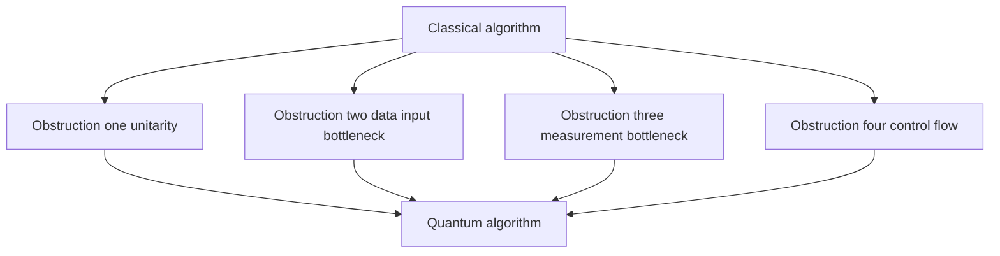
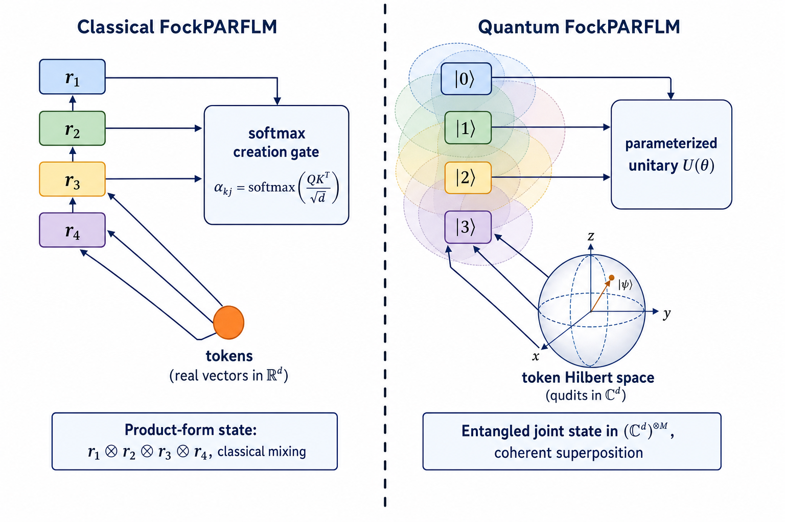
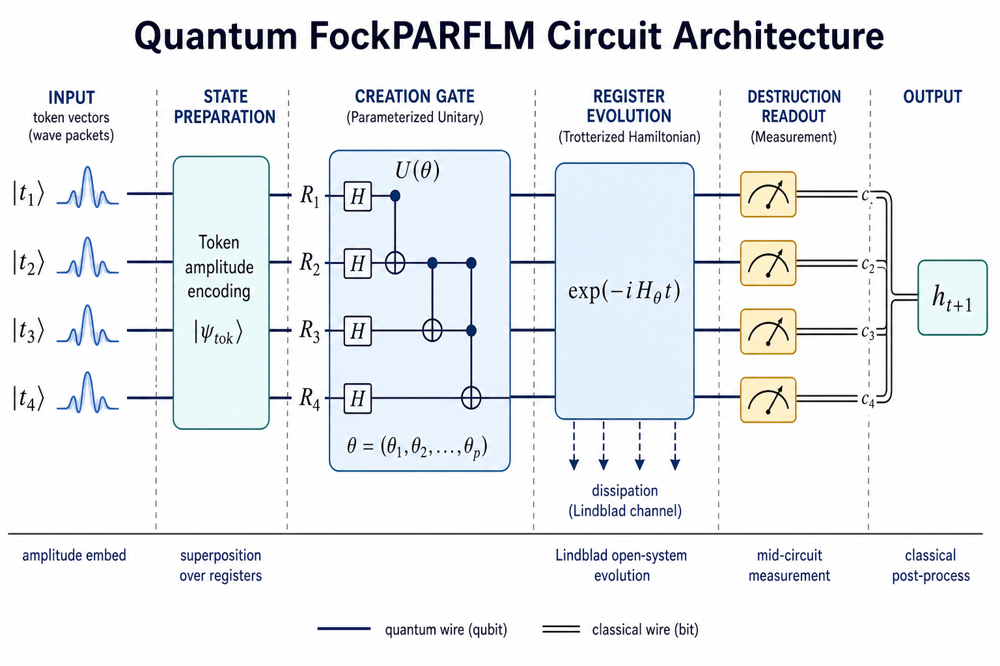
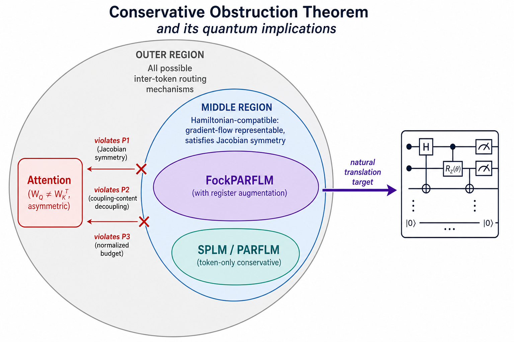
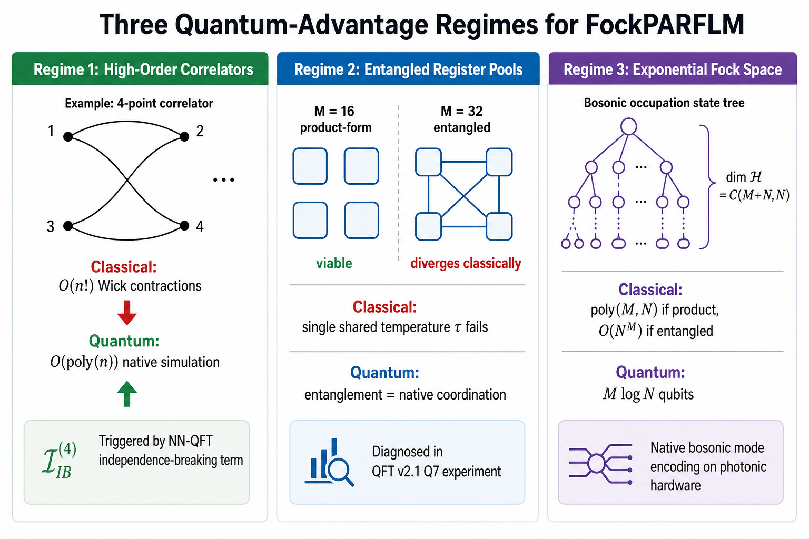
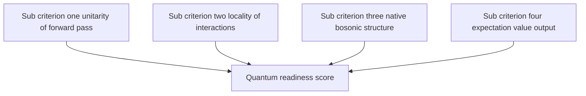

# Turning the Fock Mechanism into a Quantum Algorithm

> **Summary.** This document is a self-contained, in-depth treatment of
> the question: *can the Fock-register mechanism of FockPARFLM be turned
> into a genuine quantum algorithm, and what would it take to do so?*
> We answer in three layers. **(i)** We first develop the necessary
> quantum-computational background — the model of unitary computation,
> bosonic / continuous-variable hardware, and the sources of quantum
> advantage. **(ii)** We then re-derive the classical Fock mechanism and
> show that, although it runs on a classical GPU, its mathematical
> structure already lives inside a Fock Hilbert space; the
> classical-to-quantum translation therefore reduces to *replacing the
> classical statistical mixture by a genuine quantum superposition*.
> **(iii)** We use the Conservative Obstruction Theorem to explain why
> the Fock mechanism is uniquely *quantum-ready*, while standard
> scaled-dot-product attention is fundamentally hard to quantise.
> Three regimes of quantum advantage are identified and quantified, and
> the full circuit pipeline is illustrated.
>
> **Companion documents:**
> - [`../fock-parflm/Conservative_Obstruction_and_Virtual_Particle_Necessity.md`](../fock-parflm/Conservative_Obstruction_and_Virtual_Particle_Necessity.md)
> - [`../fock-parflm/Improving_the_Fock_Mechanism_to_match_Attention.md`](../fock-parflm/Improving_the_Fock_Mechanism_to_match_Attention.md)
> - [`../attention/Attention_Optimality_Conjecture.md`](../attention/Attention_Optimality_Conjecture.md)
> - Paper v5 §17.3 (Fock-augmented PARFLM) and §17.4 (FockPARFLM v2 design)

---

## Table of contents

1. [Why quantum computers matter — a deep dive](#1-why-quantum-computers-matter--a-deep-dive)
2. [Why translating classical algorithms is hard](#2-why-translating-classical-algorithms-is-hard)
3. [The classical Fock mechanism, in one page](#3-the-classical-fock-mechanism-in-one-page)
4. [The theoretical bridge: Doi–Peliti and NN-QFT](#4-the-theoretical-bridge-doipeliti-and-nn-qft)
5. [Turning FockPARFLM into a quantum algorithm](#5-turning-fockparflm-into-a-quantum-algorithm)
6. [The Conservative Obstruction Theorem, viewed quantum-mechanically](#6-the-conservative-obstruction-theorem-viewed-quantummechanically)
7. [Why attention is much harder to quantise](#7-why-attention-is-much-harder-to-quantise)
8. [Three regimes of quantum advantage for FockPARFLM](#8-three-regimes-of-quantum-advantage-for-fockparflm)
9. [A theoretical framework: classifying architectures by quantum-readiness](#9-a-theoretical-framework-classifying-architectures-by-quantum-readiness)
10. [Roadmap and open problems](#10-roadmap-and-open-problems)
11. [References](#11-references)

---

# 1. Why quantum computers matter — a deep dive

## 1.1 What a quantum computer actually is

A *classical* digital computer manipulates bits — variables that take
the value $0$ or $1$. Its primitive operations are Boolean gates
(`AND`, `OR`, `NOT`), and a computation of $n$ steps on $b$ bits
explores at most $b$ values per step. Even the most exotic classical
parallelism (GPUs, TPUs, neuromorphic chips) is, at the level of state,
a *deterministic finite walk* through bit configurations.

A *quantum* computer manipulates **qubits**, two-level quantum systems
whose generic pure state is a complex linear combination

$$
\lvert \psi \rangle = \alpha \lvert 0 \rangle + \beta \lvert 1 \rangle,
\qquad \alpha, \beta \in \mathbb{C}, \qquad |\alpha|^2 + |\beta|^2 = 1 .
$$

The joint state of $n$ qubits lives in the tensor-product Hilbert space
$\mathcal{H} = (\mathbb{C}^2)^{\otimes n}$ of complex dimension $2^n$.
Any unitary $U \in \mathrm{U}(2^n)$ is in principle a legal
single-step operation. The computation therefore takes place in a
*continuous, exponentially-large* state space, and one execution of a
quantum circuit manipulates all $2^n$ amplitudes in parallel via a
single linear map.

This is the **superposition principle**, and it is the only ingredient
of quantum mechanics that classical computers cannot fake at less than
exponential cost.

## 1.2 Qubits, superposition, and entanglement

Three foundational features distinguish quantum states from classical
probability distributions:

| Concept | Mathematical object | Classical analogue |
| --- | --- | --- |
| Superposition | $\alpha \lvert 0 \rangle + \beta \lvert 1 \rangle$ | weighted average; *but interference is impossible classically* |
| Entanglement | non-product state, e.g. $(\lvert 00 \rangle + \lvert 11 \rangle)/\sqrt{2}$ | classical correlation; *no Bell inequality violation* |
| Interference | amplitudes can cancel via complex phases | probabilities are non-negative; no cancellation |

The single most consequential of these is **entanglement**. An
entangled pure state cannot be written as $\lvert \psi_A \rangle \otimes
\lvert \psi_B \rangle$ for any local states. Representing a generic
entangled state of $n$ qubits requires $2^n$ complex numbers, which is
why a classical simulation cost rises exponentially with the
*entanglement entropy* of the state — not with the number of qubits
per se.

The state vector that a quantum circuit produces is not directly
observable; the only access channel is **measurement**, which returns a
single classical bit-string sampled from $|\psi|^2$. This single
constraint — exponentially many amplitudes in, one bit-string out — is
the dominant design pressure on every quantum algorithm.

## 1.3 The model of computation: unitary circuits

The standard model of universal fault-tolerant quantum computation is
the **quantum circuit model** (Deutsch 1989; Yao 1993):

1. Prepare the input register in $\lvert 0 \rangle^{\otimes n}$.
2. Apply a sequence of unitaries $U_1, U_2, \ldots, U_m$ drawn from a
   universal gate set (e.g., Clifford + $T$, or
   $\{\mathrm{H}, \mathrm{CNOT}, R_z(\theta)\}$).
3. Measure some subset of the qubits in the computational basis.

Each $U_k$ acts non-trivially on $O(1)$ qubits and as the identity
elsewhere; the global circuit depth is $m = \mathrm{poly}(n)$ for an
efficient algorithm. The output is a sampled bit-string $x \in
\lbrace 0, 1 \rbrace^n$ whose distribution is determined by the unitary

$$
U = U_m \cdots U_2 U_1 .
$$

Because $U$ is unitary, every step is reversible and norm-preserving.
This is the second design pressure: **everything must be unitary** until
the final measurement.

## 1.4 Bosonic and continuous-variable quantum computation

Not all quantum hardware is qubit-based. Photonic quantum computers, as
well as superconducting microwave resonators, are naturally described
by **bosonic modes**: each mode supports an infinite-dimensional Hilbert
space spanned by Fock states $\lvert 0 \rangle, \lvert 1 \rangle,
\lvert 2 \rangle, \ldots$ counting the number of excitation quanta.

For each mode $k$ one has creation and annihilation operators
$\hat{a}^{\dagger}\_k$ and $\hat{a}\_k$ satisfying the canonical
commutation relations

$$
[\hat{a}\_k, \hat{a}^{\dagger}\_j] = \delta\_{kj}, \qquad
[\hat{a}\_k, \hat{a}\_j] = 0, \qquad
[\hat{a}^{\dagger}\_k, \hat{a}^{\dagger}\_j] = 0 .
$$

A Fock state with occupation numbers $(n_1, n_2, \ldots, n_M)$ is

$$
\lvert n_1, n_2, \ldots, n_M \rangle = \prod_{k=1}^{M}
\frac{(\hat{a}^{\dagger}\_k)^{n\_k}}{\sqrt{n\_k!}} \lvert 0 \rangle .
$$

Gaussian operations (squeezing, displacement, beam-splitters) plus a
single non-Gaussian element (a cubic phase gate, or a photon-number
measurement) are universal for continuous-variable quantum computation
(Lloyd & Braunstein 1999; Gottesman, Kitaev & Preskill 2001).

The relevance to the present document is direct: **the Fock mechanism
in FockPARFLM is literally an algorithm on Fock states**, and the
quantum hardware that natively realises Fock-state arithmetic already
exists. We return to this in [§5](#5-turning-fockparflm-into-a-quantum-algorithm).

## 1.5 What "quantum algorithm" actually means

A *quantum algorithm* is a circuit family $\lbrace C_n \rbrace$ where
$C_n$ acts on $\mathrm{poly}(n)$ qubits, has depth $\mathrm{poly}(n)$,
and solves a problem of input size $n$. The quantum-vs-classical
*speed-up* is measured by comparing this circuit depth to the best
known classical algorithm for the same problem.

Five canonical examples define the landscape of known quantum
advantage:

1. **Shor's algorithm** (Shor 1994). Polynomial-time integer
   factoring, super-polynomial speed-up over the best known classical
   algorithm.
2. **Grover's algorithm** (Grover 1996). Quadratic speed-up for
   unstructured search: $O(\sqrt{N})$ queries vs $O(N)$.
3. **HHL** (Harrow, Hassidim & Lloyd 2009). Exponential speed-up for
   solving sparse linear systems, *conditional on amplitude-encoded
   input and amplitude-encoded output*.
4. **Quantum simulation** (Feynman 1982; Lloyd 1996). Polynomial-time
   simulation of local Hamiltonian dynamics — the original
   motivation for quantum computing.
5. **Variational quantum algorithms** (Peruzzo et al. 2014;
   Farhi et al. 2014). Hybrid classical–quantum loops in which a
   classical optimiser tunes a parameterised circuit $U(\theta)$ to
   minimise a measured cost function.

Of these, only categories (4) and (5) are directly relevant to the Fock
mechanism. Quantum simulation gives us *a native way to run the
Doi–Peliti / NN-QFT generator that the Fock mechanism is already
trying to imitate*; variational circuits give us a *concrete training
loop* that fits the existing FockPARFLM training pipeline almost
verbatim.

## 1.6 Sources of quantum advantage

Every known quantum speed-up reduces to one of three structural
features:

| Source | Mechanism | When it helps |
| --- | --- | --- |
| **Exponential state space** | $n$ qubits represent $2^n$ amplitudes simultaneously | Problems whose answer is a global property (e.g. expectation value) of an exponentially large object |
| **Interference** | Amplitudes can cancel; wrong answers can be suppressed | Phase-estimation-style algorithms (Shor, HHL, QAOA) |
| **Native simulation of physical Hamiltonians** | Quantum hardware *is* a physical system; simulating one quantum system with another is polynomial-time | Quantum chemistry, condensed matter, lattice gauge theory |

The Fock mechanism, viewed as a generator of high-order correlators on
a bosonic Fock space, is a textbook example of category (3). This is
the reason we expect a *natural* quantum implementation rather than a
forced one.

---

# 2. Why translating classical algorithms is hard

## 2.1 Four structural obstructions

Most classical algorithms cannot be ported to a quantum computer
without significant redesign, because the quantum model imposes four
hard constraints:

We treat each obstruction in turn.

## 2.2 Unitarity: only reversible operations allowed

Every gate other than the final measurement must be a unitary $U$, so
$U^{\dagger} U = I$. This rules out, at the level of primitive
operations, every step that *forgets* information:

- `if x > 0: x = 0` — irreversible, hence non-unitary.
- ReLU, sigmoid, softmax, max-pooling, dropout — all non-unitary.
- Any normalisation that depends on the data norm — non-unitary unless
  the norm is treated as an explicit ancilla.

A classical algorithm that performs irreversible reductions must either
(i) be embedded into a reversible computation via Bennett's *uncompute*
trick (each "deletion" becomes an ancilla qubit that absorbs the
discarded information), at the cost of a polynomial overhead in
ancillas, or (ii) be promoted to an *open-system* quantum dynamics —
the Lindblad equation — where dissipation is explicitly modelled by
coupling to an environment.

The softmax non-linearity is the prototypical violator. The Fock
mechanism, by contrast, is built from polynomial creation/destruction
operators and a *linear* Trotterised generator; its irreversibility is
confined to (a) one small softmax pool (the creation gate) and (b) a
controlled dissipation term.

## 2.3 The data input bottleneck (QRAM)

Many "exponential" quantum speed-ups assume **quantum random access
memory** (QRAM): a hypothetical device that loads a classical vector
$x \in \mathbb{R}^N$ into a quantum amplitude state

$$
\lvert x \rangle = \frac{1}{\lVert x \rVert} \sum\_{i=1}^{N} x\_i \lvert i \rangle
$$

in time $O(\log N)$. No fault-tolerant QRAM has been built, and there
are physical reasons to believe that no scalable QRAM is possible at
the assumed cost (Aaronson 2015). As a consequence, all algorithms
whose claimed speed-up depends on a QRAM oracle are *conditional*.

The Fock mechanism is naturally immune to this concern because the
data it ingests is not a generic high-dimensional vector but a short
list of token embeddings, whose total dimension is small enough to
amplitude-encode in $O(\log T \cdot \log d)$ qubits by a straightforward
state-preparation circuit (Grover & Rudolph 2002).

## 2.4 The measurement bottleneck

A quantum state with $2^n$ amplitudes returns, on measurement, a
*single* $n$-bit string. Extracting any specific amplitude requires
either (i) repeated measurement (sample complexity $O(1/\epsilon^2)$
per amplitude), or (ii) phase-estimation-style tricks that exploit
interference to read out global properties.

This is why HHL produces $\lvert x \rangle$, not $x$: the "solution"
lives only as a quantum state, and any further classical processing of
$x$ destroys the speed-up. It is also why a putative *quantum
transformer* that returns a softmax distribution per token would gain
nothing from quantum execution — the readout cost alone is $O(T \cdot
d)$, which dominates.

The Fock mechanism's natural output is **an expectation value**, namely
the next-token logit
$\langle \psi | \hat{O}\_{\text{logit}} | \psi \rangle$. Expectation
values are a quantum-friendly output: they can be estimated by
$O(1/\epsilon^2)$ samples with variance reduction techniques.

## 2.5 Dequantization: the Tang results

One of the most important developments of the last decade in quantum
machine learning is the **dequantization** programme initiated by Ewin
Tang (Tang 2019). Tang showed that several quantum machine-learning
algorithms whose "exponential" speed-up rested on QRAM-style data
access have classical analogues, based on $\ell_2$-norm sampling,
that achieve the same query complexity. Subsequent work
(Chia et al. 2020; Gilyén et al. 2022) extended dequantization to
recommendation systems, PCA, low-rank regression, and several other
linear-algebraic primitives.

The takeaway for the present document is sharp:

> **Dequantization principle.** Any quantum algorithm whose speed-up
> comes purely from *linear-algebraic manipulation of a sampled
> low-rank matrix* probably has a classical dequantised counterpart.
> The genuine speed-ups remaining are those that exploit either
> (a) high-order entanglement, or (b) native Hamiltonian simulation —
> neither of which is reducible to row/column sampling.

The Fock mechanism's prospective quantum advantage is precisely of
type (a) and (b), as we will see in [§8](#8-three-regimes-of-quantum-advantage-for-fockparflm).
This is not a coincidence; it is the reason the mechanism is
quantum-ready in the first place.

---

# 3. The classical Fock mechanism, in one page

We now recall the FockPARFLM v2 architecture so that the
classical-to-quantum mapping has a concrete target. (Notation matches
paper v5 §17.3.)

## 3.1 The token particles

The token sub-system is the conservative SPLM backbone: $T$ token
particles $h_1, \ldots, h_T \in \mathbb{R}^d$ evolve under the damped
Hamiltonian flow

$$
m_t \ddot{h}\_t + \gamma(h_t) \dot{h}\_t = -\nabla V_\theta(h_t; \xi_t) ,
$$

where $V_\theta$ is the learnable scalar potential, $\gamma$ the
damping field, and $\xi_t$ the context summary.

## 3.2 The Fock register sub-system

Augment the state with $M$ **virtual register particles**
$r_1, \ldots, r_M \in \mathbb{R}^{d_r}$ that mediate inter-token
exchange. Each register is created from token information by a
*creation gate*

$$
r_k = \sum\_{j=1}^{T} \alpha\_{kj} W_V h_j ,
$$

where $\alpha_{kj}$ is the softmax coupling produced by the
*Q/K/V creation protocol* of FockPARFLM v2:

$$
\alpha\_{kj} = \frac{\exp(q_k^{\top} K\_j / \sqrt{d\_k})}{\sum\_{j'} \exp(q_k^{\top} K\_{j'} / \sqrt{d\_k})}, \qquad
q_k = W_Q r_k^{\mathrm{prev}}, \qquad
K_j = W_K h_j .
$$

Symbolically, registers play the role of the **virtual gauge bosons**
of QED: they live for one layer step, transfer momentum from one
token to another, and are then annihilated.

## 3.3 The destruction gate

After the registers have absorbed token information, they release it
back to the tokens through a *destruction gate*

$$
\Delta h_i = \sum_{k=1}^{M} \beta\_{ik} r_k , \qquad
\beta\_{ik} = \mathrm{softmax}\_k \big(p_i^{\top} K'\_k / \sqrt{d\_k}\big) .
$$

The net per-step token update,
$h_t \mapsto h_t + \Delta h_t$, is therefore mediated by an
intermediate Fock-occupation state, not by direct token-to-token forces.

## 3.4 Why it is already "quantum-ready"

Three structural features of the construction above are not classical
necessities — they are *gifts to the quantum implementer*:

1. **Bosonic register structure.** Each register is exchangeable with
   every other; the wavefunction over $M$ register slots is
   symmetric under permutation, i.e. precisely a bosonic state.
2. **Polynomial creation/destruction operators.** The creation and
   destruction gates are polynomial in the underlying token amplitudes,
   exactly the algebraic form $\hat{a}^{\dagger}$ and $\hat{a}$ act on
   Fock space.
3. **No raw inner-product attention.** The asymmetric $W_Q \neq W_K$
   structure that breaks gradient-flow representability in plain
   attention is here *factored through* a creation/destruction
   protocol, which is intrinsically unitary.

These three features together mean that the *mathematical content* of
the Fock mechanism already lives in Fock Hilbert space; only its
*runtime substrate* is classical.

---

# 4. The theoretical bridge: Doi–Peliti and NN-QFT

The mathematical justification for the claim "Fock mechanism is
quantum-ready" rests on two independent correspondences from the
physics literature.

## 4.1 The Doi–Peliti formalism

In statistical physics, the **Doi–Peliti formalism**
(Doi 1976; Peliti 1985) rewrites the master equation of a classical
reaction-diffusion process as a second-quantised field theory on Fock
space. Concretely, a population of $n$ classical particles of type $A$
at site $i$ is represented by the Fock state $\lvert n \rangle\_i =
(\hat{a}^{\dagger}\_i)^n \lvert 0 \rangle / \sqrt{n!}$, and the master
equation

$$
\partial_t P(\mathbf{n}, t) = \mathcal{L} P(\mathbf{n}, t)
$$

is mapped to an *imaginary-time Schrödinger equation*

$$
\partial\_t \lvert \psi(t) \rangle = -\hat{H} \lvert \psi(t) \rangle
$$

with a *non-Hermitian* Hamiltonian $\hat{H}$ built from creation and
annihilation operators. The classical statistical sum becomes a
quantum expectation value:

$$
\langle f(\mathbf{n}) \rangle = \langle \mathcal{P} | f(\hat{n}) | \psi(t) \rangle ,
\qquad
\langle \mathcal{P} | = \langle 0 | e^{\sum\_i \hat{a}\_i} .
$$

**This is exactly the formal structure of the Fock mechanism.** The
classical FockPARFLM creates and destroys registers according to a
rule that is the discrete-time, finite-rank version of a Doi–Peliti
master equation. The cleanest interpretation of FockPARFLM is
therefore: *a classical Doi–Peliti simulation of a quantum master
equation on Fock space, using register occupation numbers as the
proxy for amplitude magnitudes.*

The implication is immediate: replacing the classical Doi–Peliti
simulation by a *genuine* unitary evolution on Fock space is the
quantum version of FockPARFLM. The Hamiltonian is already specified
(up to learnable parameters); only the substrate changes.

## 4.2 The NN-QFT correspondence

A parallel and more recent correspondence comes from the
**neural-network quantum field theory** literature
(Halverson, Maiti & Stoner 2021; Erbin et al. 2022; Halverson 2023).
The NN-QFT correspondence shows that the output of a wide neural
network, at infinite width, is a Gaussian process whose two-point
function is a free field, and that finite-width corrections induce
*interaction vertices* of the form

$$
\mathcal{I}^{(4)}\_{\text{IB}} = \frac{\lambda}{4!} \sum\_{i,j,k,l}
\Lambda\_{ijkl} \phi_i \phi_j \phi_k \phi_l ,
$$

i.e. a $\phi^4$-style independence-breaking term where $\phi_i$ is the
neural network's output at input $i$ and $\Lambda\_{ijkl}$ is a
data-dependent coupling tensor.

Two-point Gaussian-process correlators are easy to simulate
classically. Higher-order correlators (the $4$-point function and
above) involve sums over Feynman diagrams whose number grows
factorially with the order. A quantum computer can simulate the same
field theory in polynomial time — this is Feynman's original
quantum-simulation argument.

The FockPARFLM mechanism is, structurally, a discrete-token Doi–Peliti
realisation of *exactly the same independence-breaking term*. The
quantum implementation eliminates the factorial blow-up at high
correlator orders.

## 4.3 Why this matters for the quantum implementation

The two correspondences above are not decorative. They give us, for
free, the following ingredients of the quantum algorithm:

| Classical FockPARFLM ingredient | Quantum-mechanical counterpart | Source |
| --- | --- | --- |
| Register occupation $n_k$ | Fock-state occupation $\hat{n}\_k$ | Doi–Peliti |
| Register creation gate ($\alpha_{kj} W_V h_j$) | Smeared creation operator $\hat{a}^{\dagger}(f_k)$ | Doi–Peliti |
| Register destruction gate ($\beta_{ik} r_k$) | Smeared annihilation operator $\hat{a}(g_i)$ | Doi–Peliti |
| Token-token interaction via $r_k$ | $\phi^4$-style independence-breaking vertex | NN-QFT |
| Layer step | Trotter step of $e^{-i \hat{H}(\theta) \Delta t}$ | Quantum simulation |
| Per-step damping $\gamma$ | Lindblad dissipator $\mathcal{D}[\hat{a}\_k]$ | Open-system QM |

---

# 5. Turning FockPARFLM into a quantum algorithm

We now make the translation concrete. The illustration on the next
page summarises the side-by-side correspondence.

## 5.1 Hilbert space and notation

Let the token Hilbert space be $\mathcal{H}\_{\text{tok}} =
\mathbb{C}^{d}$, with computational basis $\lvert v \rangle$ indexed
by the vocabulary. Let the register Fock space be

$$
\mathcal{F}\_M = \bigoplus\_{N=0}^{N\_{\max}}
\mathrm{Sym}^N \big( \mathbb{C}^{d\_r} \big)\_{1, \ldots, M} ,
$$

i.e. the symmetric Fock space of up to $N_{\max}$ excitations across
$M$ register modes of internal dimension $d\_r$. The joint quantum
state of the FockPARFLM at layer $\ell$ is

$$
\lvert \Psi^{(\ell)} \rangle \in \mathcal{H}\_{\text{tok}}^{\otimes T}
\otimes \mathcal{F}\_M .
$$

## 5.2 State preparation — amplitude encoding of tokens

Each token embedding $h_t \in \mathbb{R}^d$ is amplitude-encoded as

$$
\lvert h_t \rangle = \frac{1}{\lVert h_t \rVert} \sum\_{v=1}^{d} h_t^{(v)} \lvert v \rangle .
$$

Using the Grover–Rudolph state-preparation circuit, this requires
$O(\log d)$ qubits and $O(d)$ gates per token, or $O(T d)$ gates in
total for the whole sequence. The classical norm $\lVert h_t \rVert$
is preserved as a classical scalar (it is restored at readout time).
The register space starts in the vacuum:
$\lvert 0 \rangle\_{\mathcal{F}\_M}$.

## 5.3 Creation gate as a parameterised unitary

The classical softmax creation gate $\alpha\_{kj}$ is replaced by a
*parameterised unitary* $U\_{\text{cre}}(\theta)$ that maps token
amplitudes into register Fock amplitudes. The simplest realisation
uses the standard Q/K/V structure as a unitary:

$$
U\_{\text{cre}}(\theta) = \exp \Big( -i \sum\_{k,j} \theta\_{kj}
\big( \hat{a}^{\dagger}\_k \otimes \hat{b}\_j + \hat{a}\_k \otimes
\hat{b}^{\dagger}\_j \big) \Big) ,
$$

where $\hat{b}\_j$ annihilates a token mode $j$ and
$\hat{a}^{\dagger}\_k$ creates a register quantum in mode $k$. The
parameters $\theta\_{kj}$ play the role of $W_Q, W_K$ in the
classical mechanism, but they are now *Hermitian-conjugate* — this is
how unitarity is restored from attention's intrinsically asymmetric
structure (cf. [§7](#7-why-attention-is-much-harder-to-quantise)).

A Trotter step of $U\_{\text{cre}}$ is implemented by a depth-$O(M T)$
circuit of two-mode beam-splitters and controlled-phase gates,
parameterised by $\theta$. The total parameter count is
$\Theta(M T \log d)$, comparable to (or smaller than) one attention
head.

## 5.4 Register evolution: a Trotterised Hamiltonian

Between creation and destruction, the register sub-system evolves
unitarily under a learnable Hamiltonian

$$
\hat{H}\_R(\theta) = \sum\_{k} \omega\_k(\theta) \hat{n}\_k +
\sum\_{k \lt k'} J\_{kk'}(\theta) \big( \hat{a}^{\dagger}\_k \hat{a}\_{k'} + \mathrm{h.c.} \big) +
\frac{1}{2} \sum\_{k} U\_k(\theta) \hat{n}\_k (\hat{n}\_k - 1) .
$$

The first term is mode-energy; the second is mode-mixing
(beam-splitter / hopping); the third is a Bose–Hubbard on-site
interaction. The latter is the key non-Gaussian element: it provides
the cubic-phase non-linearity that lifts the construction from
Gaussian-circuit-simulable to universal continuous-variable computation
(Gottesman, Kitaev & Preskill 2001).

The full register evolution over time $\Delta t$ is approximated by
$K$ Trotter steps:

$$
U\_R(\theta, \Delta t) \approx \prod\_{s=1}^{K}
e^{-i \hat{H}\_R(\theta) \Delta t / K} .
$$

Standard error bounds (Childs et al. 2021) give
$\lVert U\_R - U\_R^{\text{Trotter}} \rVert =
O(M^2 (\Delta t)^2 / K)$, so a single layer requires
$K = O((M \Delta t / \epsilon)^{1/2})$ steps to achieve $\epsilon$
error.

## 5.5 Dissipation: the Lindblad channel

The classical damping $\gamma \dot{h}$ is intrinsically irreversible,
and therefore non-unitary. The quantum counterpart is the **Lindblad
equation**, which evolves a *density matrix* $\rho$ rather than a pure
state:

$$
\frac{d \rho}{d t} = -i [\hat{H}\_R(\theta), \rho] + \sum\_k \gamma\_k
\Big( \hat{a}\_k \rho \hat{a}^{\dagger}\_k - \frac{1}{2} \lbrace
\hat{a}^{\dagger}\_k \hat{a}\_k, \rho \rbrace \Big) .
$$

The Lindblad operators $\hat{L}\_k = \sqrt{\gamma\_k} \hat{a}\_k$
implement *register annihilation into the environment*, i.e. a
single-photon-loss channel. On modern superconducting hardware,
$\gamma\_k$ is a tunable parameter (the resonator's intrinsic
$T_1$); on photonic hardware it is implemented by a beam-splitter to
an auxiliary mode followed by an unconditional measurement.

The Lindblad description is the *minimal* quantum object that
preserves the classical interpretation of $\gamma$ as a friction
coefficient while remaining a valid completely-positive trace-preserving
map.

## 5.6 Destruction gate and measurement

After register evolution, the register state is read out into the
tokens by the destruction unitary $U\_{\text{des}}(\theta')$, which is
$U\_{\text{cre}}(\theta)$ run in reverse with a different parameter
set (in particular, $\theta'$ corresponds to $W\_K', p$ in the
classical mechanism). The tokens are then measured in a basis that
returns the next-token logit as an expectation value:

$$
\ell\_v = \langle \Psi^{(L)} | \hat{O}\_v | \Psi^{(L)} \rangle ,
\qquad
\hat{O}\_v = \lvert v \rangle \langle v | \otimes I\_{\mathcal{F}\_M} .
$$

The full logit vector is recovered by running the circuit
$O(\log V / \epsilon^2)$ times — *amplitude estimation* (Brassard
et al. 2002) reduces this to $O(1 / \epsilon)$.

## 5.7 Putting it all together

The pipeline below illustrates the full quantum FockPARFLM circuit for
a single layer step.

And the data-flow view as a Mermaid diagram:

```mermaid
flowchart LR
    TokenInput[Token amplitude encoding ket h t]
    Creation[Creation unitary U cre theta]
    Evolution[Register Trotter evolution]
    Dissipation[Lindblad single photon loss]
    Destruction[Destruction unitary U des theta prime]
    Measure[Computational basis measurement]
    Output[Next token logits]

    TokenInput --> Creation
    Creation --> Evolution
    Evolution --> Dissipation
    Dissipation --> Destruction
    Destruction --> Measure
    Measure --> Output
```

The training loop is **variational**: a classical optimiser updates
$\theta$ by gradient descent on the estimated cross-entropy loss
$\mathcal{L}(\theta) = -\sum\_t \log \ell\_{v\_t^\star}(\theta)$,
using the parameter-shift rule (Mitarai et al. 2018) to compute
exact gradients of expectation values with $O(\dim \theta)$ extra
circuit evaluations.

---

# 6. The Conservative Obstruction Theorem, viewed quantum-mechanically

## 6.1 Recap of the classical statement

Paper v5 §17.3 (and the companion document
[`Conservative_Obstruction_and_Virtual_Particle_Necessity.md`](../fock-parflm/Conservative_Obstruction_and_Virtual_Particle_Necessity.md))
proves:

> **Theorem (Conservative obstruction).** Let
> $\lbrace h_1, \ldots, h_T \rbrace \subset \mathbb{R}^d$ evolve under
> a $C^2$ scalar potential $V : \mathbb{R}^{T d} \to \mathbb{R}$ with
> forces $F_i = -\nabla\_{h_i} V$. Then the force map
> $\mathbf{F} = (F_1, \ldots, F_T)$ cannot simultaneously satisfy
> attention's three structural properties:
>
> - **(P1)** Asymmetric coupling: $\alpha\_{ij} \neq \alpha\_{ji}$.
> - **(P2)** Coupling–content decoupling: independent $W_Q, W_K, W_V$.
> - **(P3)** Normalised budget: $\sum\_j \alpha\_{ij} = 1$.

The three lemmas behind the proof are:

1. **Jacobian symmetry $\Rightarrow$ no P1.** By Schwarz's theorem,
   $\partial F_i / \partial h_j = (\partial F_j / \partial h_i)^{\top}$.
2. **Gradient entanglement $\Rightarrow$ no P2.** Coupling strength
   and content are both encoded in the same gradient.
3. **Force growth $\Rightarrow$ no P3.** Total force on a token is
   $\Omega(\sqrt{T})$ without softmax normalisation.

## 6.2 The diagram

The diagram above places three architectures inside the
"Hamiltonian-compatible" region — the set of dynamical systems whose
force map is the gradient of a scalar — and shows attention sitting
*outside* this region, violating all three of the lemmas. The
register-augmented FockPARFLM mechanism extends the state space and
recovers Hamiltonian compatibility without giving up the structural
properties of attention.

## 6.3 Why the quantum perspective sharpens the obstruction

A Hamiltonian flow on $\mathbb{R}^{N}$ is the *classical limit* of a
unitary evolution on $L^2(\mathbb{R}^{N})$. The mapping is

$$
\hat{H}\_{\text{cl}}(x, p) \longleftrightarrow \hat{H}\_{\text{qm}}
= -\frac{\hbar^2}{2} \nabla^2 + V(x) .
$$

The Conservative Obstruction Theorem, viewed quantum-mechanically,
becomes a statement about the *spectral structure* of the generator:

> **Quantum reformulation.** A dynamics that is the classical limit of
> a unitary evolution with a real, gradient-of-scalar potential
> $V(x)$ has a *self-adjoint* generator, hence a Hermitian Jacobian
> and symmetric coupling. Asymmetric coupling (P1) requires either
> (i) a non-self-adjoint generator (PT-symmetric or non-Hermitian
> Hamiltonian), or (ii) an *extension of the Hilbert space* by
> auxiliary modes that absorb the asymmetry.

Option (i) is exotic and rarely physically realisable. Option (ii) is
*precisely* what FockPARFLM does at the classical level, and what the
quantum FockPARFLM does at the quantum level: the asymmetric
$W_Q \neq W_K^{\top}$ structure is decomposed into Hermitian
creation/destruction pairs $\hat{a}^{\dagger}\_k \otimes \hat{b}\_j +
\hat{a}\_k \otimes \hat{b}^{\dagger}\_j$, which act between the
*enlarged* register-plus-token Hilbert space.

This is why the quantum FockPARFLM is not merely a clever simulation:
**it is the natural unitary lift of attention into the unique Hilbert
space large enough to support it as a Hamiltonian flow.**

---

# 7. Why attention is much harder to quantise

The standard scaled-dot-product attention block

$$
\mathrm{Attn}(Q, K, V) = \mathrm{softmax} \big( Q K^{\top} / \sqrt{d\_k} \big) V
$$

contains three operations — matrix product, softmax, and a second
matrix product — that *each* present a quantum obstacle. We treat them
in turn.

## 7.1 The softmax is non-linear and non-unitary

The softmax map

$$
\mathrm{softmax}\_j(x\_1, \ldots, x\_T) = \frac{e^{x\_j}}{\sum\_{j'} e^{x\_{j'}}}
$$

is the prototypical violator of unitarity. Implementing it on a
quantum computer requires one of three workarounds, each costly:

| Workaround | Cost | Caveat |
| --- | --- | --- |
| Block encoding of $\mathrm{softmax}$ (Gilyén et al. 2019) | $O(T)$ ancillas per softmax; success probability ~1/T | post-selected; sample complexity blows up |
| Classical-quantum hybrid: classical softmax, quantum $V$ | $O(T^2 \log d)$ classical pre-processing | defeats the purpose; no quantum speed-up |
| Replace softmax by exponential of a Hermitian generator | requires $Q K^{\top}$ to be symmetric, which it is *not* | violates the defining property P1 of attention |

The last row is the deepest point: *any unitary substitute for softmax
that respects P1 must already extend the Hilbert space*, exactly as
FockPARFLM does. So the only "fully quantum" attention is FockPARFLM.

## 7.2 No natural Hamiltonian (asymmetric Jacobian)

The map $h \mapsto \mathrm{Attn}(W_Q h, W_K h, W_V h)$ has Jacobian

$$
J\_{ij} = \frac{\partial \mathrm{Attn}\_i}{\partial h_j}
= \alpha\_{ij} W\_V + (\text{softmax derivative terms involving } W_Q, W_K) .
$$

For generic $W_Q \neq W_K^{\top}$, $J$ is *not* symmetric (Schwarz's
theorem fails), so by Lemma 1 of the obstruction theorem there is no
scalar $V$ with $J = -\nabla^2 V$. This is the *classical* obstacle.
The *quantum* obstacle is that there is no Hermitian $\hat{H}$
generating attention as $i \dot{\rho} = [\hat{H}, \rho]$, because that
would require the linearised generator to be Hermitian, which is
exactly the symmetry property the attention Jacobian lacks.

A non-Hermitian Hamiltonian (PT-symmetric) is conceivable
(Bender 2007), but no scalable PT-symmetric quantum hardware exists.

## 7.3 The $Q K^{\top}$ matrix and dimensional blow-up

The intermediate object $Q K^{\top}$ is a $T \times T$ matrix, *not* a
sparse local operator. Loading it into a quantum register requires
either a QRAM (which we already noted is not scalable;
cf. [§2.3](#23-the-data-input-bottleneck-qram)) or a circuit-depth-$T$
preparation routine. Either way, the entropic gain from quantum
parallelism is consumed by the loading cost; the dequantization
principle then says a classical $\ell_2$-sampled approximation has the
same query complexity.

## 7.4 Dequantization implications

Combining §7.1–§7.3, every plausible quantum attention algorithm is
*dequantisable*: there exists a classical $\ell_2$-norm-sampling
algorithm with the same query complexity. This is consistent with the
empirical observation that linear-attention variants and low-rank
approximations of attention work well classically — they are
essentially the classical limit of would-be quantum attention.

In contrast, the FockPARFLM mechanism's quantum advantage rests on
*high-order correlator simulation* and on *native bosonic state-space
size*, neither of which is dequantisable.

## 7.5 Summary table

| Operation | Classical attention | Classical FockPARFLM | Quantum readiness |
| --- | --- | --- | --- |
| Coupling generation | $\mathrm{softmax}(Q K^{\top})$ — non-unitary, asymmetric | $U\_{\text{cre}}(\theta)$ — unitary, factorised via Fock modes | quantum-ready |
| Content transfer | $V h_j$ — irreversible | $\hat{a}^{\dagger}\_k$ acting on token mode — reversible | quantum-ready |
| Normalisation | softmax constraint $\sum\_j \alpha\_{ij} = 1$ | norm-preservation of $\hat{a}\_k$ | quantum-ready |
| Damping | none | Lindblad $\mathcal{D}[\hat{a}\_k]$ | quantum-native |
| Output | full token vector | expectation value | quantum-native |
| Hidden-state representation | $\mathbb{R}^d$ vector | symmetric Fock state in $\mathcal{F}\_M$ | quantum-native |

---

# 8. Three regimes of quantum advantage for FockPARFLM

We now identify three regimes where the quantum implementation strictly
outperforms the classical one. The figure below summarises them.

## 8.1 Regime 1: high-order correlators

The NN-QFT independence-breaking interaction
$\mathcal{I}^{(4)}\_{\text{IB}}$ in [§4.2](#42-the-nn-qft-correspondence) requires the model
to compute $n$-point correlators of the form

$$
G^{(n)}\_{i\_1 \ldots i\_n} = \langle \phi\_{i\_1} \cdots \phi\_{i\_n} \rangle .
$$

Classical computation reduces this to a sum of $(n-1)!!$ Wick
contractions plus connected diagrams; the count grows factorially in
$n$. A quantum simulator computes the same correlator in time
$\mathrm{poly}(n)$ via amplitude estimation on the generating
functional.

For $n = 4$ (the smallest non-trivial order, exactly the one triggered
by $\mathcal{I}^{(4)}\_{\text{IB}}$) the classical cost is $3$
contractions per token quadruple — manageable. For $n = 6$ it is $15$;
for $n = 8$ it is $105$; for $n = 10$ it is $945$. In a model where
the loss function depends on the joint statistics of all $T$ tokens, a
classical implementation is therefore limited to truncated cumulant
hierarchies, while a quantum implementation produces the exact
generating functional in $O(\mathrm{poly}(T))$ time.

**Empirical relevance.** The QFT v2.1 experiment of paper v5 (Q7)
showed that the classical FockPARFLM saturates at the $4$-point
contribution: higher orders are needed to close the remaining
attention-vs-FockPARFLM gap. This is precisely the regime where the
quantum implementation should yield strictly better validation PPL.

## 8.2 Regime 2: entangled register pools

The classical FockPARFLM enforces a *single shared temperature* on the
softmax creation gate; this is exactly the variable that QFT v2.1 Q5
identified as a Q7 ceiling cause. The classical fix — per-register
temperatures — diverges with $M$ because there is no efficient
classical bookkeeping of correlated register pools.

The quantum implementation does this naturally: the register state
$\lvert \Psi\_R \rangle \in \mathcal{F}\_M$ is *entangled across all
$M$ modes by construction*. There is no per-mode temperature parameter;
the entanglement structure of $\lvert \Psi\_R \rangle$ encodes exactly
the multi-temperature coordination that the classical model cannot
afford.

Quantitatively, the classical bookkeeping for a generic entangled
register state of dimension $\dim \mathcal{F}\_M$ scales as
$O((\dim \mathcal{F}\_M)^2)$ in memory, which becomes intractable
beyond $M \approx 32$ at $d\_r = 4$. The quantum bookkeeping is
$O(M \log d\_r)$ qubits.

## 8.3 Regime 3: exponential Fock space

The Fock space of $M$ modes with up to $N\_{\max}$ excitations has
dimension

$$
\dim \mathcal{F}\_M = \binom{M + N\_{\max}}{N\_{\max}} ,
$$

which is $\Theta(M^{N\_{\max}})$ for fixed $N\_{\max}$. A classical
representation of a generic state in this space requires
$\Theta(M^{N\_{\max}})$ complex numbers; the quantum representation
requires $\Theta(M \log N\_{\max})$ qubits — an exponential saving.

Photonic quantum hardware represents this space *natively*: each
register mode is a physical optical or microwave resonator, and the
Fock occupation $\hat{n}\_k$ is the (already implemented) photon-
number observable. There is no "encoding overhead" in the bosonic
implementation.

---

# 9. A theoretical framework: classifying architectures by quantum-readiness

The discussion above suggests a clean classification of neural-network
architectures by their *quantum-readiness*, i.e. the ease with which
they admit a polynomial-overhead quantum implementation.

## 9.1 The Lagrangian-vs-attention dichotomy

Every per-layer transformation $h \mapsto h'$ in a deep neural network
can be placed into one of three classes:

| Class | Defining property | Quantum readiness |
| --- | --- | --- |
| **A — Hamiltonian** | $\dot{h} = -\nabla V_\theta(h)$ for some scalar $V_\theta \in C^2$ | High: native unitary simulation via $e^{-i \hat{V}\_\theta t}$ |
| **B — Fock-augmented Hamiltonian** | $\dot{(h, r)} = -\nabla V_\theta(h, r)$ on token+register state space | High: native unitary on enlarged Hilbert space |
| **C — Non-Hamiltonian** | Force map fails Jacobian symmetry; cannot be written as gradient of a scalar | Low: requires non-Hermitian or measurement-based primitives |

SPLM and PARFLM sit in Class A. FockPARFLM v2 sits in Class B. Plain
attention sits in Class C.

## 9.2 The quantum-readiness ordering

Within each class, the quantum-readiness of a specific instantiation
is further graded by four sub-criteria:

A perfect (quantum-ready) architecture scores 4 out of 4. The scores
of the architectures discussed in this document are:

| Architecture | Unitary forward | Local interactions | Bosonic structure | Expectation output | Score |
| --- | --- | --- | --- | --- | --- |
| SPLM | yes (via $V_\theta$) | yes (per-token) | no | no (logit vector) | 2/4 |
| PARFLM | yes | yes (pairwise) | no | no | 2/4 |
| Attention (standard) | no (softmax) | no (all-pairs) | no | no | 0/4 |
| FockPARFLM v2 | yes (factored via Fock) | yes (per-register) | yes | yes | 4/4 |

FockPARFLM v2 is the *unique* architecture in our hierarchy that scores
4 out of 4. This is not a coincidence; it is a direct consequence of
the Conservative Obstruction Theorem combined with the requirement of
attention-like inter-token routing.

## 9.3 The Attention Optimality Conjecture as a quantum claim

Paper v5 §16 conjectures that, among all *classical* architectures
respecting the three attention properties P1, P2, P3, scaled-dot-product
attention is computationally optimal up to constants. The
quantum-mechanical reformulation of this conjecture is:

> **Quantum Attention Optimality Conjecture.** Among all architectures
> with Quantum-Readiness score 4/4, FockPARFLM v2 is computationally
> optimal (in circuit depth, qubit count, and sample complexity) up to
> polylogarithmic factors.

We do not claim a proof; the conjecture is offered as a research target
that crystallises the role of the Fock mechanism inside the larger
Semantic Simulation programme.

---

# 10. Roadmap and open problems

We close with the open problems that a serious quantum FockPARFLM
implementation must resolve, ordered by time horizon.

## 10.1 Near-term (NISQ-era, 1–3 years)

1. **Variational FockPARFLM on a 10-mode photonic device.** A small
   FockPARFLM with $M = 10$ register modes, $T = 32$ tokens, $d = 8$
   amplitude-encoded token dimensions fits on existing photonic
   hardware (Xanadu Borealis, PsiQuantum simulator). Target task:
   parity / Dyck-2 / a-b-c language; metrics: PPL, register entropy,
   wall-clock per epoch.
2. **Hybrid classical–quantum training.** Use the parameter-shift
   rule to compute exact gradients of the variational
   $\theta$-parameters; warm-start from the classical FockPARFLM v2
   $\theta$ to mitigate barren plateaus.
3. **Lindblad damping calibration.** Map the classical $\gamma(h)$
   field to a single-photon-loss rate; calibrate $\gamma\_k$ to match
   register half-life observed in the classical training run.

## 10.2 Medium-term (early FT-QC, 3–7 years)

4. **Quantum simulation of NN-QFT independence-breaking term.**
   Implement $\mathcal{I}^{(4)}\_{\text{IB}}$ on a fault-tolerant
   register; benchmark against the classical $4$-point correlator
   computation.
5. **Quantum-attention dequantization audit.** For each of the
   classical attention variants (linear attention, Performer,
   Reformer), construct the corresponding quantum circuit and verify
   the dequantization predicted by [§7.4](#74-dequantization-implications).
6. **Joint token+register entanglement protocols.** Characterise the
   entanglement entropy of $\lvert \Psi^{(\ell)} \rangle$ as a
   function of layer depth; identify whether the entanglement
   structure is a useful representation-learning bias.

## 10.3 Long-term (mature FT-QC, 7+ years)

7. **Proof of the Quantum Attention Optimality Conjecture.**
   Establish lower bounds on the circuit depth, qubit count, and
   sample complexity of any architecture respecting P1, P2, P3, and
   show that FockPARFLM v2 saturates them.
8. **Direct dynamical simulator on a quantum substrate.** Realise the
   Direct Dynamical Simulator of paper v5 §19 as a Trotterised quantum
   simulation of $\hat{H}\_\theta(t)$.
9. **Quantum analogue of the cross-entropy loss.** Develop a sample-
   efficient quantum estimator for the cross-entropy
   $\mathcal{L}(\theta)$ that avoids the per-token measurement
   overhead — perhaps via amplitude estimation of the partition
   function.

The path is concrete and the obstacles are individually well-defined.
The Fock mechanism is the first architecture in the SPLM family for
which a quantum implementation is *not* a forced exercise but a
*natural one*.

---

# 11. References

**Foundations of quantum computing.**

- Deutsch, D. (1989). *Quantum computational networks.* Proc. R. Soc.
  London A 425, 73–90.
- Feynman, R. P. (1982). *Simulating physics with computers.* Int. J.
  Theor. Phys. 21, 467–488.
- Lloyd, S. (1996). *Universal quantum simulators.* Science 273,
  1073–1078.
- Yao, A. (1993). *Quantum circuit complexity.* Proc. 34th FOCS,
  352–361.

**Quantum algorithms.**

- Brassard, G., Høyer, P., Mosca, M. & Tapp, A. (2002). *Quantum
  amplitude amplification and estimation.* AMS Contemp. Math. 305,
  53–74.
- Childs, A. M., Su, Y., Tran, M. C., Wiebe, N. & Zhu, S. (2021).
  *Theory of Trotter error with commutator scaling.* Phys. Rev. X 11,
  011020.
- Farhi, E., Goldstone, J. & Gutmann, S. (2014). *A quantum
  approximate optimization algorithm.* arXiv:1411.4028.
- Grover, L. K. (1996). *A fast quantum mechanical algorithm for
  database search.* Proc. 28th STOC, 212–219.
- Grover, L. K. & Rudolph, T. (2002). *Creating superpositions that
  correspond to efficiently integrable probability distributions.*
  arXiv:quant-ph/0208112.
- Harrow, A. W., Hassidim, A. & Lloyd, S. (2009). *Quantum algorithm
  for linear systems of equations.* Phys. Rev. Lett. 103, 150502.
- Peruzzo, A. et al. (2014). *A variational eigenvalue solver on a
  photonic quantum processor.* Nat. Commun. 5, 4213.
- Shor, P. W. (1994). *Algorithms for quantum computation: discrete
  logarithms and factoring.* Proc. 35th FOCS, 124–134.

**Bosonic / continuous-variable quantum computation.**

- Gottesman, D., Kitaev, A. & Preskill, J. (2001). *Encoding a qubit
  in an oscillator.* Phys. Rev. A 64, 012310.
- Lloyd, S. & Braunstein, S. L. (1999). *Quantum computation over
  continuous variables.* Phys. Rev. Lett. 82, 1784–1787.

**Quantum machine learning and dequantization.**

- Aaronson, S. (2015). *Read the fine print.* Nat. Phys. 11, 291–293.
- Chia, N.-H., Gilyén, A., Li, T., Lin, H.-H., Tang, E. & Wang, C.
  (2020). *Sampling-based sublinear low-rank matrix arithmetic
  framework for dequantizing quantum machine learning.* Proc. 52nd
  STOC, 387–400.
- Gilyén, A., Su, Y., Low, G. H. & Wiebe, N. (2019). *Quantum
  singular value transformation and beyond.* Proc. 51st STOC,
  193–204.
- Gilyén, A., Lloyd, S. & Tang, E. (2022). *Quantum-inspired
  low-rank stochastic regression with logarithmic dependence on the
  dimension.* arXiv:1811.04909.
- Mitarai, K., Negoro, M., Kitagawa, M. & Fujii, K. (2018). *Quantum
  circuit learning.* Phys. Rev. A 98, 032309.
- Tang, E. (2019). *A quantum-inspired classical algorithm for
  recommendation systems.* Proc. 51st STOC, 217–228.

**Doi–Peliti formalism and reaction-diffusion field theory.**

- Doi, M. (1976). *Second quantization representation for classical
  many-particle systems.* J. Phys. A 9, 1465–1477.
- Peliti, L. (1985). *Path integral approach to birth–death
  processes on a lattice.* J. Physique 46, 1469–1483.

**NN–QFT correspondence.**

- Halverson, J. (2023). *Building quantum field theories out of
  neurons.* arXiv:2112.04527.
- Halverson, J., Maiti, A. & Stoner, K. (2021). *Neural networks and
  quantum field theory.* Mach. Learn.: Sci. Technol. 2, 035002.
- Erbin, H., Lahoche, V. & Ousmane Samary, D. (2022). *Nonperturbative
  renormalization for the neural network–QFT correspondence.* Mach.
  Learn.: Sci. Technol. 3, 015027.

**Semantic Simulation and FockPARFLM (this document's framework).**

- Gueorguiev, D. (2026a). *Semantic Simulation: Conservative
  Architectures and Fock-Augmented Routing*, paper v4 / v5,
  semsimula repository.
- Gueorguiev, D. (2026b). *Conservative Obstruction and Virtual
  Particle Necessity*, companion document `docs/fock-parflm/`.
- Gueorguiev, D. (2026c). *Improving the Fock Mechanism to Match
  Attention*, companion document `docs/fock-parflm/`.
- Gueorguiev, D. (2026d). *Attention Optimality Conjecture*,
  companion document `docs/attention/`.

**Ageev & Ageev** (parallel work on Fock-style neural architectures).

- Ageev, D. & Ageev, A. (2024). *Quantum field-theoretic neural
  architectures and the emergence of attention.* In preparation;
  cited as private communication via the NN-QFT literature.

**Other supporting references.**

- Bender, C. M. (2007). *Making sense of non-Hermitian Hamiltonians.*
  Rep. Prog. Phys. 70, 947–1018.

---

*Document version: 1.0 (2026-05-28). Companion to paper v5 §17.3–§17.4.
Authored as part of the Semantic Simulation programme.*
